# MRI system



---

## System overview {#sec-system-overview}

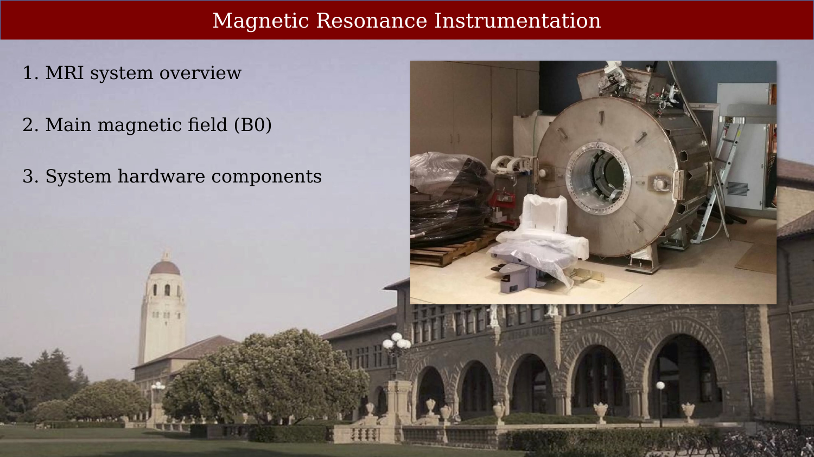{#fig-instrumentation-overview fig-alt="Title slide listing three topics: MRI system overview, main magnetic field B0, and system hardware components."}

## The CNI Control Room

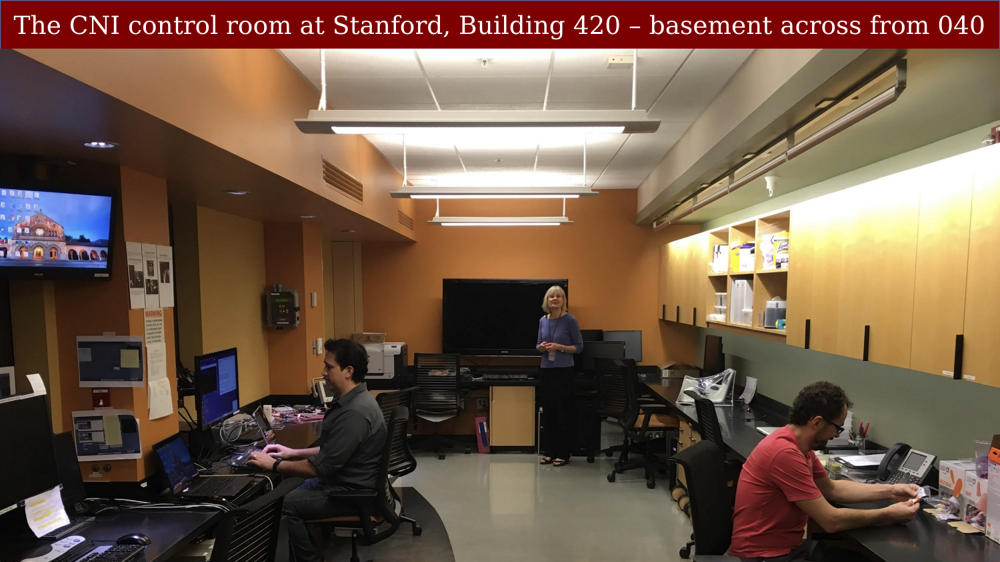{#fig-cni-control-room fig-alt="Photo of the CNI control room showing workstations and monitors."}

This is where the experimenters work while the subject is inside the shielded scanner room. The room contains many computers, mostly from different labs, used to present or control stimuli and to monitor the experiment while it is running.

## MRI System: Multiple Rooms and Components

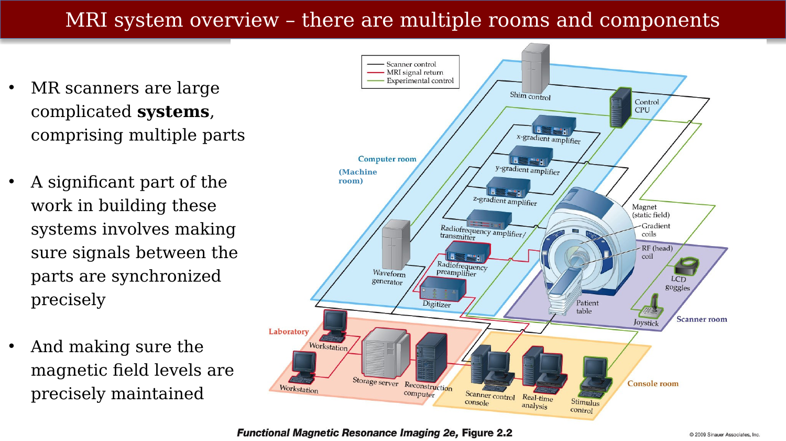{#fig-system-rooms-diagram fig-alt="Diagram showing the scanner room, machine room, and console room with connections between components."}

MR scanners are large, complicated systems comprising multiple parts. A significant part of the work in building these systems involves making sure signals between the parts are synchronized precisely, and making sure the magnetic field levels are precisely maintained.

Multiple systems are important for acquiring the raw data for fMRI studies. One is the hardware used for image acquisition — in addition to the scanner itself, this consists of a series of amplifiers and transmitters responsible for creating gradients and pulse sequences, as well as recorders of MR signal from the head coil. Another system controls the experiment in which the subject participates and records behavioral and physiological data. These are not needed for all MR acquisitions, but they are important and often fragile for human fMRI studies.

## Scanner Room

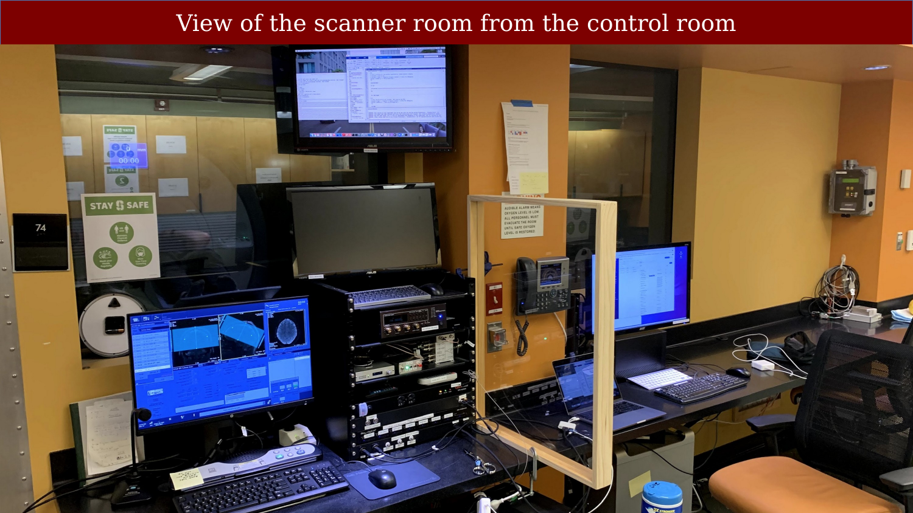{#fig-scanner-room fig-alt="Photo looking through the control room window into the scanner room."}

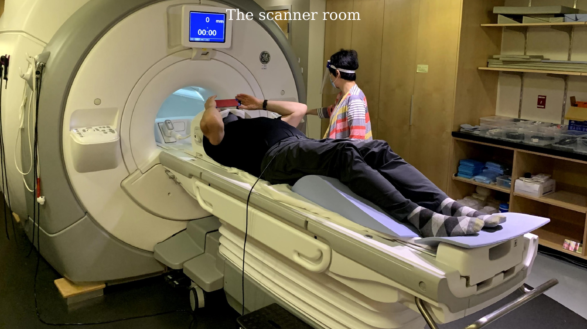{#fig-scanner-room-patient-table fig-alt="Photo of a subject lying on the scanner table being positioned by a technician."}

The scanner room contains the magnet bore and patient table. Note the squeeze ball (for subject communication) and the mirror positioned above the subject's eyes so they can see out of the back of the bore.

## RF Shielding

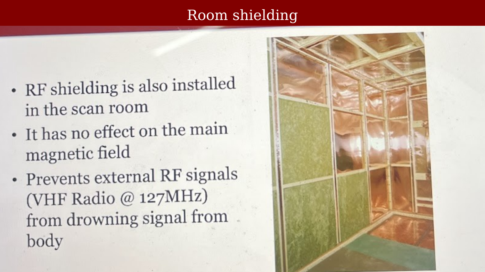{#fig-rf-shielding fig-alt="Photo of copper RF shielding panels in the scanner room."}

RF shielding is installed in the scanner room walls. It has no effect on the main magnetic field, but it prevents external RF signals — such as VHF radio signals near the 127 MHz proton resonance frequency — from drowning out the weak MR signal from the body.

## Machine Room

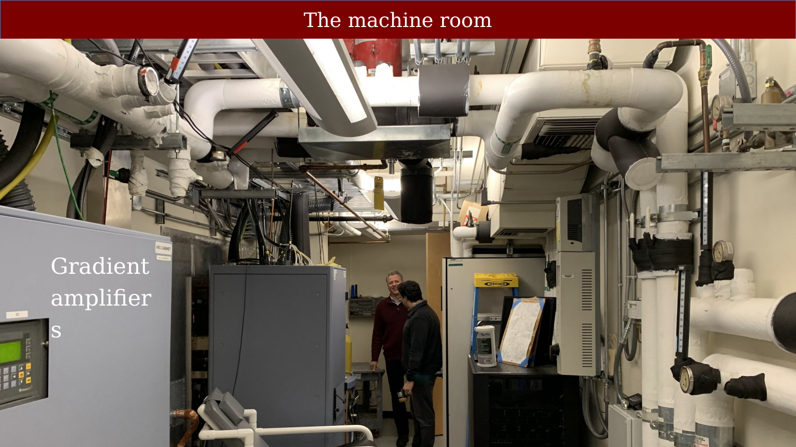{#fig-gradient-amplifiers fig-alt="Photo of the machine room interior showing gradient amplifiers and piping."}

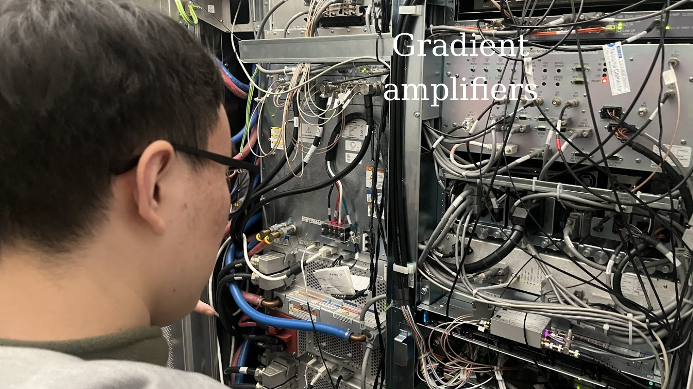{#fig-gradient-amplifier-rack fig-alt="Close-up photo of a researcher examining the gradient amplifier electronics rack."}

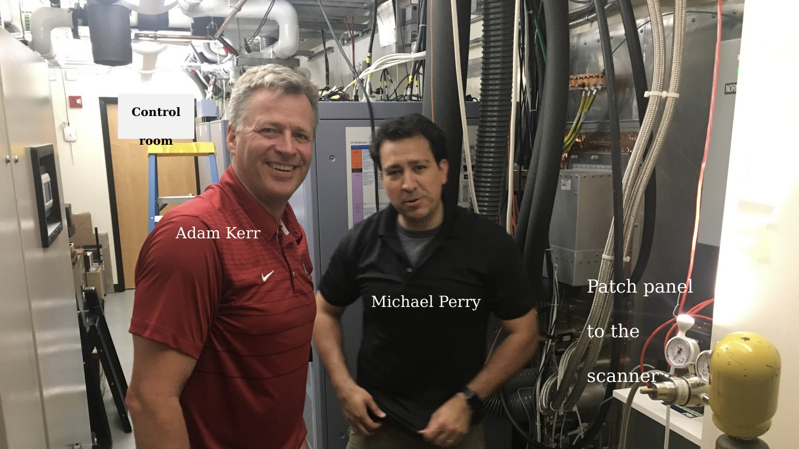{#fig-patch-panel fig-alt="Photo of two people standing in the machine room near the patch panel."}

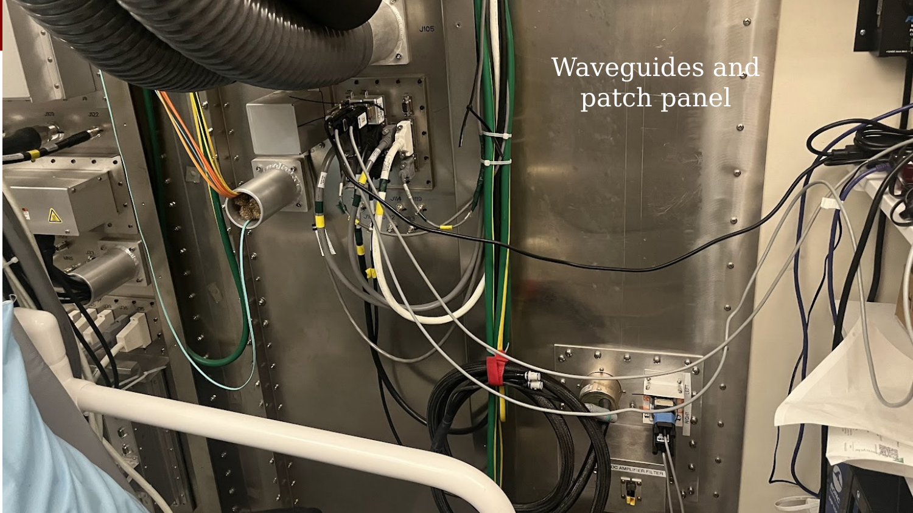{#fig-waveguides fig-alt="Close-up photo of waveguides and patch panel connections."}

## Chilled Water Cooling

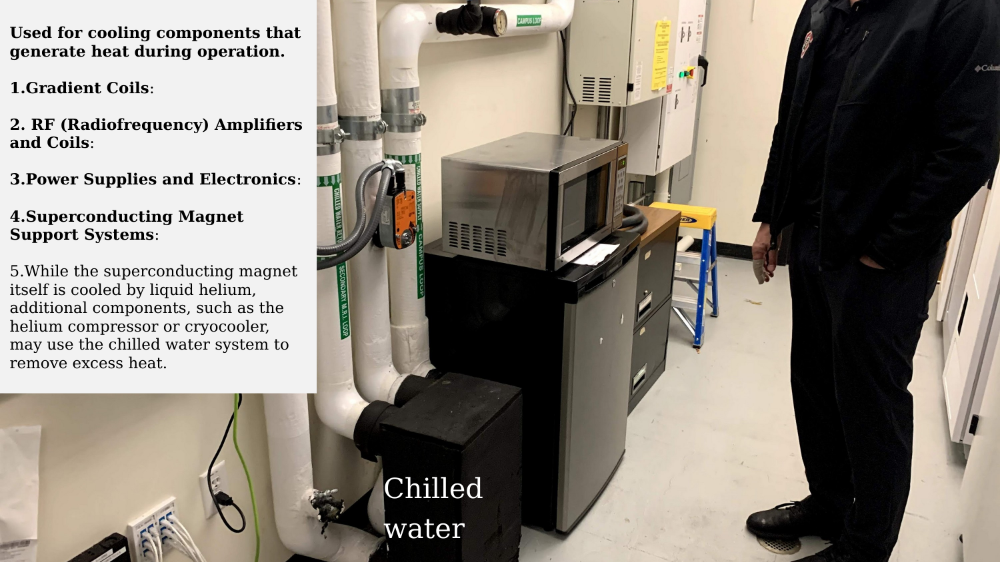{#fig-chilled-water fig-alt="Photo of the chilled water pipes and cooling system in the machine room."}

The chilled water system is used for cooling components that generate heat during operation. These include the gradient coils (which generate significant heat due to rapidly switching magnetic fields), the RF amplifiers and coils, power supplies and electronics, and superconducting magnet support systems such as the helium compressor or cryocooler. The chilled water system is essential for thermal management, preventing damage to heat-sensitive components and ensuring reliable operation.

## Liquid Helium

{#fig-helium-dewars fig-alt="Photo of multiple liquid helium Dewars lined up in a hallway."}

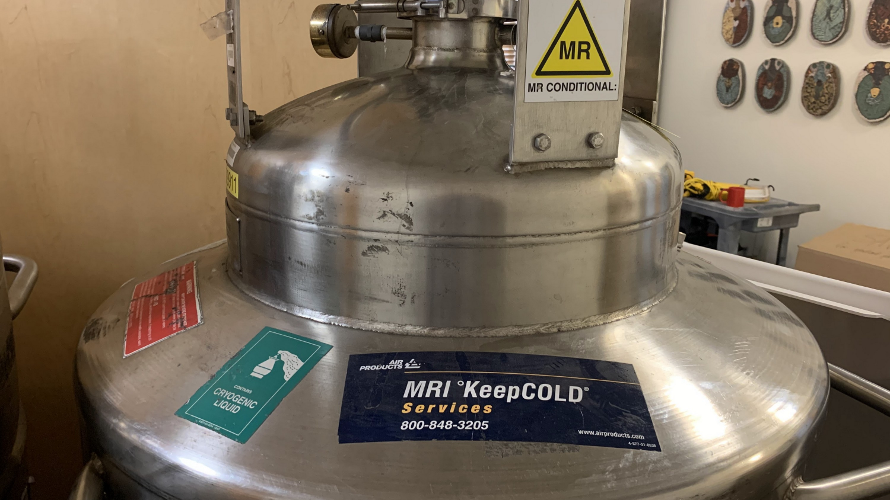{#fig-helium-dewar-closeup fig-alt="Close-up photo of a liquid helium Dewar showing the cryogenic liquid warning label."}

Dewars are large, thermally insulated flasks — essentially an oversized Thermos — designed to keep liquid helium cold. They have a double-walled structure with a vacuum space between the walls. Because the inner vessel is surrounded by vacuum, the liquid helium does not exchange heat with the room by conduction or convection. The inner and outer walls are made from materials with poor thermal conductivity, such as stainless steel or Invar.

Liquid helium in MR systems is maintained at approximately 4 Kelvin (−269°C) to sustain superconductivity in the magnet. Modern systems use a cryocooler (cold head) to recondense helium vapor back into liquid, significantly reducing helium consumption and the need for regular refills.

## MRI Vendors

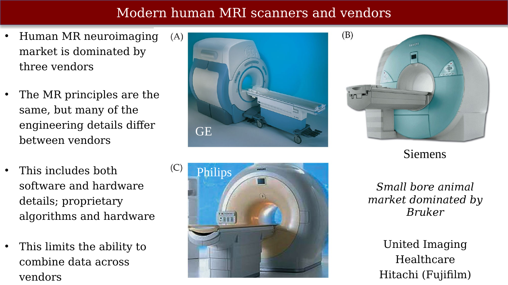{#fig-mri-vendors fig-alt="Slide showing photos of scanners from GE, Siemens, and Philips with bullet points about the vendor landscape."}

The human MR neuroimaging market is dominated by three vendors: GE, Siemens, and Philips. The MR principles underlying their systems are the same, but many engineering details differ — including proprietary software, hardware, and algorithms. This limits the ability to combine data across vendors. The small-bore animal imaging market is dominated by Bruker; United Imaging Healthcare and Hitachi (Fujifilm) are also present in the human market.
