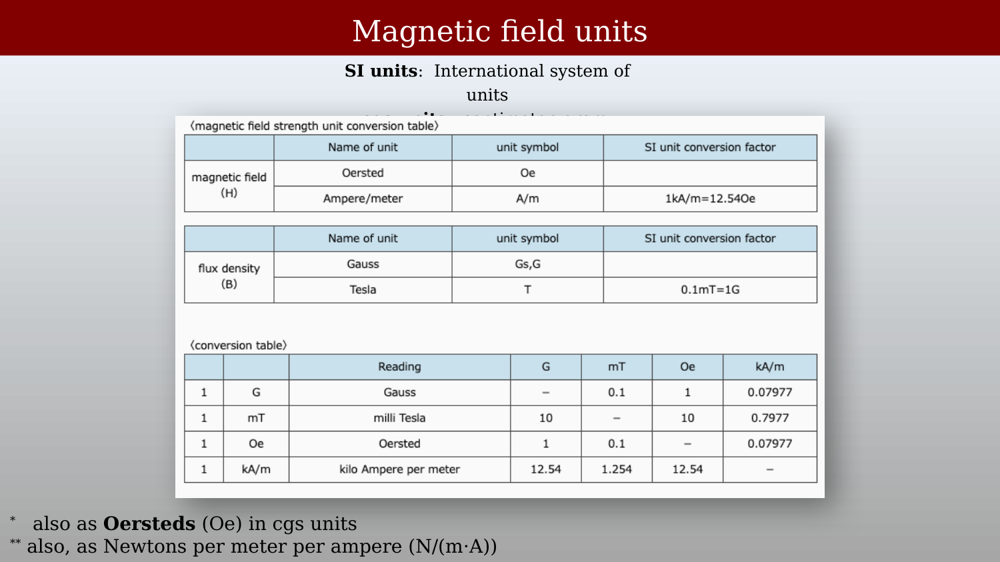
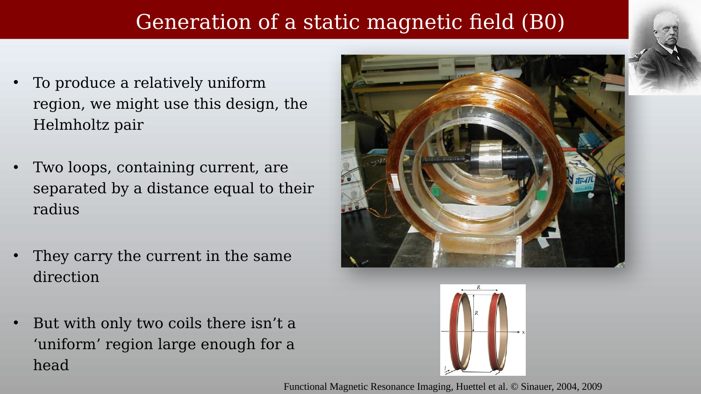
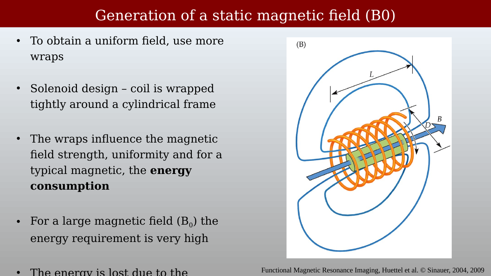
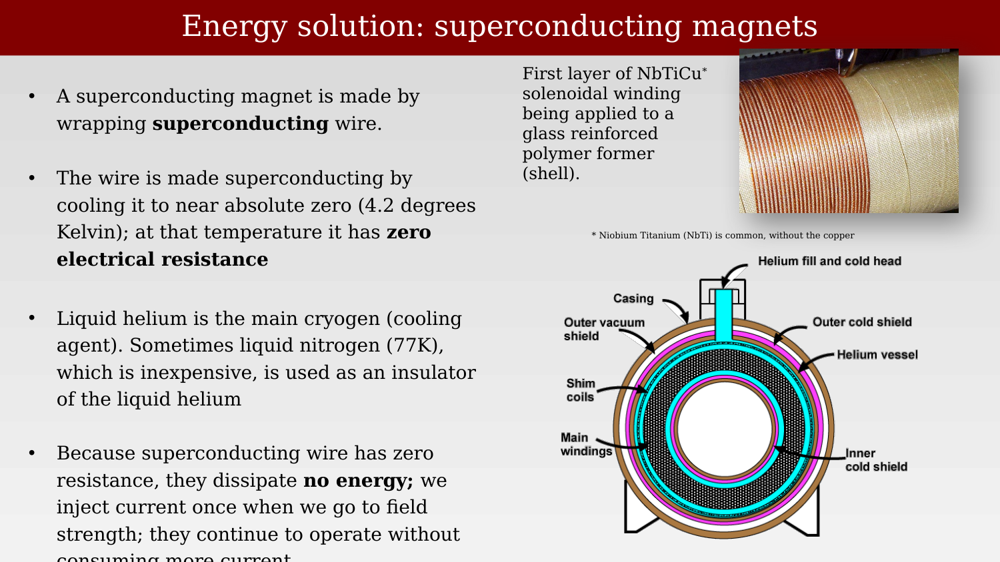
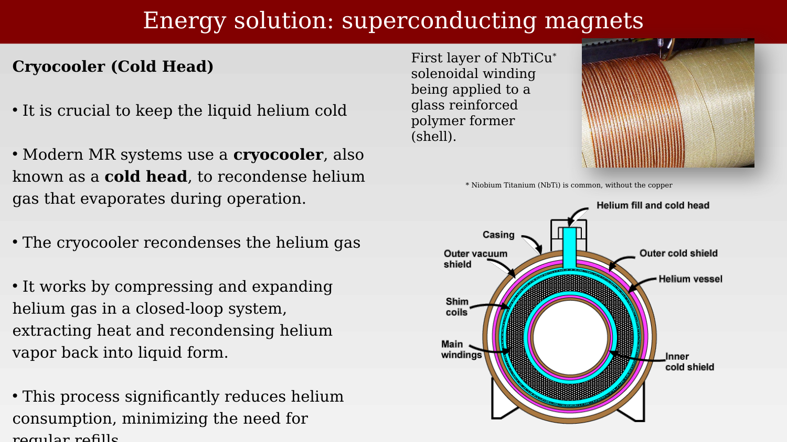
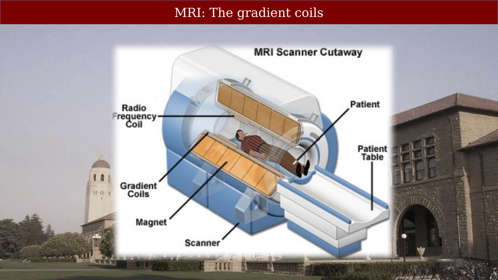
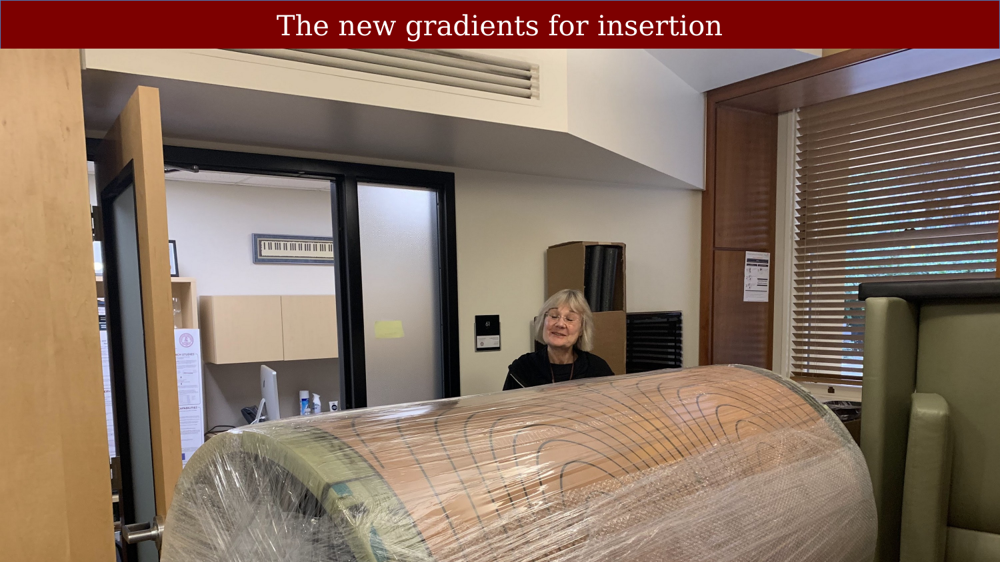
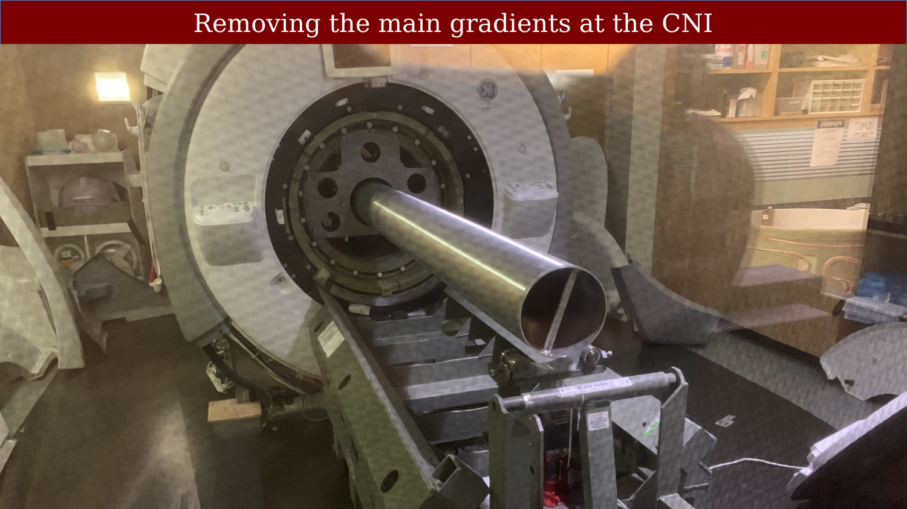
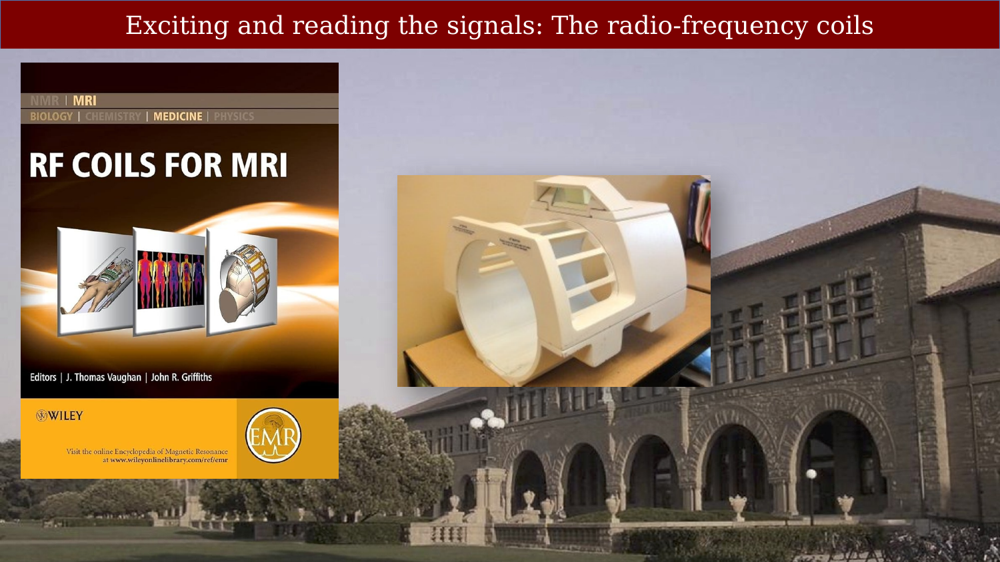

# Main field gradient coils {.unnumbered}



---

## Main field and gradient coils overview

{#fig-scanner-components-diagram fig-alt="Block diagram of MR system components including RF, gradient, and control systems."}

A useful reference for this material is *Pictures to Protons* (p. 168).
The T/R (Transmit/Receive) switch is a key component that alternates the RF coil
between transmitting pulses and receiving the MR signal.

## Magnetic Field Units

{#fig-magnetic-field-units-pioneers fig-alt="Slide showing portraits of Oersted, Tesla, and Gauss alongside a diagram of a current-carrying wire and compass."}

There are two related magnetic field quantities, **H** (magnetic field strength)
and **B** (magnetic flux density). In free space they differ only by a constant:
B = μ₀H, where μ₀ = 4π × 10⁻⁷ T·m/A.

The H-field is measured in **amperes per meter** (A/m) in SI units.
The B-field is measured in **Tesla** (T).

The connection between electricity and magnetism was first demonstrated by the
Danish physicist Hans Christian Ørsted in 1820, when he showed that a
current-carrying wire deflected a compass needle placed beneath it.

{#fig-magnetic-field-units-examples fig-alt="Slide listing example magnetic field levels: Earth 0.5G, refrigerator magnet 200G, MRI scanner 15,000–90,000G."}

Useful reference points: Earth's magnetic field is about 0.5 Gauss; a refrigerator
magnet is around 200 Gauss; clinical MR scanners operate at 15,000–90,000 Gauss
(1.5–9 Tesla).

{#fig-magnetic-field-units-table fig-alt="Table showing unit conversions between Gauss, milliTesla, Oersted, and kA/m."}

## Generating the Static Magnetic Field (B0)

### The Helmholtz Pair

{#fig-b0-helmholtz-pair-diagram fig-alt="Diagram of a Helmholtz pair coil with field lines shown at the center."}

{#fig-b0-helmholtz-pair-photo fig-alt="Photo of a copper Helmholtz coil pair and a diagram of the resulting magnetic field."}

The Helmholtz pair uses two loops carrying current in the **same direction**,
separated by a distance equal to their radius. This geometry produces a
relatively uniform field in the region between the coils. However, with only
two coils the uniform region is too small to encompass a human head.

### The Solenoid Design

{#fig-b0-solenoid-design fig-alt="Diagram of a solenoid coil with field lines along the central axis."}

To obtain a uniform field over a larger volume, modern MRI magnets use a solenoid
design in which a coil is wrapped tightly around a cylindrical frame.
The wraps determine the magnetic field strength, uniformity, and — for a
resistive magnet — the energy consumption. For a large B₀ field, the energy
required is very high.

## Superconducting Magnets

{#fig-superconducting-magnet-design fig-alt="Diagram of a superconducting magnet showing the helium vessel, shim coils, and outer vacuum shield, alongside a photo of NbTi wire being wound."}

The energy problem is solved by using **superconducting wire**. A superconducting
magnet is made by wrapping niobium-titanium (NbTi) wire around a cylindrical
form. When cooled to approximately 4.2 K (near absolute zero) using liquid
helium, the wire has zero electrical resistance. Current injected once at
field strength continues to flow indefinitely with no power input —
the magnet sustains itself.

Liquid helium is the primary cryogen (cooling agent). Liquid nitrogen (~77 K),
which is less expensive, is sometimes used as an insulating layer around the
helium vessel.

{#fig-superconducting-magnet-cryocooler fig-alt="Diagram of the cryocooler system alongside the cryostat cross-section showing thermal shields."}

Modern MR systems use a **cryocooler** (cold head) to recondense helium gas that
evaporates during operation. The cryocooler works by compressing and then
expanding a separate helium gas loop; the expansion stage drops the temperature
to ~4 K, which is cold enough to recondense the boiled-off cryostat helium back
into liquid. This process significantly reduces helium consumption and minimizes
the need for refills.

## The Gradient Coils

{#fig-gradient-coils-scanner-cutaway fig-alt="Cutaway diagram of an MRI scanner labeling the magnet, gradient coils, RF coil, patient, and patient table."}

### The Maxwell Pair (Z-gradient)

{#fig-gradient-maxwell-pair fig-alt="Diagram showing a Maxwell pair coil design and the resulting linear z-gradient field added to the static B0 field."}

Unlike the Helmholtz pair, the Maxwell pair runs current in **opposite directions**
in the two coils. This produces a change in magnetic field from iso-center to
each coil. When superimposed on the main B0 field, the result is a static field
that increases linearly along the axis between the two coils — a **z-gradient**.

### Three Orthogonal Gradients

{#fig-gradient-coils-xyz fig-alt="3D diagram showing the X, Y, and Z gradient coils arranged concentrically, with the RF body coil surrounding the subject."}

MRI requires three orthogonal gradient coils to encode spatial position in all
three dimensions. It is important that the X and Y gradients are properly paired;
without this pairing it would be impossible to generate a true X or Y gradient
independently.

## Gradient Coil Replacement at the CNI

{#fig-gradient-coil-new-insertion fig-alt="Photo of a large cylindrical gradient coil wrapped in plastic, positioned for insertion into the scanner."}

{#fig-gradient-coil-removal-cni fig-alt="Photo of the gradient coil extraction tool inserted into the scanner bore during the upgrade procedure."}

These images are from the Ultra-High Performance (UHP) gradient upgrade at the
CNI. The gradient coils were shipped in containers that inadvertently included
iron components — a significant problem given the strong magnetic field of the
scanner. A winch was required to remove the unwanted ferromagnetic material from
the bore before the new coils could be installed.
