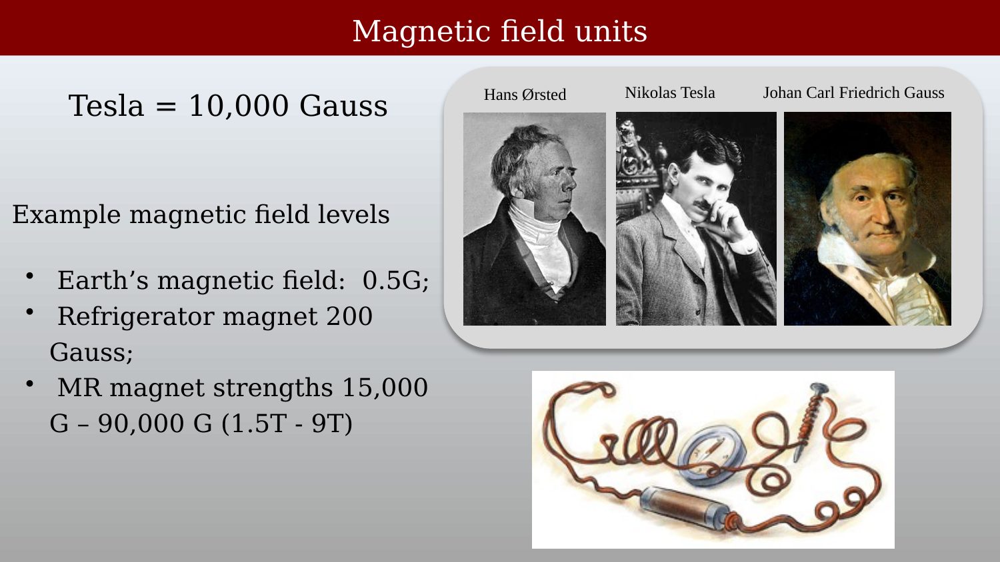
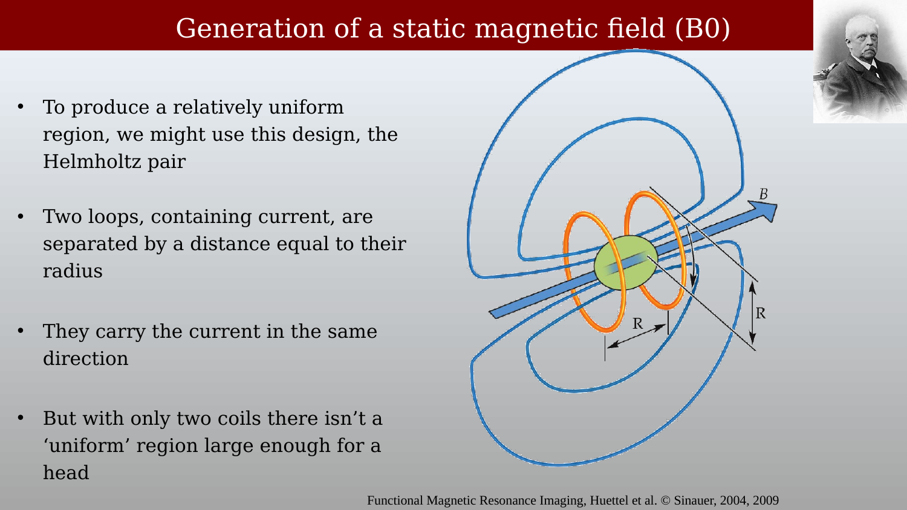
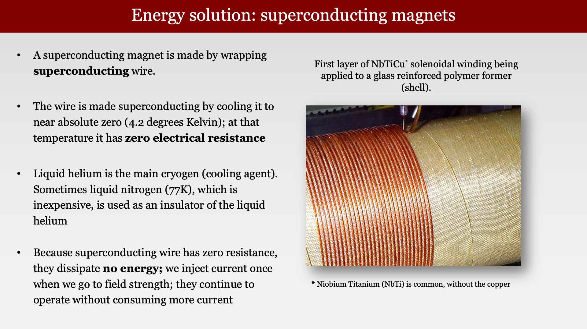
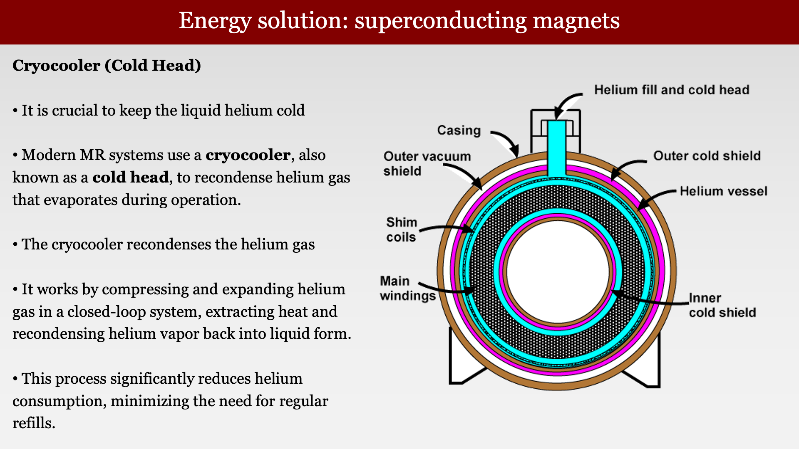
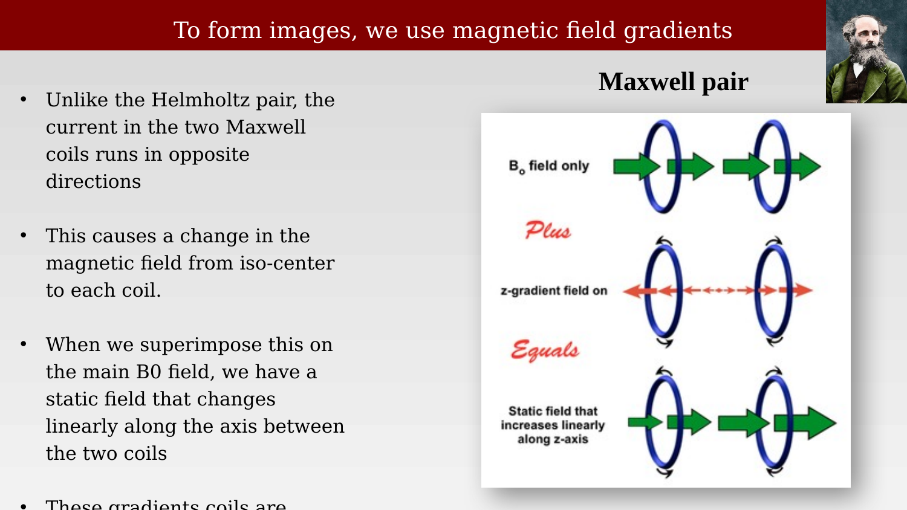
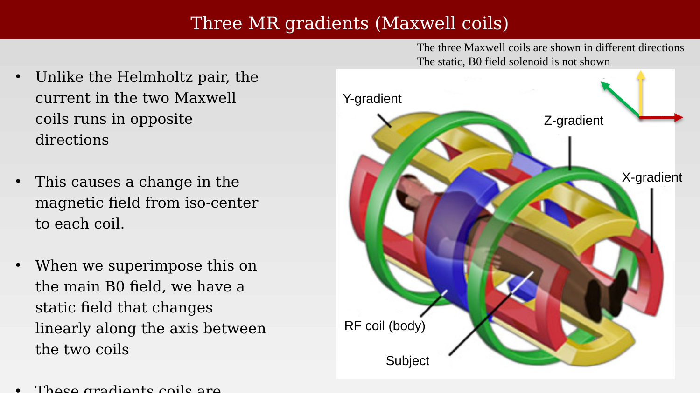
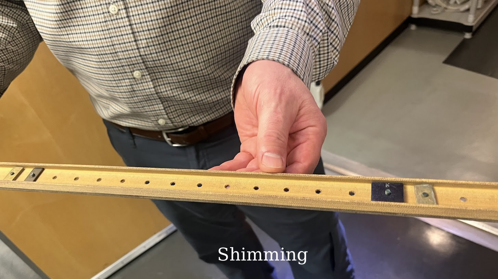

# Main Field and Gradient Coils



---

<!--
TODO (Brian): MAJOR — the image filenames in images/ch02/ do not describe their contents, and
because the crossref labels were derived from the filenames, the labels are misleading too.
Verified by opening each file:

  scanner-components-diagram.png   is the "Magnetic field units" slide (Orsted/Tesla/Gauss)
  magnetic-field-units-pioneers.png is the unit conversion tables
  magnetic-field-units-examples.png is the Helmholtz pair diagram
  magnetic-field-units-table.png    is the Helmholtz pair photograph
  b0-helmholtz-pair-diagram.png     is the solenoid slide
  b0-helmholtz-pair-photo.png       is the superconducting magnet slide   (UNUSED)
  b0-solenoid-design.png            is the cryocooler / cold head slide   (UNUSED)
  superconducting-magnet-design.png is the scanner cutaway, gradient coils (UNUSED)
  gradient-coil-new-insertion.png   (UNUSED — chapter uses cni-gradient-replacement.png instead)
  gradient-coil-removal-cni.png     (UNUSED — chapter uses cni-gradient-replacement2.png instead)

The captions and prose in this chapter are correct for the images actually displayed (one caption
was wrong and has been fixed — see "The Helmholtz Pair"). The files are all distinct; none are
duplicates. Renaming them to match their content, and updating the labels to the #fig-ch02-*
convention, would be a single mechanical pass — say the word.
-->

## Main Field and Gradient-Coil Overview

{#fig-scanner-components-diagram fig-alt="Slide titled Magnetic field units, showing reference field strengths and portraits of Hans Ørsted, Nikola Tesla, and Carl Friedrich Gauss."}

Electricity and magnetism are inseparable in an MRI scanner: electric currents generate the main, gradient, and RF magnetic fields. The three scientists shown here have units named after them: the oersted (Oe), tesla (T), and gauss (G). In MRI, the main field $B_0$ is normally specified in tesla.

The connection between electricity and magnetism was first demonstrated by the Danish physicist Hans Christian Ørsted in 1820, when he showed that a current-carrying wire deflected a compass needle placed beneath it — the experiment sketched at the lower right of the slide. Gauss developed mathematical foundations for describing magnetic fields, and Tesla applied these principles in practical electromagnetic devices.

For scale, Earth's magnetic field is about 0.5 gauss, and a refrigerator magnet is roughly 200 gauss. Most clinical MRI systems operate at 1.5 or 3 tesla; higher-field human systems, such as 7 T and 9.4 T, are used primarily for research.

## Magnetic Field Units

{#fig-magnetic-field-units-pioneers fig-alt="Table of magnetic-field units and conversions, including oersted, ampere per meter, gauss, and tesla."}

Two related magnetic field quantities describe magnetic effects:

- **H** (magnetic field strength): measured in amperes per meter (A/m)
- **B** (magnetic flux density): measured in Tesla (T)

In free space, these quantities are related by:

$$B = \mu_0 H$$

where the permeability of free space is $\mu_0 = 4\pi \times 10^{-7}$ T·m/A. Within magnetic materials, magnetization also contributes to $B$. MRI conventionally reports $B_0$ in tesla; $1\ \text{T} = 10{,}000\ \text{G}$.

## Generating the Static Magnetic Field ($B_0$)

### The Helmholtz Pair

{#fig-magnetic-field-units-examples fig-alt="Diagram of a Helmholtz pair showing two circular coils, their radius, separation, and magnetic field at the center."}

The Helmholtz pair uses two loops carrying current in the **same direction**, separated by a distance equal to their radius. This geometry produces a relatively uniform field in the region between the coils. However, with only two coils the uniform region is too small to encompass a human head.

{#fig-magnetic-field-units-table fig-alt="Photograph of a laboratory Helmholtz pair — two coaxial copper coils on a bench — with a small Helmholtz-pair diagram shown below it."}

### The Solenoid Design

{#fig-b0-helmholtz-pair-diagram fig-alt="Slide illustrating a solenoid with many turns wrapped around a cylindrical form and field lines through its center."}

To produce a uniform field over a large volume, an MRI main magnet uses multiple closely spaced, coaxial solenoidal windings. Their positions and currents determine the field strength and homogeneity. For a simple solenoid, adding turns or increasing current increases the field; in an MRI magnet, the winding geometry is optimized to make $B_0$ highly uniform throughout the imaging volume.

A simple resistive solenoid would dissipate enormous power at MRI field strengths, which is why most clinical and research systems use superconducting windings — the subject of the next section.

## Superconducting Magnets

{#fig-superconducting-magnet-material fig-alt="Slide titled Energy solution: superconducting magnets, showing NbTi wire being wound onto a glass-reinforced polymer former."}

The resistive-power problem is addressed with **superconducting wire**. MRI magnets commonly use niobium-titanium (NbTi) wire wound into multiple coils and kept below its critical temperature, typically near 4 Kelvin in a helium cryostat. In persistent mode, a superconducting switch closes the circuit after the magnet is ramped to field, allowing the current to circulate with essentially no resistive loss. The cryogenic system still requires power to maintain the low temperature.

Liquid helium is the traditional primary cryogen. Thermal shields and vacuum insulation reduce the heat reaching the helium vessel; older magnet designs sometimes used liquid nitrogen as an additional, relatively inexpensive thermal shield.

{#fig-superconducting-magnet-cryocooler fig-alt="Diagram of the cryocooler system alongside the cryostat cross-section showing thermal shields."}

Modern MR systems use a **cryocooler** (cold head) to remove heat from the cryostat. In a recondensing system, the cold head condenses helium vapor back into liquid, greatly reducing helium loss and the need for refills. The cryocooler operates with a separate, closed helium-gas cycle that alternately compresses and expands the gas to create a cold stage near 4 K.

## Gradient Coils

The main magnet's job is to make $B_0$ as uniform as possible. The gradient coils do the opposite: they deliberately add a small, controlled, spatially varying field on top of $B_0$, so that the resonant frequency depends on position. That is what makes imaging possible, and it is developed fully in the image-formation part of the book.

### The Maxwell Pair: a Z Gradient

{#fig-gradient-maxwell-pair fig-alt="Diagram showing a Maxwell pair coil design and the resulting linear z-gradient field added to the static B0 field."}

Unlike the Helmholtz pair, the two coils of a Maxwell pair carry current in **opposite directions**. Their fields cancel at isocenter and change approximately linearly near the center. When this field is added to the main field, the result is $B(z) = B_0 + G_z z$: a **z-gradient** that makes the field strength depend on position along the bore.

### Three Orthogonal Gradient Fields

{#fig-gradient-coils-xyz fig-alt="3D diagram showing the X, Y, and Z gradient coils arranged concentrically, with the RF body coil surrounding the subject."}

MRI requires three independently controlled gradient fields to encode position in all three dimensions. The z-gradient is often produced by a Maxwell-like pair of loops; the x- and y-gradients use saddle-shaped windings around the bore. Each produces a field that varies approximately linearly along its named axis, allowing the scanner to select and encode spatial locations.

All three gradient coils, along with the RF body coil, are nested concentrically inside the bore of the main magnet — the arrangement shown in @fig-gradient-coils-xyz.

<!-- TODO (Brian): images/ch02/superconducting-magnet-design.png is an unused scanner-cutaway slide ("MRI: The gradient coils") that labels the magnet, gradient coils, RF coil, patient, and table. It would fit well right here, and it is the clearest single picture of how the components nest. Note the filename is wrong for its content — see the naming TODO at the top of this chapter. -->

::: {.callout-note title="Saddle-shaped windings"}
An x- or y-gradient winding lies on the cylindrical surface of the bore. Its conductors run lengthwise along two sides of the cylinder and are joined by curved end sections, so the pattern resembles a saddle on a horse. A transverse gradient is commonly made from two symmetric saddle pairs (four saddle sections) placed around the bore. Their fields add to form the desired gradient while unwanted uniform and higher-order fields cancel.

The sections are manufactured and positioned very precisely, then driven together as one gradient coil. They are not ordinarily calibrated as independent saddles. Instead, scanner calibration measures the behavior of the complete gradient system — its strength, axis alignment, cross-axis coupling, timing, and eddy currents — and adjusts amplifier gains and pre-emphasis to correct residual errors.
:::

## Shimming

{#fig-shimming fig-alt="Photo of a person holding a shimming insert."}

For all of the high technology, some methods for adjusting the magnetic field are remarkably simple. This image shows a small ferromagnetic piece that can be positioned along a holder to make a local correction to $B_0$. These **passive shims** improve field homogeneity; scanners also use actively controlled shim coils for adjustable corrections.

## Gradient Coil Replacement at the CNI

::: {.panel-tabset}

## Receiving the new gradient coil
{#fig-gradient-coil-new-insertion fig-alt="Photo of a large cylindrical gradient coil wrapped in plastic, being moved into position at the CNI."}

<!-- The gradient coils were shipped in containers that inadvertently included iron components — a significant problem given the strong magnetic field of the scanner. A winch was required to remove the unwanted ferromagnetic material from the bore before the new coils could be installed.-->

## Removing the old gradient coil
{#fig-gradient-coil-removal-cni fig-alt="Photo of the existing gradient coil being withdrawn from the scanner bore using an extraction tool."}
:::

These images were taken during the Ultra-High Performance (UHP) gradient upgrade at the CNI: the new gradient coil arriving, and the old coil being withdrawn from the bore to make room for it. The installation required precise mechanical alignment within the magnet bore, as well as careful attention to the strong static field.
