# Radiofrequency Coils



------------------------------------------------------------------------

## RF Coils Overview {#sec-rf-coils-overview}

{#fig-rf-coils-intro fig-alt="Title slide for the RF coils section, showing the RF Coils for MRI textbook cover and a photo of Stanford's engineering quad."}

Radiofrequency (RF) coils serve two functions in an MRI system.

-   A **transmit** coil produces the RF magnetic field that tips the nuclear spins.
-   A **receive** coil detects the weak voltage induced by the precessing transverse magnetization.

One coil can transmit and receive at different times. In most human MRI systems, however, the built-in body coil transmits and a separate coil array receives. Coil design strongly affects sensitivity, spatial coverage, and the speed of an acquisition.

## Surface Coils

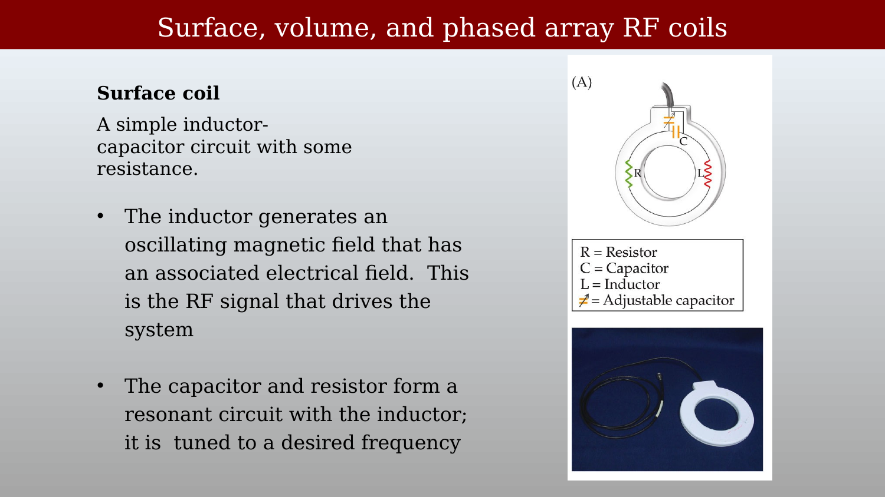{#fig-rf-surface-coil-description fig-alt="Slide describing how the inductor generates an oscillating B1 field and the capacitor forms a resonant circuit tuned to the Larmor frequency."}

```{=html}
<!--
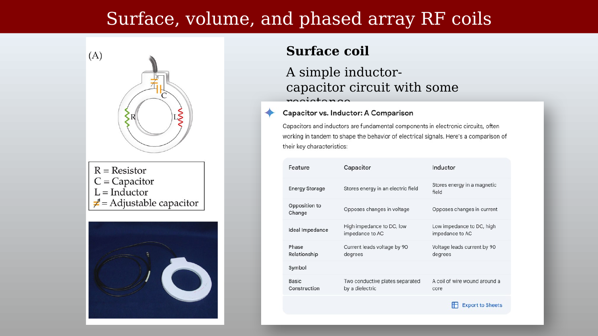{#fig-rf-surface-coil-circuit fig-alt="Diagram of a surface coil showing R (resistor), C (capacitor), L (inductor), and Z (adjustable capacitor) components, alongside a photo of a small surface coil."}
-->
```

<!-- TODO (Brian): the commented-out figure above points at images/ch03/rf-surface-coil-circuit.png, which does not exist in images/ch03/ — so this block cannot be uncommented as written. Either re-export the surface-coil circuit slide under that name, or delete the block. (The one unused file in the folder, rf-inductor-capacitor.png, is a screenshot of the capacitor-vs-inductor comparison that is already transcribed as the table in the callout below, so it is correctly unused.) -->

A **surface coil** is a conducting loop with capacitors that form a **resonant** circuit. Every real coil also has resistance and other sources of loss. The circuit is tuned to the Larmor frequency; we will return to that frequency when we discuss the free-induction-decay experiment.

Surface coils provide high local sensitivity but limited spatial coverage — they work best for structures close to the coil surface.

::: {.callout-note title="LC circuits"}
The loop behaves as an inductor: alternating current in the loop produces an oscillating $B_1$ field. Capacitors tune the circuit to resonance and are also used to match the coil to the transmitter or receiver. Resistance represents unavoidable energy loss; it does not provide the impedance match.

The idealized behavior of capacitors and inductors can be compared as follows.

| Feature | Capacitor | Inductor |
|------------------------|------------------------|------------------------|
| Energy storage | Stores energy in an electric field | Stores energy in a magnetic field |
| Response to change | Opposes changes in voltage | Opposes changes in current |
| Ideal impedance | High at DC; decreases with AC frequency | Low at DC; increases with AC frequency |
| Phase relationship | Current leads voltage by 90° | Voltage leads current by 90° |
| Basic construction | Two conductive plates separated by a dielectric | A coil of wire, often wound around a core |
:::

## Volume Coils and the Birdcage Design

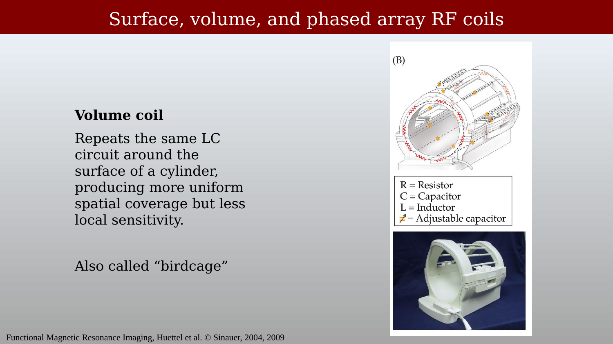{#fig-rf-volume-coil-birdcage fig-alt="Diagram of a birdcage volume coil showing the cylindrical geometry and LC circuit elements, alongside a photo of an actual birdcage coil."}

A **volume coil** distributes conductors and capacitors around a cylinder to generate a relatively uniform $B_1$ field over a large volume. The **birdcage** design — multiple conducting rungs connected by end rings — is the standard approach. Its elements form one coupled resonant structure, rather than independent receiver channels whose signals are simply added. The coil in @fig-rf-volume-coil-birdcage excites the whole head at once, with far less variation across the volume than a surface coil.

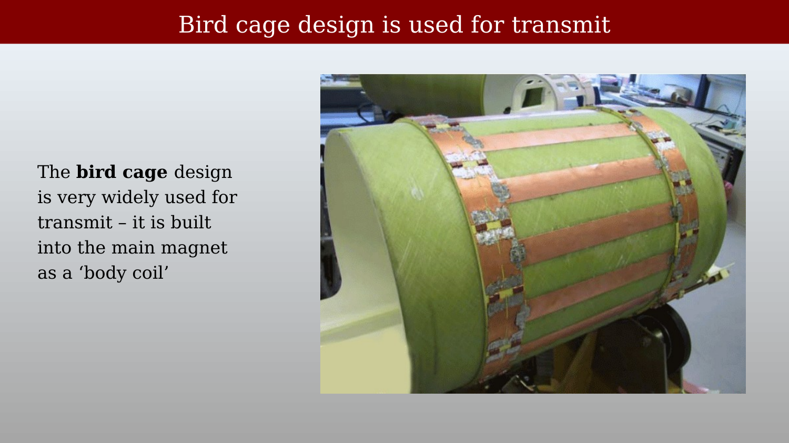{#fig-rf-birdcage-transmit fig-alt="Photo of a birdcage body coil — a large cylindrical coil with copper rungs and end rings — with text noting it is used as the built-in body coil."}

The most important example is the **body coil**, which is built into the scanner. It is driven in its uniform, circularly polarized mode to provide RF excitation throughout the magnet bore.

At 3 T, and especially at 7 T and above, the RF wavelength in tissue and coupling between the coil and patient become important. These effects can make the transmit field non-uniform and increase SAR, motivating more complex, multi-transmit driving schemes.

## Phased-Array Coils

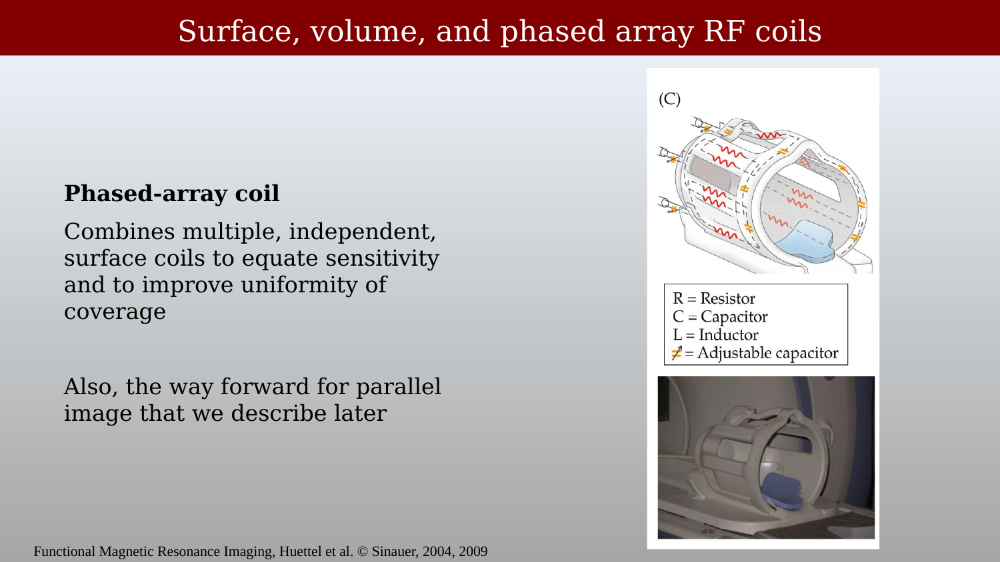{#fig-rf-phased-array-coil fig-alt="Diagram of a phased-array coil showing multiple independent coil elements arranged around the head."}

A phased-array coil combines multiple small, independent surface-coil elements — each with its own receiver channel — arranged to cover a larger region. Unlike a volume coil, each element detects signal from its local neighborhood with high sensitivity. The elements are designed to be decoupled so that they do not substantially interfere with one another.

The signals are measured separately and combined computationally to produce an image. This arrangement provides broad coverage while retaining good local signal-to-noise ratio (SNR).

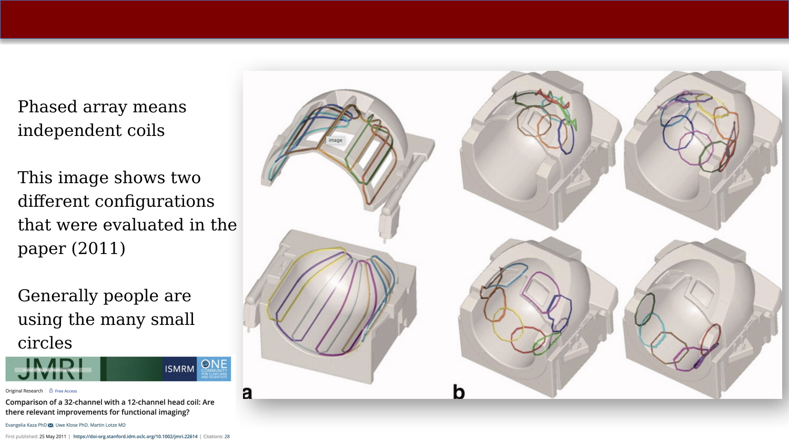{#fig-rf-phased-array-head-coils fig-alt="Diagrams showing the element layouts of a 12-channel and a 32-channel phased-array head coil."}

Phased-array coils enable **parallel imaging** (e.g., SENSE and GRAPPA), which uses the different spatial sensitivity profiles of the elements as additional encoding information. This permits faster acquisitions; we will describe the idea later. More channels can improve SNR and parallel-imaging performance, but only with appropriate element design and greater hardware complexity.

## Head Coils in Practice

::: panel-tabset
## Multiple parallel-receive head coils

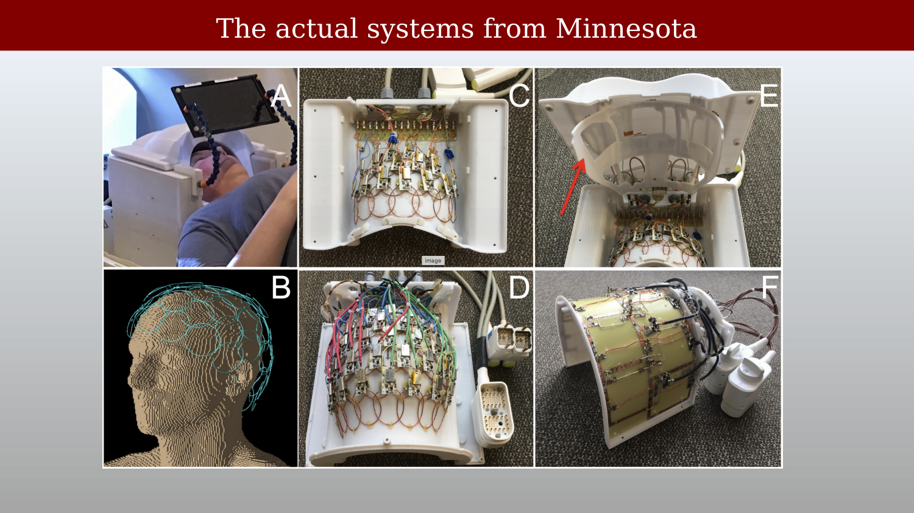{#fig-rf-head-coil-minnesota fig-alt="Six-panel figure showing head coil components, element arrays, and the assembled coil being worn by a subject."}

## Close-up: 64-channel coil (Stockmann/MGH)

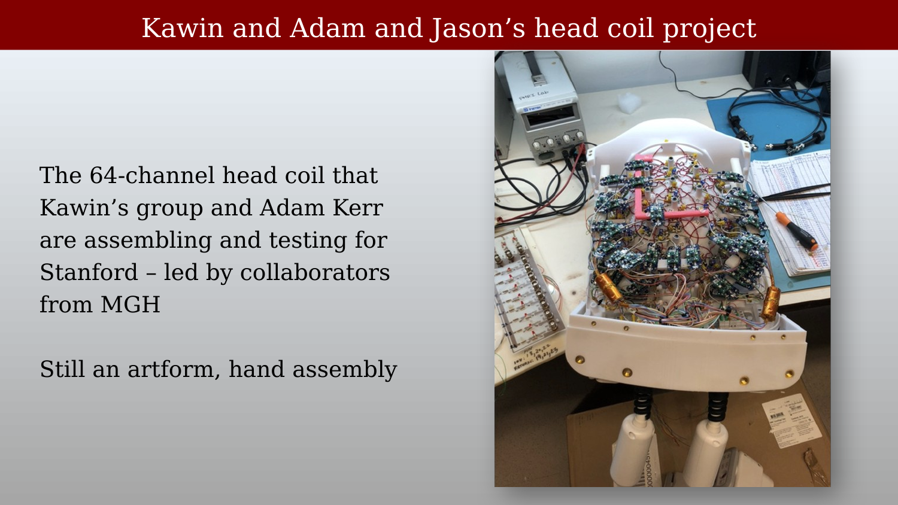{#fig-rf-head-coil-stanford-project fig-alt="Photo of a partially assembled 64-channel head coil with many small coil elements visible, next to a workbench setup."}
:::

High-channel-count head coils are still largely hand-assembled, requiring careful placement, tuning, and decoupling of each element. The 64-channel coil shown here was assembled for the CNI in collaboration with Massachusetts General Hospital. Coil construction remains something of an art: small changes in one element can alter the tuning or coupling of its neighbors.

## Coil Design and Simulation

::: panel-tabset
## Software for head-coil design

{#fig-rf-comsol-simulation fig-alt="Screenshot of a COMSOL blog post titled 'Designing and Optimizing MRI Birdcage Coils Using Simulation', showing a head phantom inside a birdcage coil model."}

## Simulation of the signal

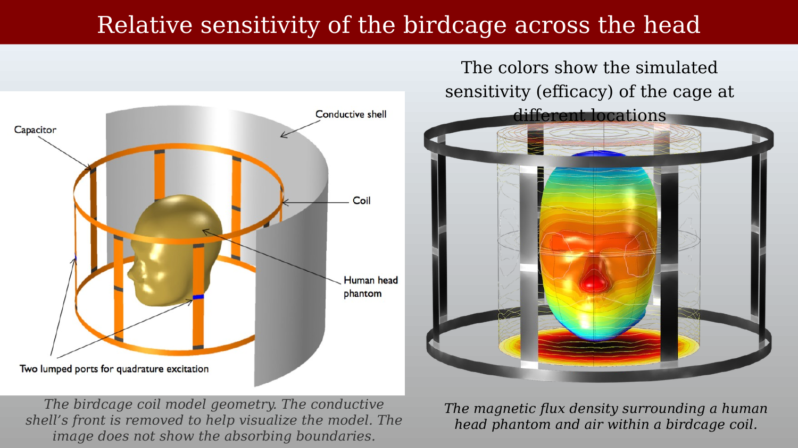{#fig-rf-birdcage-sensitivity fig-alt="Two-panel figure showing the birdcage coil model geometry on the left and a color map of magnetic flux density through the head phantom on the right."}
:::

Electromagnetic simulation tools such as COMSOL, CST Studio Suite, and Sim4Life model the transmit and receive RF fields inside the patient, as well as the electric field. They are used to estimate the specific absorption rate (SAR), the RF power absorbed per unit mass of tissue. These simulations are essential for safety evaluation, particularly at high field strengths where transmit-field inhomogeneity and local SAR become more significant.

## Commercial Coils

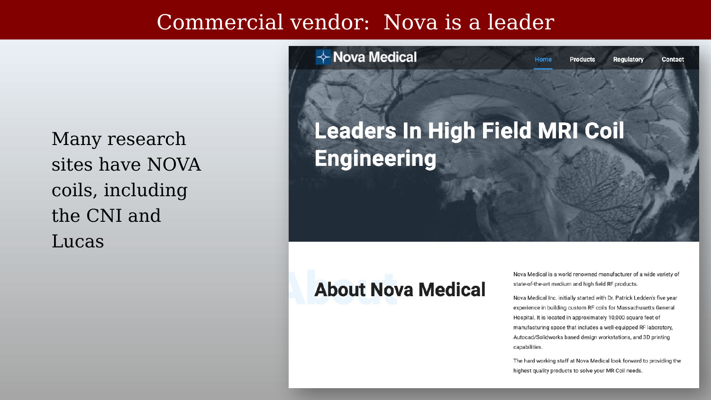{#fig-rf-nova-medical fig-alt="Screenshot of the Nova Medical website with the headline 'Leaders in High Field MRI Coil Engineering'. Text notes that many research sites including the CNI and Lucas Center use Nova coils."}

Many research sites use coils from specialized manufacturers rather than from the scanner vendor. Nova Medical is a widely used supplier of high-channel-count head coils for Siemens, GE, and Philips scanners. Other specialized manufacturers include RAPID Biomedical, ScanMed, and PulseTeq.

## Image Quality Across Coil Types

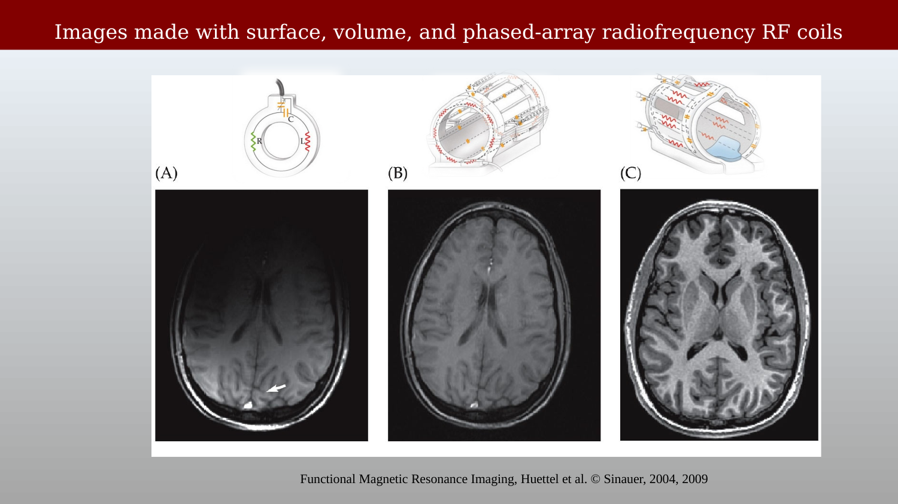{#fig-rf-coil-images-comparison fig-alt="Three brain MR images labeled A (surface coil), B (volume coil), and C (phased-array coil), showing differences in spatial coverage and signal uniformity."}

Surface coils provide high SNR near the coil, but their sensitivity falls rapidly with distance. Volume coils provide more uniform coverage across the whole brain, usually with lower receive sensitivity. Phased-array coils combine the local sensitivity of many elements to provide broad coverage and high SNR. Their raw sensitivity is still spatially non-uniform, so image reconstruction often includes a coil-combination or intensity-correction step. This balance makes phased arrays the standard receive coils for modern neuroimaging.