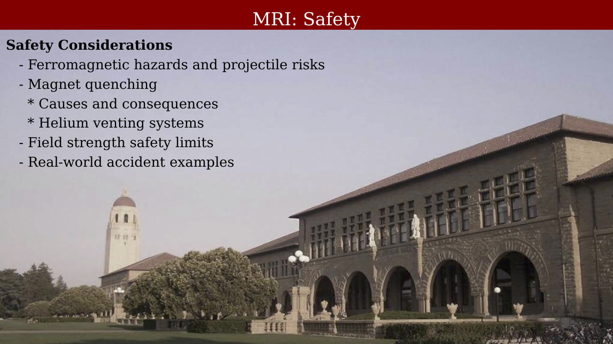
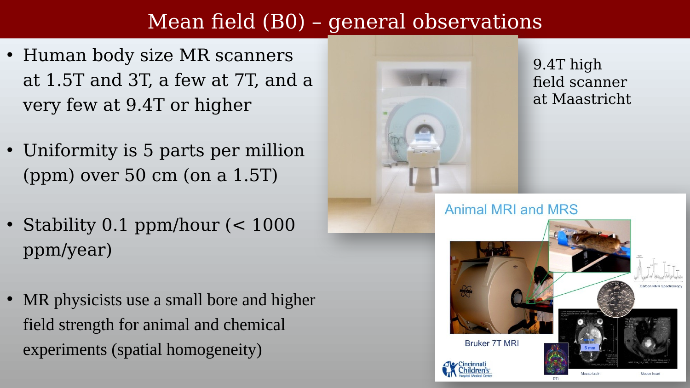
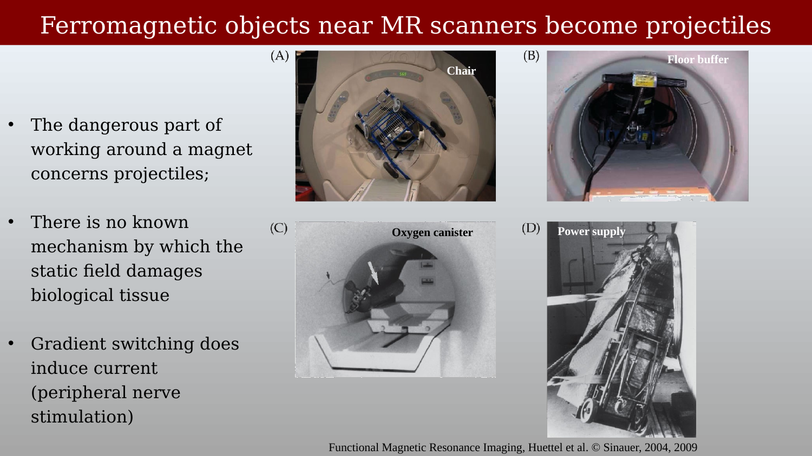
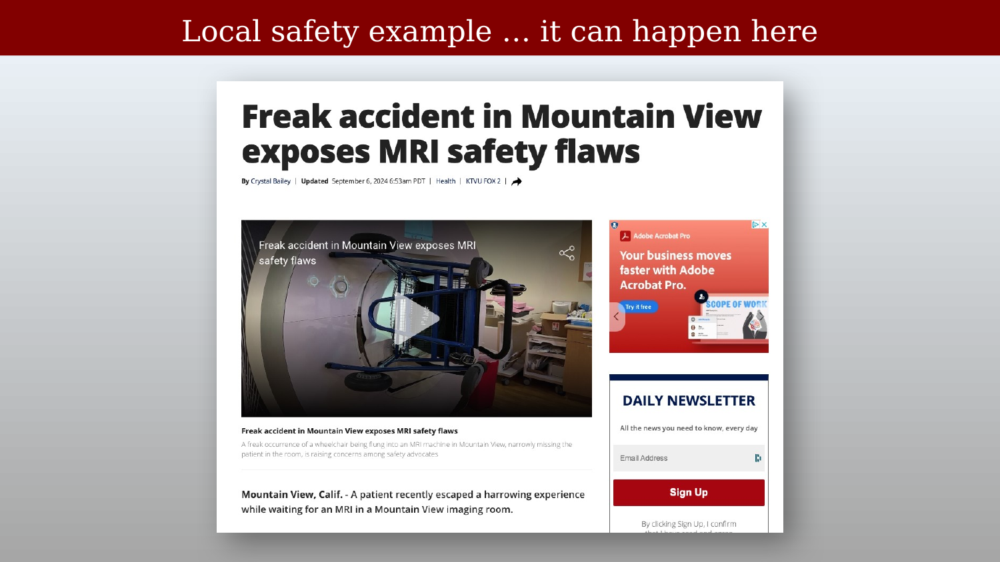
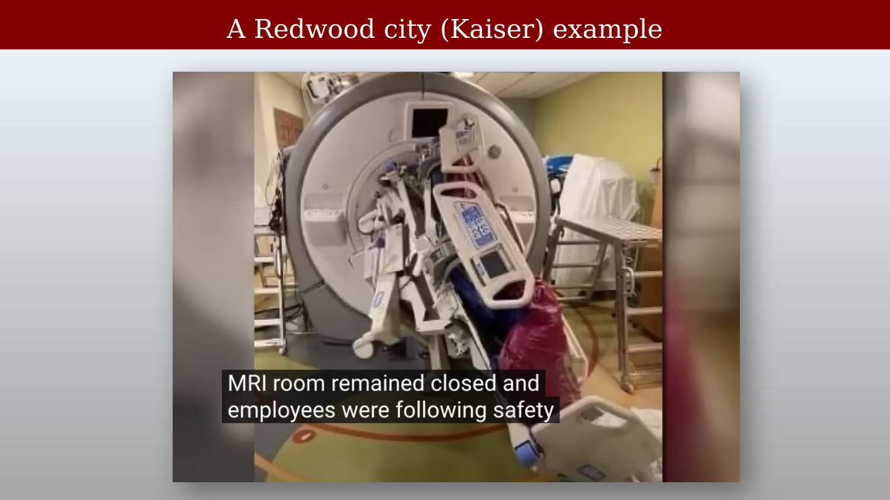
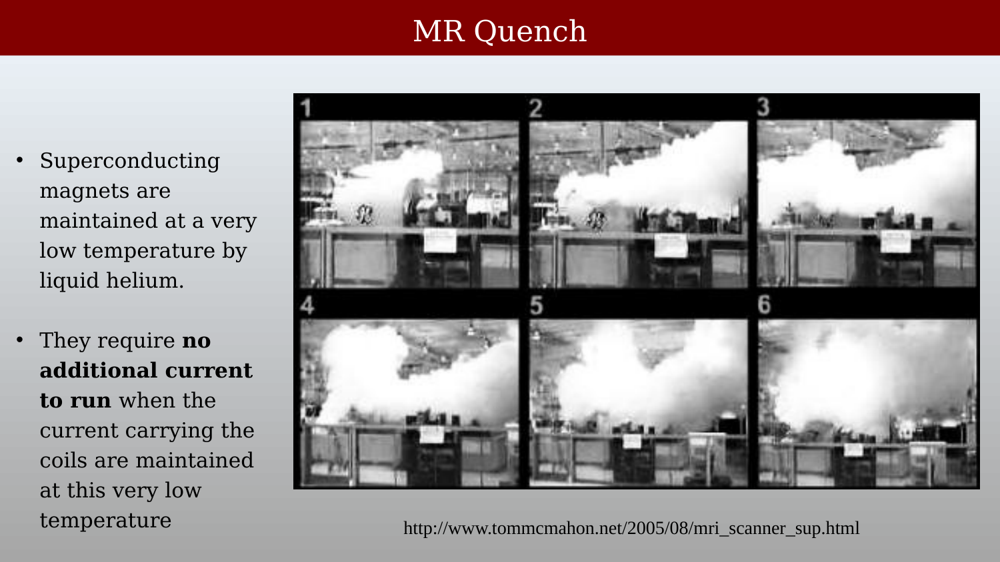
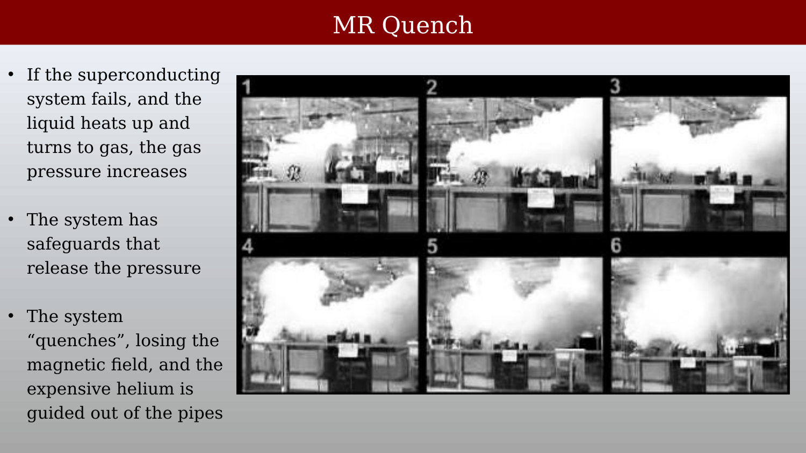
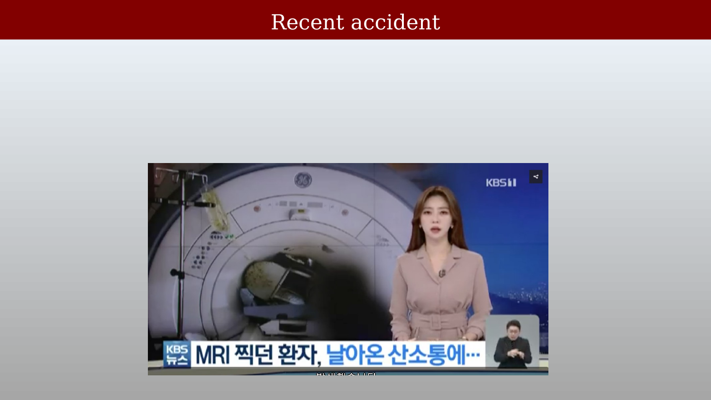
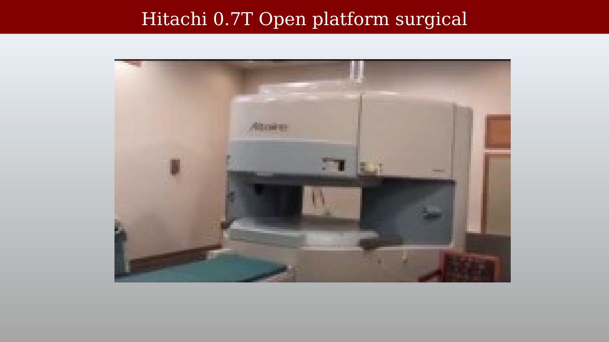
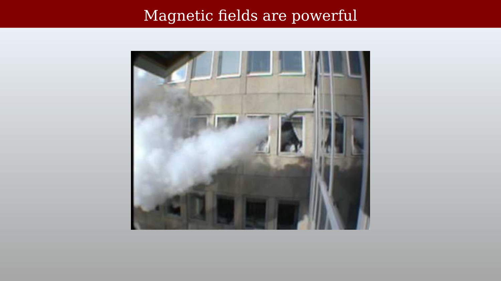

# MRI Safety



---

## Overview

{#fig-safety-overview fig-alt="Safety overview slide listing key topics: ferromagnetic hazards and projectile risks, magnet quenching causes and consequences, helium venting systems, field strength safety limits, and real-world accident examples. Stanford campus background."}

## Main Magnetic Field (B0): General Properties

{#fig-safety-b0-properties fig-alt="Slide listing B0 safety properties: human body-size scanners at 1.5T, 3T, and a few at 9.4T; uniformity of 5 ppm over 50 cm; stability of 0.1 ppm/hour; and use of small bore magnets for animal and chemical experiments."}

Human body-size MR scanners are most commonly operated at 1.5T and 3T, with a small number at 7T and very few at 9.4T or above. Field uniformity is typically 5 parts per million (ppm) over a 50 cm diameter spherical volume. Field stability is maintained at better than 0.1 ppm/hour (less than 1000 ppm/year). MR physicists also use small-bore, higher-field-strength systems for animal and chemical (spectroscopy) experiments where higher spatial homogeneity is required.

## Ferromagnetic Objects and Projectile Hazards

{#fig-safety-ferromagnetic-projectiles fig-alt="Four-panel figure showing a chair, oxygen canister, and power supply that have been drawn into MRI scanner bores by the static magnetic field. From Huettel et al., Functional Magnetic Resonance Imaging, 2e."}

The primary physical danger of working around an MRI magnet is the **projectile effect**: ferromagnetic objects experience a strong attractive force toward the magnet bore that increases rapidly as the object approaches. Common hazardous objects include oxygen canisters, IV poles, tools, scissors, and any item containing iron or steel. There is no known biological mechanism by which the **static** B0 field damages tissue at currently used field strengths. However, rapidly **switching** gradient fields can induce peripheral nerve stimulation.

## Real-World Safety Incidents

### Local Example: Mountain View

{#fig-safety-local-accident fig-alt="Screenshot of a KTVU news article headlined 'Freak accident in Mountain View exposes MRI safety flaws', with a photo of the MRI room after an incident."}

A patient recently occupied a harrowing experience at a Mountain View imaging center — a reminder that MRI safety incidents are not confined to distant or under-resourced facilities.
Reference: [KTVU report](https://www.ktvu.com/news/freak-accident-mountain-view-exposes-mri-safety-flaws)

### Redwood City (Kaiser) Example

{#fig-safety-kaiser-accident fig-alt="Video still showing medical equipment drawn into an MRI scanner bore, with a caption noting the MRI room remained closed and employees were following safety protocols."}

Reference: [YouTube video](https://www.youtube.com/watch?v=uDfwxoigZZk)

## Magnet Quench

{#fig-safety-quench-sequence fig-alt="Six-panel time sequence showing a magnet quench, with helium vapor erupting from the scanner in a large white cloud."}

{#fig-safety-quench-description fig-alt="Slide describing the quench process: the cooling system fails, the magnet develops resistance, heat builds up, helium converts to gas, pressure increases, and the system vents."}

A superconducting magnet requires no ongoing electrical power once charged — the current flows indefinitely as long as the wire remains below its critical temperature. If the cooling system fails, the wire warms, develops resistance, generates heat, which drives further warming in a runaway process. The liquid helium rapidly converts to gas (expanding by a factor of ~700), pressure builds, and the system releases the helium through a dedicated vent pipe in an event called a **quench**.

In an open space a quench is spectacular but not immediately dangerous. In an enclosed room, the escaping helium — which is inert — can displace oxygen and create an asphyxiation hazard. MRI scanner rooms are required to have helium venting systems for this reason.

## Additional Accidents

### Recent Accident (Korea)

{#fig-safety-recent-accident fig-alt="Screenshot of a Korean KBS news broadcast showing an MRI scanner with an oxygen canister lodged in the bore."}

### Hitachi Open-Platform Scanner

{#fig-safety-hitachi-open-scanner fig-alt="Photo of a Hitachi 0.7T open-platform MRI scanner with a horizontal gap between the upper and lower magnet poles, allowing lateral access to the patient."}

Open-platform scanners use a vertical field geometry with a gap between the upper and lower magnet assemblies. The lower field strength (typically 0.7T or below) limits SNR compared to closed-bore systems, but the open geometry allows surgical access and is better tolerated by claustrophobic patients.

## The Scale of Magnetic Forces

{#fig-safety-magnet-power fig-alt="Photo showing a large object being attracted to a magnet, illustrating the scale of forces involved near high-field MRI systems."}

The forces involved near a high-field magnet are difficult to appreciate without direct experience. The attractive force scales with the gradient of the field, which increases steeply as an object approaches the bore entrance. Even experienced MRI staff must maintain strict protocols to prevent accidents.
