# MR Signal Fundamentals



---

## Fundamental MR measurements

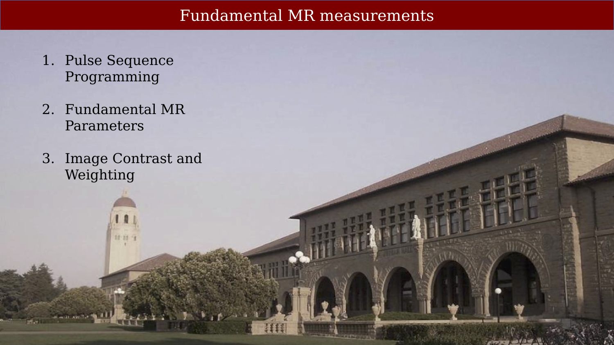{#fig-ch05-fundamental-mr-measurements}

## Pulse sequency programming

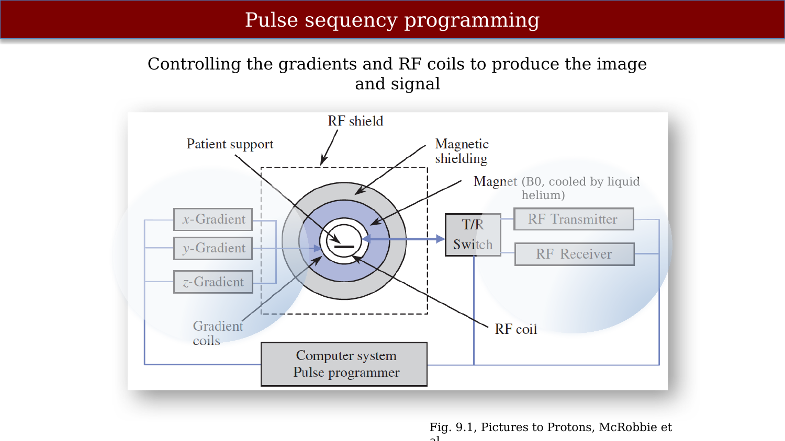{#fig-ch05-pulse-sequency-programming}

Page 168, Pictures to Protons

## User’s console: Adjusts pulse sequence parameters

::: {.panel-tabset}

## Step 1

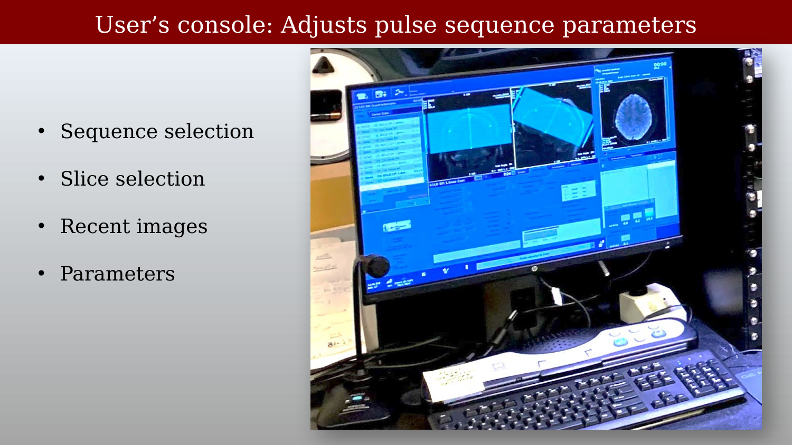{#fig-ch05-users-console-adjusts-pulse-sequence-parameters-1}

## Step 2

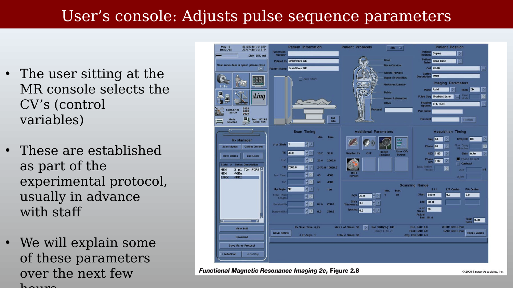{#fig-ch05-users-console-adjusts-pulse-sequence-parameters-2}

## Step 3

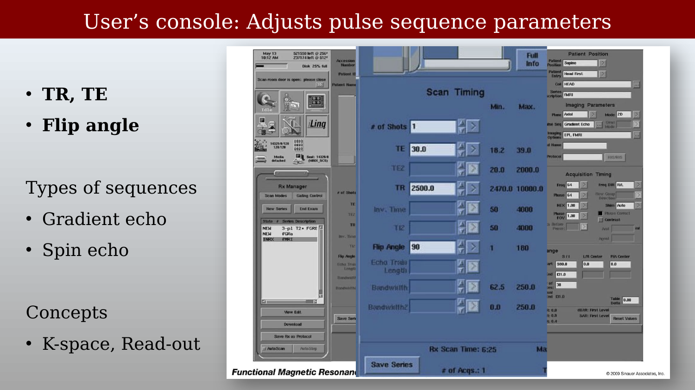{#fig-ch05-users-console-adjusts-pulse-sequence-parameters-3}

:::

## MR pulse sequences

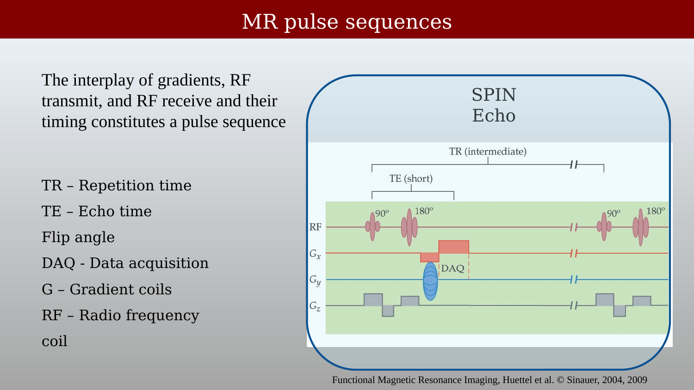{#fig-ch05-mr-pulse-sequences}

The device programming is based on creating different pulse sequences.
Two examples of pulse sequences are shown here.
The pulse sequences themselves can be quite different to emphasize different features of the brain.
Equally important, the parameters of the pulse sequences can be adjusted to highlight certain differences and diminish others.

## MR quantities (weighted)

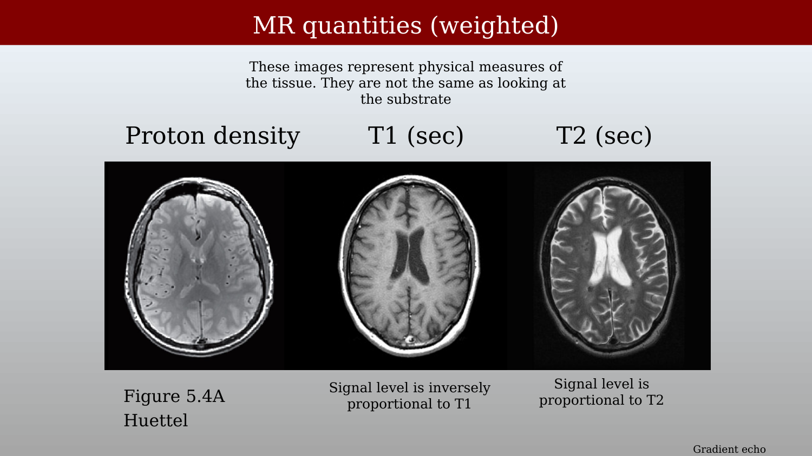{#fig-ch05-mr-quantities-weighted}

When show this slide, remind the class that this is not an image like the kind that you see when you look around you, or what is represented by a camera.
This image represents quantities that WE DO NOT SEE.  These are numerical quantities about the physical properties of the tissue that are invisible to us.
These images represents these physical quantities.

An important element of magnetic resonance is that the same instrument can be programmed to measure different aspects of the system.  
This image shows images from a similar slice of a brain, obtained using three different protocols.  
The three protocols are designed to measure different fundamental physical properties of the tissue.  
These three images are showing different physical MR measures of the tissue.

The slice on the left is from the Book, 5.4A
Middle is from Hull University, but not available any more (http://www.hull.ac.uk/mri/lectures/gpl_page.html  - seems to have been taken off line)
The slice off the screen on the right source:  https://radiopaedia.org/articles/t2-weighted-image

Here is a good site!

## MR pulse sequence parameter choices

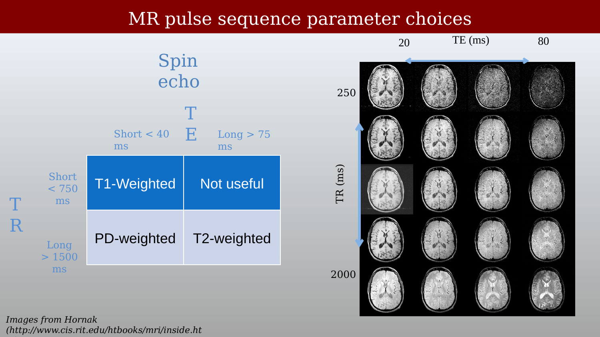{#fig-ch05-mr-pulse-sequence-parameter-choices}

Even with a single type of pulse sequence, you can choose the parameters to emphasize different physical properties of the system.
Here, a spin echo type sequence is used to produce all of the images at the right.
But the parameters are chosen in different ways, and each selection of parameters produces a signal that emphasizes a different physical property of the tissue.

## To the future – and beyond

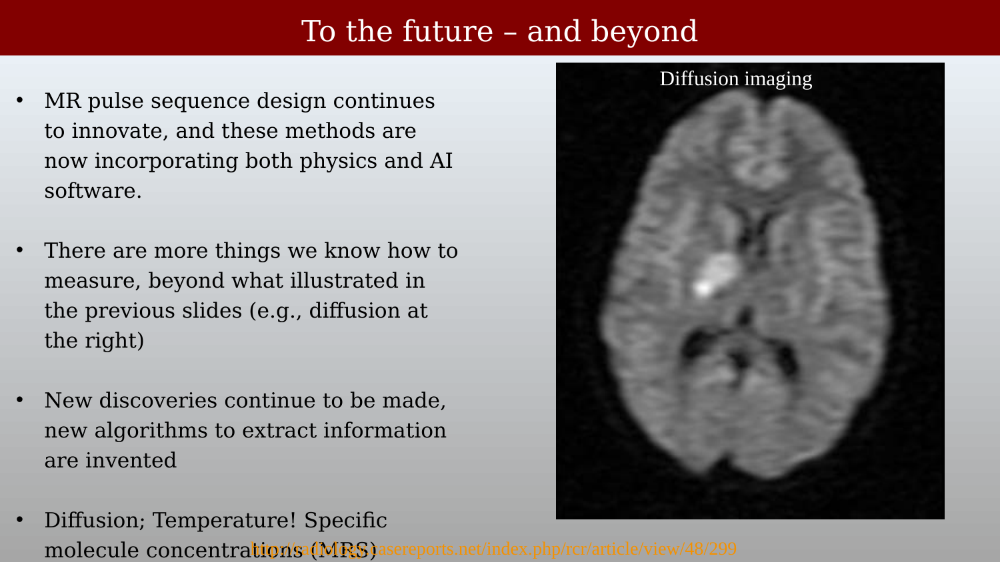{#fig-ch05-to-the-future-and-beyond}

## MR: Free induction decay

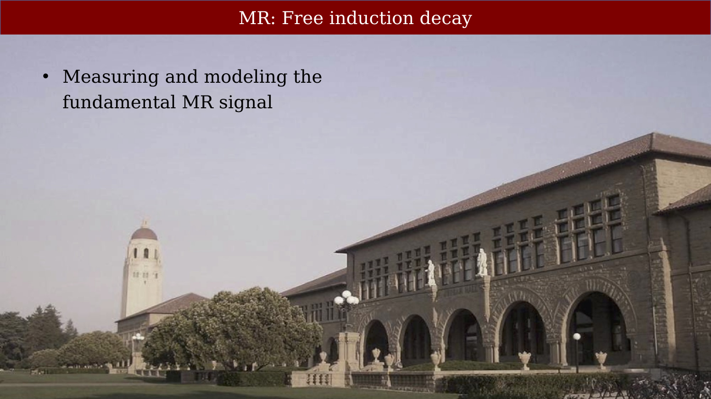{#fig-ch05-mr-free-induction-decay}

Deal with these some more in the future teaching
Williamson article for teaching.
Jwteaching repository from Jon winawer
Is Quantum Mechanics necessary for understanding Magnetic Resonance? LARS G. HANSON

## The free induction decay experiment

::: {.panel-tabset}

## Step 1

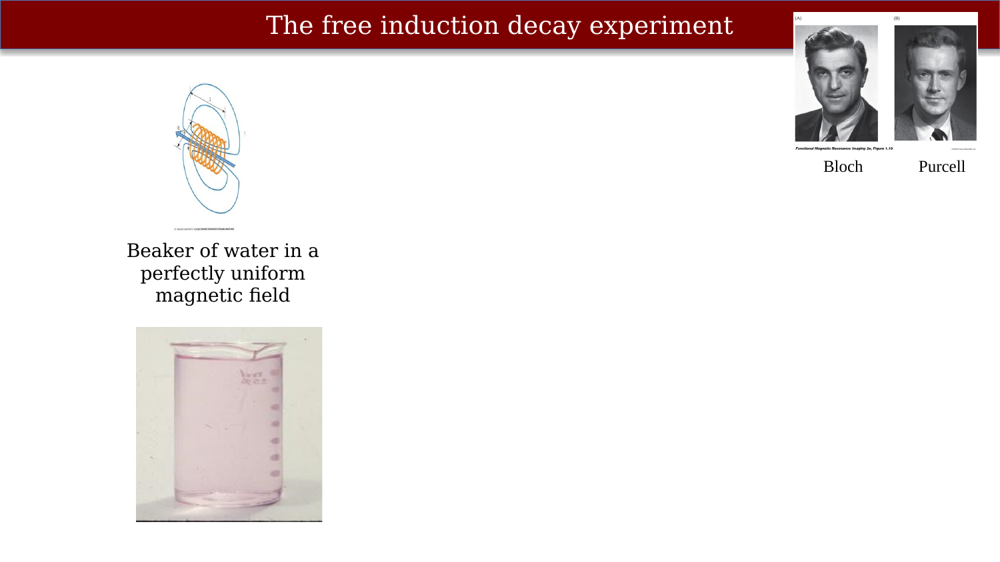{#fig-ch05-the-free-induction-decay-experiment-1}

## Step 2

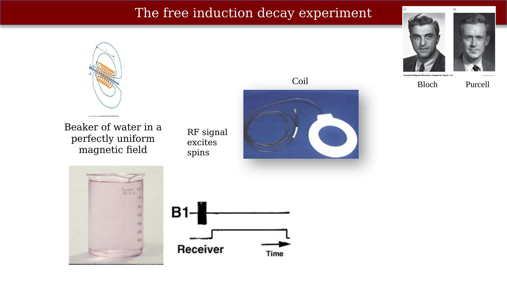{#fig-ch05-the-free-induction-decay-experiment-2}

## Step 3

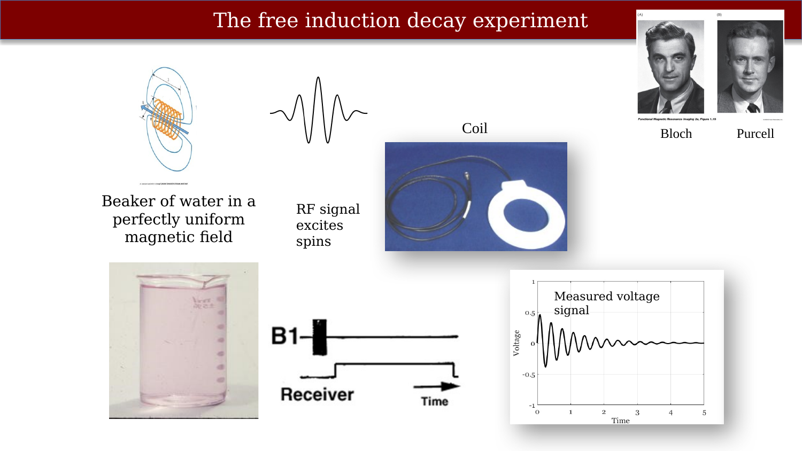{#fig-ch05-the-free-induction-decay-experiment-3}

:::

Paul Callaghan
Carries out a magnetic resonance experiment for free induction decay.

## The FID signal depends on the B1 duration

::: {.panel-tabset}

## Step 1

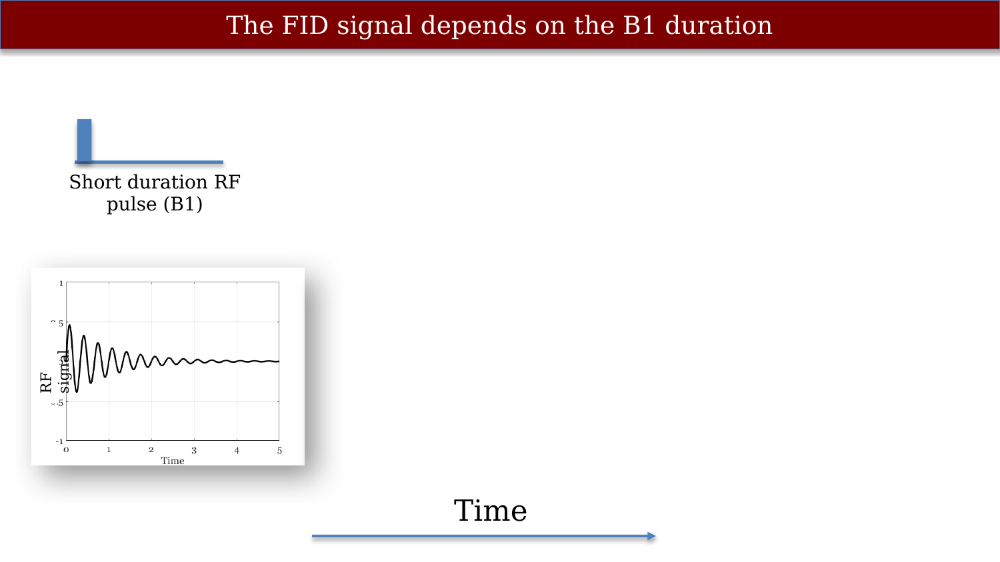{#fig-ch05-the-fid-signal-depends-on-the-b1-duration-1}

## Step 2

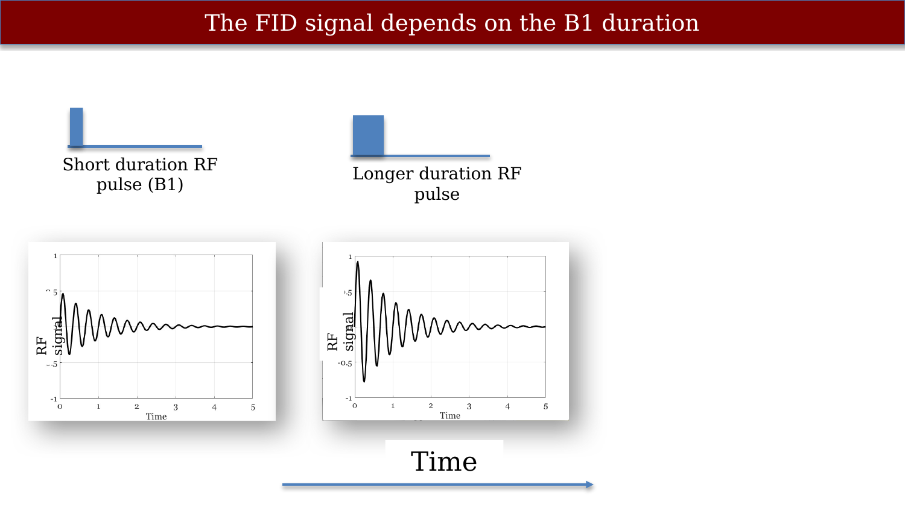{#fig-ch05-the-fid-signal-depends-on-the-b1-duration-2}

## Step 3

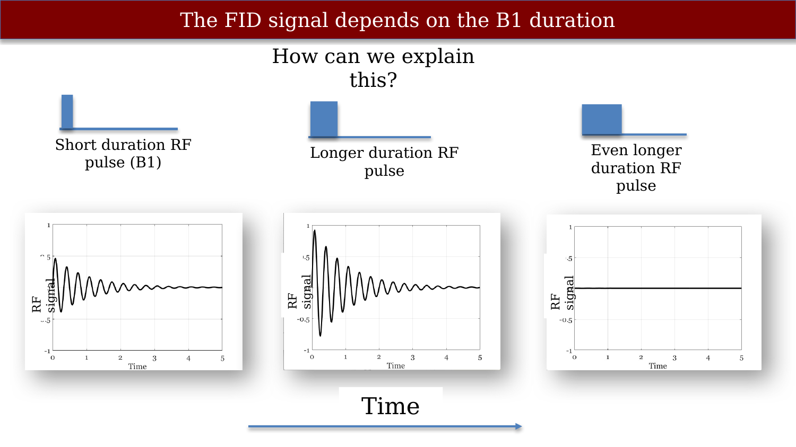{#fig-ch05-the-fid-signal-depends-on-the-b1-duration-3}

:::
