# The MR Macroscopic Model



---

## The standard MR macroscopic model

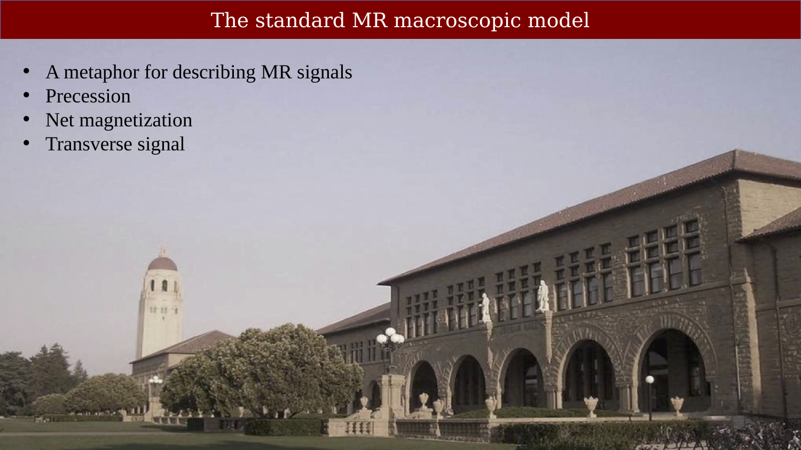{#fig-ch06-the-standard-mr-macroscopic-model}

Reference about 
Drawing single NMR spins and understanding relaxation
Mike P. Williamson
Sheffield

How should we draw vectors to represent individual nuclear spins? Vectors in 3D space are merely a way of understanding the mathematics of quantum mechanics, which provides the “true” description of a single spin-½ nucleus. They are a useful aid to understanding, but there is no single “correct” vector representation, and the different vector models that are used have advantages and disadvantages. Here, we discuss the 2 standard vector models for a nuclear magnetic resonance spin: the up/down or alignment model and the 2-cone model, and we show how they relate to quantum mechanics. We show why both of these models are limited and discuss a third model, the uniform model, in which individual spins can be in any orientation. We demonstrate how the uniform model presents a clear and logically coherent description for spins: at equilibrium; following a 90° pulse; and during the subsequent relaxation back to equilibrium. The uniform model is fully consistent with quantum mechanics and leads to an understanding of coherence and relaxation that cannot be obtained from the other 2 models. We suggest that the uniform model is more helpful than the other 2 for most purposes.

## Source of the MR signal: Hydrogen nuclei (spins, protons)

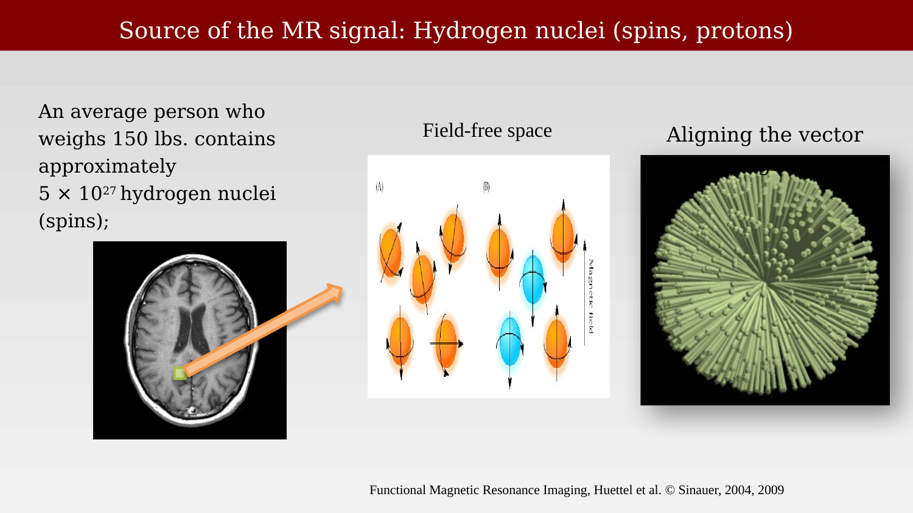{#fig-ch06-source-of-the-mr-signal-hydrogen-nuclei-spins-prot}

People use a metaphor that the protons oscillate between one of two permissible states.  But it is probably more sensible to see the protons as distributed uniformly, as in the right image, and then when we apply the B0 field RF pulse we change the distribution to be biased.  Applying the RF pulse rotates all of the spins.  The longer we apply the pulse the more they rotate.  

The energy difference between these two states determines the frequency of an RF signal that is needed to flip from one state to the other.  This is called the Larmor frequency. Slightly more of the protons have their positive side (red) oriented along with the B0 field. If we add an RF pulse along the longitudinal axis at this frequency, we change the preponderance of the spins from the orange state to the blue state.  They will then relax back along the main axis

Extra images from
Is Quantum Mechanics Necessary for Understanding Magnetic Resonance?
LARS G. HANSON
Sent to me by Hongjian He

## The FID signal: quantal description

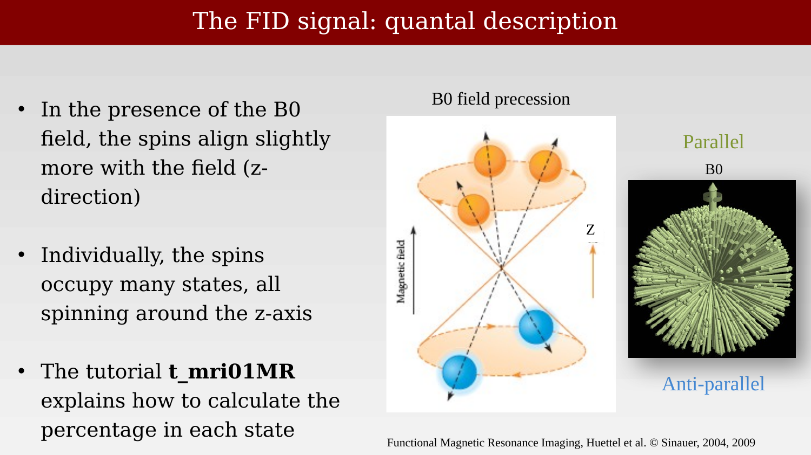{#fig-ch06-the-fid-signal-quantal-description}

The energy difference between the parallel and anti-parallel two states determines the frequency of an RF signal that is needed to flip from one state to the other.  This is called the Larmor frequency. Slightly more of the protons have their positive side (red) oriented along with the B0 field. If we add an RF pulse along the longitudinal axis at this frequency, we change the preponderance of the spins from the orange state to the blue state.  They will then relax back along the main axis

## The net magnetization is the sum of the spins

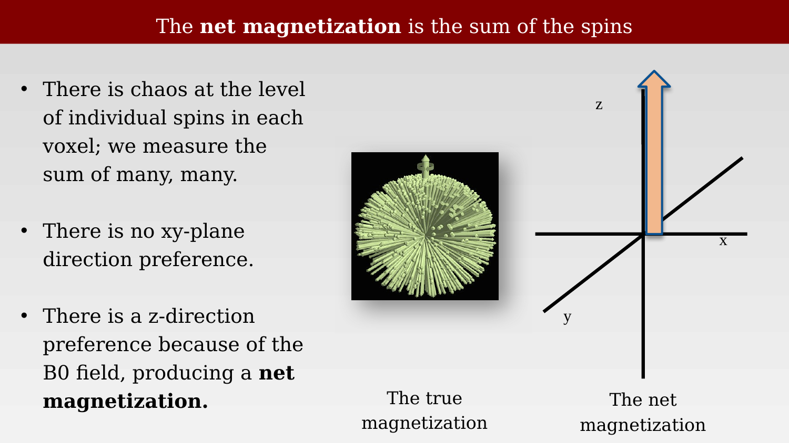{#fig-ch06-the-net-magnetization-is-the-sum-of-the-spins}

Figure 3.4 Precession. The movement of a rotating proton or magnet within a magnetic field (A) is similar to the movement of a top in the earth’s gravitational field (B).
In addition to their spinning motion, their axis of spin itself wobbles around a vertical axis; this motion is known as precession.

## The RF signal creates a ‘precession’ signal of the net magnetization

::: {.panel-tabset}

## Step 1

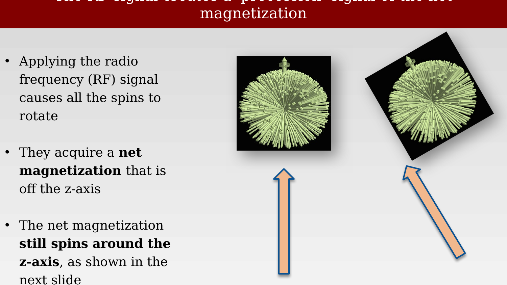{#fig-ch06-the-rf-signal-creates-a-precession-signal-of-the-n-1}

## Step 2

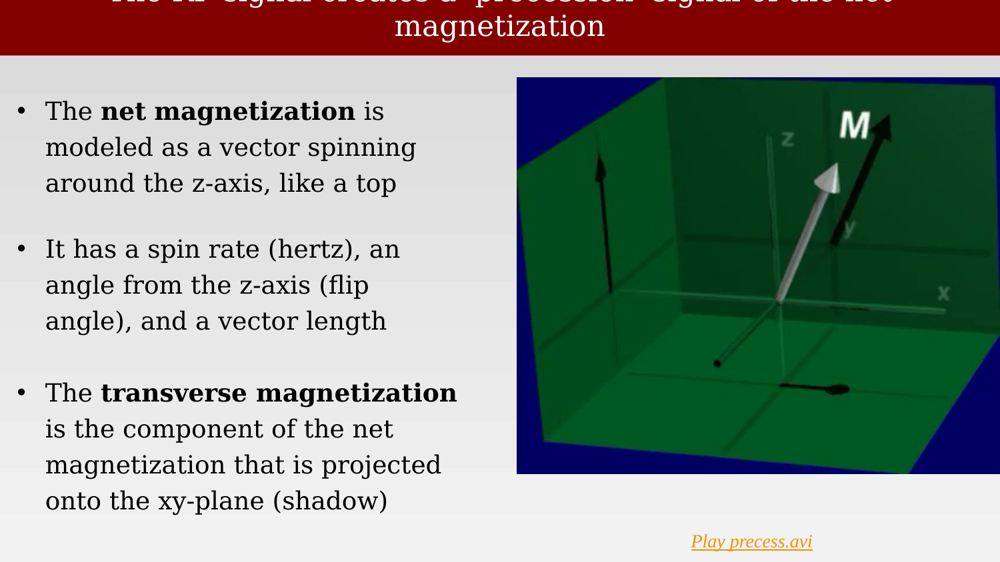{#fig-ch06-the-rf-signal-creates-a-precession-signal-of-the-n-2}

:::

## Applying the RF field rotates all the spins

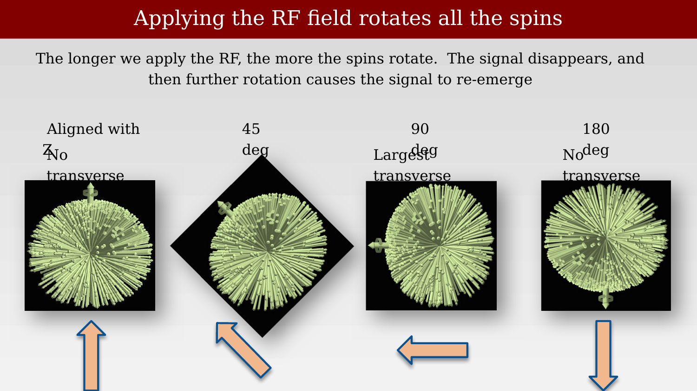{#fig-ch06-applying-the-rf-field-rotates-all-the-spins}

## The B1 signal applies a force to the net magnetization creating the transverse signal

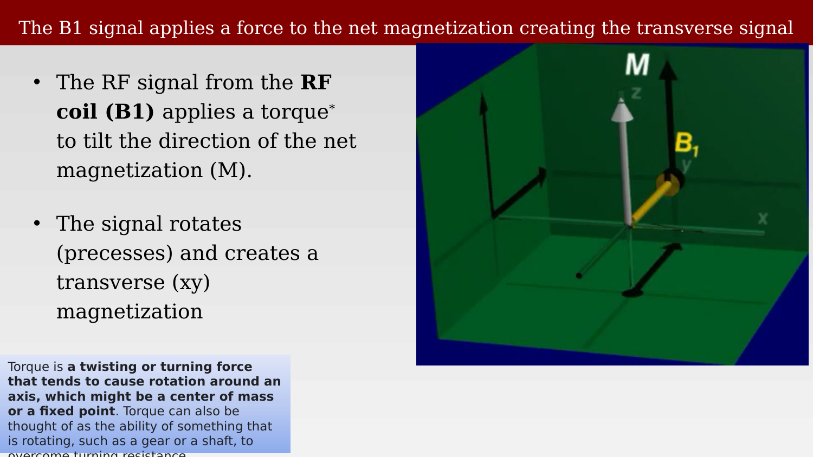{#fig-ch06-the-b1-signal-applies-a-force-to-the-net-magnetiza}

The RF excitation field does have a component along the zz-axis (the direction of the B0B_0 field), but this zz-component typically does not have a significant effect on the net magnetization during MRI. Here’s why:

1. RF Field Orientation and Purpose:
The RF pulse in MRI is typically designed as a rotating magnetic field, denoted as B1B_1, in the xyxy-plane. This field is perpendicular to the B0B_0 field and is tuned to oscillate at the Larmor frequency.
The purpose of the B1B_1 field is to cause the net magnetization vector (M\mathbf{M}) to rotate away from the zz-axis by inducing a torque in the xyxy-plane. This happens because the B1B_1 field interacts resonantly with the precessing spins.

2. Components of the RF Field:
The RF pulse is usually modeled as having two components:

Transverse components (B1xB_{1x} and B1yB_{1y}): These are the primary components of the RF field, which rotate in the xyxy-plane at the Larmor frequency. These components are critical because they match the frequency of spin precession and efficiently transfer energy to the spins, causing them to tip away from the zz-axis.
Longitudinal component (B1zB_{1z}): This is the component of the RF field along the zz-axis.

3. Why the B1zB_{1z} Component is Negligible:
Faraday Shielding and Coil Design: The RF coils used in MRI are designed to produce a strong, uniform B1xyB_{1xy} field (transverse field) while minimizing the B1zB_{1z} component. The B1zB_{1z} component is often very small compared to the transverse components and does not significantly affect the spins.
No Resonant Interaction with the zz-Component: The B1zB_{1z} component does not effectively interact with the spins at the Larmor frequency because it is aligned with the static B0B_0 field. This alignment means that B1zB_{1z} cannot create a torque on the spins and thus does not contribute to tipping the magnetization vector.

4. If B1zB_{1z} Were Significant:
If the B1zB_{1z} component were large enough, it could potentially alter the B0B_0 field during the RF pulse, slightly shifting the Larmor frequency or introducing artifacts. However, in practice, the B1zB_{1z} component is designed to be negligible, so this effect is avoided.

5. Practical Considerations:
MRI engineers focus on maximizing the efficiency and uniformity of B1xyB_{1xy} while ensuring that B1zB_{1z} is minimal. This is achieved through careful RF coil design and the use of shielding to minimize any stray fields along the zz-axis.

6. Summary:
The B1zB_{1z} component of the RF field is generally very small and does not significantly affect the spins or the magnetization vector during MRI. The critical interaction is between the transverse components of the RF pulse (B1xyB_{1xy}) and the precessing spins, which create the coherence in the xyxy-plane and enable signal detection.

Would you like to discuss RF coil design, or how B1B_1 fields are optimized to create uniform excitation?

## Measuring the net magnetization

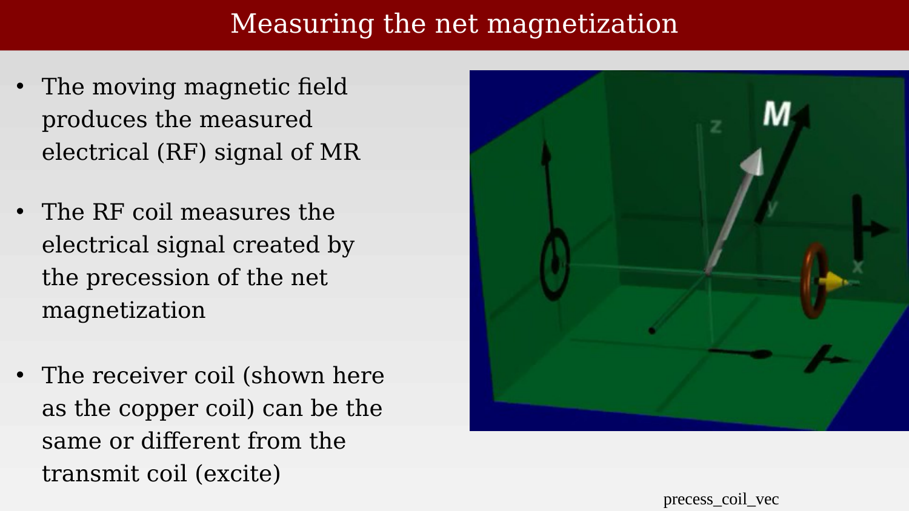{#fig-ch06-measuring-the-net-magnetization}

## The RF signal (B1) causes the net magnetization to precess

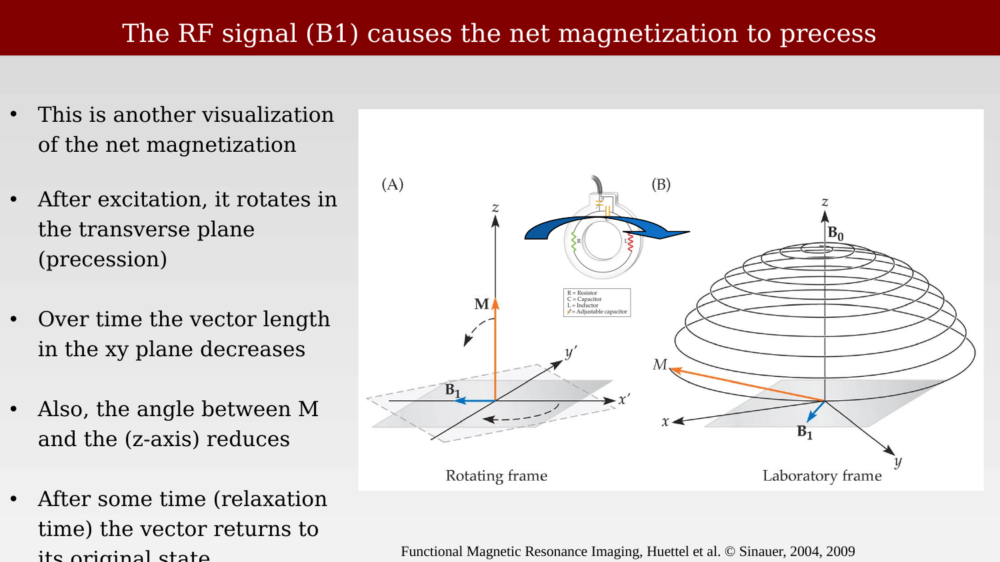{#fig-ch06-the-rf-signal-b1-causes-the-net-magnetization-to-p}

Figure 3.4 Precession. The movement of a rotating proton or magnet within a magnetic field (A) is similar to the movement of a top in the earth’s gravitational field (B). In addition to their spinning motion, their axis of spin itself wobbles around a vertical axis; this motion is known as precession.

## The receive coil measures the electrical radio frequency signal from the spins

::: {.panel-tabset}

## Step 1

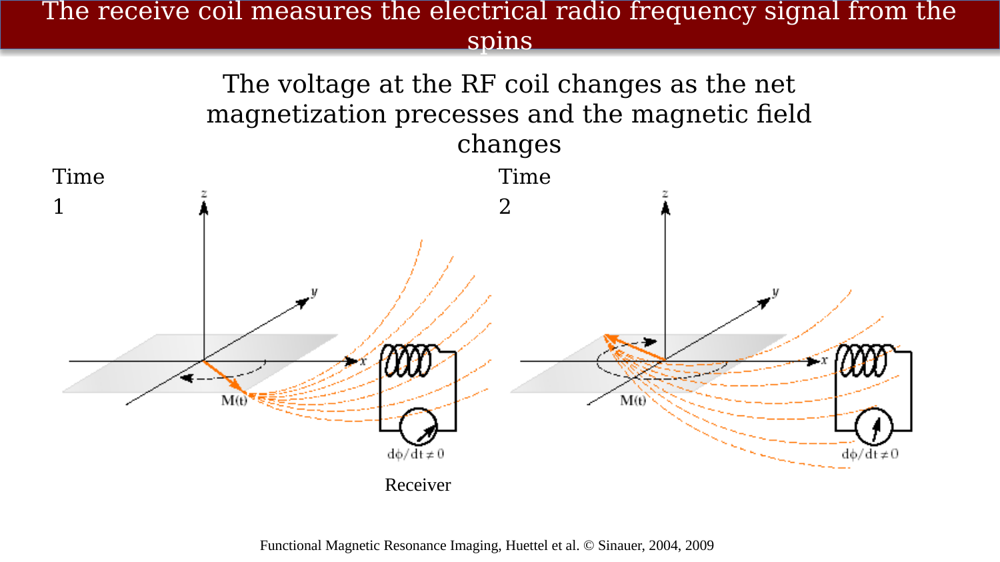{#fig-ch06-the-receive-coil-measures-the-electrical-radio-fre-1}

## Step 2

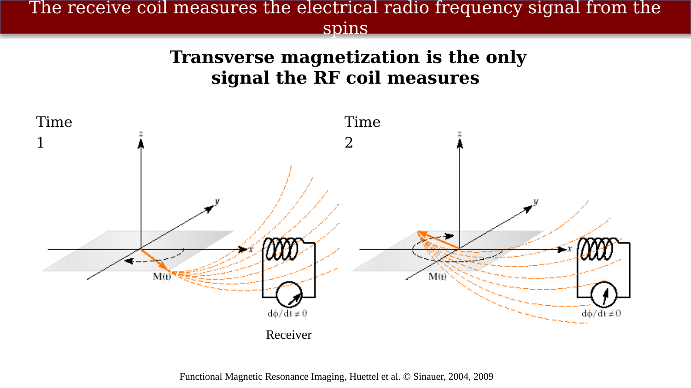{#fig-ch06-the-receive-coil-measures-the-electrical-radio-fre-2}

:::

Figure 3.16 MR signal reception. As the net magnetization rotates through the transverse plane, the amount of magnetic flux experienced by the receiver coil changes over time (A and B). The changing flux generates an electromotive force, which provides the basis for the MR signal.

## Remember: The FID signal depends on the B1 duration

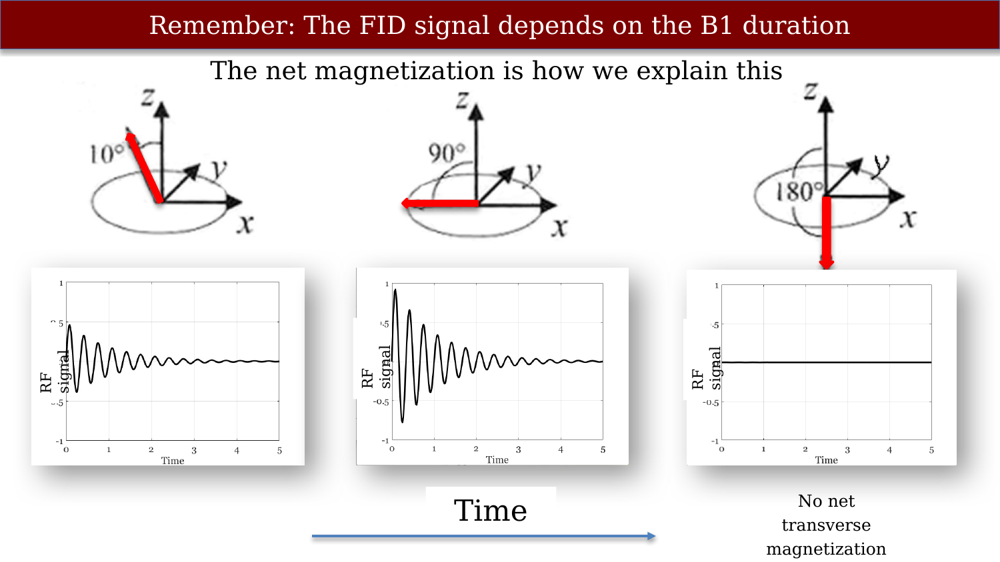{#fig-ch06-remember-the-fid-signal-depends-on-the-b1-duration}

## Applying the RF field rotates all the spins

{#fig-ch06-applying-the-rf-field-rotates-all-the-spins}
