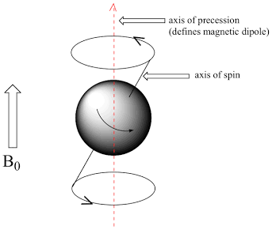
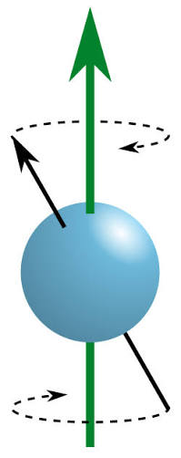
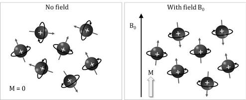
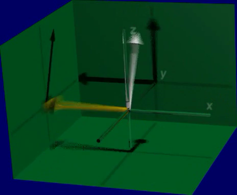
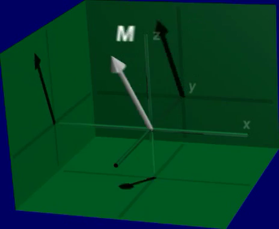
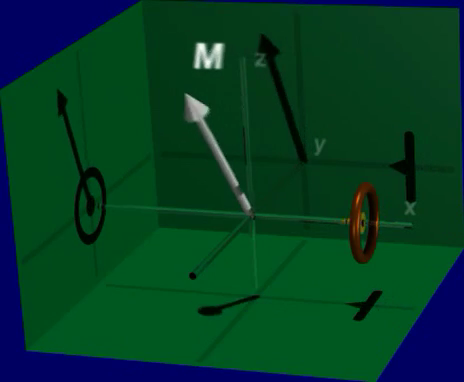

# The MR Macroscopic Model



------------------------------------------------------------------------

## From the FID experiment to a model

In the free-induction-decay (FID) experiment, we apply an RF pulse to a sample of water and record an oscillating voltage that decays over time. We also saw that changing the duration of the RF pulse first increases and then decreases the initial signal. This chapter develops a macroscopic model that explains both observations.

The model has four steps: the main field, $B_0$, creates an equilibrium net magnetization; the RF field, $B_1$, tips it; the resulting transverse magnetization precesses; and that precession induces the voltage recorded by a receiver coil.

## Hydrogen nuclei are the source of the MR signal

{#fig-ch06-source-of-the-mr-signal-hydrogen-nuclei-spins-prot}

The FID arises from hydrogen nuclei, primarily those in water. Each hydrogen nucleus is a proton with spin and an associated magnetic moment. Spin is a quantum-mechanical property, but a magnetic-dipole model provides useful intuition for the bulk behavior measured in MRI.

## The main field establishes equilibrium magnetization

In the absence of an applied field, an ensemble of proton magnetic moments has no preferred direction, so its net magnetization is zero. Placing the sample in the main magnetic field, $B_0$, establishes a preferred longitudinal direction.

{#fig-ch06-nucleus-spin}

In the classical picture, a magnetic moment precesses about $B_0$, like a spinning top in Earth's gravitational field. This picture is an analogy, not a literal spinning charged sphere.

{#fig-ch06-nucleus-precession width="20%"}

For a single spin-$1/2$ proton, a measurement of the spin component along $B_0$ has one of two values, conventionally called parallel and antiparallel. At thermal equilibrium, there is a small excess in the lower-energy, parallel state. That excess produces the longitudinal equilibrium magnetization, $M_0$.

{#fig-ch06-nuclei-aligned}

We summarize the ensemble by its **net magnetization**, the vector sum of its individual magnetic moments. At equilibrium, the net magnetization is $\mathbf{M}=M_0\hat{\mathbf z}$: it points along $B_0$, which defines the $z$-axis. The transverse components cancel because their phases are distributed around the axis.

{#fig-ch06-the-net-magnetization-is-the-sum-of-the-spins}

## An RF pulse creates transverse magnetization

The transmit coil produces an RF magnetic field, $B_1$, that is transverse to $B_0$ and oscillates near the Larmor frequency. In the usual idealized description, this field applies a torque that tips $\mathbf{M}$ away from the $z$-axis, creating transverse magnetization, $M_{xy}$.

{#fig-ch06-applying-the-rf-field-rotates-all-the-spins}

::: {.content-visible when-format="html"}
{#vid-ch06-b1-force-creates-transverse-signal width="70%" loop="true" autoplay="true" muted="true"}
:::

::: {.content-visible when-format="pdf"}
{width="70%"}
:::

The rotating-frame and laboratory-frame descriptions show the same excitation from two useful viewpoints. In the laboratory frame, the transverse magnetization precesses rapidly about $B_0$; in a frame rotating at the Larmor frequency, a resonant $B_1$ field can appear nearly stationary.

{#fig-ch06-the-rf-signal-b1-causes-the-net-magnetization-to-p}

## Precession induces the receiver-coil voltage

After excitation, $M_{xy}$ precesses about the main field, $B_0$. At equilibrium, the magnetization has no transverse component, so there is no corresponding oscillating voltage in the receiver coil.

::::: panel-tabset
## Image: precession of the net magnetization

{#fig-ch06-the-rf-signal-creates-a-precession-signal-of-the-n-1}

## Video: precession of the net magnetization

::: {.content-visible when-format="html"}
{#fig-ch06-precession-of-net-magnetization width="70%" loop="true" autoplay="true" muted="true"}
:::

::: {.content-visible when-format="pdf"}
{#vid-ch06-precession-of-net-magnetization width="70%"}
:::
:::::

As the transverse net magnetization precesses, the magnetic flux through the receiver coil changes. By Faraday's law, the changing flux induces a voltage whose sign and magnitude vary over time. The receiver records this voltage as the MR signal. The transmit and receiver coils can be the same physical coil or separate coils.

::: {.content-visible when-format="html"}
{#vid-ch06-measuring-net-magnetization-coil width="70%" loop="true" autoplay="true" muted="true"}
:::

::: {.content-visible when-format="pdf"}
{width="70%"}
:::

{#fig-ch06-the-receive-coil-measures-the-electrical-radio-fre-2}

The induced voltage requires phase coherence among spins in the transverse ($x$-$y$) plane. Phase coherence produces a nonzero $M_{xy}$; incoherent transverse components cancel in the net magnetization.

## Flip angle explains the effect of RF-pulse duration

The amount by which an RF pulse tips $\mathbf{M}$ is its **flip angle**, $\alpha$. For an ideal resonant hard pulse, the flip angle increases with both the $B_1$ amplitude and pulse duration. The initial transverse magnitude is proportional to $M_0\sin\alpha$.

{#fig-ch06-remember-the-fid-signal-depends-on-the-b1-duration}

As $\alpha$ increases from $0^\circ$ to $90^\circ$, the transverse magnetization and the initial FID voltage increase. At $90^\circ$, all of $\mathbf{M}$ is transverse and the magnitude is maximal. As the pulse continues toward $180^\circ$, the transverse magnitude falls to zero; beyond $180^\circ$, it returns with the opposite phase. This explains the pattern observed in the FID experiment.

## Relaxation makes the FID decay

{#fig-ch06-the-fid-signal-quantal-description}

After an RF excitation pulse, the magnetization is displaced from equilibrium. **Relaxation** returns it toward equilibrium. The physical processes responsible for longitudinal recovery along the $z$-axis and transverse decay in the $x$-$y$ plane differ. The next two chapters develop these processes as $T_1$ and $T_2$ relaxation.

For a deeper discussion of the quantum-mechanical representations used to draw individual NMR spins, see [Drawing single NMR spins](resources/drawing-single-nmr-spins.qmd).
