# T1 Relaxation



---

## The two types of signals: Longitudinal recovery (T1)

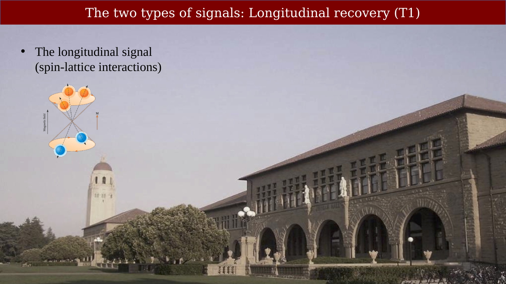{#fig-ch07-the-two-types-of-signals-longitudinal-recovery-t1}

## The RF signal (B1) causes the net magnetization to precess

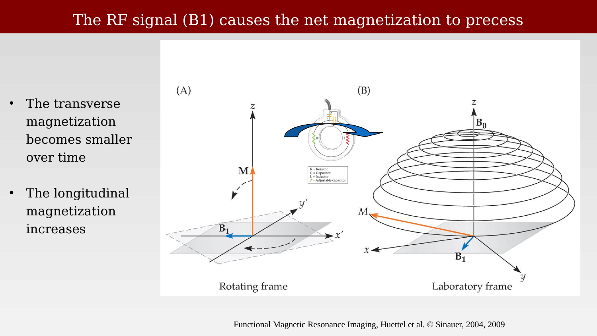{#fig-ch07-the-rf-signal-b1-causes-the-net-magnetization-to-p}

Figure 3.4 Precession. The movement of a rotating proton or magnet within a magnetic field (A) is similar to the movement of a top in the earth’s gravitational field (B). In addition to their spinning motion, their axis of spin itself wobbles around a vertical axis; this motion is known as precession.

## The net magnetization is summarized by two components

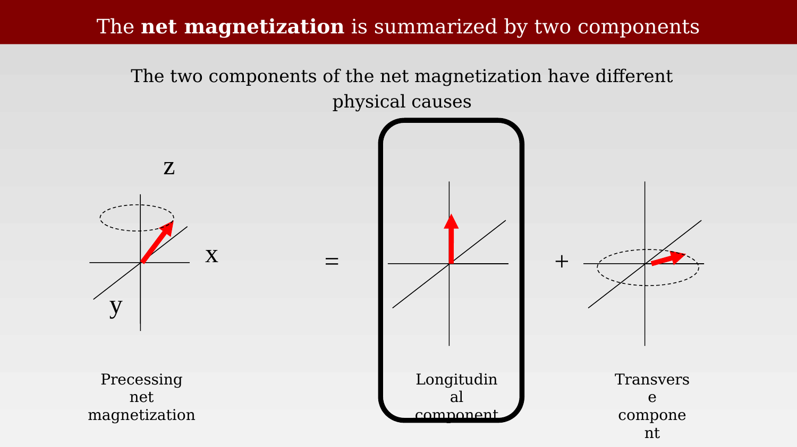{#fig-ch07-the-net-magnetization-is-summarized-by-two-compone}

## The longitudinal component:  High- and low-stability states

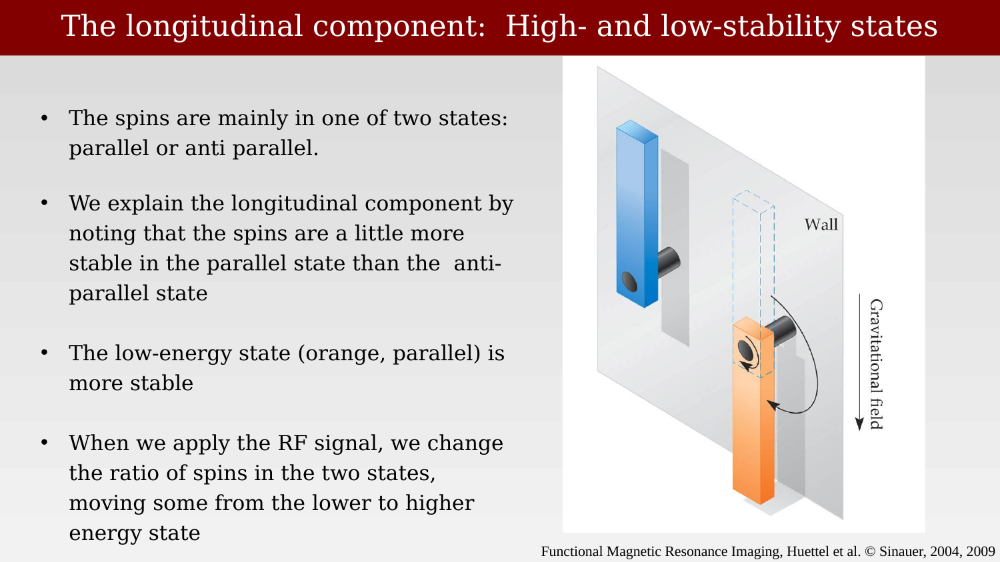{#fig-ch07-the-longitudinal-component-high-and-low-stability}

## Energy from an RF pulse changes spins between the two stable binary states

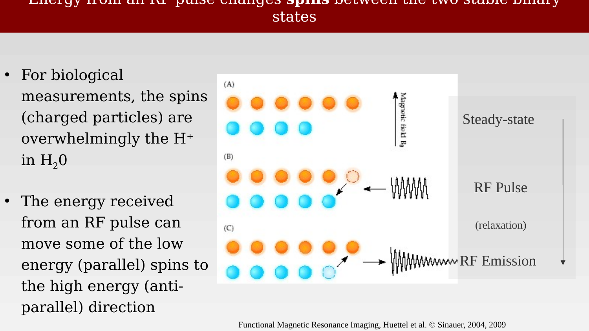{#fig-ch07-energy-from-an-rf-pulse-changes-spins-between-the}

## Spin Transition and Quantum Energy

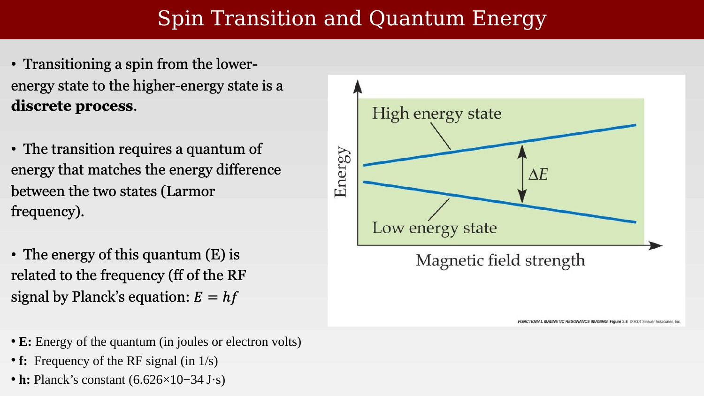{#fig-ch07-spin-transition-and-quantum-energy}

To move a spin between two states, we require an RF photon whose energy is matched to the difference in energy between the two states;
 
The energy of an RF photon is E = hv where h is Planck’s constant and v is frequency

The RF pulse frequency we need to flip the spins varies with field strength

Sir Joseph Larmor (11 July 1857 Magheragall, County Antrim, Ireland – 19 May 1942 Holywood, County Down, Northern Ireland [1]), a physicist and mathematician who made innovations in the understanding of electricity, dynamics,thermodynamics, and the electron theory of matter. His most influential work was Aether and Matter, a theoretical physics book published in 1900.

The RF frequency needed to flip the spins is proportional to field strength because the energy difference between the two states differs with B0 (Zeeman effect)

## The Larmor frequency depends on B0 field

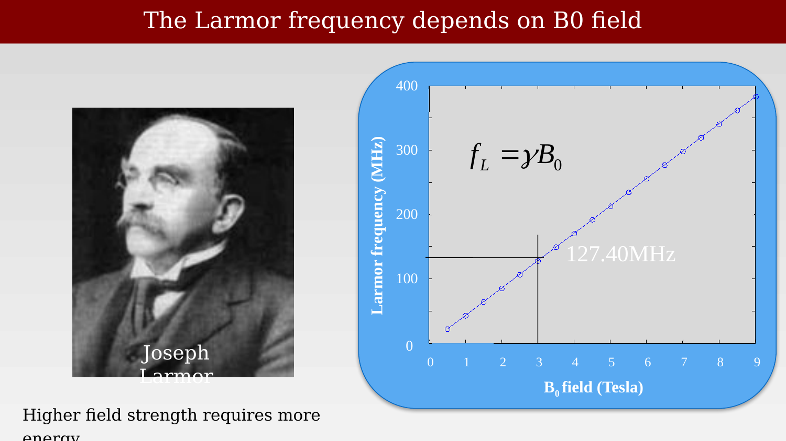{#fig-ch07-the-larmor-frequency-depends-on-b0-field-1}

To move a spin between two states, we require an RF photon whose energy is matched to the difference in energy between the two states;
 The energy of an RF photon is E = hv where h is Planck’s constant and v is frequency
 The RF pulse frequency we need to flip the spins varies with field strength

For more on Larmor and the relationship between frequency and magnetic field strength, see the resource [Joseph Larmor and his frequency](resources/joseph-larmor.qmd).

## Spin-lattice interactions

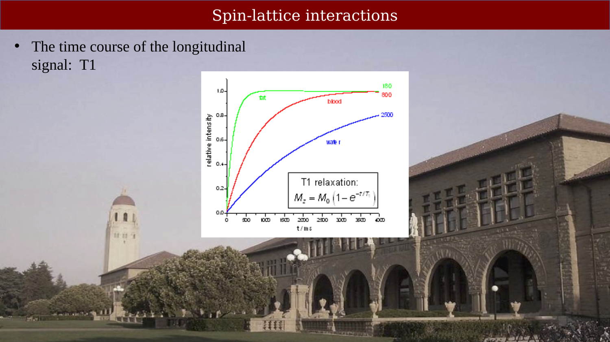{#fig-ch07-spin-lattice-interactions}

## Example: longitudinal relaxation

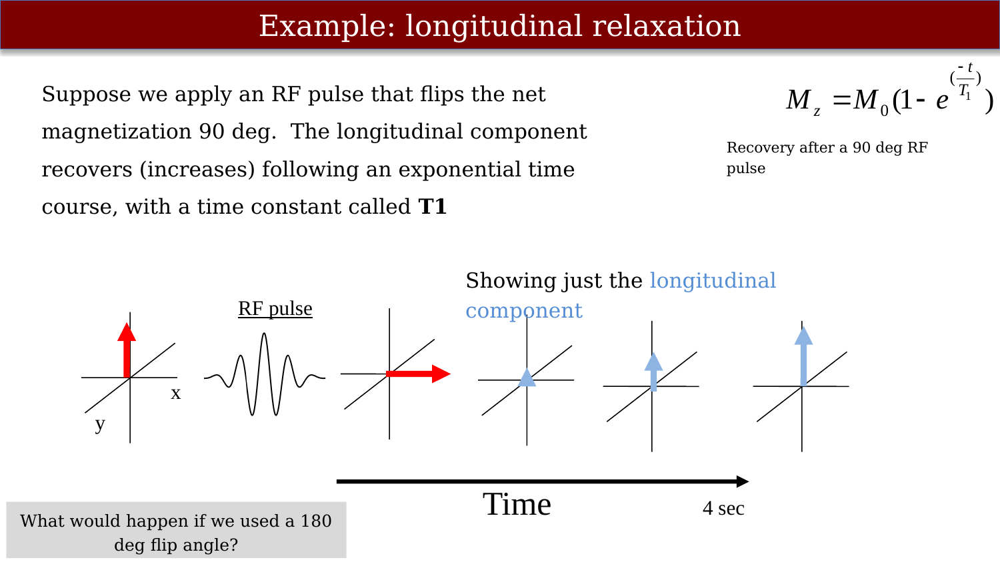{#fig-ch07-example-longitudinal-relaxation}

The net magnetization is shown at several points.  The first is the magnetization in the steady B0 field.  Then, an RF pulse at the Larmor frequency is introduced.  This flips the net magnetization along the Z-axis.  Then, over time, the net magnetization returns to the steady state position.

Note:  The formula doesn’t really make sense because the 180 deg flip makes the magnetization –M0.  I don’t know what to do about that.

## Longitudinal relaxation rate depends on your neighborhood

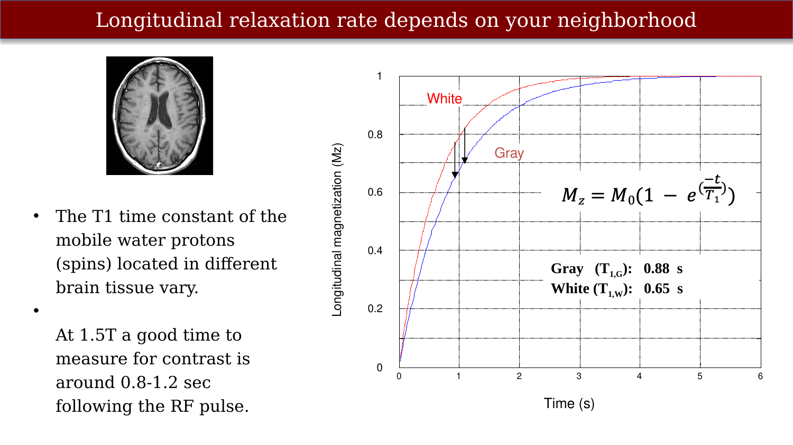{#fig-ch07-longitudinal-relaxation-rate-depends-on-your-neigh}

The time course of the net magnetization depends on the material.  So, if we measure the magnetic field strength, say, one second after a pulse, a container with water will have a lower magnetization than a container with lipids.  This difference, based on the biochemical structure of the material, is the basis for seeing different components of the brain (CSF, gray matter, white matter).

## Contrast: the difference between signals

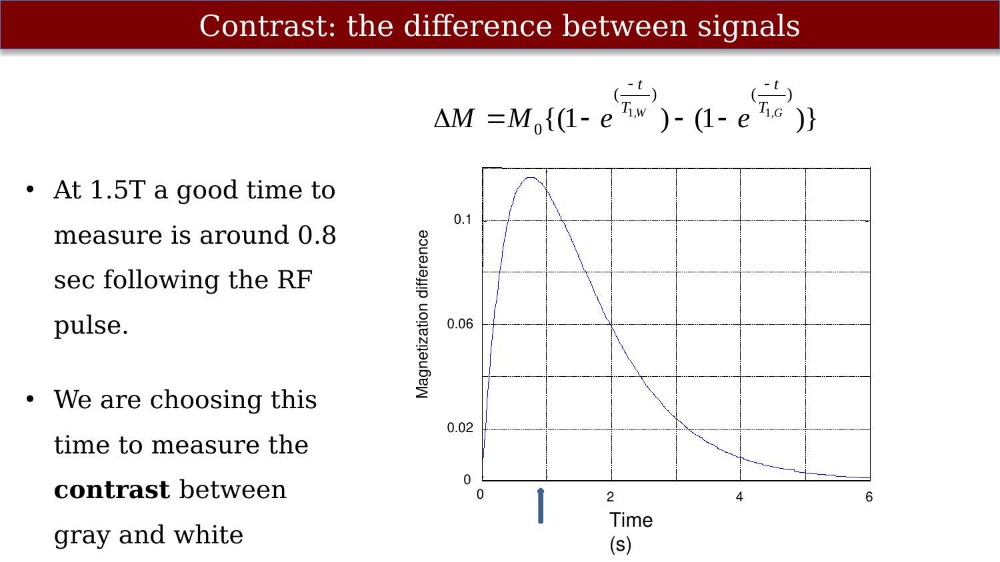{#fig-ch07-contrast-the-difference-between-signals}

The time course of the net magnetization depends on the material.  So, if we measure the magnetic field strength, say, one second after a pulse, a container with water will have a lower magnetization than a container with lipids.  This difference, based on the biochemical structure of the material, is the basis for seeing different components of the brain (CSF, gray matter, white matter).

## The T1-contrast distinguishes gray and white matter

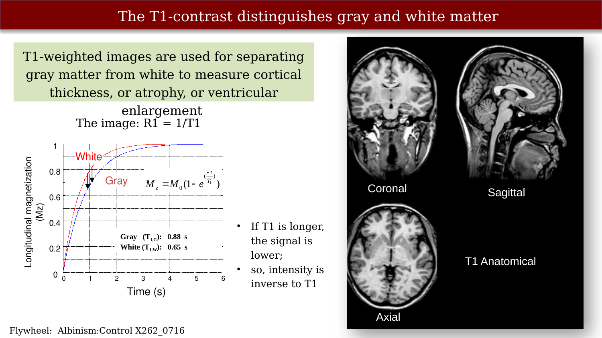{#fig-ch07-the-t1-contrast-distinguishes-gray-and-white-matte}

The time course of the net magnetization depends on the material.  So, if we measure the magnetic field strength, say, one second after a pulse, a container with water will have a lower magnetization than a container with lipids.  This difference, based on the biochemical structure of the material, is the basis for seeing different components of the brain (CSF, gray matter, white matter).

## Surface Interaction Rate (SIR)

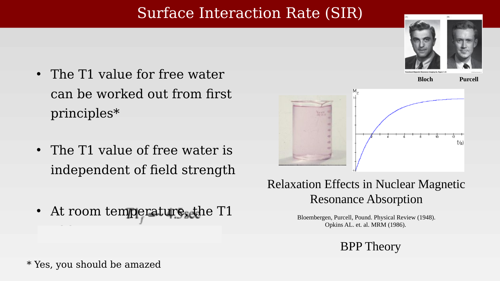{#fig-ch07-surface-interaction-rate-sir}

Mz(t) = M0(- 1exp(-t/T1) )

## Visualization of the spin-lattice exchange

::: {.panel-tabset}

## Step 1

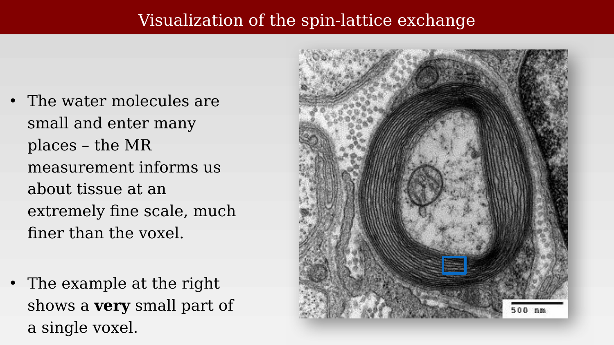{#fig-ch07-visualization-of-the-spin-lattice-exchange-1}

## Step 2

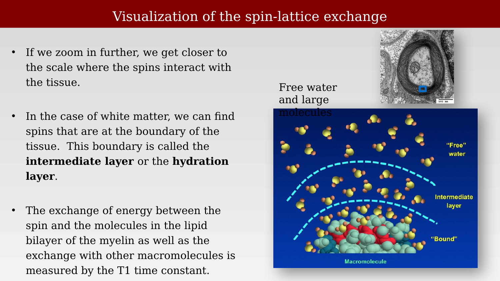{#fig-ch07-visualization-of-the-spin-lattice-exchange-2}

:::

Macromolecule picture: 

So how are we going to use MRI to measure tissue properties? 
This shows a cross section through a single axon.  You can see each of the individual wraps of myelin around this axon.
Here is a schematic of a single layer of the myelin membrane which is composed of a lipid bilayer that is surrounded by water molecules.
     We know that the MR properties of water molecules change when they interact with the surface of a membrane.  
    So this water here that we will call the apparent hydration layer has an MR signal that is distinct from the water molecules depicted in blue that are not immediately in contact with a membrane.  
We have developed a model that is based on quantitative T1 mapping that allows us to quantify the percent of water in a voxel that is interacting with the surface of a membrane.  We call the measurement the aparent hydration layer fraction or aHLF. It is related to the total membrane surface area and therefore will be much higher in more myelinated regions of white matter.  

Google image search seems to think this image came from here

## T1 from multiple molecules:  Fast Exchange Theory

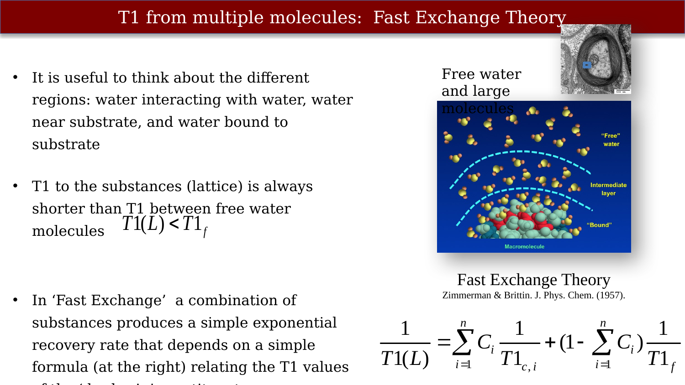{#fig-ch07-t1-from-multiple-molecules-fast-exchange-theory}

## T2 time course and T2 contrast

{#fig-ch07-t2-time-course-and-t2-contrast}
