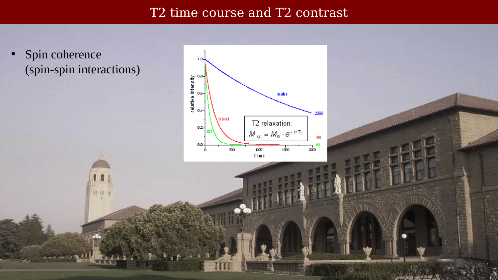

# T2 Relaxation and Signal Contrast



---

## T2 time course and T2 contrast

{#fig-ch07-t2-time-course-and-t2-contrast}
The second fundamental measurement, T2, is explained by a very different underlying mechanism.  In this chapter we explain the source of this, transverse, signal.

## The net magnetization is summarized by two components

{#fig-ch08-the-net-magnetization-is-summarized-by-two-compone}

Viewed graphically (or mathematically) the T2 signal corresponds to the way the spins are moving when measured in the x-y plane (transverse).  In this case, the signal has both a length (amplitude) and a direction.  So if we are measuring with a detector at one position, there will be times when the x-y magnetization is pointed towards the RF receiver (positive) and times it is pointed away (negative).  Thus, the signal will be oscillating up and down as the x-y vector precesses around the z-axis.

## Transverse magnetization
<!--
::: {.panel-tabset}

## Step 1

{#fig-ch08-transverse-magnetization-1}

## Step 2

{#fig-ch08-transverse-magnetization-2}

:::

@fig-ch08-transverse-magnetization-1 and @fig-ch08-transverse-magnetization-1 show the evolution of the spins in the x-y plane after the RF excitation.  

-->

## Transverse relaxation:  T2

{#fig-ch08-transverse-relaxation-t2}

Before we enter the magnet the RF pulse, the spins are randomly oriented in the x-y plane.  Even after we place a head into the B0 field, there is no preferred x-y direction.  At this point, when we measure we see no coherent RF signal.

But when we apply the RF pulse, the spins do align, driven by the RF signal.  Because the spins align we do pick up an RF signal from the *coherent* transverse spins.

The sequence of events is summarized in @fig-ch08-transverse-relaxation-t2. The red arrow below the vectors of spins shows the net magnetization over time. It starts out as a dot (zero length and zero direction). After RF excitation, the net is oriented,  large and spinning around the z-axis. As the individual spins lose their alignment, becoming *incoherent*, the net magnetization shrinks back to zero.

## The spin de-phasing

<!--
{#fig-ch08-the-spin-de-phasing}
-->

::: {.content-visible when-format="html"}
{#vid-ch08-spin-dephasing-t2-signal-loss width="70%" loop="true" autoplay="true" muted="true"}
:::

::: {.content-visible when-format="pdf"}
{#vid-ch08-spin-dephasing-t2-signal-loss width="70%"}
:::

When they are coherent, we say the spins are *in phase*. 
The loss of coherence is also called *de-phasing*.  

The video represents the de-phasing, but in a special way.  Remember that the net transverse magnetization is always precessing around the z-axis.  If we imagine ourselves rotating around the z-axis at the same pace, what wew would see is that magnetization is comprised of multiple vectors, pointing in different directions.  This is the de-phasing.  For this reason, the signal decays, as shown on the right.

* Transverse magnetization declines as the directions of the spins (their *relative phases*) diverge, becoming incoherent
* Vectors on the left represent individual spins
* Blue arrow on the right represents the reduction in the net transverse magnetization as the spins de-phase (become incoherent)
* The curve at the bottom shows how the amplitude of the vector decays over time.

But do remember that this amplitude represents the swing, back and forth from positive to negative.  It is the amplitude of the oscillation as the spins go round and round the z-axis.

## The Bloch Equations

For a mathematical description of the relaxation equations for both T1 and T2, as well as a short biographical note, see the resource [Felix Bloch and the Bloch Equations](resources/felix-bloch-equations.qmd).

## MR: The two mechanisms of spin dephasing

<!--
{#fig-ch08-mr-the-two-mechanisms-of-spin-dephasing}
-->

{#fig-ch08-two-sources-of-transverse-magnetization-decay}

Why do the spins lose their coherence?  Glad you asked.  There are two main reasons.

## T2, T2' and T2*

* Spin-spin interactions (pure T2).  The spins have slightly different excitations and they interfere with one another.

* Local field inhomogeneity (T2'), say because of the local magnetic field around nearby molecules.

## Inverting the Ts. R2 and R1

::: {.panel-tabset}

## Step 1

{#fig-ch08-transverse-magnetization-decay-1}

## Step 2

{#fig-ch08-transverse-magnetization-decay-2}

:::
The combined effect of these two T-values is called T2*.

People don't like all that one over stuff, so use R1 to refer to 1 over T1, and R2 to refer to 1 over T2.  Then the equation looks simpler.  It's not.

## Comparing T1 and T2 images

### T1-weighted images: gray is darker than white

{#fig-ch08-t1-weighted-images-gray-is-darker-than-white}

It is very unusual for investigators to acquire a pure T1 or a pure T2 based image.  Usually, the images include relatively more T1 or T2, and thus they are called *T1-weighted*'* or *T2-weighted*.

The image in @fig-ch08-t1-weighted-images-gray-is-darker-than-white is from [UCSF](http://fmri.ucsd.edu/Howto/3T/structure.html)

We need to replace the T2 decay with a T1 recovery curve.

<!--
Project:  UCSF
Subject HCP350002
Session T1s_MPR
-->

### T2-weighted images: white is darker than gray

{#fig-ch08-t2-weighted-images-white-is-darker-than-gray}

Images from this [UCSF site](http://fmri.ucsd.edu/Howto/3T/structure.html).

<!--
Project:  UCSF
Subject HCP350002
Session T2W_SPC
-->

## Summary of the relative signal intensities  using T1 and T2

{#fig-ch08-summary-of-the-relative-signal-intensities-using-t}

Values from this [pubmed paper](https://www.mdpi.com/2072-6694/14/22/5606).

## T2-weighted images measure pathologies involving fluid filled regions

{#fig-ch08-t2-weighted-images-measure-pathologies-involving-f}

Values from:  https://pubmed.ncbi.nlm.nih.gov/10232510/

## Pulse sequence impact on tumor visibility

{#fig-ch08-pulse-sequence-impact-on-tumor-visibility}

::: {.callout-note}
Why the T2 measurement is not quantitative, and a preview of the T2*/BOLD signal, are covered in the next chapter (pulse sequence diagrams, T2 quantification, and a look ahead to BOLD).
:::
