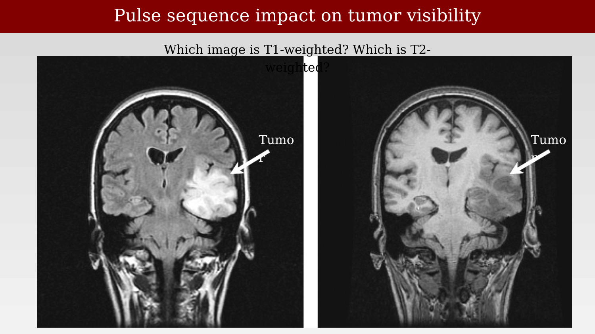
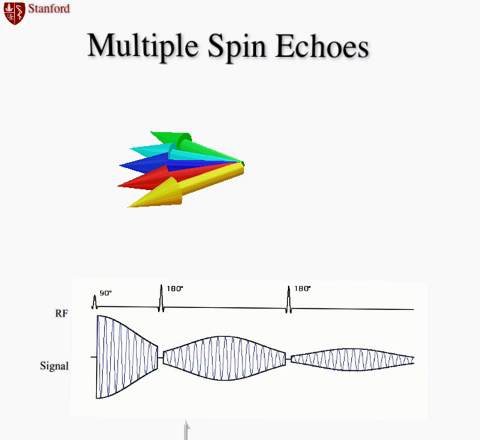

# T2 Relaxation and Signal Contrast



---

## The net magnetization is summarized by two components

{#fig-ch08-the-net-magnetization-is-summarized-by-two-compone}

## Transverse magnetization

::: {.panel-tabset}

## Step 1

{#fig-ch08-transverse-magnetization-1}

## Step 2

{#fig-ch08-transverse-magnetization-2}

:::

## Transverse relaxation:  T2

{#fig-ch08-transverse-relaxation-t2}

## The spin de-phasing

<!--
{#fig-ch08-the-spin-de-phasing}
-->

::: {.content-visible when-format="html"}
{#vid-ch08-spin-dephasing-t2-signal-loss width="70%" loop="true" autoplay="true" muted="true"}
:::

::: {.content-visible when-format="pdf"}
{#vid-ch08-spin-dephasing-t2-signal-loss width="70%"}
:::

* Transverse magnetization declines as the directions of the spins (their *relative phases*) diverge, becoming incoherent
* Vectors on the left represent individual spins
* Blue arrow on the right represents the reduction in the net transverse magnetization as the spins de-phase (become incoherent)

## MR: The two mechanisms of spin dephasing

<!--
{#fig-ch08-mr-the-two-mechanisms-of-spin-dephasing}
-->

## Two sources of transverse magnetization decay

{#fig-ch08-two-sources-of-transverse-magnetization-decay}

## Transverse magnetization decay

::: {.panel-tabset}

## Step 1

{#fig-ch08-transverse-magnetization-decay-1}

## Step 2

{#fig-ch08-transverse-magnetization-decay-2}

:::

## T1-weighted images: gray is darker than white

{#fig-ch08-t1-weighted-images-gray-is-darker-than-white}

Values from https://www.mdpi.com/2072-6694/14/22/5606

Images from http://fmri.ucsd.edu/Howto/3T/structure.html

Project:  UCSF
Subject HCP350002
Session T1s_MPR

## T2-weighted images: white is darker than gray

{#fig-ch08-t2-weighted-images-white-is-darker-than-gray}

Values from https://www.mdpi.com/2072-6694/14/22/5606

Images from http://fmri.ucsd.edu/Howto/3T/structure.html

Project:  UCSF
Subject HCP350002
Session T2W_SPC

## Summary of the relative signal intensities  using T1 and T2

{#fig-ch08-summary-of-the-relative-signal-intensities-using-t}

## T2-weighted images measure pathologies involving fluid filled regions

{#fig-ch08-t2-weighted-images-measure-pathologies-involving-f}

Values from:  https://pubmed.ncbi.nlm.nih.gov/10232510/

## Pulse sequence impact on tumor visibility

{#fig-ch08-pulse-sequence-impact-on-tumor-visibility}

Figure 3.1 (a) Coronal image of the brain showing a tumour (arrow). In this image the tumour is bright against the darker grey
of the normal brain tissue. (b) The same slice with a different pulse sequence, this time showing the tumour darker than the
surrounding brain

## Why is the T2 measurement not quantitative?

{#fig-ch08-why-t2-measurement-not-quantitative}

::: {.content-visible when-format="html"}
{#vid-ch08-multiple-echoes-decay-t2-quantitative width="70%" loop="true" autoplay="true" muted="true"}
:::

::: {.content-visible when-format="pdf"}
{#vid-ch08-multiple-echoes-decay-t2-quantitative width="70%"}
:::

* When we measure different brain positions, the absolute level of the initial excitation differs
* There are several reasons - but mainly proton density (PD) and coil inhomogeneities that impact both excite and receive
* The inhomogeneities cause the size of the bulk magnetization ($M_0$) to differ
