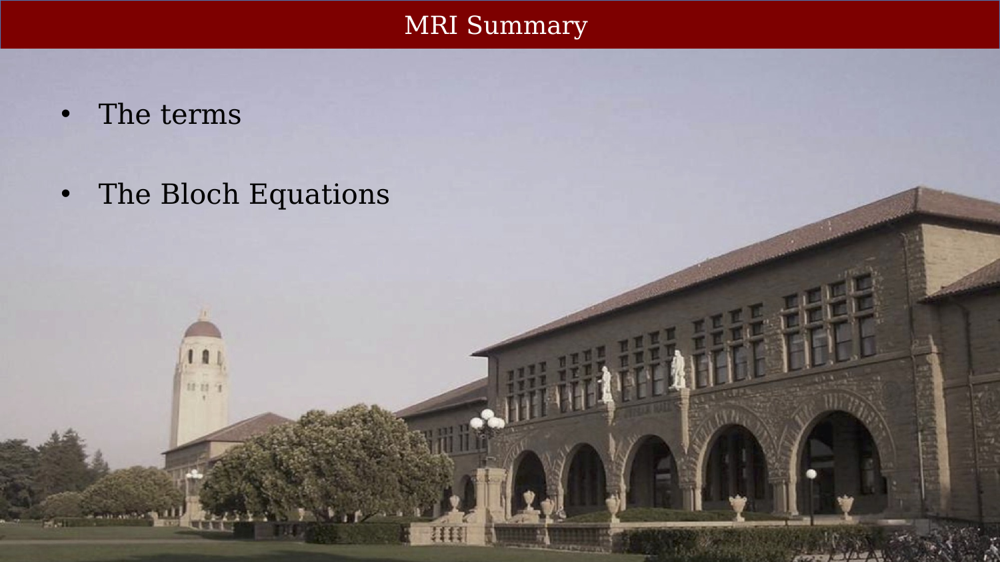
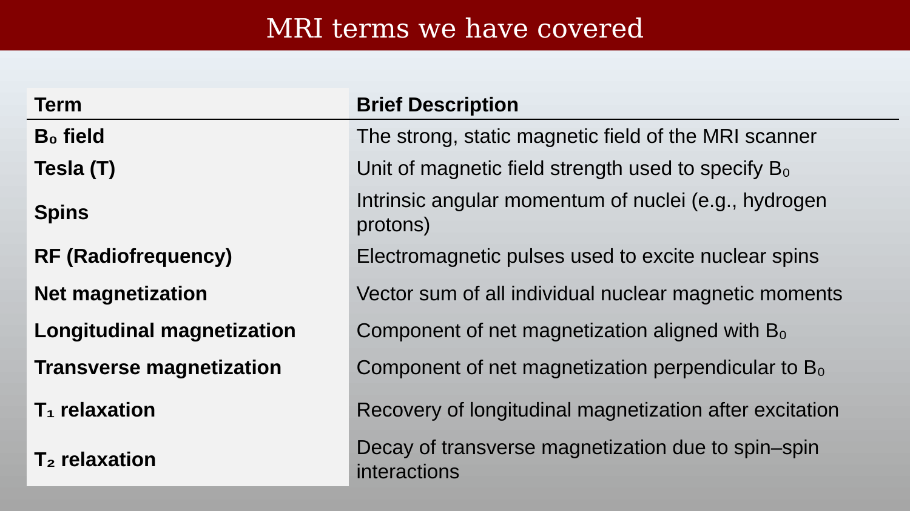
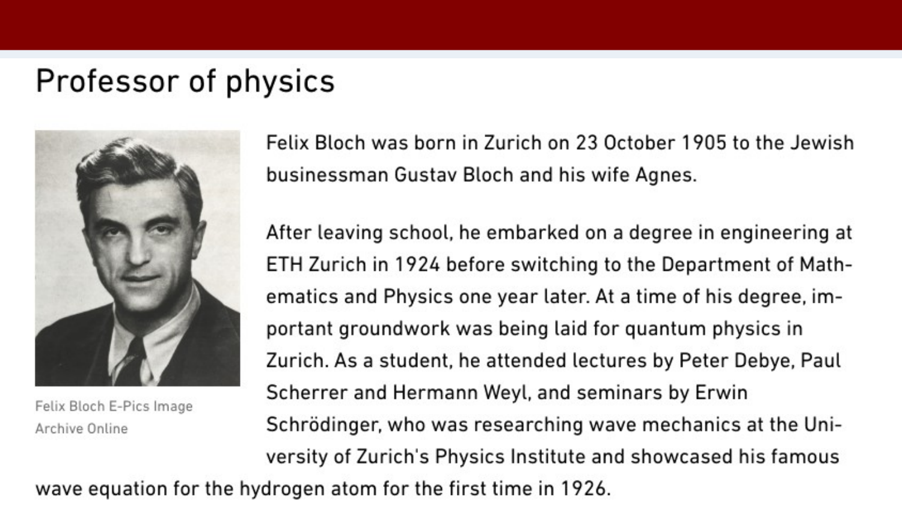
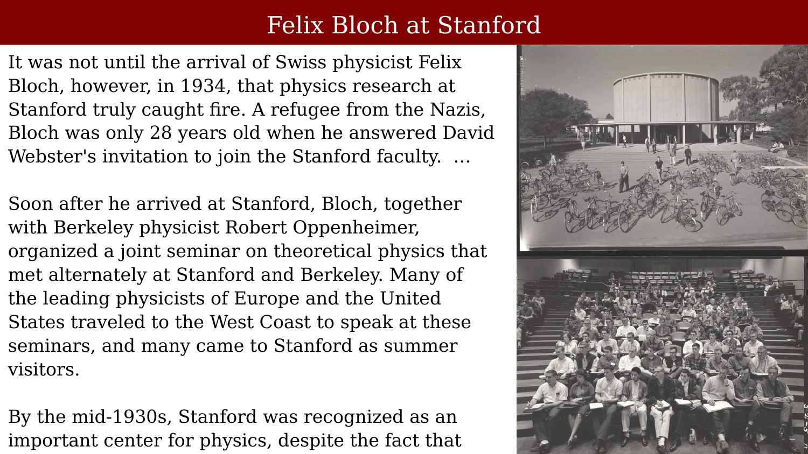
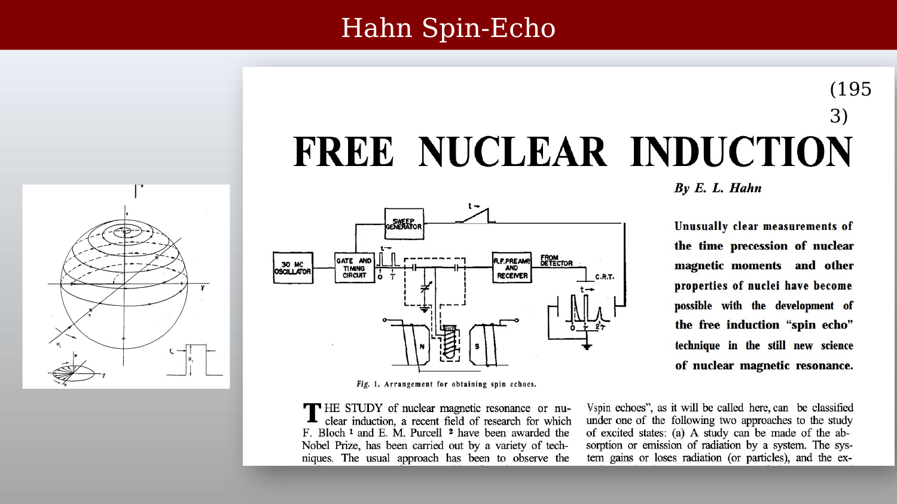
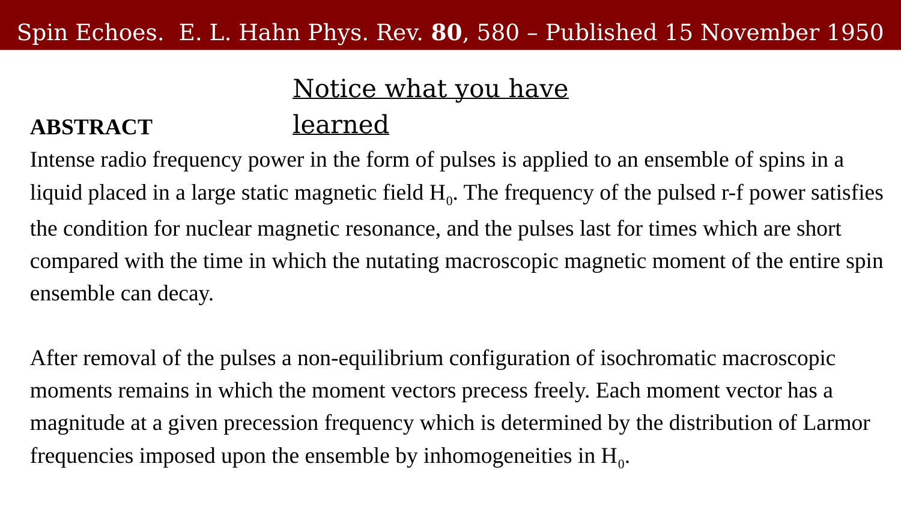
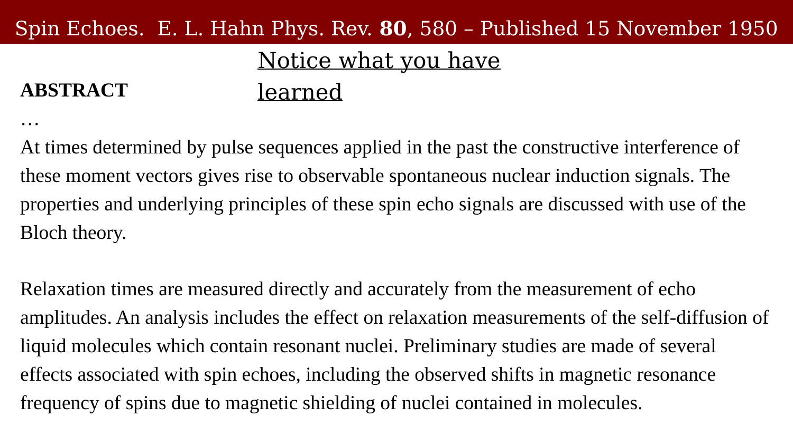
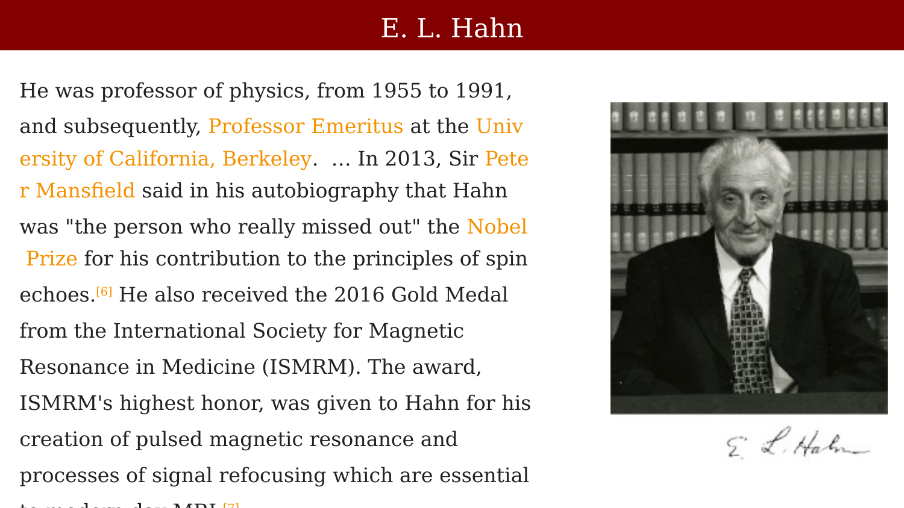
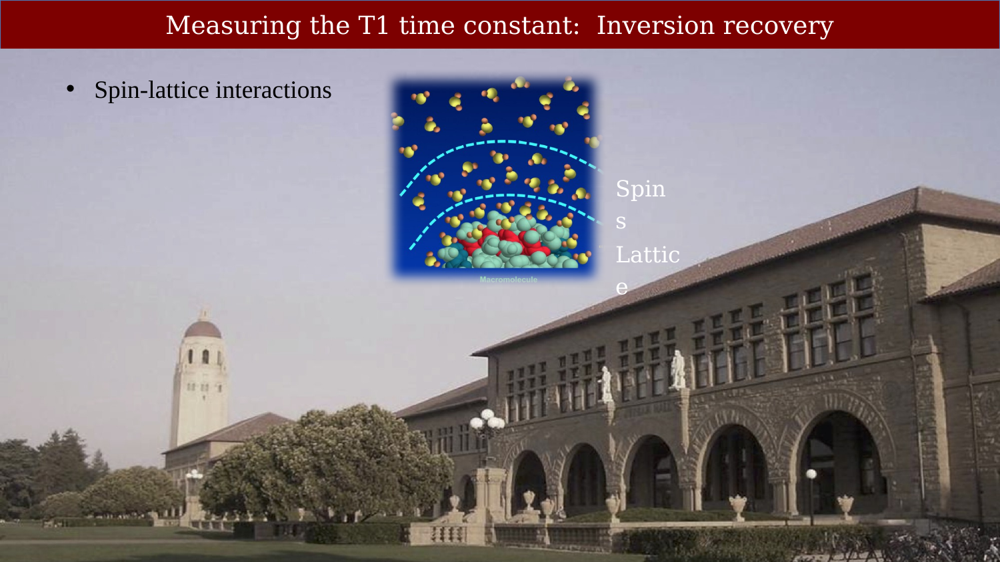

# MRI Summary and Spin Echo



---

## MRI Summary

{#fig-ch09-mri-summary}

## MRI terms we have covered

{#fig-ch09-mri-terms-we-have-covered}

## The Bloch Equations

{#fig-ch09-the-bloch-equations}

## The Bloch Equations in differential equation form

{#fig-ch09-the-bloch-equations-in-differential-equation-form}

{#fig-ch09-slide-068}

{#fig-ch09-slide-069}

{#fig-ch09-slide-070}

## Felix Bloch at Stanford

{#fig-ch09-felix-bloch-at-stanford}

## Pulse sequences

{#fig-ch09-pulse-sequences}

## Pulse sequences: Spin echo (Hahn)

{#fig-ch09-pulse-sequences-spin-echo-hahn}

## The RF pulse sequence up to now (FID)

{#fig-ch09-the-rf-pulse-sequence-up-to-now-fid}

You can create a macroscopic signal after the RF excitation is over.

## Early NMR had difficulty instrumenting their measurements

{#fig-ch09-early-nmr-had-difficulty-instrumenting-their-measu}

## Hahn Spin-Echo

{#fig-ch09-hahn-spin-echo}

## Spin Echo (Hahn)

{#fig-ch09-spin-echo-hahn}

The Hahn echo was not only a method to remove static dephasing; it introduced the idea that magnetic resonance signals could be engineered in time, allowing detection to be separated from excitation. This temporal separation was essential for overcoming hardware limitations and made practical NMR—and later MRI—possible.

## Demo by instructor and class spinning

{#fig-ch09-demo-by-instructor-and-class-spinning}

## Visualization of dephasing and re-phasing

{#fig-ch09-visualization-of-dephasing-and-re-phasing}

## Single spin echo: Signal

{#fig-ch09-single-spin-echo-signal}

::: {.content-visible when-format="html"}
{#vid-ch09-single-spin-echo-formation width="70%" loop="true" autoplay="true" muted="true"}
:::

::: {.content-visible when-format="pdf"}
{#vid-ch09-single-spin-echo-formation width="70%"}
:::

## Multiple echoes

{#fig-ch09-multiple-echoes}

::: {.content-visible when-format="html"}
{#vid-ch09-multiple-spin-echoes-decay width="70%" loop="true" autoplay="true" muted="true"}
:::

::: {.content-visible when-format="pdf"}
{#vid-ch09-multiple-spin-echoes-decay width="70%"}
:::

Hongjian He proposes to give a lecture about multi-echo

## Spin Echoes.  E. L. Hahn Phys. Rev. 80, 580 – Published 15 November 1950

::: {.panel-tabset}

## Step 1

{#fig-ch09-spin-echoes-e-l-hahn-phys-rev-80-580-published-15-1}

## Step 2

{#fig-ch09-spin-echoes-e-l-hahn-phys-rev-80-580-published-15-2}

:::

## E. L. Hahn

{#fig-ch09-e-l-hahn}

## … but that's how I got one of the National Research Council Fellowships. So with that in my bonnet, Nordsieck, who was there at Illinois, had of course previously worked with Felix Bloch. They’d done some theory together. He said, "Why don't you go to Stanford? Bloch is a good man and you'd learn a lot." So I said, "OK," and California attracted me, since I'd been there during the war in the Navy in training school, so I went to Stanford and that's how I became a post-doc for one year, a fellow, and then I was an instructor for one year. So there I continued my work on spin echoes and directed a student of his, under me as well, a PhD, and we did a problem together.

![… but that's how I got one of the National Research Council Fellowships. So with that in my bonnet, Nordsieck, who was there at Illinois, had of course previously worked with Felix Bloch. They’d done some theory together. He said, "Why don't you go to Stanford? Bloch is a good man and you'd learn a lot." So I said, "OK," and California attracted me, since I'd been there during the war in the Navy in training school, so I went to Stanford and that's how I became a post-doc for one year, a fellow, and then I was an instructor for one year. So there I continued my work on spin echoes and directed a student of his, under me as well, a PhD, and we did a problem together..](images/ch09/-but-thats-how-i-got-one-of-the-national-research.png){#fig-ch09--but-thats-how-i-got-one-of-the-national-research}

## Hahn’s interview

{#fig-ch09-hahns-interview}

## Measuring the T1 time constant:  Inversion recovery

{#fig-ch09-measuring-the-t1-time-constant-inversion-recovery}
