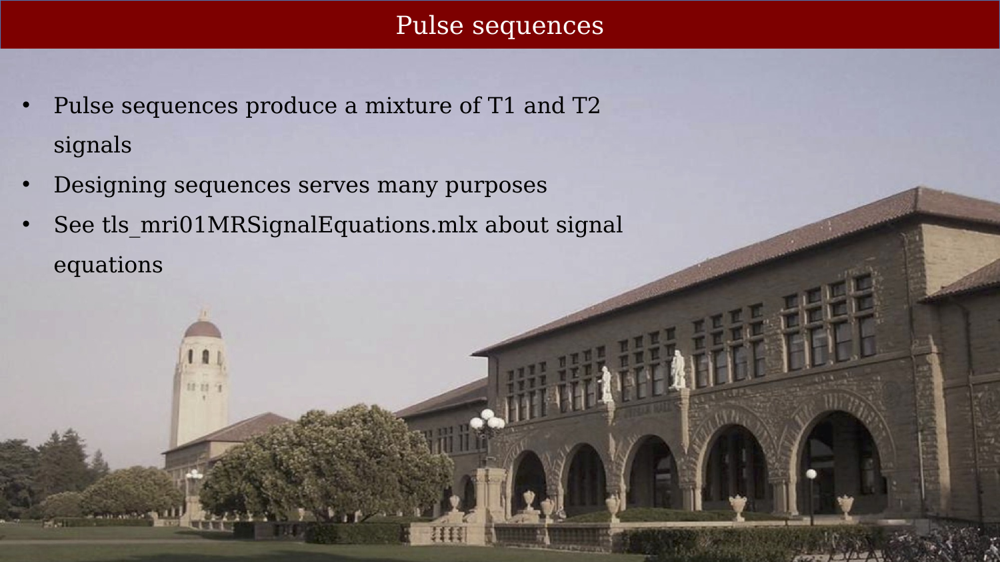
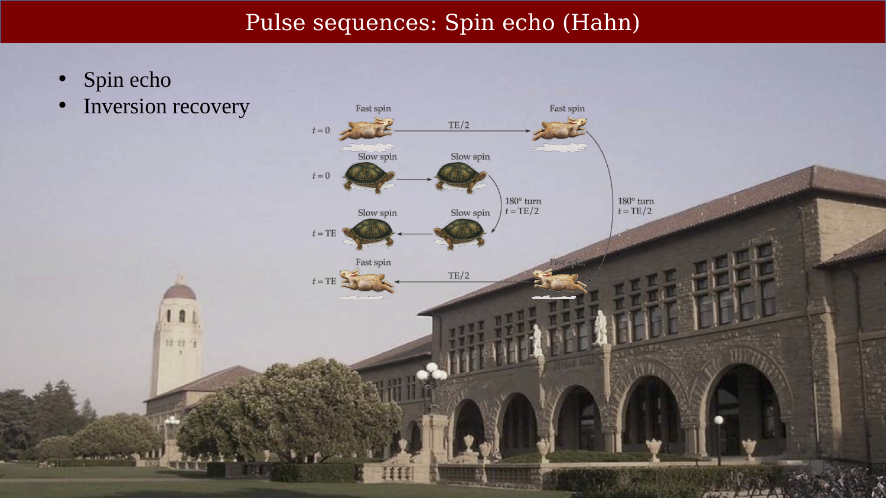
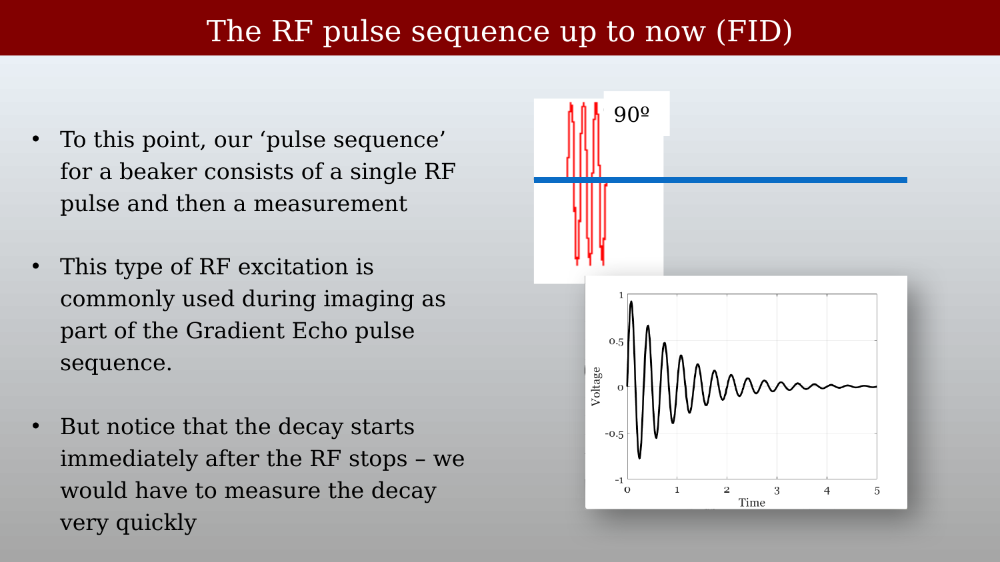
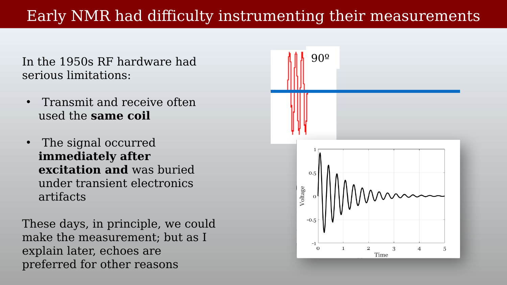
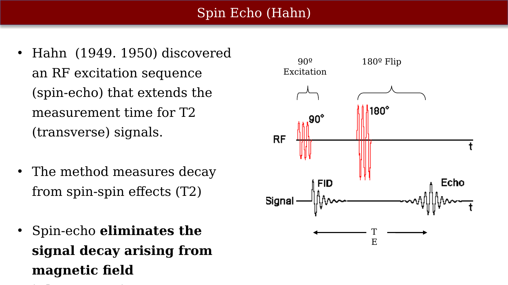
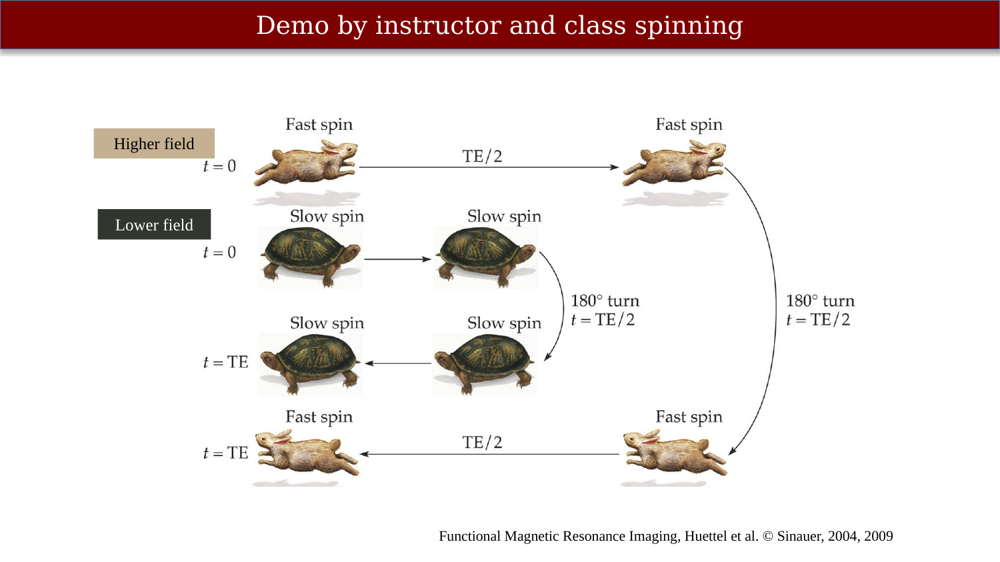
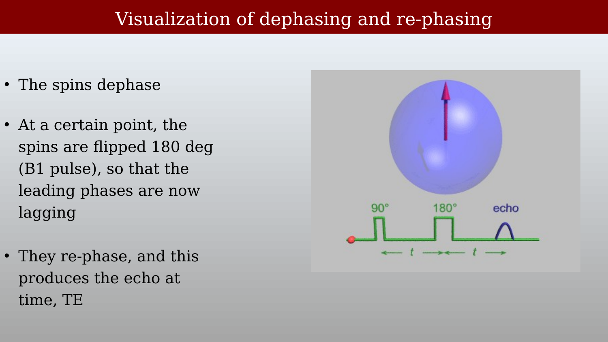
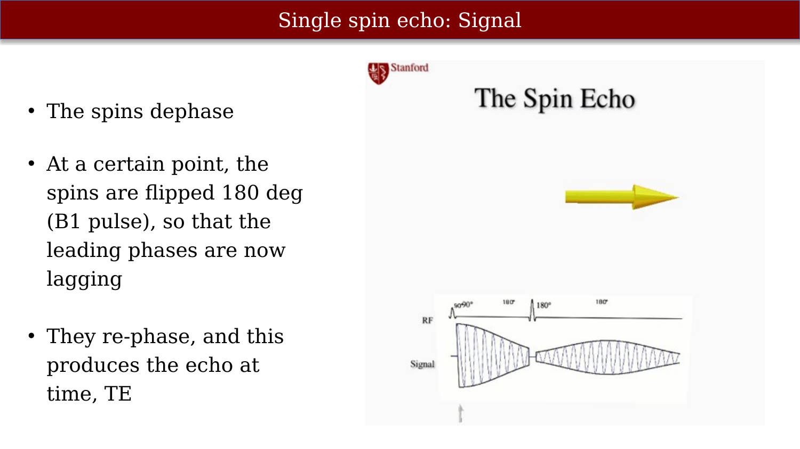
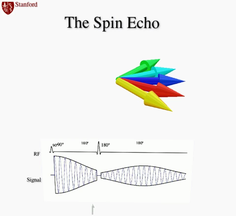
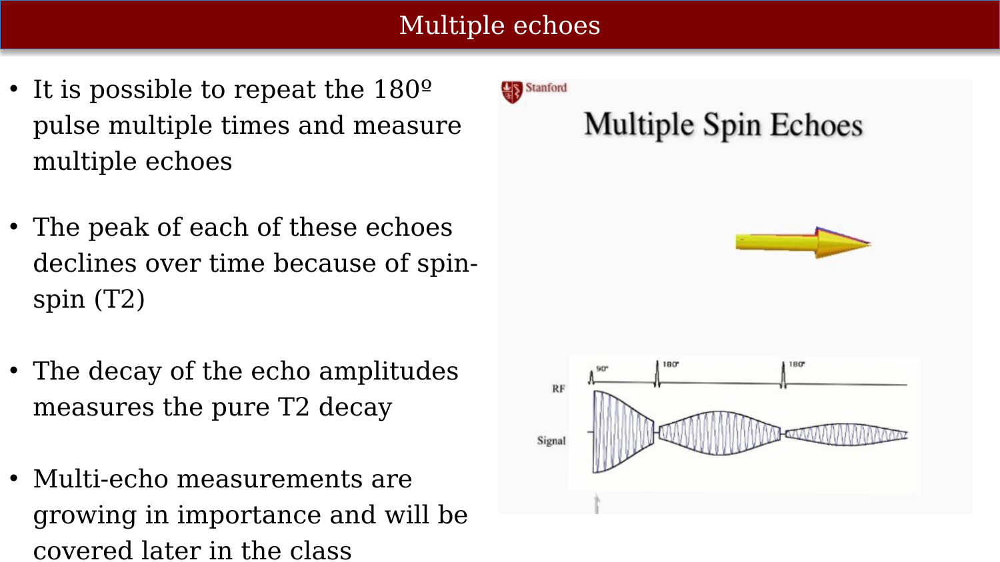

# Spin Echo pulse sequence



---

{#fig-ch09-pulse-sequences}

## Pulse sequences: Spin echo (Hahn)

{#fig-ch09-pulse-sequences-spin-echo-hahn}

## The RF pulse sequence up to now (FID)

{#fig-ch09-the-rf-pulse-sequence-up-to-now-fid}

You can create a macroscopic signal after the RF excitation is over.

## Early NMR had difficulty instrumenting their measurements

{#fig-ch09-early-nmr-had-difficulty-instrumenting-their-measu}

## Spin Echo (Hahn)

{#fig-ch09-spin-echo-hahn}

The Hahn echo was not only a method to remove static dephasing; it introduced the idea that magnetic resonance signals could be engineered in time, allowing detection to be separated from excitation. This temporal separation was essential for overcoming hardware limitations and made practical NMR—and later MRI—possible.

For the original papers and biographical material, see the resource [Erwin L. Hahn and the Spin Echo](resources/erwin-hahn.qmd).

## Demo by instructor and class spinning

{#fig-ch09-demo-by-instructor-and-class-spinning}

## Visualization of dephasing and re-phasing

{#fig-ch09-visualization-of-dephasing-and-re-phasing}

## Single spin echo: Signal

{#fig-ch09-single-spin-echo-signal}

::: {.content-visible when-format="html"}
{#vid-ch09-single-spin-echo-formation width="70%" loop="true" autoplay="true" muted="true"}
:::

::: {.content-visible when-format="pdf"}
{#vid-ch09-single-spin-echo-formation width="70%"}
:::

## Multiple echoes

{#fig-ch09-multiple-echoes}

::: {.content-visible when-format="html"}
{#vid-ch09-multiple-spin-echoes-decay width="70%" loop="true" autoplay="true" muted="true"}
:::

::: {.content-visible when-format="pdf"}
{#vid-ch09-multiple-spin-echoes-decay width="70%"}
:::

Hongjian He proposes to give a lecture about multi-echo
