# Pulse Sequences



---

## Inversion recovery: Spin-lattice (T1)

::: {.panel-tabset}

## Step 1

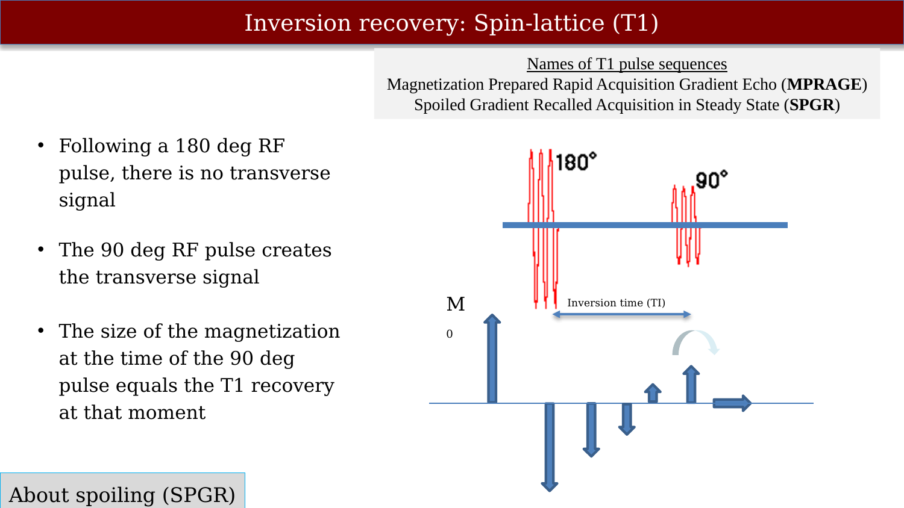{#fig-ch10-inversion-recovery-spin-lattice-t1-1}

## Step 2

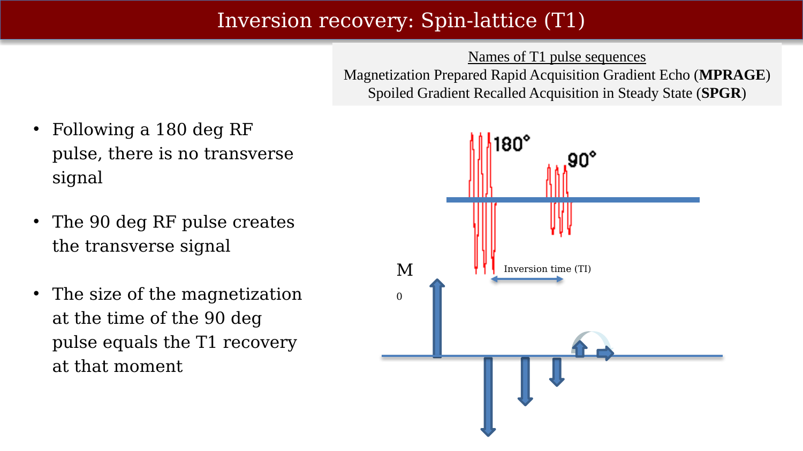{#fig-ch10-inversion-recovery-spin-lattice-t1-2}

## Step 3

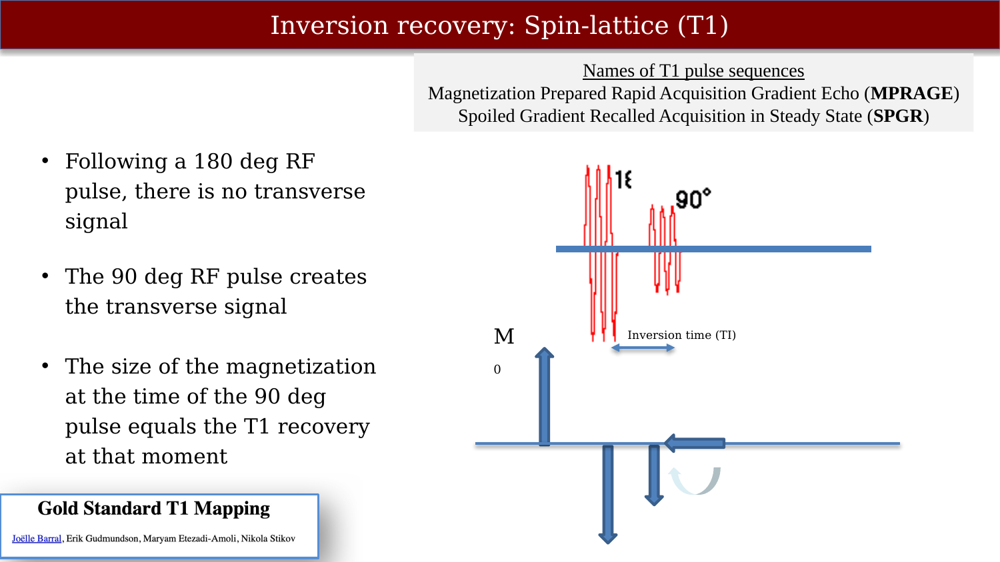{#fig-ch10-inversion-recovery-spin-lattice-t1-3}

:::

## Combining inversion recovery and Hahn spin-echo

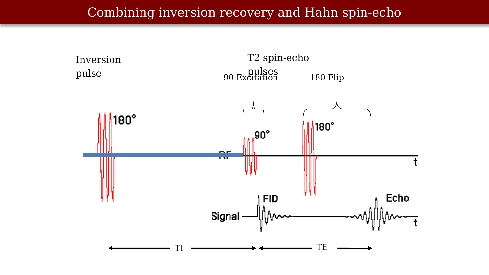{#fig-ch10-combining-inversion-recovery-and-hahn-spin-echo}

## Thursday of the 2nd week

::: {.panel-tabset}

## Step 1

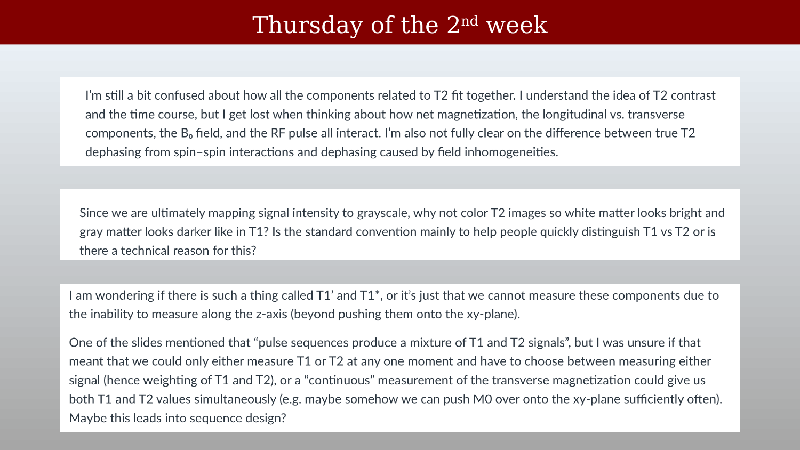{#fig-ch10-thursday-of-the-2nd-week-1}

## Step 2

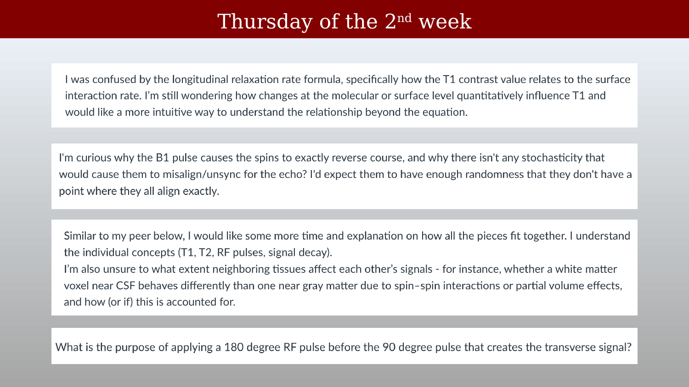{#fig-ch10-thursday-of-the-2nd-week-2}

:::

## The signal magnitude formation when for 180 deg flip

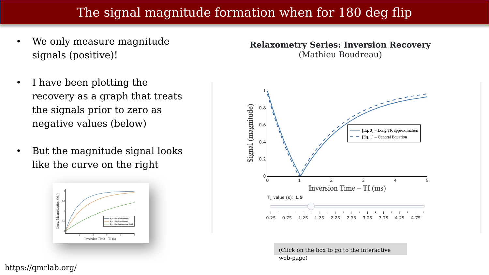{#fig-ch10-the-signal-magnitude-formation-when-for-180-deg-fl}

The link on this page goes to a very nice web-site for quantitative MRI.

That site includes references to Joelle Barral and Nikola Stikov’s work in fitting these kinds of data.

Barral:  A robust methodology for in vivo T1 mapping

Stikov:  On the accuracy of T1 mapping: Searching for common ground

If you don’t want to just produce an image, but you want to know the T1, you can use this method by Joelle Barral at Stanford

Original method by Look Locker

## The contrast changes for different TI (inversion times)

{#fig-ch10-the-contrast-changes-for-different-ti-inversion-ti}

## Combining inversion time measurements into a quantitative T1 map (7T)

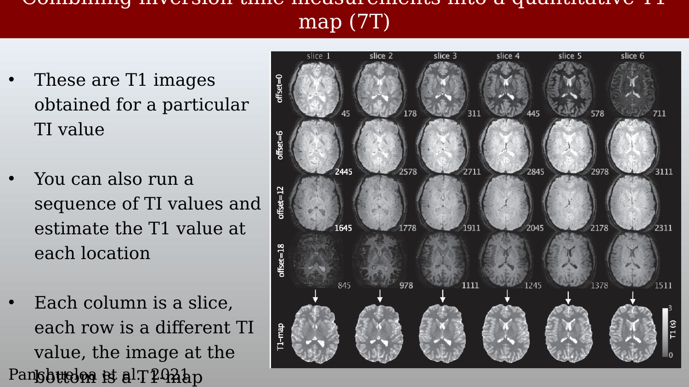{#fig-ch10-combining-inversion-time-measurements-into-a-quant}

## T1-FLAIR (Fluid attenuated inversion recovery)

::: {.panel-tabset}

## Step 1

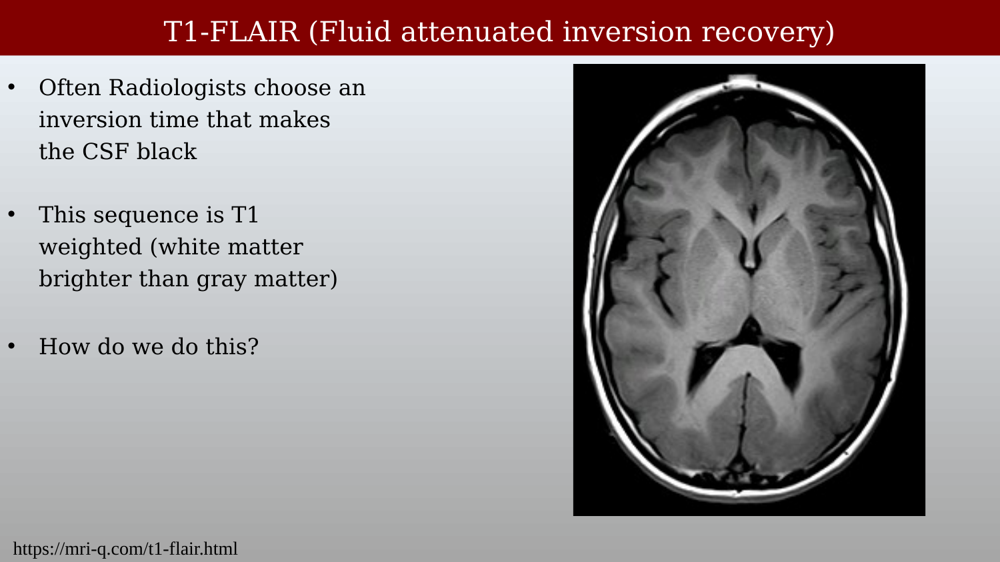{#fig-ch10-t1-flair-fluid-attenuated-inversion-recovery-1}

## Step 2

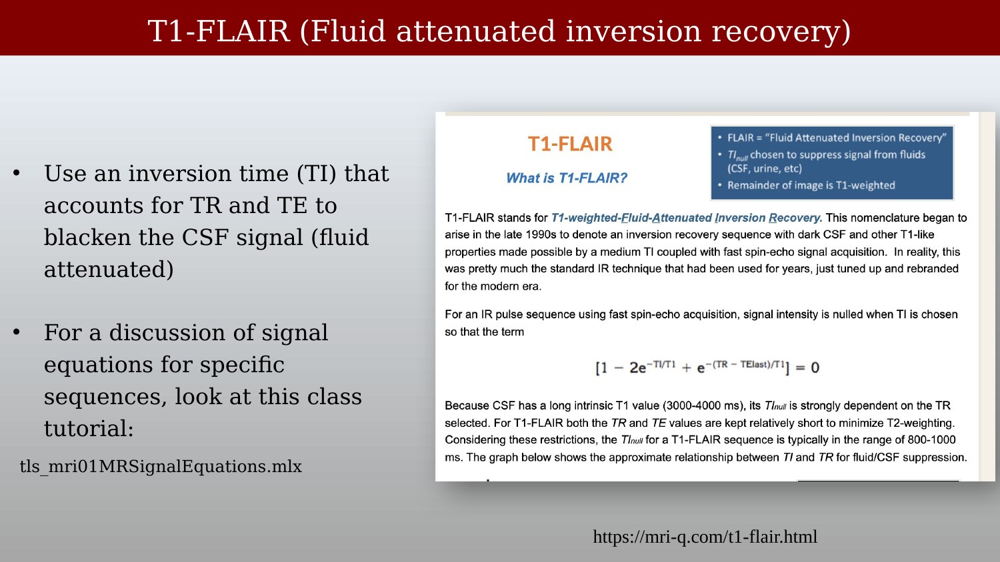{#fig-ch10-t1-flair-fluid-attenuated-inversion-recovery-2}

:::

Add the derivation of this.  I remember seeing it somewhere.  Maybe in the tutorial?

## Inversion recovery can be combined with a spin-echo T2 – not pure T1

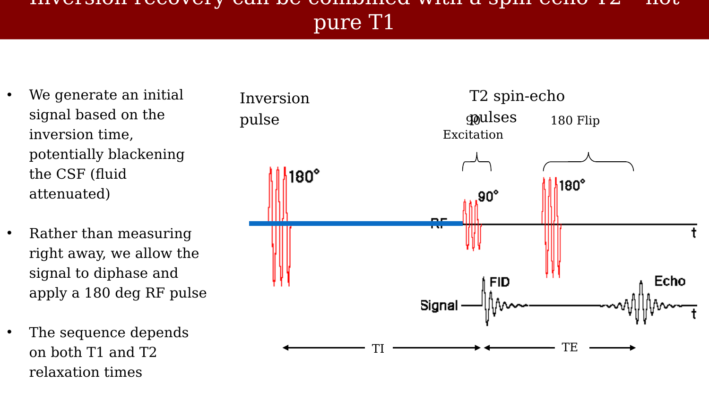{#fig-ch10-inversion-recovery-can-be-combined-with-a-spin-ech}

## Fluid attenuated inversion recovery (FLAIR)

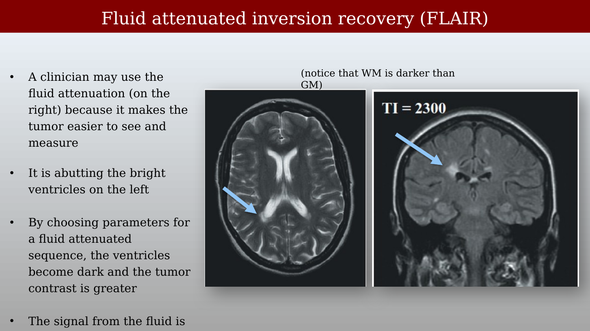{#fig-ch10-fluid-attenuated-inversion-recovery-flair}

## Pulse sequence diagrams

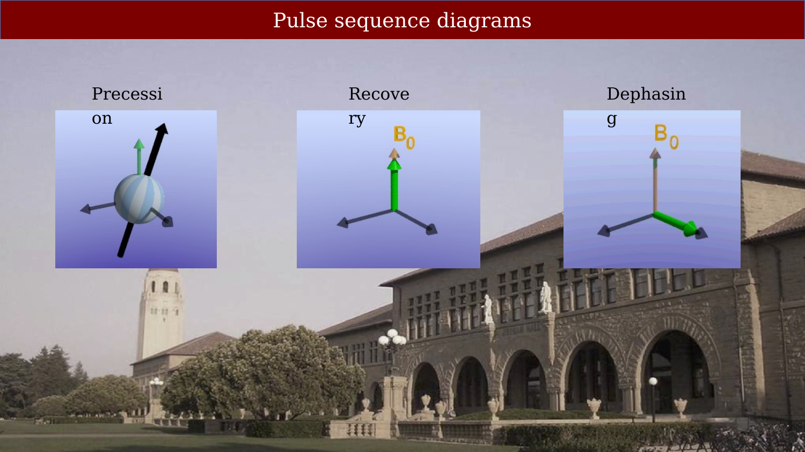{#fig-ch10-pulse-sequence-diagrams}

## MR pulse sequence diagrams:  the measured signals depend on multiple factors

{#fig-ch10-mr-pulse-sequence-diagrams-the-measured-signals-de}

The device programming is based on creating different pulse sequences.
Two examples of pulse sequences are shown here.
The pulse sequences themselves can be quite different to emphasize different features of the brain.
Equally important, the parameters of the pulse sequences can be adjusted to highlight certain differences and diminish others.

## Time constants (white matter):  T1 is always much longer than T2

{#fig-ch10-time-constants-white-matter-t1-is-always-much-long}

## Selection of TE values to contrast two tissue types based on T2

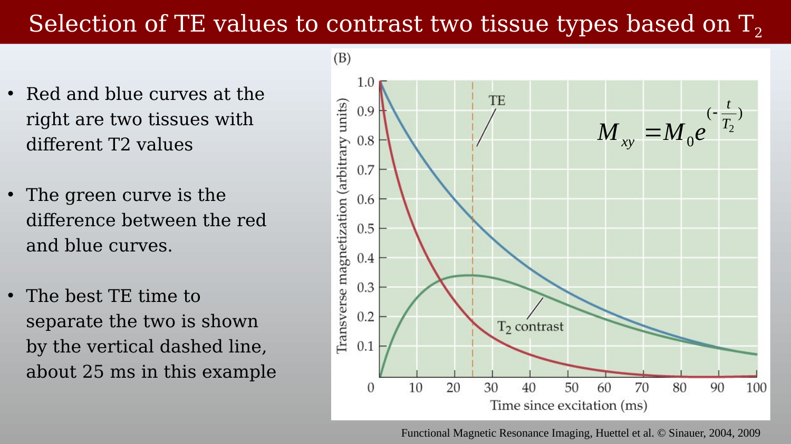{#fig-ch10-selection-of-te-values-to-contrast-two-tissue-type}

## Selection of TR values to contrast two tissue types based on T2

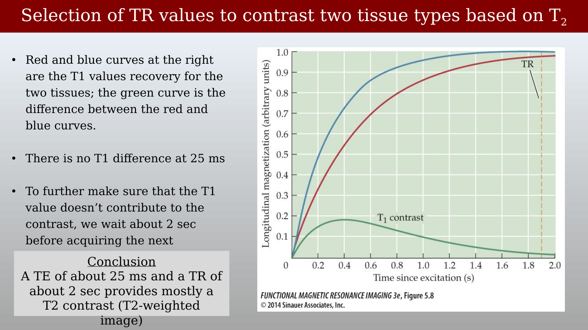{#fig-ch10-selection-of-tr-values-to-contrast-two-tissue-type}

## Summary: The pulse sequences and TR/TE relationships

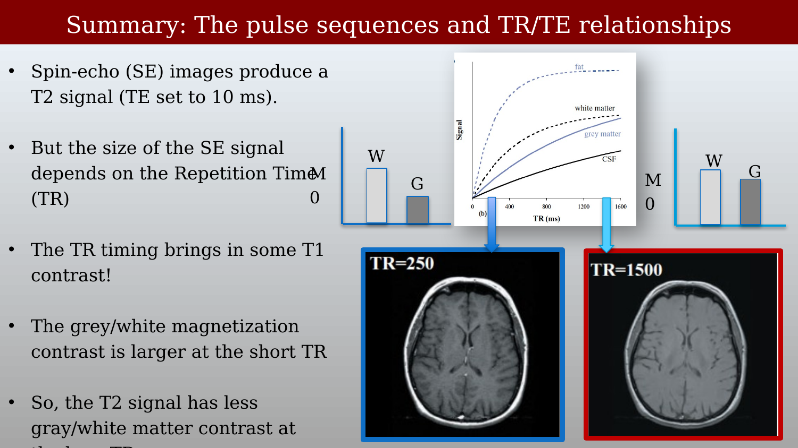{#fig-ch10-summary-the-pulse-sequences-and-trte-relationships}

Figure 3.3 

(a) SE brain images with TE = 10 ms and various TR. 
(b) Signal intensity of CSF, grey and white matter, and subcutaneous fat plotted against TR.

## Why is the T2 measurement not quantitative?

::: {.panel-tabset}

## Step 1

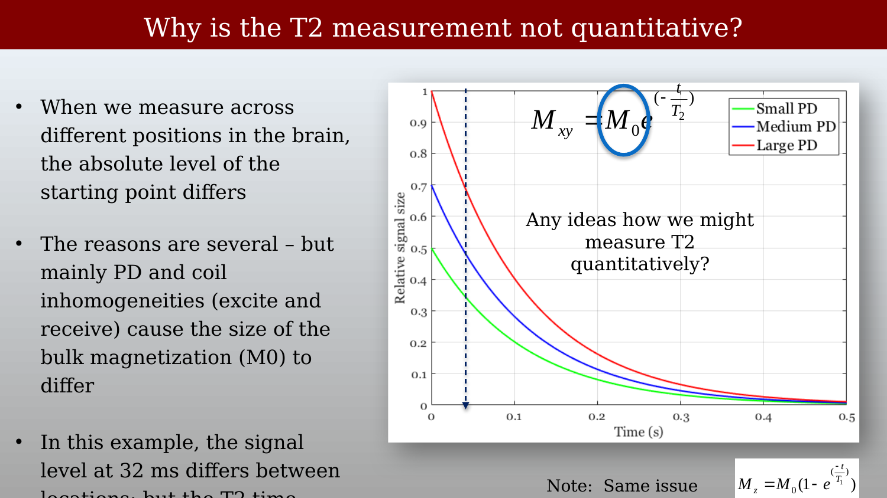{#fig-ch10-why-is-the-t2-measurement-not-quantitative-1}

## Step 2

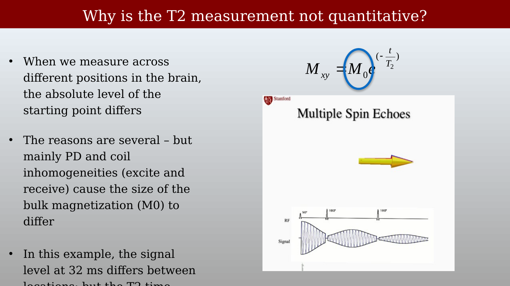{#fig-ch10-why-is-the-t2-measurement-not-quantitative-2}

:::

## A quick look ahead: The T2* BOLD signal

{#fig-ch10-a-quick-look-ahead-the-t2-bold-signal}

## Blood oxygenation influences transverse magnetization relaxation rate(Huettel et al., Fig 7.1; After Thulborn, 1982)

{#fig-ch10-blood-oxygenation-influences-transverse-magnetizat}

Figure 7.1 Effects of blood deoxygenation upon MR relaxation constants. Shown are the differential effects of blood deoxygenation upon transverse and longitudinal relaxation times, as expressed by the constants 1/T2 (blue circles) and 1/T1 (red circles). The xaxis indicates the square of the proportion of deoxygenated blood. Note that oxygenation increases from left to right. Clearly evident is the fact that 1/T2 decreases with increasing oxygenation; that is, the more deoxygenated hemoglobin that is present, the shorter the T2. Note that T1 is not affected by blood oxygenation level. (After Thulborn et al., 1982.)

## Oxygenated and de-oxygenated blood:  Schematic

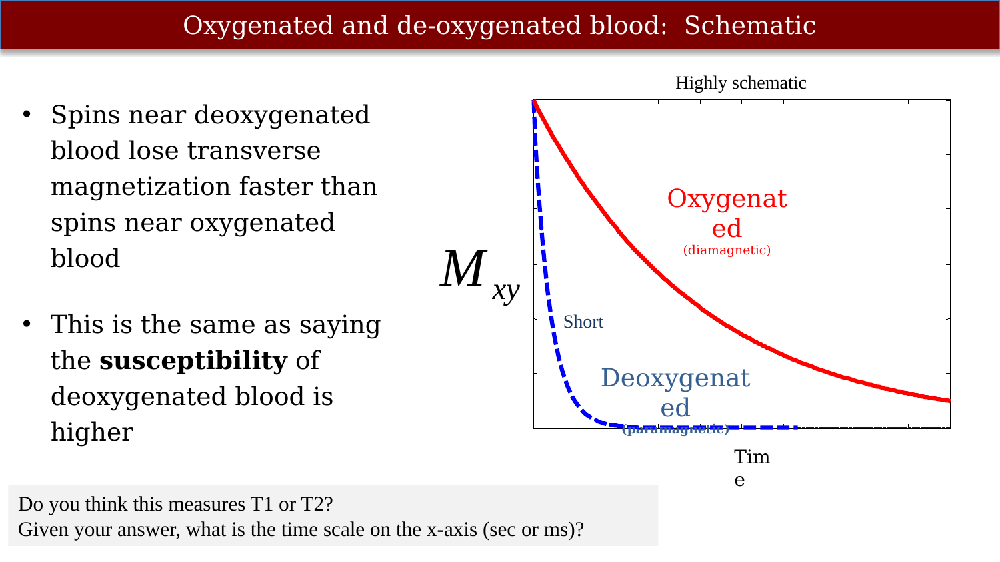{#fig-ch10-oxygenated-and-de-oxygenated-blood-schematic}

## BOLD T2* curves: Quantitative

{#fig-ch10-bold-t2-curves-quantitative}

% some constants
te = 29;       % te for spiral-out
readout = 33;  % duration of readout

% time in milliseconds
x = 0:200;

% te_rest is the rest-state T2*; te_active is the active-state T2*; (at 3 T)
te_rest = [44.9 46.1 43.9 46.1];
te_active = [46.4 48.7 45.4 46.1+.93];

% let's just take the mean
te_rest = mean(te_rest);
te_active = mean(te_active);

% look at signal decay
figure; hold on;
plot(x,exp(-x./te_rest),'r-');
plot(x,exp(-x./te_active),'g-');
straightline([te te+readout],'v','b-');
xlabel('time (ms)');
ylabel('signal');
legend({'rest' 'active'});
title('signal decay');

% look at difference between active and rest
figure; hold on;
plot(x,exp(-x./te_active)-exp(-x./te_rest),'r-');
straightline([te te+readout],'v','b-');
xlabel('time (ms)');
ylabel('signal difference');
title('difference in signal between active and rest');

% look at the percent change relative to rest
figure; hold on;
plot(x,(exp(-x./te_active)./exp(-x./te_rest) - 1) * 100,'r-');
straightline([te te+readout],'v','b-');
xlabel('time (ms)');
ylabel('percent change');
title('percent change relative to rest');

## Real BOLD T2* curves difference:  Quantitative

{#fig-ch10-real-bold-t2-curves-difference-quantitative}

% some constants
te = 29;       % te for spiral-out
readout = 33;  % duration of readout

% time in milliseconds
x = 0:200;

% te_rest is the rest-state T2*; te_active is the active-state T2*; (at 3 T)
te_rest = [44.9 46.1 43.9 46.1];
te_active = [46.4 48.7 45.4 46.1+.93];

% let's just take the mean
te_rest = mean(te_rest);
te_active = mean(te_active);

% look at signal decay
figure; hold on;
plot(x,exp(-x./te_rest),'r-');
plot(x,exp(-x./te_active),'g-');
straightline([te te+readout],'v','b-');
xlabel('time (ms)');
ylabel('signal');
legend({'rest' 'active'});
title('signal decay');

% look at difference between active and rest
figure; hold on;
plot(x,exp(-x./te_active)-exp(-x./te_rest),'r-');
straightline([te te+readout],'v','b-');
xlabel('time (ms)');
ylabel('signal difference');
title('difference in signal between active and rest');

% look at the percent change relative to rest
figure; hold on;
plot(x,(exp(-x./te_active)./exp(-x./te_rest) - 1) * 100,'r-');
straightline([te te+readout],'v','b-');
xlabel('time (ms)');
ylabel('percent change');
title('percent change relative to rest');
