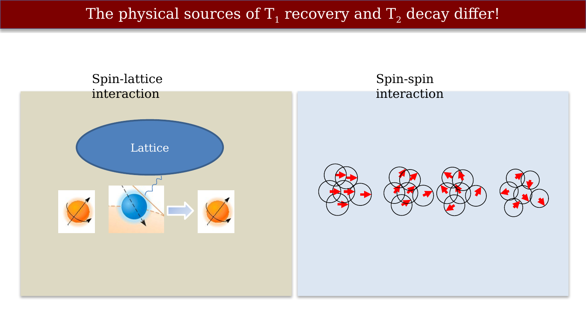
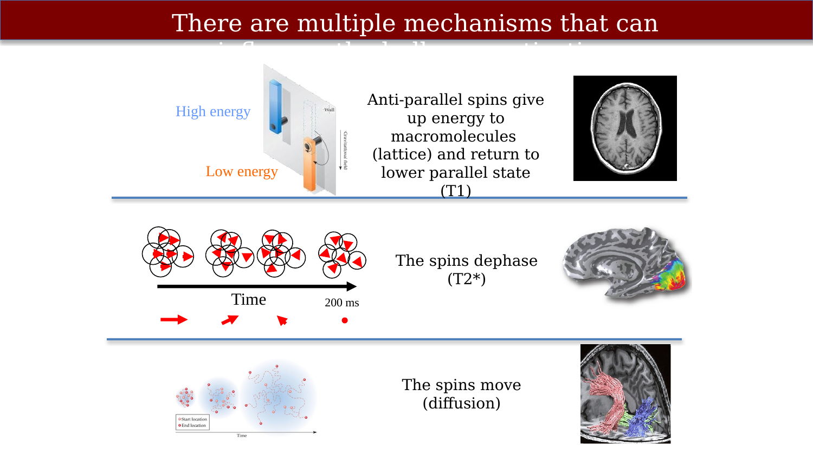

# MR summaries



---

## The physical sources of T1 recovery and T2 decay differ!

{#fig-ch11-the-physical-sources-of-t1-recovery-and-t2-decay-d}

## There are multiple mechanisms that can influence the bulk magnetization

An important principle is that we have working models of the MR signal.  These models tell us that we can use the MRI system to learn about different aspects of the substrate we are measuring.  This is very important when it comes to making measurements of the brain.

{#fig-ch11-there-are-multiple-mechanisms-that-can-influence-t}

## MRI terminology

To understand the instrument and the signals, we have explored new ideas, we have introduced many new terms. Here is a brief summary.

{#fig-ch09-mri-terms-we-have-covered}

