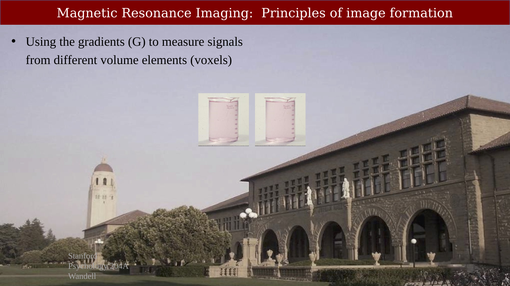
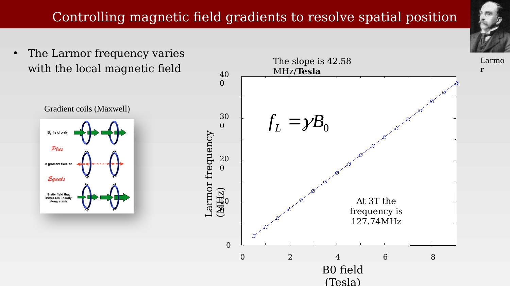
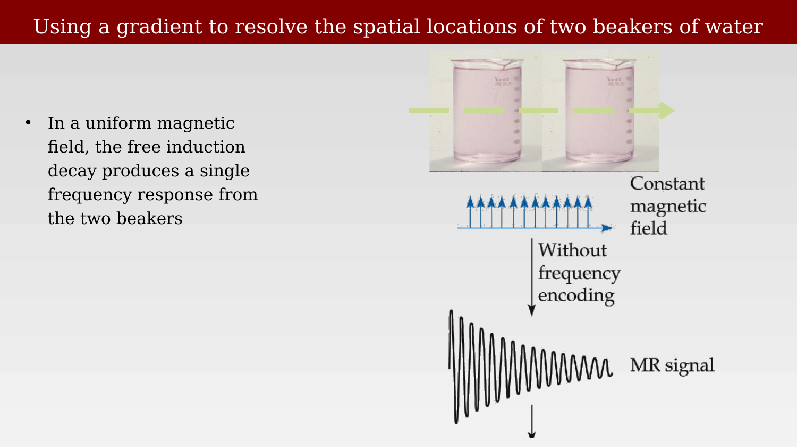
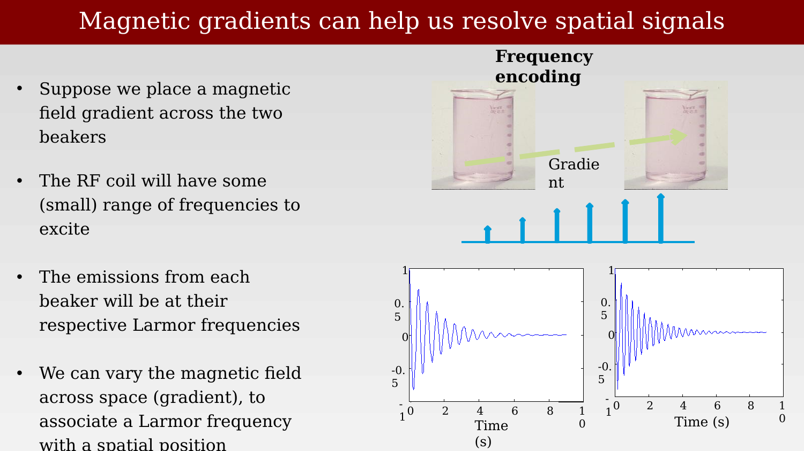
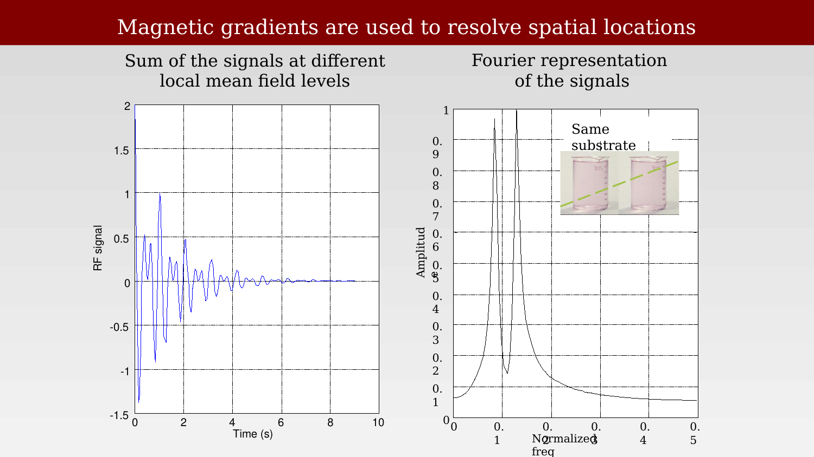
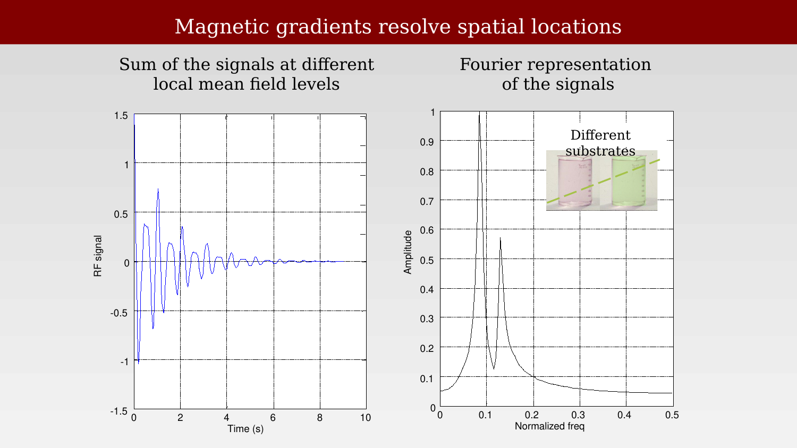
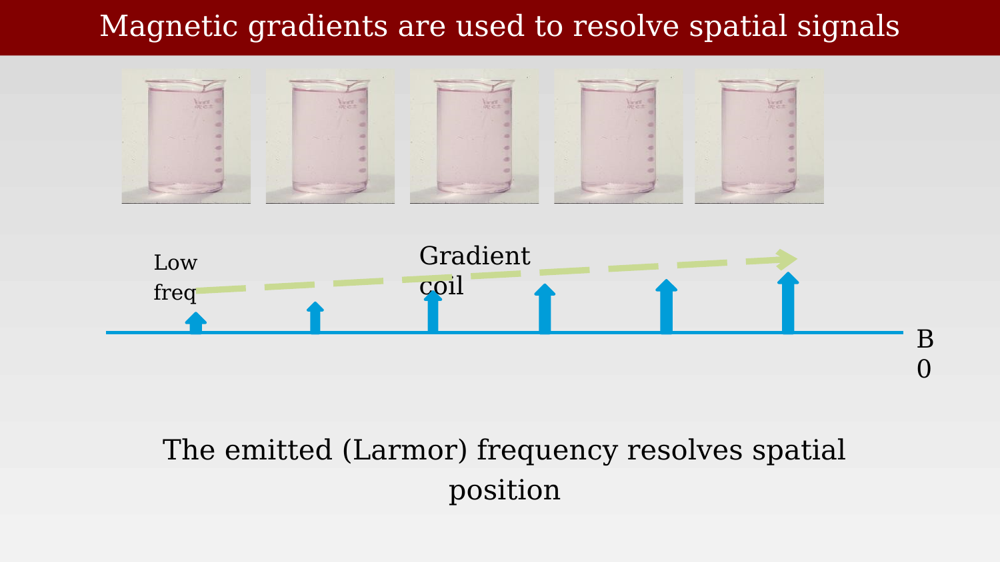
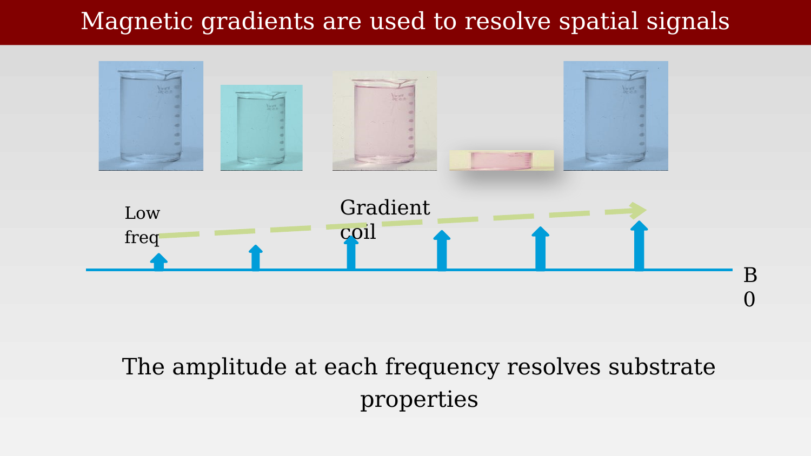
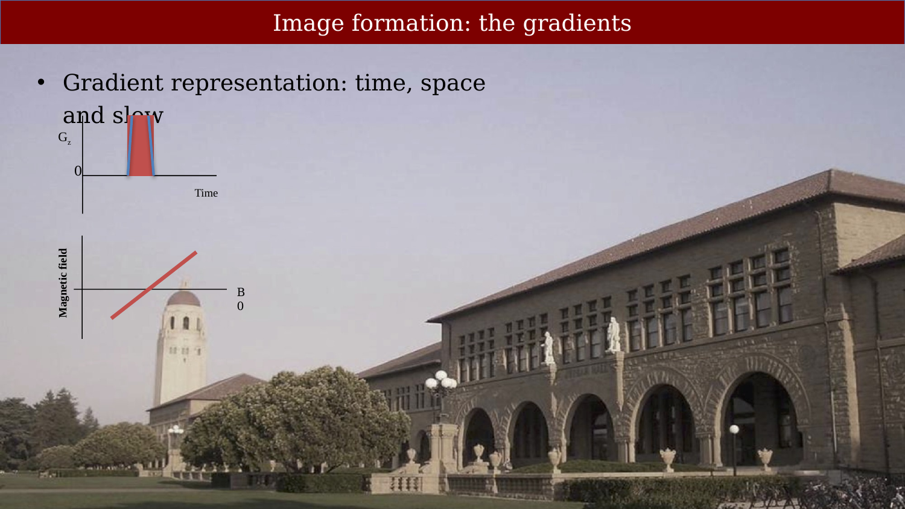

# Image Formation Principles



---

## Image formation principles overview

{#fig-ch12-magnetic-resonance-imaging-principles-of-image-for}

Next, we are going to ask how we might create images from the MR signal, enabling us to measure not just the average signal from a whole volume, but separating out where in the volume the signal might come from.

## Controlling magnetic field gradients to resolve spatial position

{#fig-ch12-controlling-magnetic-field-gradients-to-resolve-sp}

To move a spin between two states, we require an RF photon whose energy is matched to the difference in energy between the two states; The energy of an RF photon is $E = hv$ where h is Planck’s constant and $v$ is frequency The RF pulse frequency we need to flip the spins varies with field strengthSir Joseph Larmor (11 July 1857 Magheragall, County Antrim,Ireland – 19 May 1942 Holywood, County Down, Northern Ireland [1])a physicist and mathematician who made innovations in the understanding of electricity,dynamics,thermodynamics, and the electron theory of matter. His most influential work was Aether and Matter, a theoretical physics book published in 1900.Ampere saw the originalThe birth of the electric machines: a commentary on Faraday (1832) ‘Experimental researches in electricity’https://royalsocietypublishing.org/doi/full/10.1098/rsta.2014.0208“. Within months of Ørsted's discovery, the French physicist and mathematician André-Marie Ampère had shown that two current carrying wires placed in parallel close to each other each generated magnetic lines of force that caused the wires to be attracted or repelled from each other depending on whether the currents were flowing in the same or in opposite directions. Ampère would go on to help found the field of classical electromagnetism and has the SI unit of electric current named after him.”

## Using a gradient to resolve the spatial locations of two beakers of water

{#fig-ch12-using-a-gradient-to-resolve-the-spatial-locations}

## Magnetic gradients can help us resolve spatial signals

{#fig-ch12-magnetic-gradients-can-help-us-resolve-spatial-sig}

## Magnetic gradients are used to resolve spatial locations

{#fig-ch12-magnetic-gradients-are-used-to-resolve-spatial-loc}

## Magnetic gradients resolve spatial locations

{#fig-ch12-magnetic-gradients-resolve-spatial-locations}

## Magnetic gradients are used to resolve spatial signals

::: {.panel-tabset}

## Step 1

{#fig-ch12-magnetic-gradients-are-used-to-resolve-spatial-sig-1}

## Step 2

{#fig-ch12-magnetic-gradients-are-used-to-resolve-spatial-sig-2}

:::

## Image formation: the gradients

{#fig-ch12-image-formation-the-gradients}
