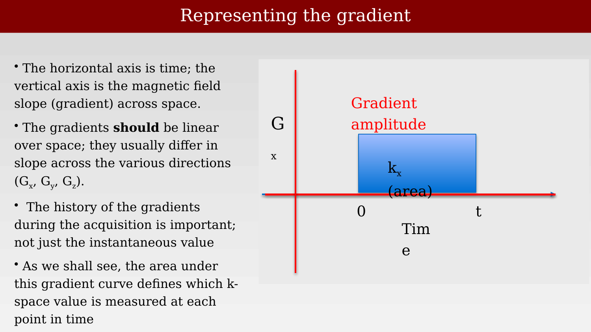
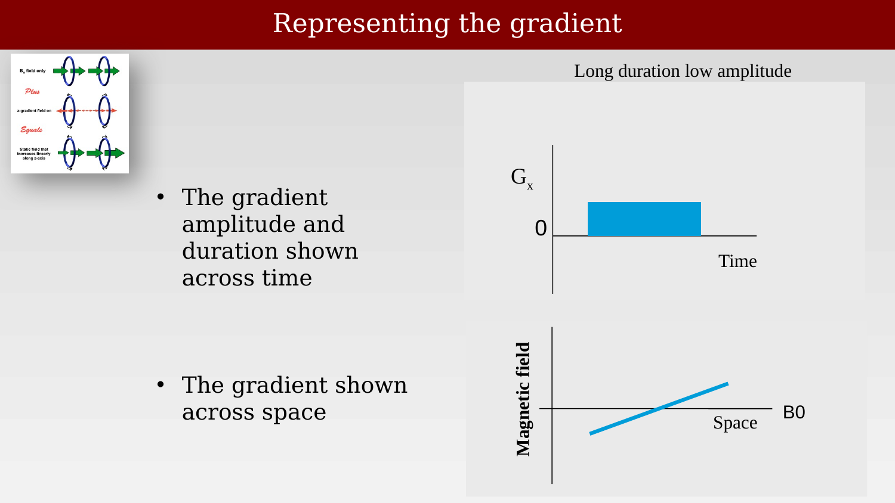
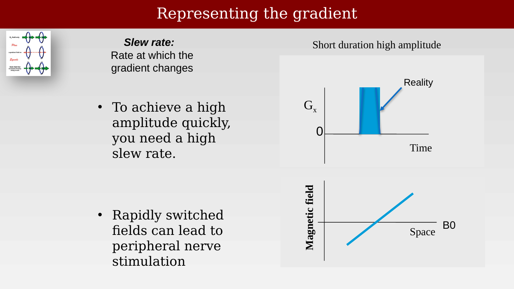

# Image Formation Principles



---

## Image formation principles overview
<!--
{#fig-ch12-magnetic-resonance-imaging-principles-of-image-for}
-->

We now ask how we can create images from the MR signal.  The ability to create an image, not just measuring the bulk signal, is what makes MR so valuable for clinical usage.  We can literally create a signal based on different types of MR contrast inside the head.

The insights about how to create an image, and particularly how to create an image of MR contrasts relatively quickly, are wonderful and important set of new scientific insights. It is here that the **imaging gradients** become the central actors. 

We begin by identifying a simple way to understand how we might localize, based on what you already know of the Larmor frequency. The story becomes increasingly interesting - and a bit more complex.  None of it is too hard for for someone with just a little bit of math (linear algebra) to understand.

<!--
## Controlling magnetic field gradients to resolve spatial position

{#fig-ch12-controlling-magnetic-field-gradients-to-resolve-sp}

To move a spin between two states, we require an RF photon whose energy is matched to the difference in energy between the two states; The energy of an RF photon is $E = hv$ where h is Planck’s constant and $v$ is frequency The RF pulse frequency we need to flip the spins varies with field strengthSir Joseph Larmor (11 July 1857 Magheragall, County Antrim,Ireland – 19 May 1942 Holywood, County Down, Northern Ireland [1])a physicist and mathematician who made innovations in the understanding of electricity,dynamics,thermodynamics, and the electron theory of matter. His most influential work was Aether and Matter, a theoretical physics book published in 1900.Ampere saw the originalThe birth of the electric machines: a commentary on Faraday (1832) ‘Experimental researches in electricity’https://royalsocietypublishing.org/doi/full/10.1098/rsta.2014.0208“. Within months of Ørsted's discovery, the French physicist and mathematician André-Marie Ampère had shown that two current carrying wires placed in parallel close to each other each generated magnetic lines of force that caused the wires to be attracted or repelled from each other depending on whether the currents were flowing in the same or in opposite directions. Ampère would go on to help found the field of classical electromagnetism and has the SI unit of electric current named after him.”
-->

## Using a gradient to resolve the locations of two beakers of water

{#fig-ch12-using-a-gradient-to-resolve-the-spatial-locations}

If we have two beakers of water next to one another, and we put them both in a uniform field, the signal we measure will be the sum of the two signals from the two beakers.  Physicists are fortunate that so many central phenomena are added.  The signal amplitude will just scale with the number of breakers.

## Magnetic gradients can help us resolve spatial signals

{#fig-ch12-magnetic-gradients-can-help-us-resolve-spatial-sig}

What will happen if we put the beakers in a magnetic field that changes over space (a spatial gradient)?  

First, notice that the Larmor frequency for the two beakers would differ.  So, to make sure we evoke a FID signalfrom both beakers, we would have to excite with a broad range of frequencies.

Similarly, the Larmor frequency of the emitted signals will differ; a lower frequency will be emitted from the beaker in the lower magnetic field.  

## Magnetic gradients are used to resolve spatial locations

{#fig-ch12-magnetic-gradients-are-used-to-resolve-spatial-loc}

What we measure, will be the sum of the two signals.  Those lucky physicists and their additive phenomena!  The graph on the left of @fig-ch12-magnetic-gradients-are-used-to-resolve-spatial-loc shows the sum of the signals, as they vary over time.  This is the representation we have been using up to now.

The graph on the right represents the signal in a different way. The signal is transformed into a **temporal frequency** representation.  The horizontal axis represents the different frequency components, and the vertical axis is the amplitude of each of the components.  (We will ignore phase for now).  Notice that in this representation, there are two peaks.  One is the Larmor frequency for the beaker in the lower magnetic field, and the second peak for the second beaker.

The signals at the different frequencies come from different locations.  We have some spatial resolution!

## Magnetic gradients resolve spatial locations

{#fig-ch12-magnetic-gradients-resolve-spatial-locations}

What if the substance in the beakers differs?

## Magnetic gradients are used to resolve spatial signals

::: {.panel-tabset}

## Step 1

{#fig-ch12-magnetic-gradients-are-used-to-resolve-spatial-sig-1}

## Step 2

{#fig-ch12-magnetic-gradients-are-used-to-resolve-spatial-sig-2}

:::

## Image formation: the gradients

{#fig-ch12-image-formation-the-gradients}

## Representing the gradient

::: {.panel-tabset}

## Step 1

{#fig-ch12-representing-the-gradient-1}

## Step 2

{#fig-ch12-representing-the-gradient-2}

## Step 3

{#fig-ch12-representing-the-gradient-3}

## Step 4

{#fig-ch12-representing-the-gradient-4}

:::
