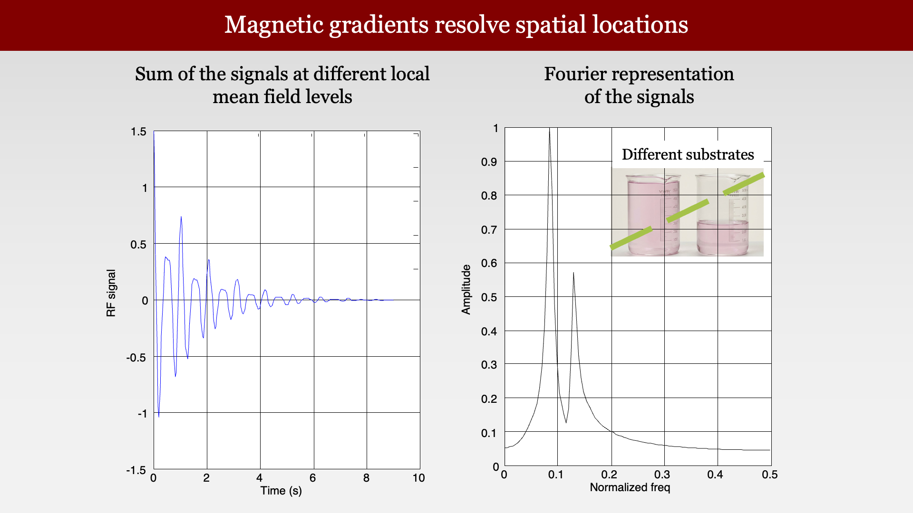
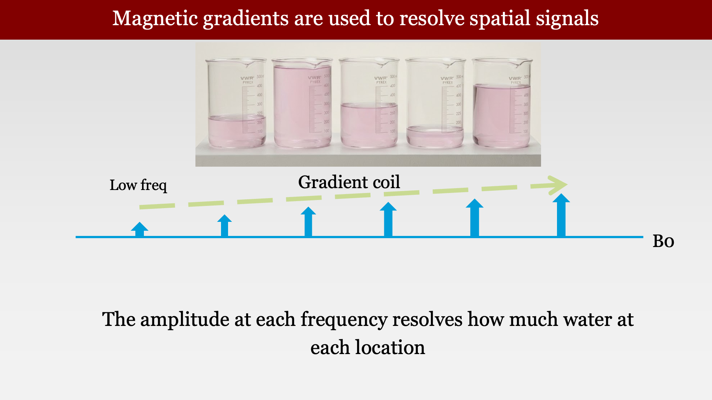

# Image Formation Principles



---

## Image formation principles overview
<!--
{#fig-ch12-magnetic-resonance-imaging-principles-of-image-for}
-->

The ability to create an image, not just measuring the bulk signal, is what makes MR so valuable for clinical usage.  We can literally create a signal based on different types of MR contrast inside the head.  

But how? The insights about how to create an image, and particularly how to create an image of MR contrasts relatively quickly, are wonderful and important set of new scientific insights. It is here that the **imaging gradients** become the central actors. 

We begin by identifying a simple way to understand how we might localize, in principle. You will see the idea based on what you already know of the Larmor frequency. As we go deeper, however, the story becomes a bit more complex and interesting. The ideas are not too hard for for someone with just a little bit of math (linear algebra) to understand.  It just takes a little getting used to.

<!--
## Controlling magnetic field gradients to resolve spatial position

{#fig-ch12-controlling-magnetic-field-gradients-to-resolve-sp}

To move a spin between two states, we require an RF photon whose energy is matched to the difference in energy between the two states; The energy of an RF photon is $E = hv$ where h is Planck’s constant and $v$ is frequency The RF pulse frequency we need to flip the spins varies with field strengthSir Joseph Larmor (11 July 1857 Magheragall, County Antrim,Ireland – 19 May 1942 Holywood, County Down, Northern Ireland [1])a physicist and mathematician who made innovations in the understanding of electricity,dynamics,thermodynamics, and the electron theory of matter. His most influential work was Aether and Matter, a theoretical physics book published in 1900.Ampere saw the originalThe birth of the electric machines: a commentary on Faraday (1832) ‘Experimental researches in electricity’https://royalsocietypublishing.org/doi/full/10.1098/rsta.2014.0208“. Within months of Ørsted's discovery, the French physicist and mathematician André-Marie Ampère had shown that two current carrying wires placed in parallel close to each other each generated magnetic lines of force that caused the wires to be attracted or repelled from each other depending on whether the currents were flowing in the same or in opposite directions. Ampère would go on to help found the field of classical electromagnetism and has the SI unit of electric current named after him.”
-->

## Using a gradient to resolve the locations of two beakers of water

{#fig-ch12-using-a-gradient-to-resolve-the-spatial-locations}

Suppose we have two beakers of water next to one another, and we put them in a uniform field, the bulk signal we measure will be the sum of the signals from the two beakers.  **IMHO**: Physicists are fortunate that so many phenomena are additive.  

## Magnetic gradients can help us resolve spatial signals

{#fig-ch12-magnetic-gradients-can-help-us-resolve-spatial-sig}

What will we measure if we create a magnetic field that changes over space (a spatial gradient), so that the two beakers are in different magnetic field levels?  

First, notice that the Larmor frequency for the two beakers would differ.  So, to make sure we evoke a FID signal from both beakers, we would have to excite with a broader range of frequencies, covering their different Larmor frequencies.

Similarly, the Larmor frequency of the emitted signals will differ; a lower frequency will be emitted from the beaker in the lower magnetic field.  So the measurements will be the sum of the two FID signals at the two different frequencies. Those lucky physicists and their additive systems!  

## Using temporal frequencies to resolve spatial locations

{#fig-ch12-magnetic-gradients-are-used-to-resolve-spatial-loc}

The graph on the left of @fig-ch12-magnetic-gradients-are-used-to-resolve-spatial-loc shows the sum of the signals, as they vary over time.  This is the representation we have been using up to now.

The graph on the right represents the signal in a different way. The signal is transformed into a **temporal frequency** representation.  The horizontal axis represents the different frequency components, and the vertical axis is the amplitude of each of the components.  (We will ignore phase for now).  Notice that in this representation, there are two peaks.  One is the Larmor frequency for the beaker in the lower magnetic field, and the second peak for the second beaker.

The signals at the different frequencies come from different locations. We are using temporal frequency analysis to resolve spatial position!

## Magnetic gradients: when the substrate differs

{#fig-ch12-magnetic-gradients-resolve-spatial-locations}

In our first example, the two beakers have the same content.  What if the amount of the water in the beakers differs?  In that case, the FID amplitude might differ.  The Larmor frequency, however, should be the same.

## Magnetic gradients are used to resolve spatial signals

{#fig-ch12-magnetic-gradients-are-used-to-resolve-spatial-sig-2}

If we have an array of beakers with different amounts of water, the amplitude at each frequency tells us how much water there is at each position!

The purpose of this simple example is to introduce the idea that using magnetic field gradients can provide us with information about different locations in space.  The information is contained in the nature of the signal. We will develop these ideas quite a bit further in the next sections, using more advanced tools.  But the essential idea - spatial gradients enable us to resolve spatial position from the temporal signal - is with us for good.

## Image formation: the gradients

<!--
{#fig-ch12-image-formation-the-gradients}
-->

Given the importance of gradients, we should have some words and pictures to describe them.  The sequence of panels here describe the terms we use to describe gradients.

## Representing the gradient

## The basic representation

{#fig-ch12-representing-the-gradient-1}

## Showing the gradient across time and space

{#fig-ch12-representing-the-gradient-2}

## Rapidly turning it on and off

{#fig-ch12-representing-the-gradient-3}

But we kept the area under the curve the same.

## Gradients have positive and negative slopes

{#fig-ch12-representing-the-gradient-4}

