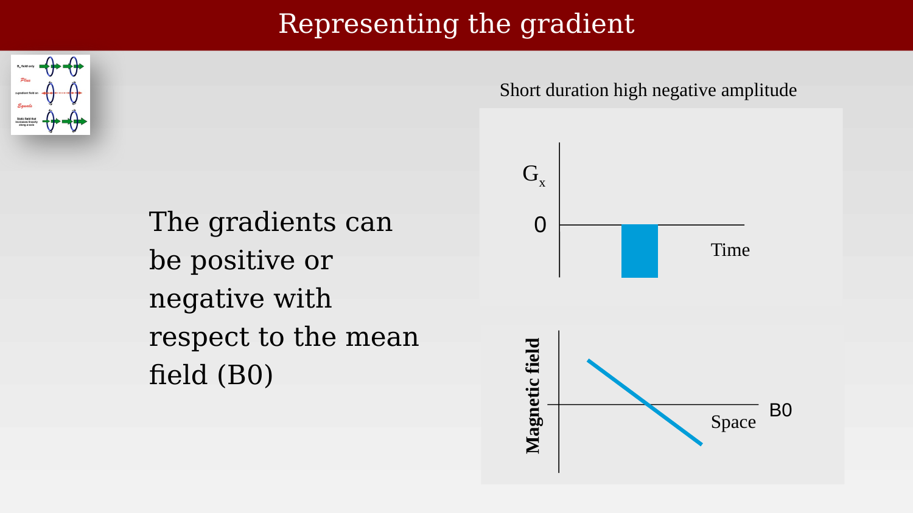
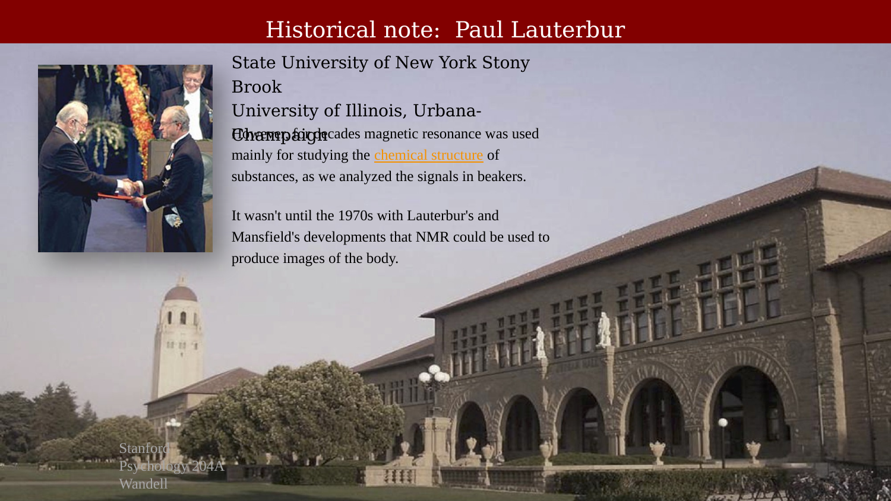
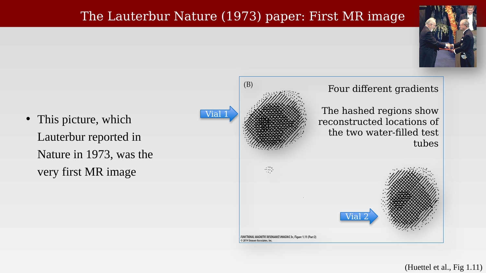

# Gradient Encoding and the First MR Image



---

## Representing the gradient

::: {.panel-tabset}

## Step 1

{#fig-ch13-representing-the-gradient-1}

## Step 2

{#fig-ch13-representing-the-gradient-2}

## Step 3

{#fig-ch13-representing-the-gradient-3}

## Step 4

{#fig-ch13-representing-the-gradient-4}

:::

## Historical note:  Paul Lauterbur

{#fig-ch13-historical-note-paul-lauterbur}

## The Lauterbur Nature (1973) paper: First MR image

::: {.panel-tabset}

## Step 1

{#fig-ch13-the-lauterbur-nature-1973-paper-first-mr-image-1}

## Step 2

{#fig-ch13-the-lauterbur-nature-1973-paper-first-mr-image-2}

:::

In 1972, Lauterbur had a novel idea: if the  strength of the magnetic field were varied over space, the resonant frequencies of protons at different field locations would also vary. By measuring how much energy was emitted at different frequencies, one could identify how many protons were present at each spatial location. This idea, of inducing spatial gradients (often symbolized as  G) in the magnetic field, proved to be the fundamental insight that led to the creation of MR images. Lauterbur also realized that a single gradient could only provide information about one spatial dimension; to recover two-dimensional structure, it would be necessary to use gradients at different orientations. By acquiring data using four gradients in succession, each turned 45º from its predecessor, Lauterbur created an image of a pair of water-filled test tubes (Figure 1.11). This picture, which was reported in Nature in 1973, was the very first MR image.16

## From the 1973 Nature paper

{#fig-ch13-from-the-1973-nature-paper}
