# Image formation and Fourier Series (k-space)



---

## Linear models are important in science and engineering

<!--
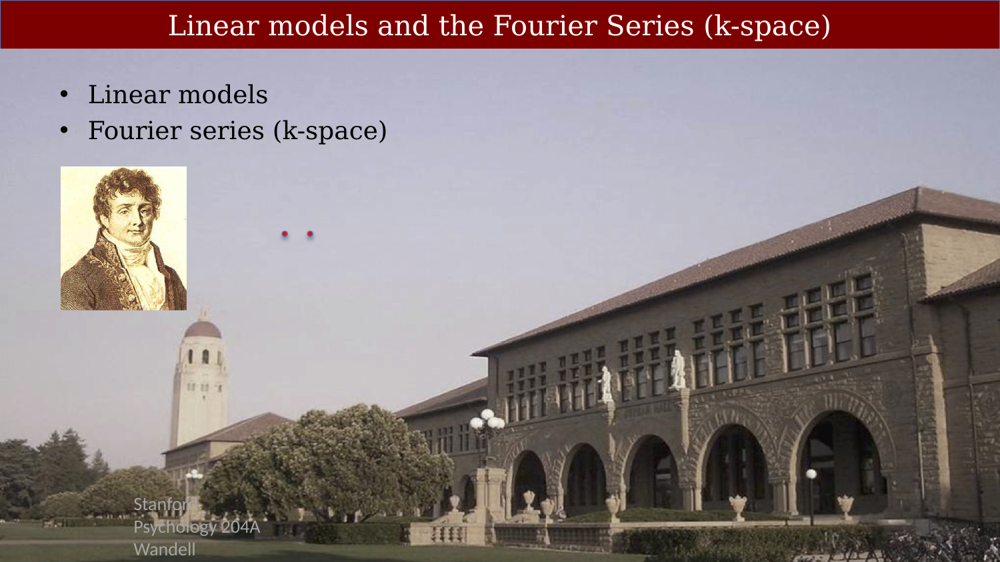{#fig-ch14-linear-models-and-the-fourier-series-k-space}
-->

Linear models are extremely important in science and engineering. There are many ways linear models arise in practice, and we will see several examples in this class. Linear models are used in almost every class I teach, which is why they are [included in this Appendix of my book on the Foundations of Image Systems Engineering](https://wandell.github.io/FISE-git/chapters/appendix-01-linearsystems.html).  

 The Fourier series is a specific example of a linear model; many engineers consider it to be the most important one. There is no doubt that it is the most important one in magnetic resonance imaging. This chapter introduces the Fourier series and starts to explain its important in MRI.

The [historical and mathematical background of Fourier analysis](resources/jean-baptiste-fourier.qmd), as well as the life of Jean-Baptiste Fourier, is quite interesting.

## What is a linear model?

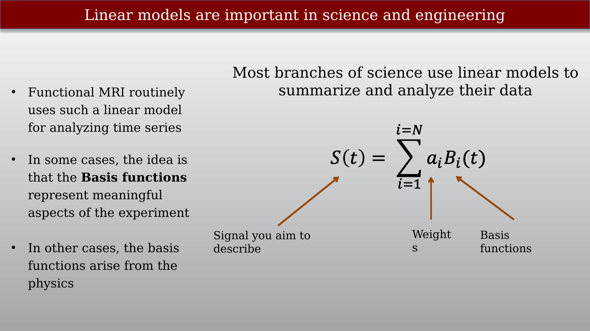{#fig-ch14-linear-models-are-important-in-science-and-enginee}

A linear model is a re-expressing a series of measurements. The set of measurements might be set of values measured over time (time series) or a set of points measured across space.  

Instead of expressing the vector of measurements in the form they were acquired, we express them as the weighted sum of a fixed set of other vectors. These other vectors are potential signals we might have measured.  We call these vectors the basis functions $B_i$ of the linear model.  We weights we apply to these basis vectors to match the measurements are the new description of the signal.  Each signal is now represented by these weights with respect to the new basis.

Linear models are valuable because they can help us understand properties of the measurement, or how a system acts on signal. 

In the example shown in the slide, the measured signal, $s(t)$ is exactly equal to the weighted sum of the basis functions $B_i(t)$.  In general, people we use a linear model whose basis functions do a reasonable job of just approximating the measured signal,

$$
s(t) \approx \sum_{i=1}^{k=N} a_i B_i(t)
$$

## The Fourier series is a linear model – the basis functions are harmonics

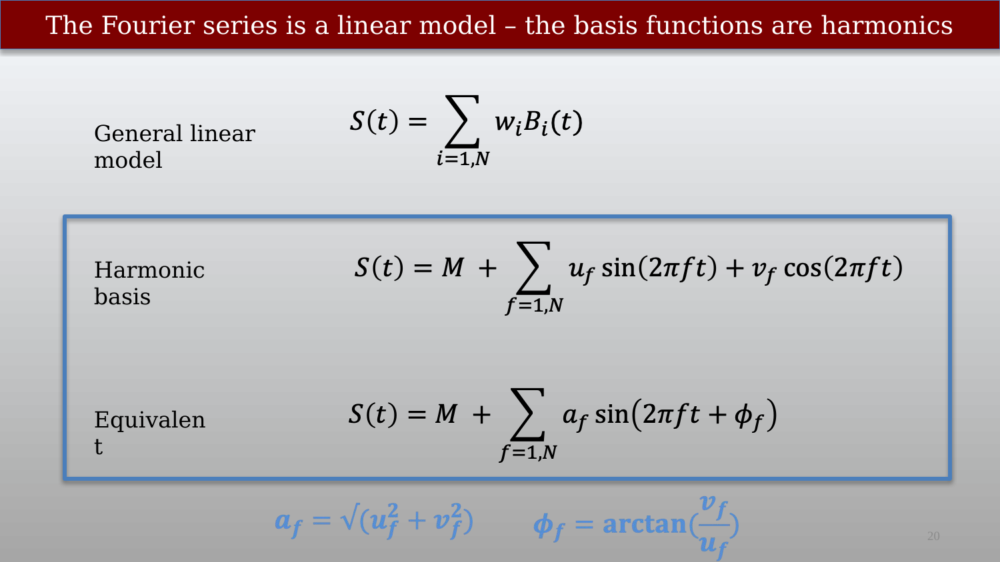{#fig-ch14-the-fourier-series-is-a-linear-model-the-basis-fun}

Sines and cosines are called **harmonmic** functions. 

One way to express the Fourier series is as the weighted sum of sines and cosines over a range of different frequencies. 

Another way is to use a trigonometric relationships that many of you learned in high school, to rewrite the sum of a sine and cosine as sine with some amplitude, $a_f$ and phase $\phi_f$ that  depends on the weights of the sine and cosine. 

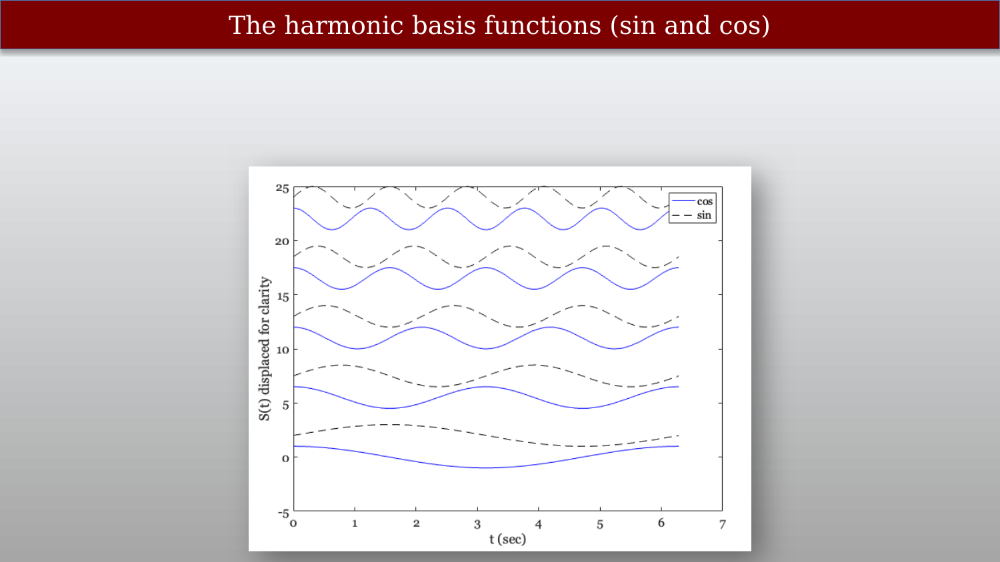{#fig-ch14-the-harmonic-basis-functions-sin-and-cos}

This slide shows examples of the harmonics, where you can see the impact of changing the frequency. Changing the phase shifts the harmonic right or left on with respect to the horizontal axis.

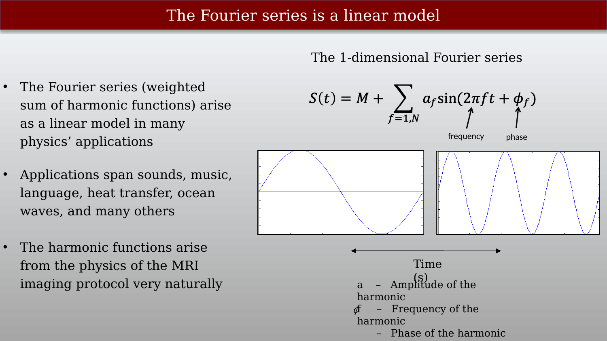{#fig-ch14-the-fourier-series-is-a-linear-model}

## Matrix tableau representation

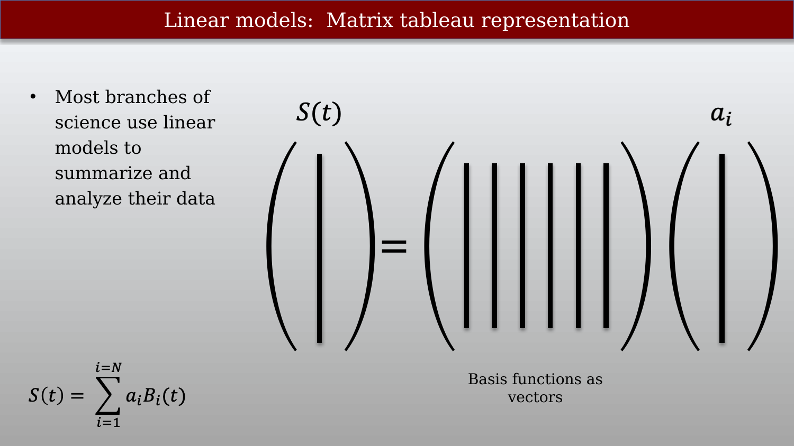{#fig-ch14-linear-models-matrix-tableau-representation}

Matrices are a a clear way to visualize and think about linear models. I am fond of the visual summary of matrices called the **matrix tableau**.   The idea is illustrated in @fig-ch14-linear-models-matrix-tableau-representation.  

The vector on the left $s(t)$ is the measurement at sample times, $t_i$. The big matrix on the right has all of the basis functions in the columns.  These are potential signals, also sampled at times $t_i$.  The weights are in the column vector at the right $a_i$.

The product of the matrix and the vector is computed by scaling (multiplying) the first column by $a_1$, the second column by $a_2$, and so forth and then adding together all of those scaled columns.

## Estimating the Fourier weights from the signal

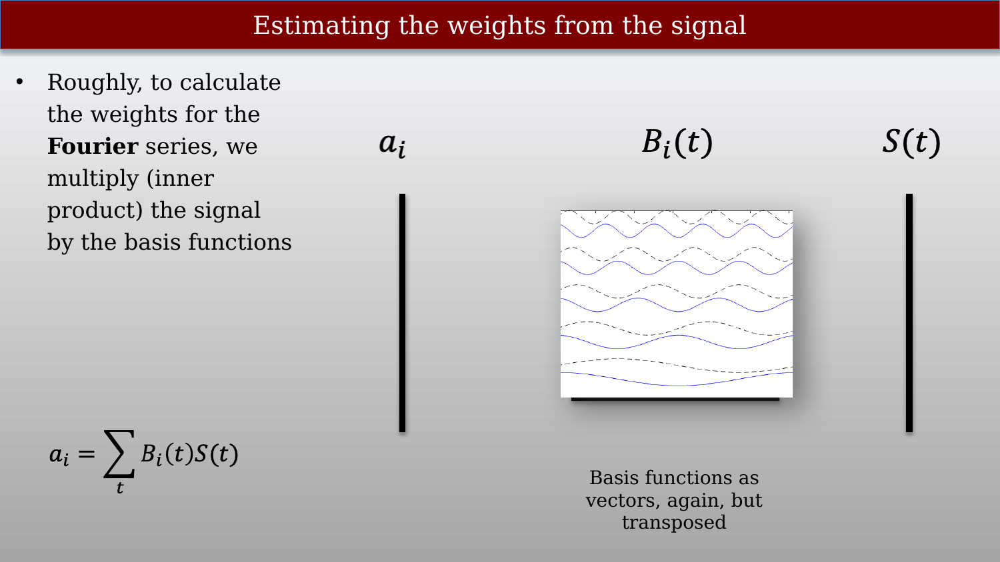{#fig-ch14-estimating-the-weights-from-the-signal}

**Teachmri:**  harmonicsFFTandImages29

::: {.callout-note title="Point basis"}
When we represent a signal in the frequency domain, we describe it as a weighted sum of sinusoids—the Fourier basis functions. When you return the representation to the standard time domain $s(t)$, you are performing a change of basis. What are the implicit basis functions of this time-domain representation?
:::

## Fourier Transforms and Images

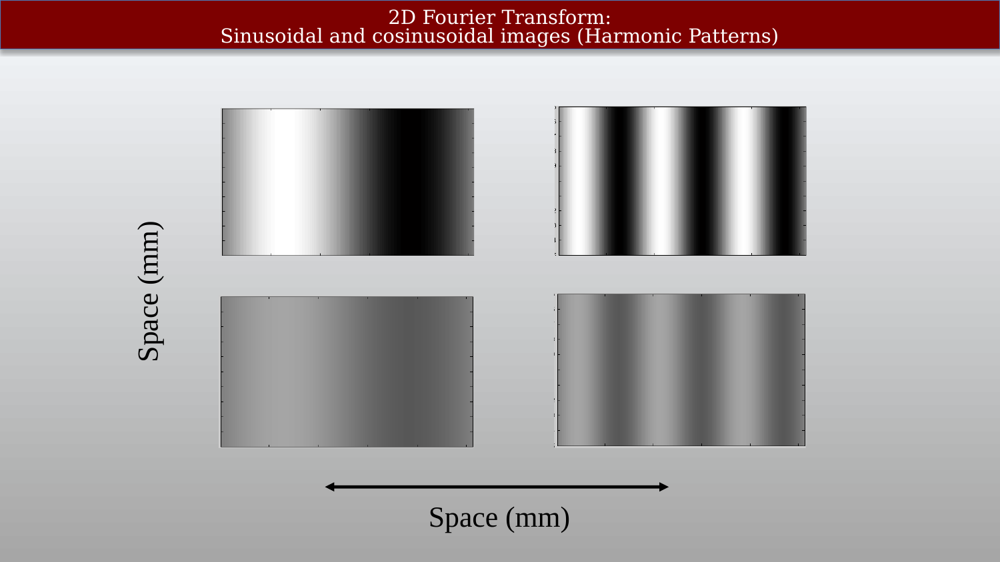{#fig-ch14-2d-fourier-transformsinusoidal-and-cosinusoidal-im}

It was a significant step to extend the basic ideas of the Fourier Transform - which was originally about one-dimensional signals - into the domain of images, which are two-dimensional. This extension happened in several different fields at different times.

::: {.callout-note title="Image contrast"}
There is also one subtlety in moving from abstract functions to images: there are no negative light intensities. Yet, sines and cosine all vary around zero. So what is a harmonic function as an image?  

In some ways this is a small matter, because the solution is easy.  We think of images as varying around a positive mean.  Thus no image is a pure harmonic; it is always a sum of a constant (the mean intensity) plus the variation around the mean.  This is the idea of image contrast (the image value contrasts with the mean value).  

:::

## Harmonics – 1D

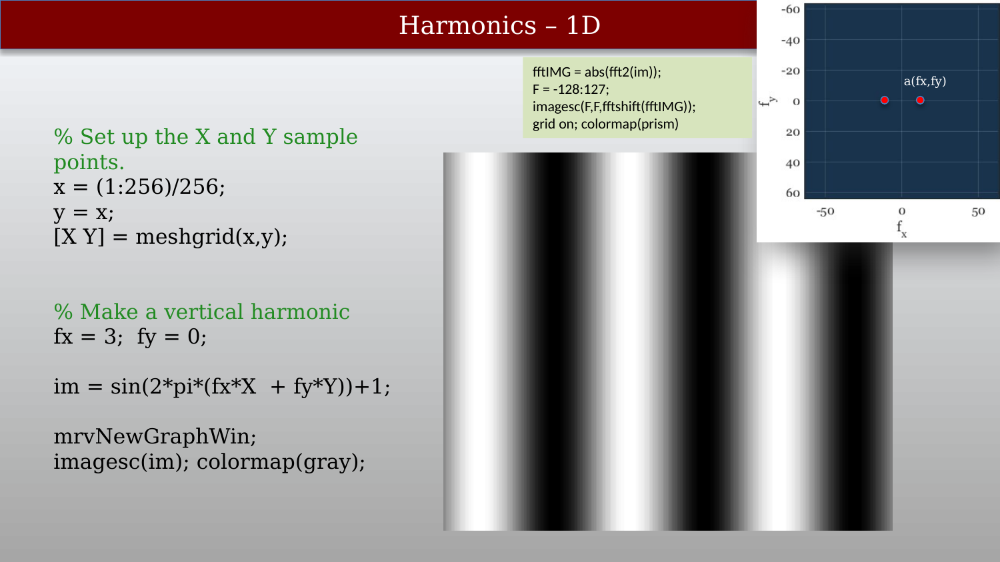{#fig-ch14-harmonics-1d}

## Adding vertical harmonics

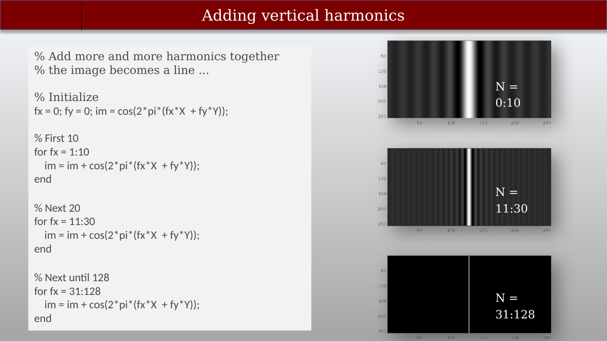{#fig-ch14-adding-vertical-harmonics}

## Harmonics – 2D

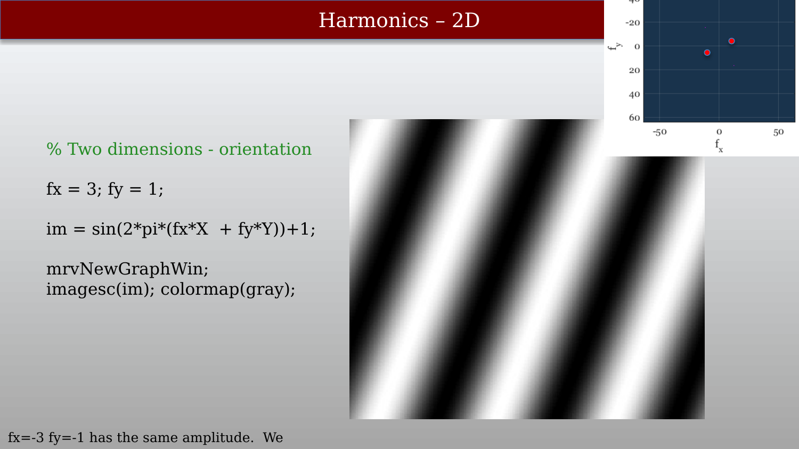{#fig-ch14-harmonics-2d}

## The 2-dimensional Fourier series

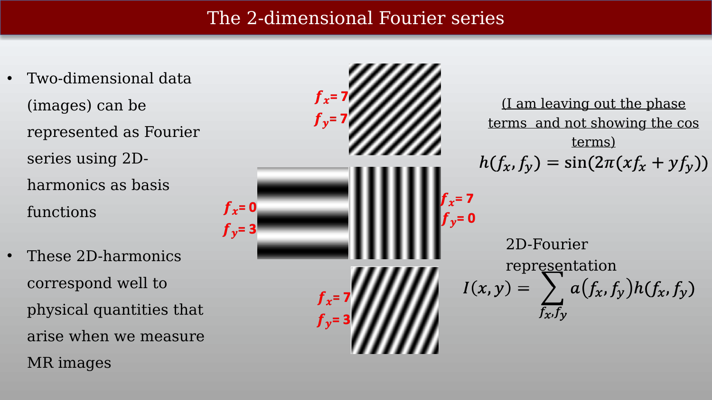{#fig-ch14-the-2-dimensional-fourier-series}

## Summing 2D harmonics to produce an image



This is a nice visualization of how the reconstructed image becomes increasingly similar to the original image as we add in more and more harmonics.

## How different frequencies contribute to an image

## The whole Fourier Transform

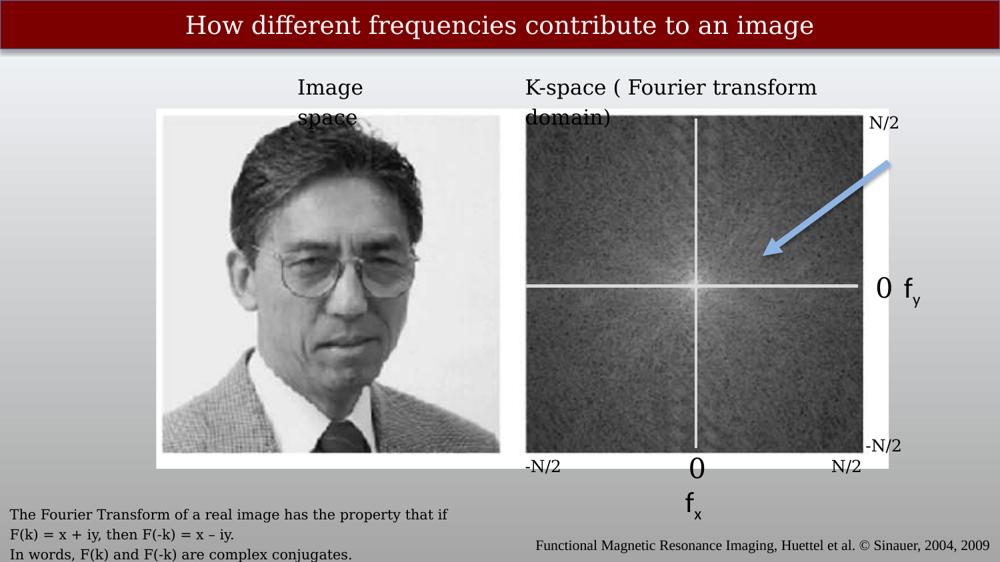{#fig-ch14-how-different-frequencies-contribute-to-an-image-1}

## The region near (0,0)

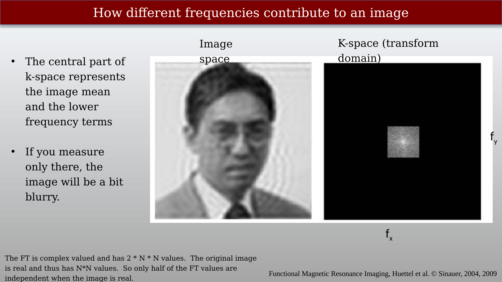{#fig-ch14-how-different-frequencies-contribute-to-an-image-2}

## The region away from (0,0)

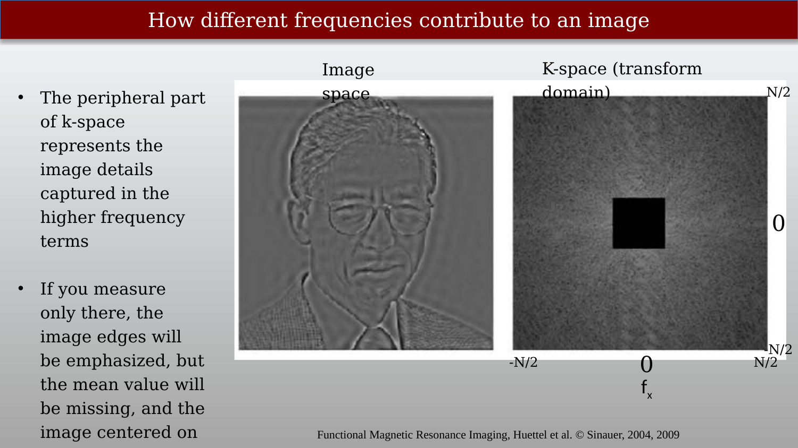{#fig-ch14-how-different-frequencies-contribute-to-an-image-3}

## Sampling the Fourier Spectrum

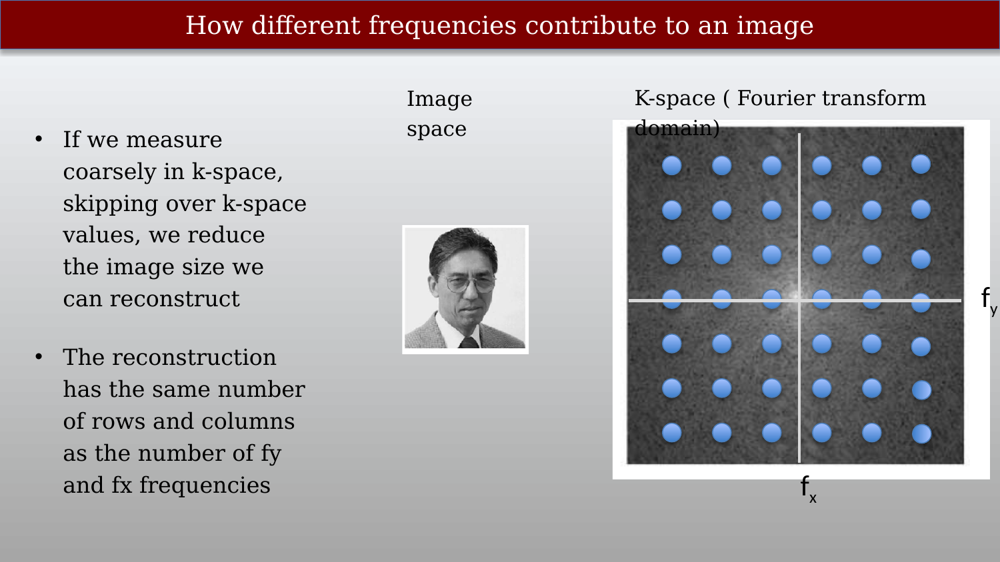{#fig-ch14-how-different-frequencies-contribute-to-an-image-4}

## Calculating the Fourier weights (coefficients)

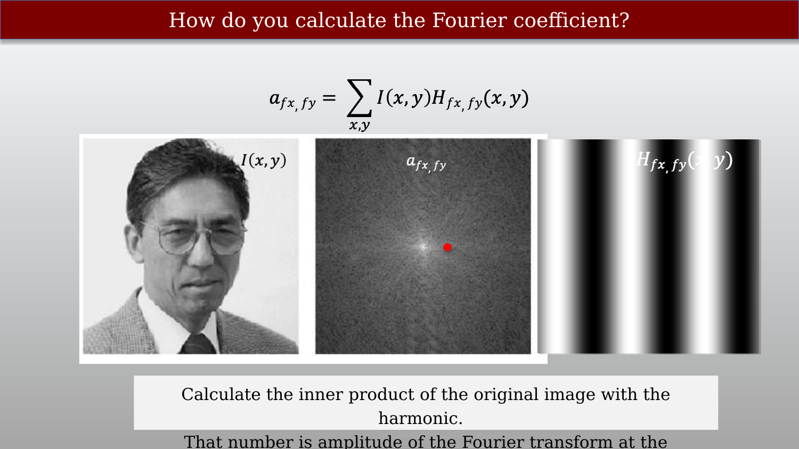{#fig-ch14-how-do-you-calculate-the-fourier-coefficient}

Do we need to explain the inner product around here?

Maybe some more examples, or a video around here.

::: {.callout-note title="Fourier Transform of images"}

| Era / Field | Core Contribution | Key Figures |
| --- | --- | --- |
| **Microscopy & Diffraction** | Physical realization that lenses execute a 2D spatial Fourier transform | Abbe, Zernike, Maréchal |
| **Fourier Optics** | Adapting 1D signal/communications concepts to 2D image signals | O'Neill, Leith, VanderLugt, Goodman |
| **Digital Image Processing** | Developing 2D-separable DFT/FFT algorithms for digital images | Cooley & Tukey, Lohmann, Rosenfeld, Pratt |

:::

## Additional Fourier Series resources

The special role of Fourier Series is described in this [appendix of Foundations of Image Systems Engineering](https://wandell.github.io/FISE-git/chapters/appendix-02-spaceinvariance.html).  



Nobody does it better than 3Blue1Brown.

::: {.callout-note title="2D Fourier Transform and real images"}

These are some notes that I think the students should be able to lookup.
**Note sure where to include this**

In the Fourier Transform representation of a real-valued image, the values of the negative frequencies are related to the values of the positive frequencies in a specific way. This relationship stems from the properties of real-valued functions and the symmetry of the Fourier Transform. 

1. **Real-valued images and conjugate symmetry:** A real-valued image means that its intensity values are real numbers, not complex numbers. This property translates to a specific behavior in the Fourier domain: conjugate symmetry.Conjugate symmetry implies that for every complex number F(k) corresponding to a positive frequency k in the Fourier Transform, the complex conjugate F(-k) will be the corresponding value at the negative frequency -k. In other words:Re[F(k)] = Re[F(-k)]Im[F(k)] = -Im[F(-k)]where Re() and Im() represent the real and imaginary parts of a complex number, respectively. 
2. **Implications for intensity values:** Since the absolute value of a complex number represents its magnitude, we can infer from the conjugate symmetry that:|F(k)| = |F(-k)|This means that the magnitude (absolute value) of a frequency component in the Fourier Transform is the same at both the positive and negative frequencies.However, the phase of the complex numbers will be different for positive and negative frequencies due to the sign difference in the imaginary part. This difference in phase doesn't affect the intensity of the image information and can often be ignored in image analysis.
3. **Practical observations:**In real-world images, some components might not perfectly exhibit perfect conjugate symmetry due to noise or imperfect data acquisition. However, the general principle of matching magnitudes between positive and negative frequencies holds true in most cases.To summarize:In a real-valued image, the magnitude of a frequency component in the Fourier Transform is the same at both the positive and negative frequencies.The phase of these components will be different, but this difference doesn't affect the intensity information in the image.Understanding this relationship can be helpful when interpreting and analyzing MRI images in the Fourier domain.I hope this explanation clarifies the connection between positive and negative frequencies in the Fourier Transform of a real-valued image! Feel free to ask if you have any further questions about this or other aspects of MRI image formation.
:::
