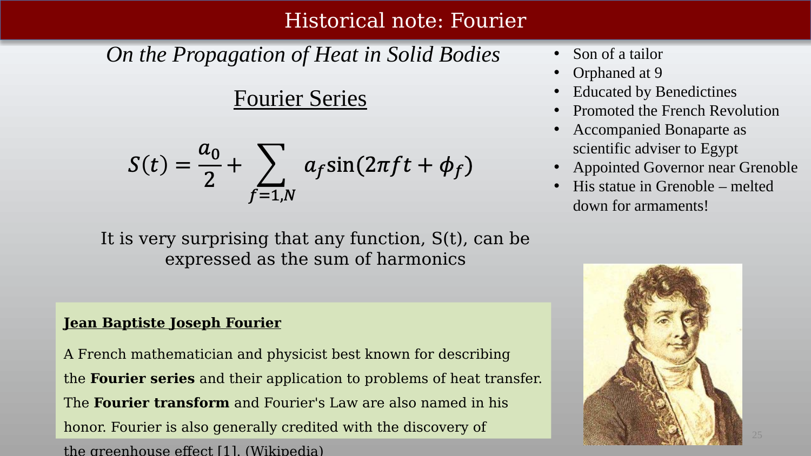
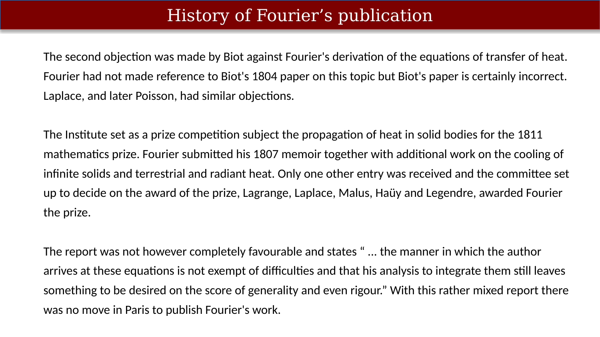
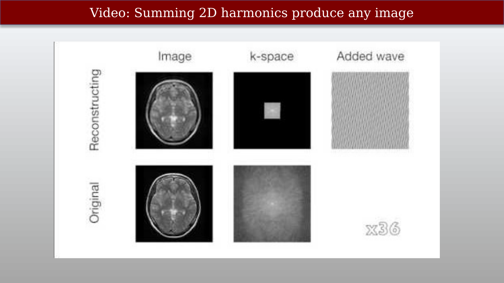

# Linear Models and the Fourier Series



---

## Linear models and the Fourier Series (k-space)

{#fig-ch14-linear-models-and-the-fourier-series-k-space}

Linear models are extremely important in science and engineering.  The Fourier series is a specific example of a linear model, perhaps the most important one, where the basis functions are harmonics (sin and cos).  In this chapter we will explore the Fourier series as a linear model, and how it relates to k-space in MRI.

A simple mathematical description of general linear models can be found in an [appendix of Foundations of Image Systems Engineering](https://wandell.github.io/FISE-git/chapters/appendix-01-linearsystems.html).  

## Linear models are important in science and engineering

{#fig-ch14-linear-models-are-important-in-science-and-enginee}

A linear model is a linear combination of basis functions.  The signal is expressed as the weighted sum of other functions that look just like the signal.  We call these the basis functions $B_i$. 

Different weights are used to describe different signals, but the basis functions remain the same. 

Linear models are important because they are simple to understand and interpret, and they can often provide a good approximation to more complex relationships between variables.

In the example shown here the signal is exactly predicted as the weighted sum of basis functions.  In general, though we may choose a set of basis functions that approximates the signal

$S(t) \approx \sum_{i=1}^{k=N} a_i B_i(t)$

## The Fourier series is a linear model – the basis functions are harmonics

{#fig-ch14-the-fourier-series-is-a-linear-model-the-basis-fun}

THe special role of Fourier Series is described in this [appendix of Foundations of Image Systems Engineering](https://wandell.github.io/FISE-git/chapters/appendix-02-spaceinvariance.html).  

## The Fourier series is a linear model

{#fig-ch14-the-fourier-series-is-a-linear-model}

Why the Fourier  series were important (**From wikipedia **):

"There were three important contributions in this work, one purely mathematical, two essentially physical. In mathematics, Fourier claimed that any function of a variable, whether continuous or discontinuous, can be expanded in a series of sines of multiples of the variable. Though this result is not correct without additional conditions, Fourier's observation that some discontinuous functions are the sum of infinite series was a breakthrough. The question of determining when a Fourier series converges has been fundamental for centuries. Joseph-Louis Lagrange had given particular cases of this (false) theorem, and had implied that the method was general, but he had not pursued the subject. Peter Gustav Lejeune Dirichlet was the first to give a satisfactory demonstration of it with some restrictive conditions. This work provides the foundation for what is today known as the Fourier transform."
[Other material in the following is from](https://mathshistory.st-andrews.ac.uk/Biographies/Fourier/)

## The harmonic basis functions (sin and cos)

{#fig-ch14-the-harmonic-basis-functions-sin-and-cos}

Sines and cosines are the harmonmic functions

## Linear models:  Matrix tableau representation

{#fig-ch14-linear-models-matrix-tableau-representation}

Matrices are a a clear way to visualize and think about linear models.

## Estimating the weights from the signal

{#fig-ch14-estimating-the-weights-from-the-signal}

Teachmri:  harmonicsFFTandImages29

## History of Fourier’s publication

::: {.panel-tabset}

## About Fourier himself

{#fig-ch14-historical-note-fourier}

## Early history

{#fig-ch14-history-of-fouriers-publication-1}

## French academy

{#fig-ch14-history-of-fouriers-publication-2}

:::

## 2D Fourier Transform:Sinusoidal and cosinusoidal images (Harmonic Patterns)

{#fig-ch14-2d-fourier-transformsinusoidal-and-cosinusoidal-im}

We are used to thinking of sines and cosines as functions.  It is also possible to represent them as images, with the requirement that the image mean value is a positive number.  In that case the sines and cosines remain positive, a requirement to be an image.

<!--
**Note sure where to include this**

In the Fourier Transform representation of a real-valued image, the values of the negative frequencies are related to the values of the positive frequencies in a specific way. This relationship stems from the properties of real-valued functions and the symmetry of the Fourier Transform. Here's how it works:1. Real-valued images and conjugate symmetry:A real-valued image means that its intensity values are real numbers, not complex numbers. This property translates to a specific behavior in the Fourier domain: conjugate symmetry.Conjugate symmetry implies that for every complex number F(k) corresponding to a positive frequency k in the Fourier Transform, the complex conjugate F(-k) will be the corresponding value at the negative frequency -k. In other words:Re[F(k)] = Re[F(-k)]Im[F(k)] = -Im[F(-k)]where Re() and Im() represent the real and imaginary parts of a complex number, respectively.2. Implications for intensity values:Since the absolute value of a complex number represents its magnitude, we can infer from the conjugate symmetry that:|F(k)| = |F(-k)|This means that the magnitude (absolute value) of a frequency component in the Fourier Transform is the same at both the positive and negative frequencies.However, the phase of the complex numbers will be different for positive and negative frequencies due to the sign difference in the imaginary part. This difference in phase doesn't affect the intensity of the image information and can often be ignored in image analysis.3. Practical observations:In real-world images, some components might not perfectly exhibit perfect conjugate symmetry due to noise or imperfect data acquisition. However, the general principle of matching magnitudes between positive and negative frequencies holds true in most cases.To summarize:In a real-valued image, the magnitude of a frequency component in the Fourier Transform is the same at both the positive and negative frequencies.The phase of these components will be different, but this difference doesn't affect the intensity information in the image.Understanding this relationship can be helpful when interpreting and analyzing MRI images in the Fourier domain.I hope this explanation clarifies the connection between positive and negative frequencies in the Fourier Transform of a real-valued image! Feel free to ask if you have any further questions about this or other aspects of MRI image formation.
-->

## Harmonics – 1D

{#fig-ch14-harmonics-1d}

## Adding vertical harmonics

{#fig-ch14-adding-vertical-harmonics}

## Harmonics – 2D

{#fig-ch14-harmonics-2d}

## The 2-dimensional Fourier series

{#fig-ch14-the-2-dimensional-fourier-series}

## Video: Summing 2D harmonics produce any image

{#fig-ch14-video-summing-2d-harmonics-produce-any-image}

## How different frequencies contribute to an image

::: {.panel-tabset}

## The whole Fourier Transform

{#fig-ch14-how-different-frequencies-contribute-to-an-image-1}

## The region near (0,0)

{#fig-ch14-how-different-frequencies-contribute-to-an-image-2}

## The region away from (0,0)

{#fig-ch14-how-different-frequencies-contribute-to-an-image-3}

## Sampling the Fourier Spectrum

{#fig-ch14-how-different-frequencies-contribute-to-an-image-4}

:::

## Calculating the Fourier weights (coefficients)

{#fig-ch14-how-do-you-calculate-the-fourier-coefficient}

We need to explain the inner product around here.

Maybe some more examples, or a video around here.

