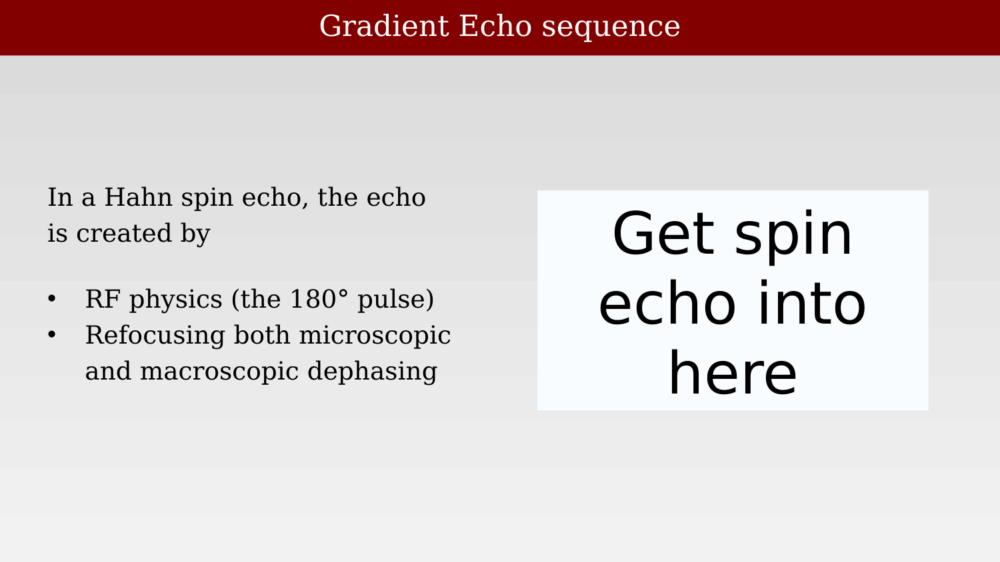
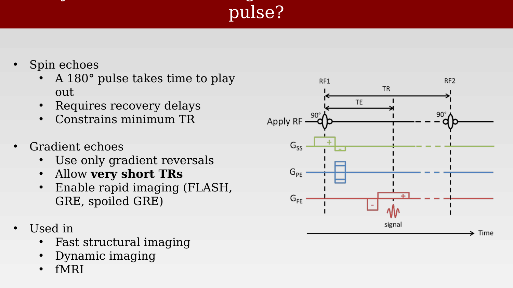
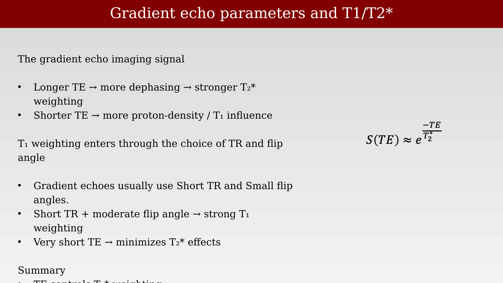
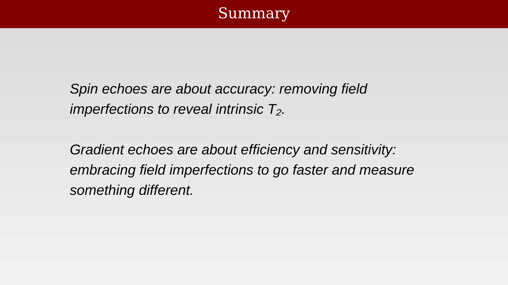

# Slice Selection and Gradient Echo Sequences



---

## Image formation: Slice selection

{#fig-ch15-image-formation-slice-selection}

## A gradient sets Larmor frequency for a slice

{#fig-ch15-a-gradient-sets-larmor-frequency-for-a-slice}

## A pulse sequence for slice selection

{#fig-ch15-a-pulse-sequence-for-slice-selection}

## Slice selection

{#fig-ch15-slice-selection}

## Slice selection pulses:  how wide will the slice be?

{#fig-ch15-slice-selection-pulses-how-wide-will-the-slice-be}

## Slice thickness and location depend on the gradient and the pulse

{#fig-ch15-slice-thickness-and-location-depend-on-the-gradien}

## The RF pulse can change slice thickness and location

{#fig-ch15-the-rf-pulse-can-change-slice-thickness-and-locati}

## Gradient echo sequences

### Gradient Echo sequence

{#fig-ch15-gradient-echo-sequence}

### Gradient echo sequence (move to previous section next year)

{#fig-ch15-gradient-echo-sequence-move-to-previous-section-ne}

### Why create echoes with gradients instead of a 180° pulse?

{#fig-ch15-why-create-echoes-with-gradients-instead-of-a-180}

### Gradient echo parameters and T1/T2*

{#fig-ch15-gradient-echo-parameters-and-t1t2}

### Summary

{#fig-ch15-summary}
