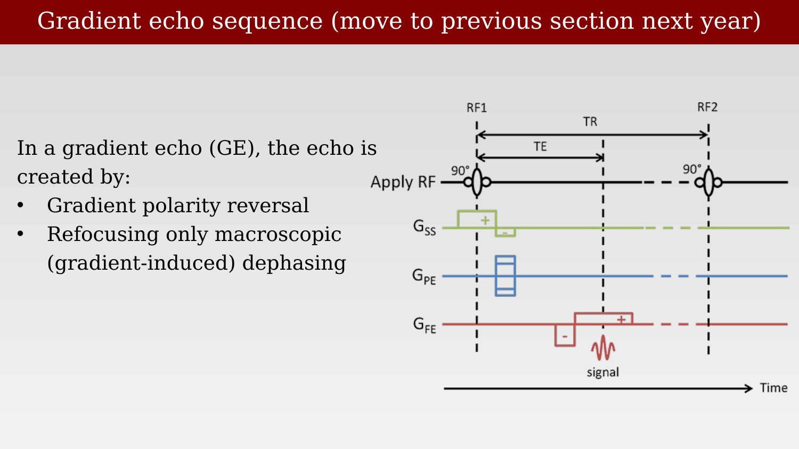

# Gradient Echo Sequences



---

## Gradient Echo sequence

{#fig-ch16-gradient-echo-sequence}

## Gradient echo sequence (move to previous section next year)

{#fig-ch16-gradient-echo-sequence-move-to-previous-section-ne}

## Why create echoes with gradients instead of a 180° pulse?

{#fig-ch16-why-create-echoes-with-gradients-instead-of-a-180}

## Gradient echo parameters and T1/T2*

{#fig-ch16-gradient-echo-parameters-and-t1t2}

## Summary

{#fig-ch16-summary}
