# Imaging Within the Slice



---

## Image formation: Imaging within the slice

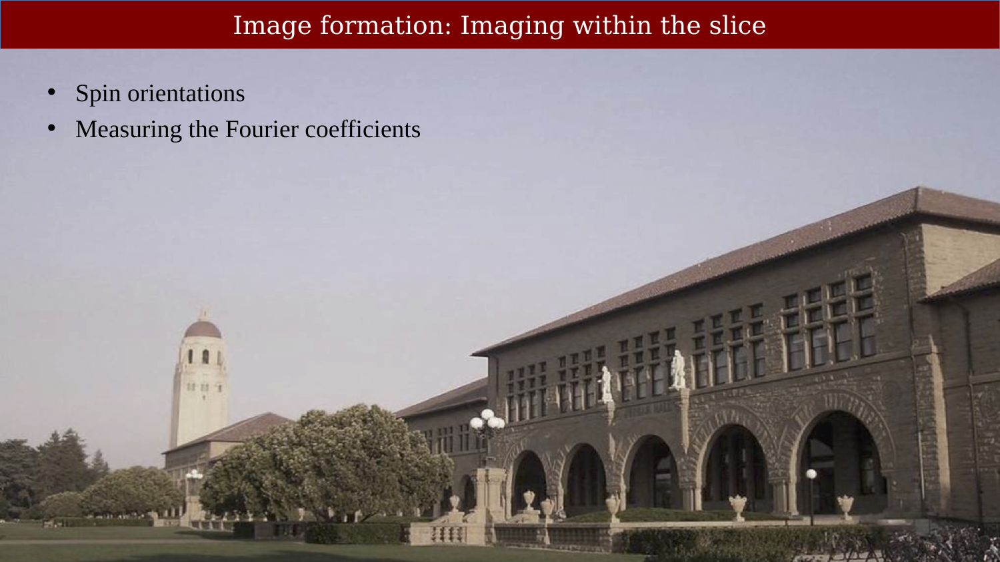{#fig-ch17-image-formation-imaging-within-the-slice}

## Transverse relaxation:  As the spins rotate their impact on the coil varies

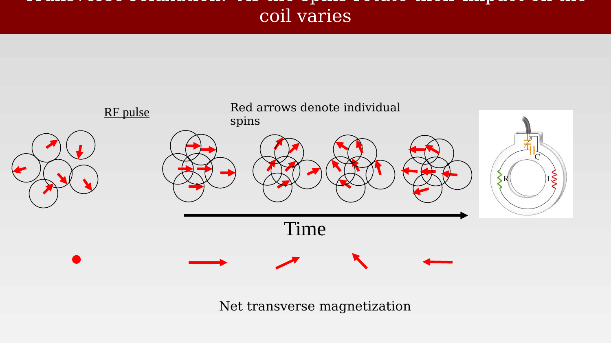{#fig-ch17-transverse-relaxation-as-the-spins-rotate-their-im}

## K-space

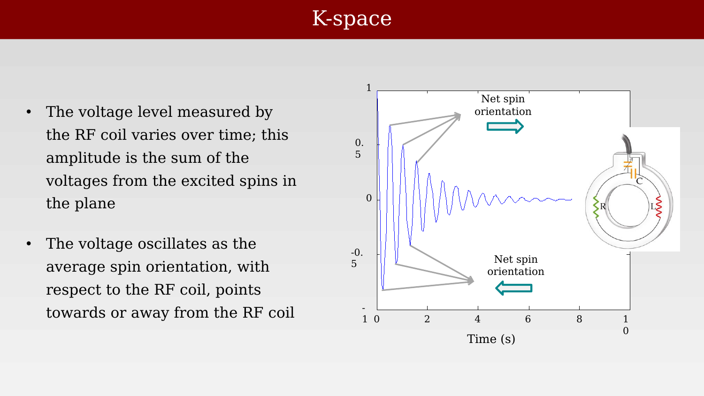{#fig-ch17-k-space}

## Gradients control spin orientations across space

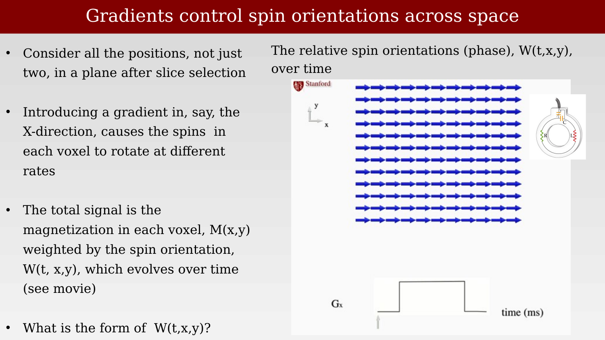{#fig-ch17-gradients-control-spin-orientations-across-space}

## Initial insight: Magnetic gradients produce different temporal signals

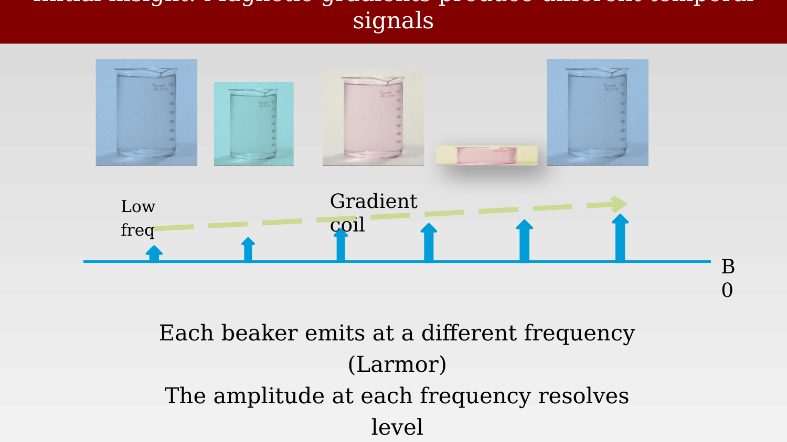{#fig-ch17-initial-insight-magnetic-gradients-produce-differe}

## New insight: Spatial gradients produce different spatial weightings

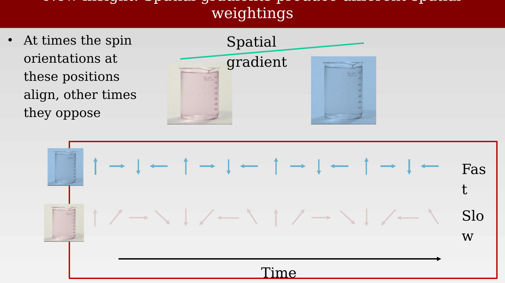{#fig-ch17-new-insight-spatial-gradients-produce-different-sp}

## The pendula are swinging at a range of temporal frequencies

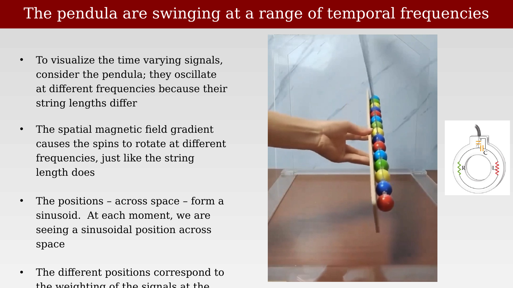{#fig-ch17-the-pendula-are-swinging-at-a-range-of-temporal-fr}

## Gradients control spin orientations across space

{#fig-ch17-gradients-control-spin-orientations-across-space}

## The spatial weighting:  First moment in time

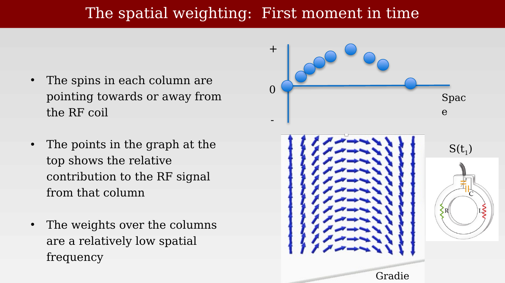{#fig-ch17-the-spatial-weighting-first-moment-in-time}

## Second moment in time

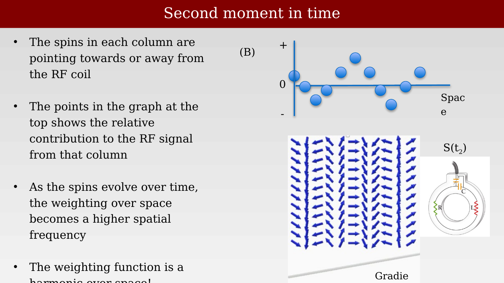{#fig-ch17-second-moment-in-time}

Figure 7.19 k-space path for a pair of frequency- and phase-encode gradients, showing echo formation. Following the RF pulse, and before the gradients are applied, the signal is at the centre of k-space. This means that it represents the total image brightness irrespective of spatial localization.37

## The spatial weighting at two moments in time

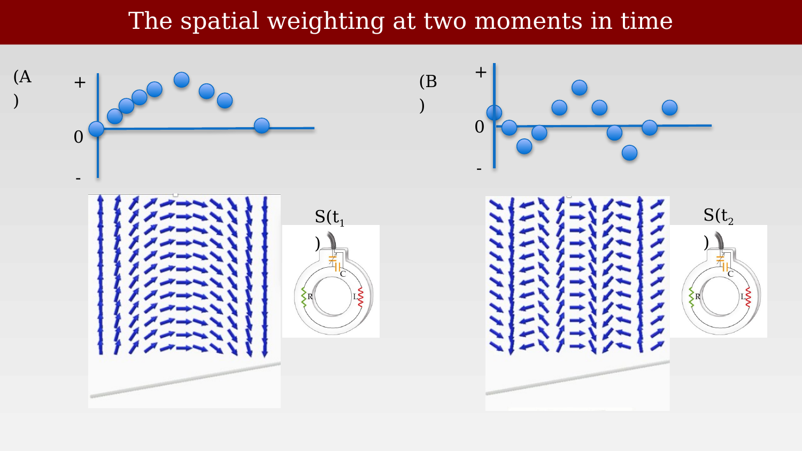{#fig-ch17-the-spatial-weighting-at-two-moments-in-time}

Figure 7.19 k-space path for a pair of frequency- and phase-encode gradients, showing echo formation. Following the RF pulse, and before the gradients are applied, the signal is at the centre of k-space. This means that it represents the total image brightness irrespective of spatial localization.38

## Fourier encoding:  the magnetization is weighted by different spatial harmonics

::: {.panel-tabset}

## Step 1

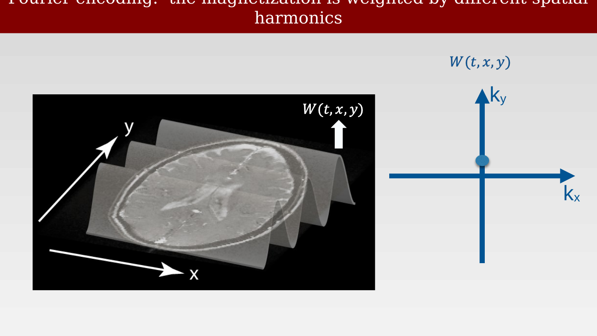{#fig-ch17-fourier-encoding-the-magnetization-is-weighted-by-1}

## Step 2

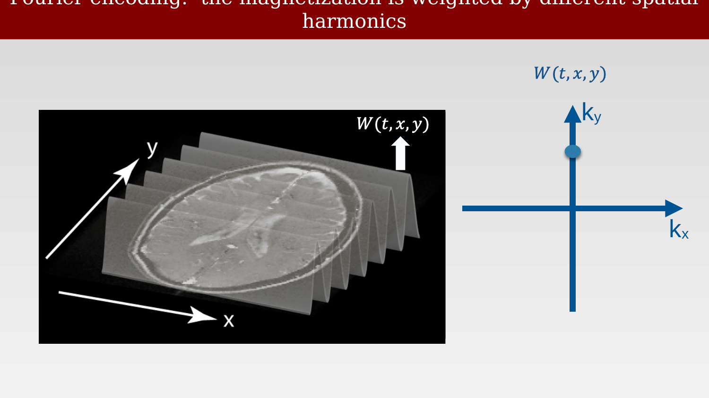{#fig-ch17-fourier-encoding-the-magnetization-is-weighted-by-2}

## Step 3

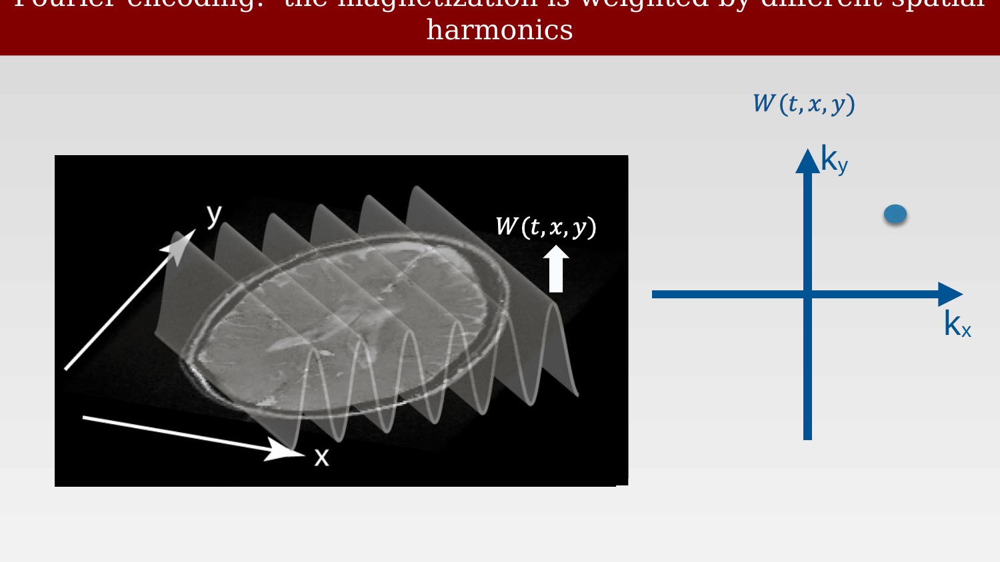{#fig-ch17-fourier-encoding-the-magnetization-is-weighted-by-3}

:::

A very brief history of spiral MRI (with the Stanford thread)Origins (late 1980s–early 1990s).Spiral k-space acquisition was developed as an alternative to Cartesian phase encoding to improve speed and efficiency. The modern, practical form is strongly associated with work at Stanford by Douglas C. Noll, Dwight G. Nishimura, and John M. Pauly, with foundational contributions from Craig B. Meyer. Their papers formalized spiral-in/out trajectories, gradient design, and reconstruction methods that made spirals feasible on clinical hardware.Why it mattered.Spirals sample k-space continuously from the center outward (or vice versa), yielding:High acquisition efficiency (more signal per unit time than Cartesian).Short echo times (TE), beneficial for T2*-weighted contrast and reduced susceptibility dropout.Motion robustness due to rapid coverage of low spatial frequencies.These features made spirals attractive for fast imaging and fMRI, and they remain influential in non-Cartesian MRI research.Why spirals never became dominant clinically.Despite their elegance, several practical issues limited widespread adoption:Off-resonance sensitivity (B₀ inhomogeneity causes blurring), especially problematic outside the brain.Demanding reconstruction, requiring accurate field maps and non-uniform FFTs—historically expensive and fragile.Hardware constraints, as long, rapidly changing graslew-rate limits and exacerbate imperfections.Operational inertia, with Cartesian EPI being simpler, standardized, and “good enough” for many applications.Bottom line.Spiral MRI is a Stanford-born idea that delivered genuine theoretical and practical advantages. Its limited clinical uptake reflects engineering trade-offs and workflow realities rather than a lack of merit. With modern gradients and computation, spirals continue to resurface in specialized and high-performance applications—but Cartesian methods remain the default.44

## Effects of magnetic field gradients on spin phase

::: {.panel-tabset}

## Step 1

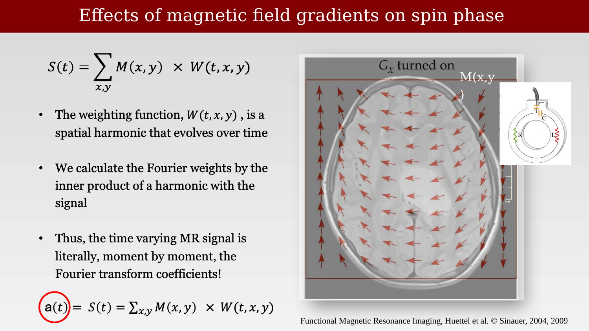{#fig-ch17-effects-of-magnetic-field-gradients-on-spin-phase-1}

## Step 2

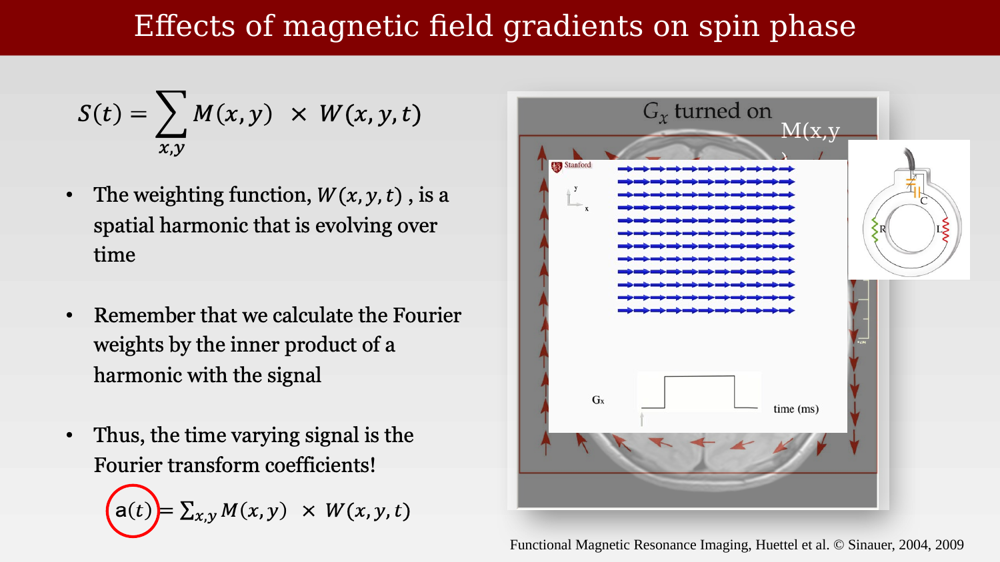{#fig-ch17-effects-of-magnetic-field-gradients-on-spin-phase-2}

:::

I might say the problem is that the sample points do not fall on a grid, and regridding can introduce errors. Most importantly, any B0 inhomogeneities mean we don't know the true k-space position of the sample values. For Cartesian, this is a problem, too. But it is somewhat worse of a problem - just numerically - for spiral. Do you agree?46

## Summary: Effects of magnetic field gradients on spin phase

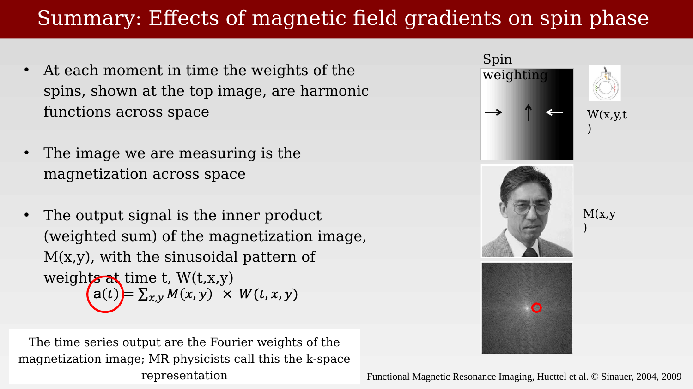{#fig-ch17-summary-effects-of-magnetic-field-gradients-on-spi}

## T1, T2, Blood oxygen

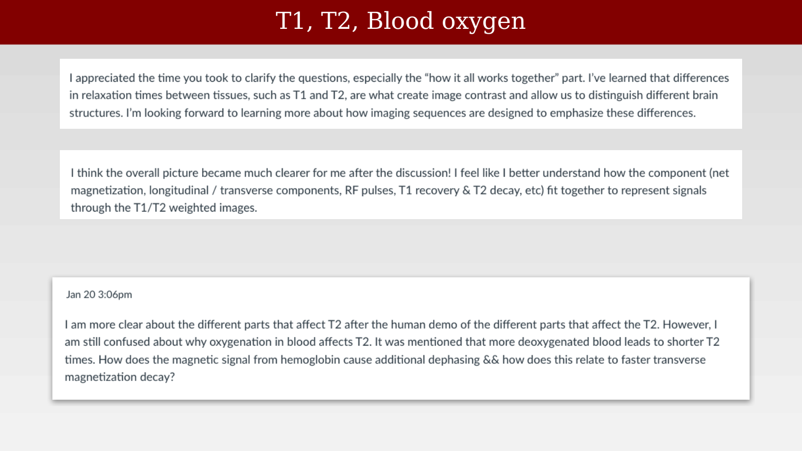{#fig-ch17-t1-t2-blood-oxygen}
