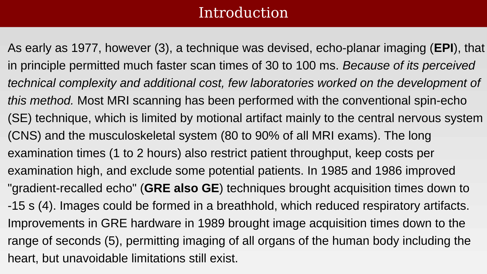
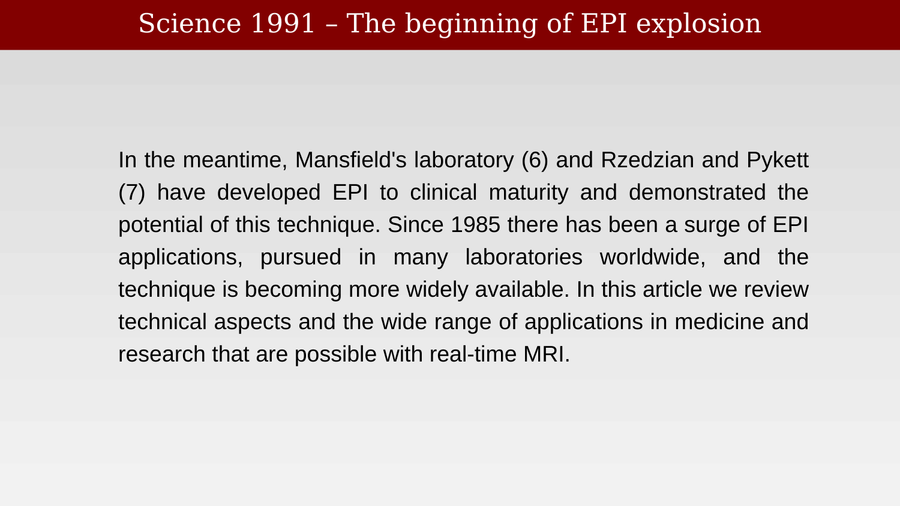

# K-Space Traversal and Echo Planar Imaging



---

## Using the gradients to traverse K-space

{#fig-ch18-using-the-gradients-to-traverse-k-space}

## The frequency of the pattern of weights at a moment t defines the K-space frequency

{#fig-ch18-the-frequency-of-the-pattern-of-weights-at-a-momen}

A,1,4,6,721:96,23:138

## Gradients, k-space, etch-a-sketch

{#fig-ch18-gradients-k-space-etch-a-sketch}

## As the RF signal is measured, we estimate the image harmonics

{#fig-ch18-as-the-rf-signal-is-measured-we-estimate-the-image}

## Example: reading two lines in k-space

::: {.panel-tabset}

## Step 1

{#fig-ch18-example-reading-two-lines-in-k-space-1}

## Step 2

{#fig-ch18-example-reading-two-lines-in-k-space-2}

:::

## Echo Planar Imaging - Mansfeld

{#fig-ch18-echo-planar-imaging-mansfeld}

FIGURE 1. A, Conventional acquisition of fully sampled kspace, resulting in a full FOV image after Fourier transformation.B, Undersampled acquisition (R = 2), resulting in a reduced FOV (FOV/2) with aliasing artifacts. Solid lines indicateacquired k-space lines, dashed lines indicate nonacquired kspace lines.59

## Introduction

{#fig-ch18-introduction}

The coil image at a position u is a combination of the coil sensitivity, Sij, and the brain substrate points, pj.61

## Science 1991 – The beginning of EPI explosion

{#fig-ch18-science-1991-the-beginning-of-epi-explosion}

Notice that we have more coil measurements, I, than we have unknown substrate values, p.  If we know the coil sensitivities, we can solve this set of linear equations.63

## An EPI pulse sequence (A) and its k-space trajectory (B).

{#fig-ch18-an-epi-pulse-sequence-a-and-its-k-space-trajectory}
