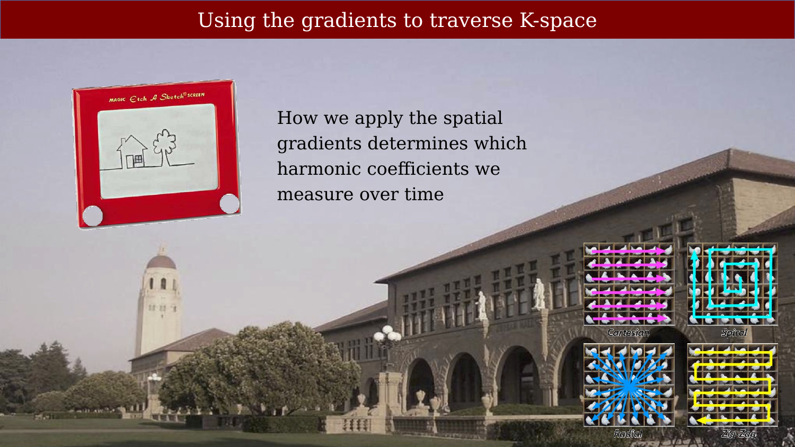
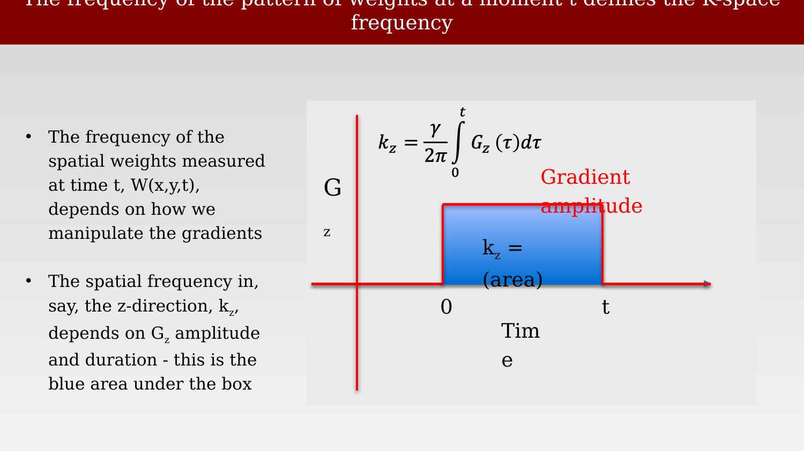
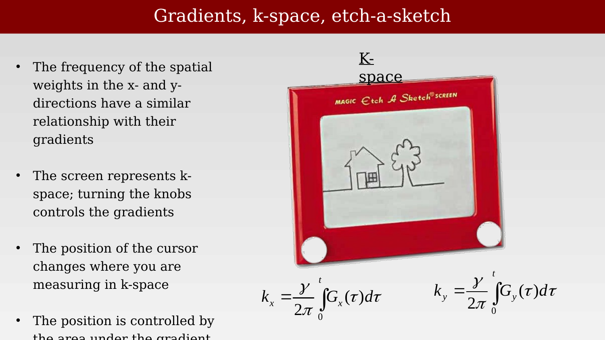
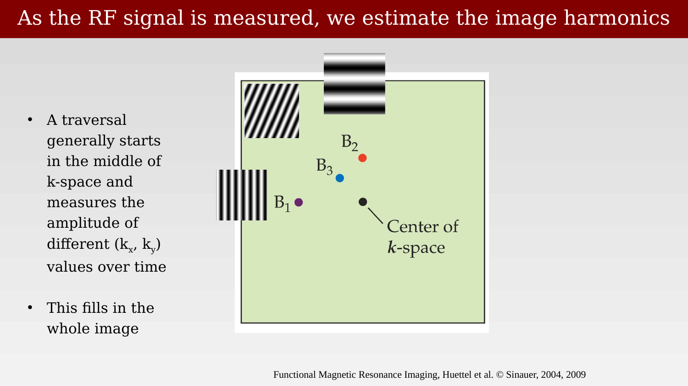
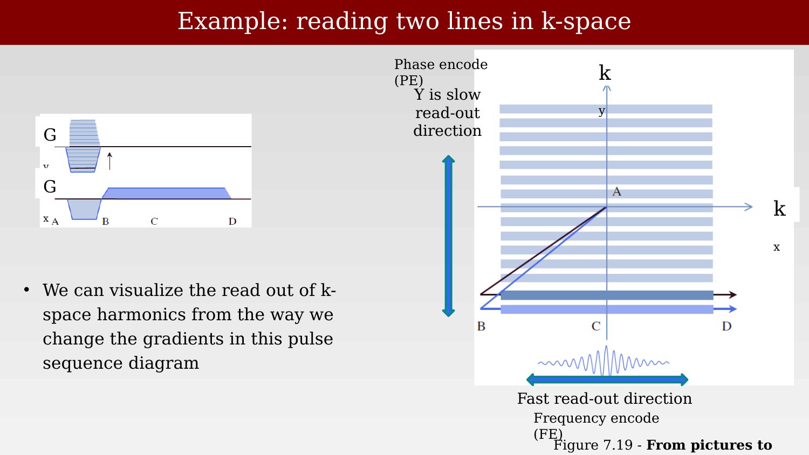
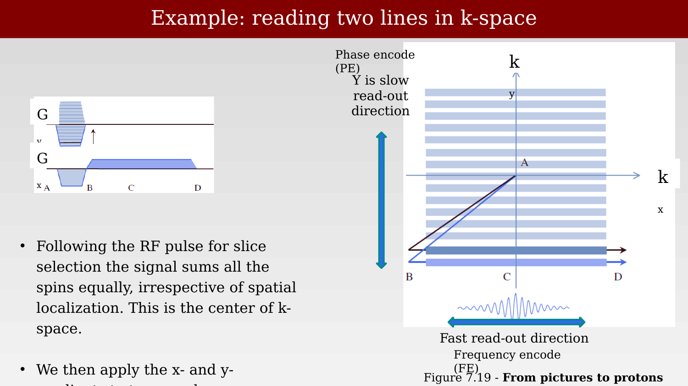
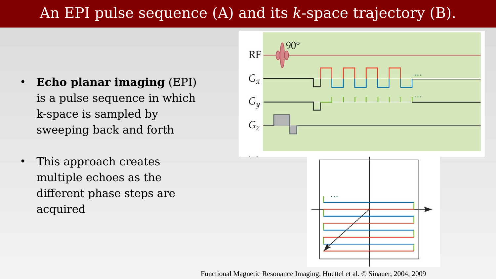

# K-Space and Echo Planar Imaging



---

## Using the gradients to traverse K-space

{#fig-ch18-using-the-gradients-to-traverse-k-space}

## The frequency of the pattern of weights at a moment t defines the K-space frequency

{#fig-ch18-the-frequency-of-the-pattern-of-weights-at-a-momen}

A,1,4,6,721:96,23:138

## Gradients, k-space, etch-a-sketch

{#fig-ch18-gradients-k-space-etch-a-sketch}

## As the RF signal is measured, we estimate the image harmonics

{#fig-ch18-as-the-rf-signal-is-measured-we-estimate-the-image}

## Example: reading two lines in k-space

::: {.panel-tabset}

## Step 1

{#fig-ch18-example-reading-two-lines-in-k-space-1}

## Step 2

{#fig-ch18-example-reading-two-lines-in-k-space-2}

:::

## An EPI pulse sequence (A) and its k-space trajectory (B).

{#fig-ch18-an-epi-pulse-sequence-a-and-its-k-space-trajectory}
