# Image Distortions, Quality, and Parallel Imaging



---

## Image distortions and image quality

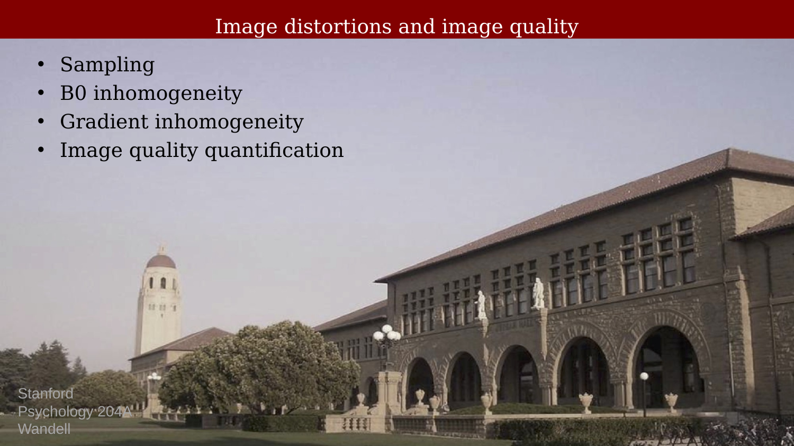{#fig-ch19-image-distortions-and-image-quality}

## Distortions due to magnetic field inhomogeneities.

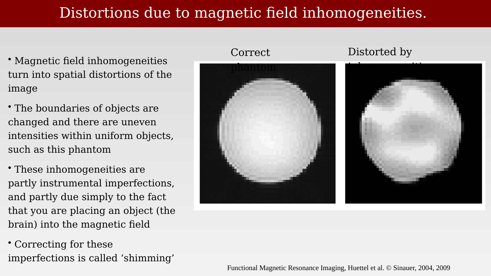{#fig-ch19-distortions-due-to-magnetic-field-inhomogeneities}

## Distortions caused by gradient problems.

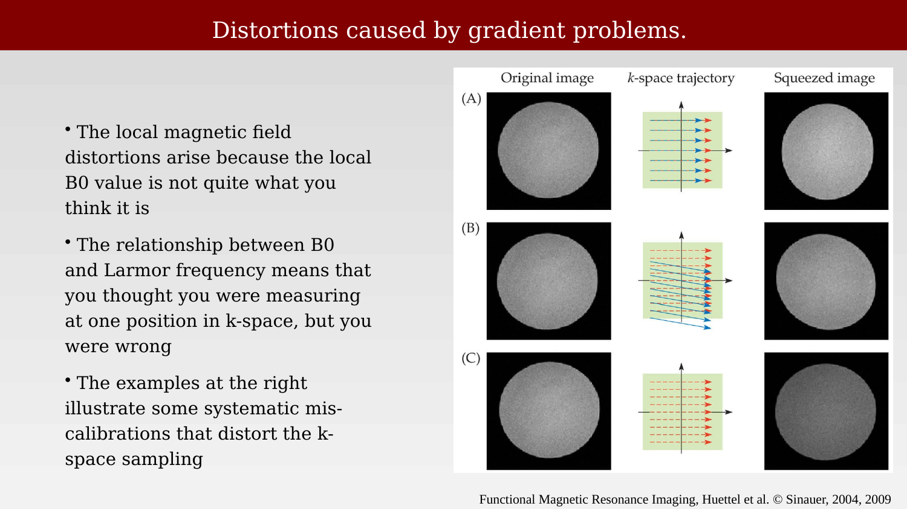{#fig-ch19-distortions-caused-by-gradient-problems}

## Effect of under-sampling:  IMPORTANT FOR PARALLEL IMAGING

::: {.panel-tabset}

## Step 1

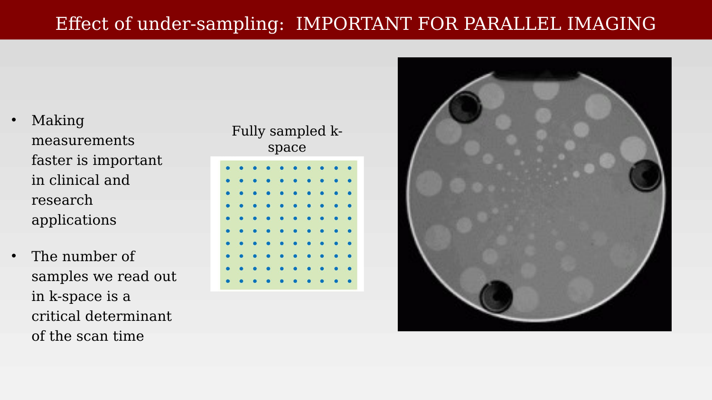{#fig-ch19-effect-of-under-sampling-important-for-parallel-im-1}

## Step 2

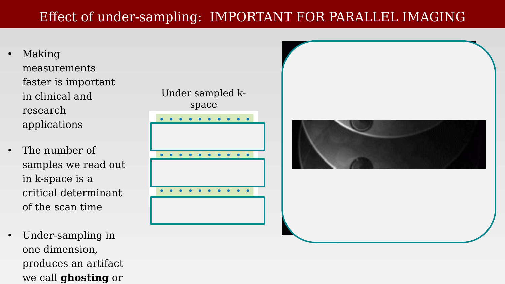{#fig-ch19-effect-of-under-sampling-important-for-parallel-im-2}

:::

## Ghosting is a particularly important imaging artifact

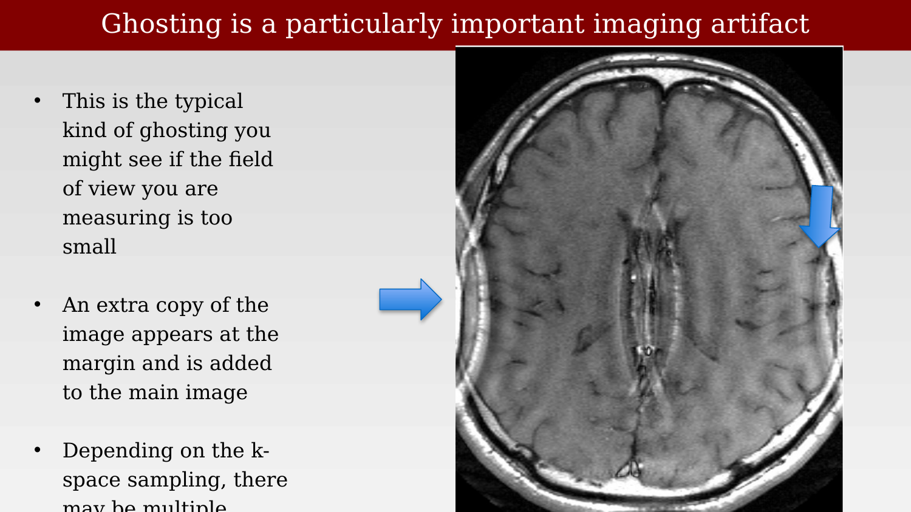{#fig-ch19-ghosting-is-a-particularly-important-imaging-artif}

## Functional imaging: B0 non-uniformity distortion

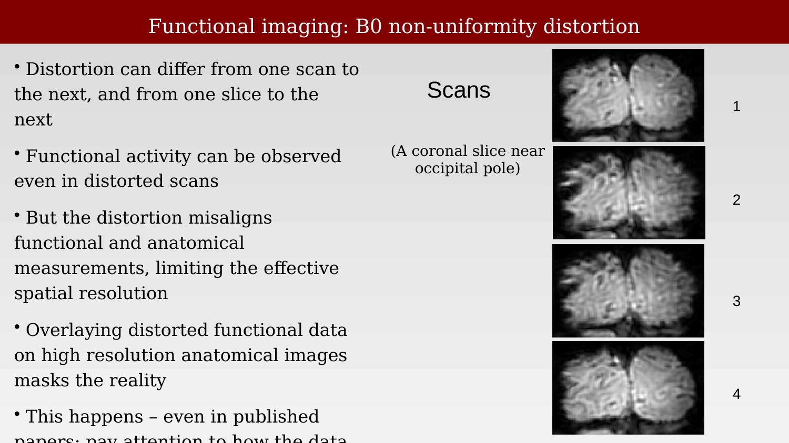{#fig-ch19-functional-imaging-b0-non-uniformity-distortion}

## Parallel imaging

### Multiple read channels:  Parallel imaging

{#fig-ch19-multiple-read-channels-parallel-imaging}

### Parallel magnetic resonance imaging (pMRI) algorithms

{#fig-ch19-parallel-magnetic-resonance-imaging-pmri-algorithm}

### Multiple-coil acquisition principles

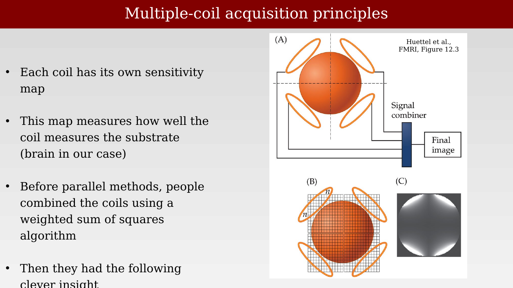{#fig-ch19-multiple-coil-acquisition-principles}

### Effect of under-sampling:  IMPORTANT FOR PARALLEL IMAGING

{#fig-ch19-effect-of-under-sampling-important-for-parallel-im-3}

### Under-sampling in k-space produces overlap (aliasing)

{#fig-ch19-under-sampling-in-k-space-produces-overlap-aliasin}

### Interpreting data from multiple coils (spatial domain)

{#fig-ch19-interpreting-data-from-multiple-coils-spatial-doma}

### Substrate contributions to the aliased coil response

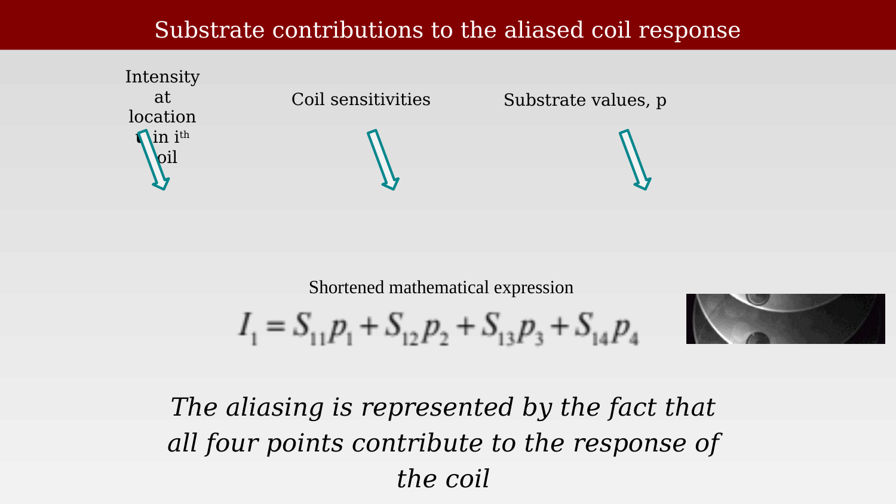{#fig-ch19-substrate-contributions-to-the-aliased-coil-respon}

### The intensity in the coil images

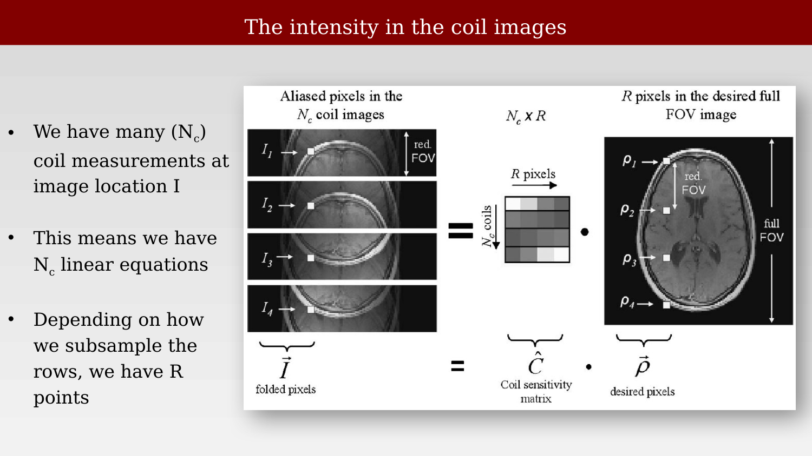{#fig-ch19-the-intensity-in-the-coil-images}

### Multiple coils means multiple, similar linear equations from those points

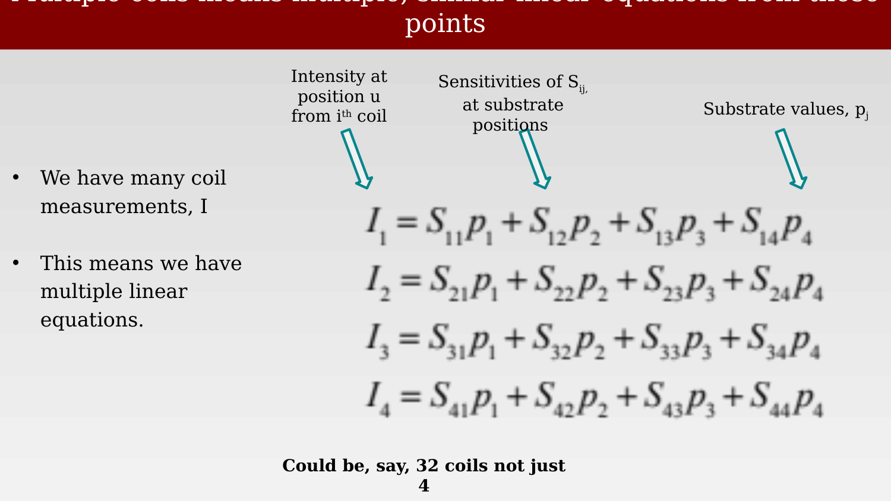{#fig-ch19-multiple-coils-means-multiple-similar-linear-equat}

### Matrix notation expressing the ideas

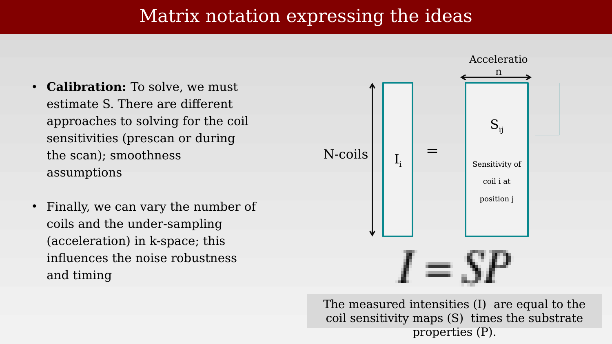{#fig-ch19-matrix-notation-expressing-the-ideas}

### Parallel imaging can achieve high resolution

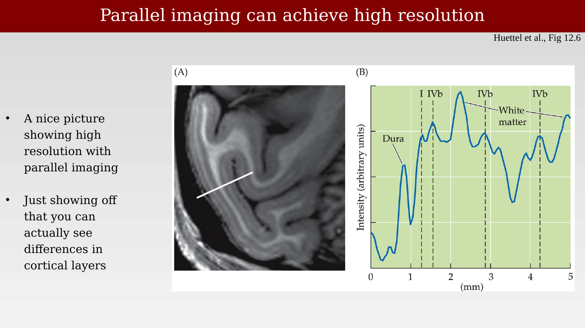{#fig-ch19-parallel-imaging-can-achieve-high-resolution}

### Parallel magnetic resonance imaging (pMRI) reconstruction algorithms

{#fig-ch19-parallel-magnetic-resonance-imaging-pmri-reconstru}

### Corporate names for different methods

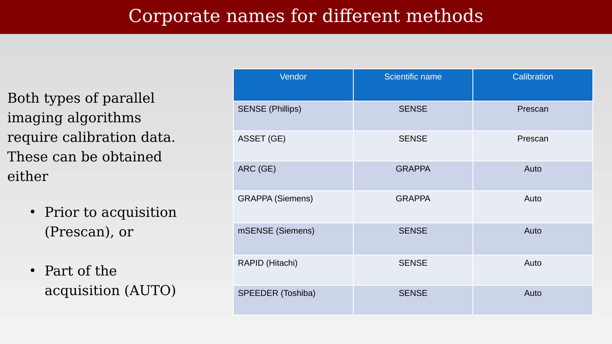{#fig-ch19-corporate-names-for-different-methods}
