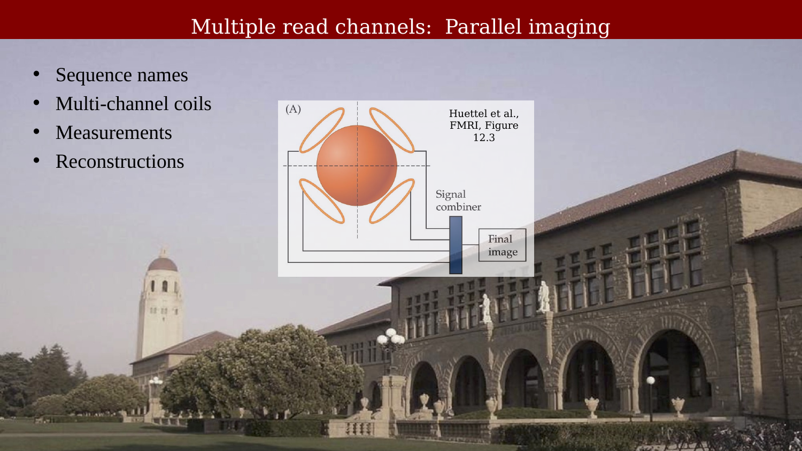
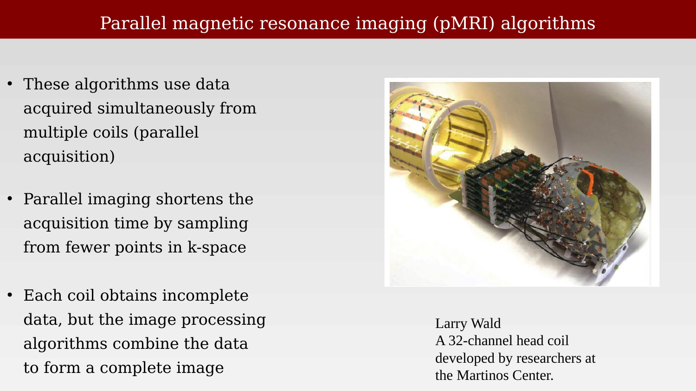
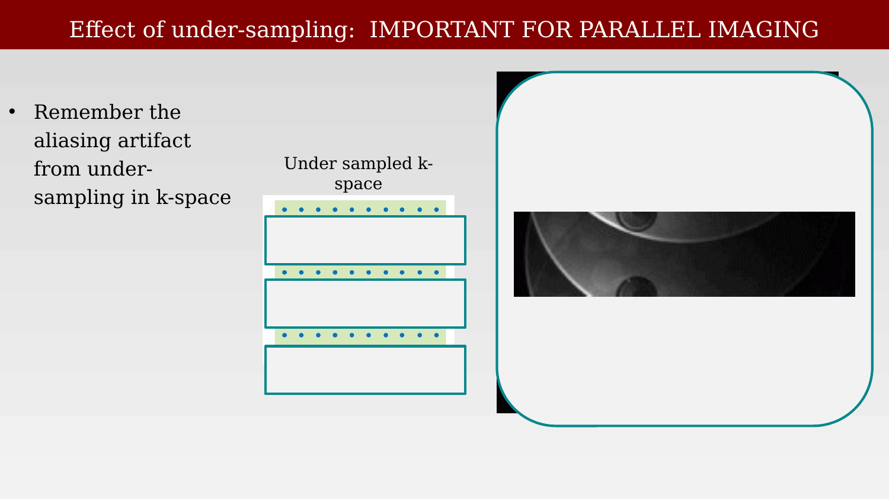
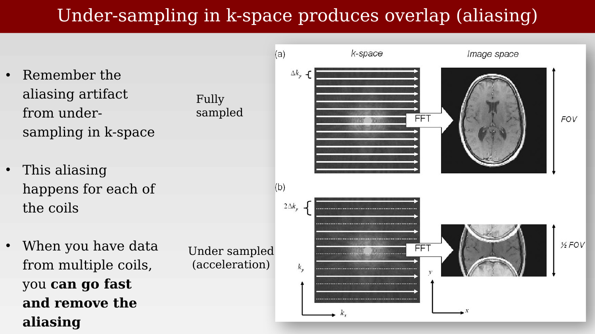
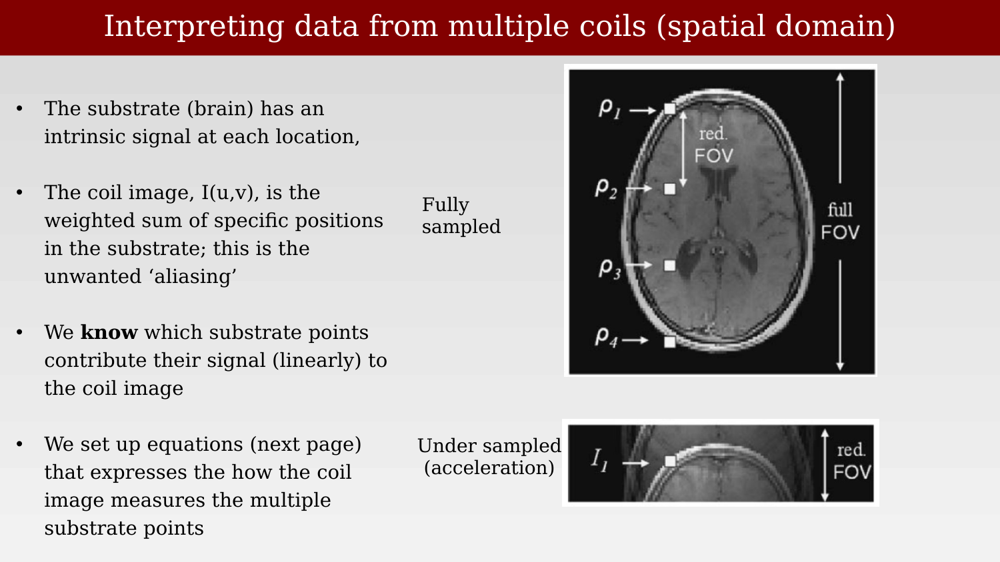
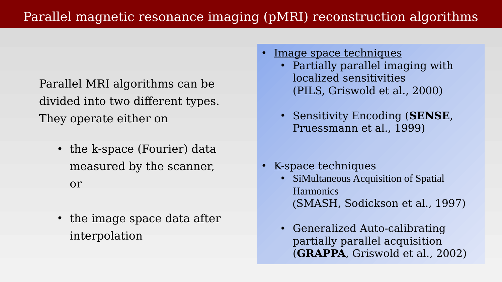

# Parallel Imaging



---

## Multiple read channels:  Parallel imaging

{#fig-ch20-multiple-read-channels-parallel-imaging}

## Parallel magnetic resonance imaging (pMRI) algorithms

{#fig-ch20-parallel-magnetic-resonance-imaging-pmri-algorithm}

## Multiple-coil acquisition principles

{#fig-ch20-multiple-coil-acquisition-principles}

## Effect of under-sampling:  IMPORTANT FOR PARALLEL IMAGING

{#fig-ch20-effect-of-under-sampling-important-for-parallel-im-1}

## Under-sampling in k-space produces overlap (aliasing)

{#fig-ch20-under-sampling-in-k-space-produces-overlap-aliasin}

## Interpreting data from multiple coils (spatial domain)

{#fig-ch20-interpreting-data-from-multiple-coils-spatial-doma}

## Substrate contributions to the aliased coil response

{#fig-ch20-substrate-contributions-to-the-aliased-coil-respon}

## The intensity in the coil images

{#fig-ch20-the-intensity-in-the-coil-images}

## Multiple coils means multiple, similar linear equations from those points

{#fig-ch20-multiple-coils-means-multiple-similar-linear-equat}

## Matrix notation expressing the ideas

{#fig-ch20-matrix-notation-expressing-the-ideas}

## Parallel imaging can achieve high resolution

{#fig-ch20-parallel-imaging-can-achieve-high-resolution}

## Parallel magnetic resonance imaging (pMRI) reconstruction algorithms

{#fig-ch20-parallel-magnetic-resonance-imaging-pmri-reconstru}

## Corporate names for different methods

{#fig-ch20-corporate-names-for-different-methods}
