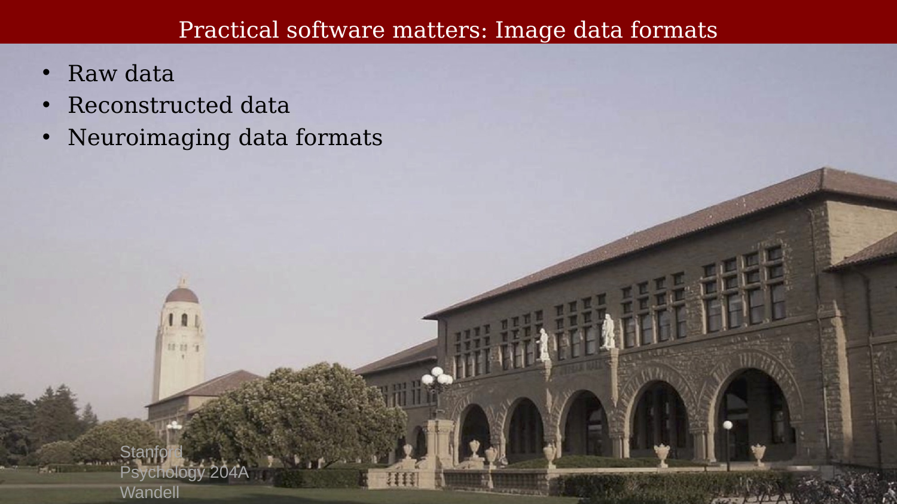
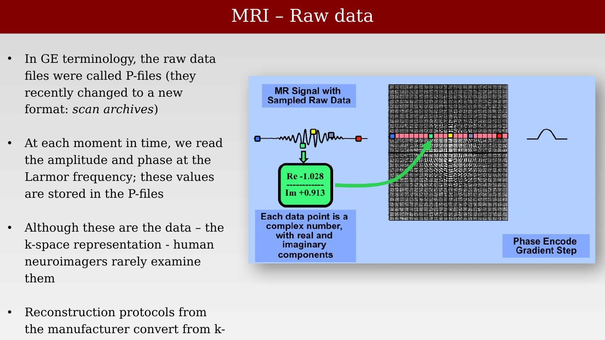
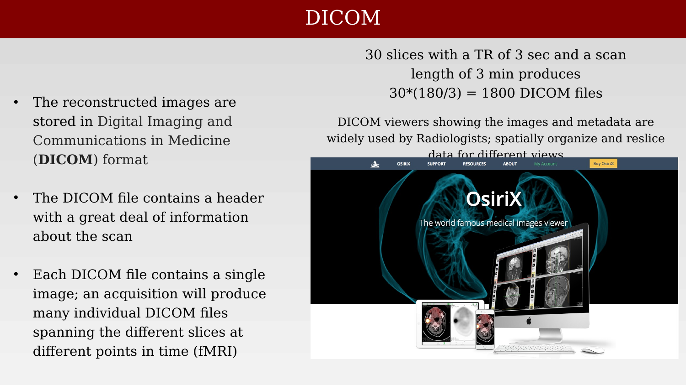
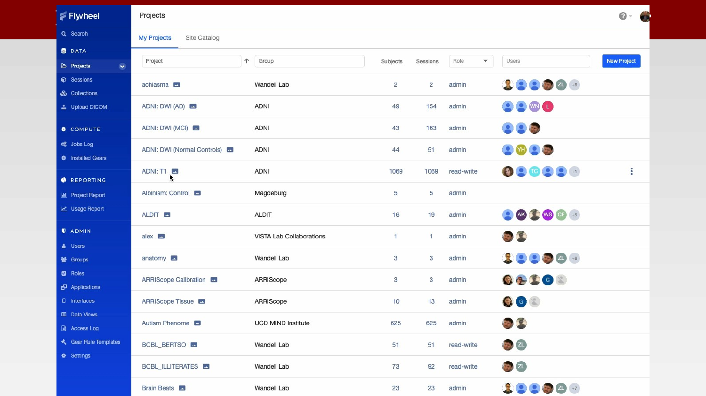
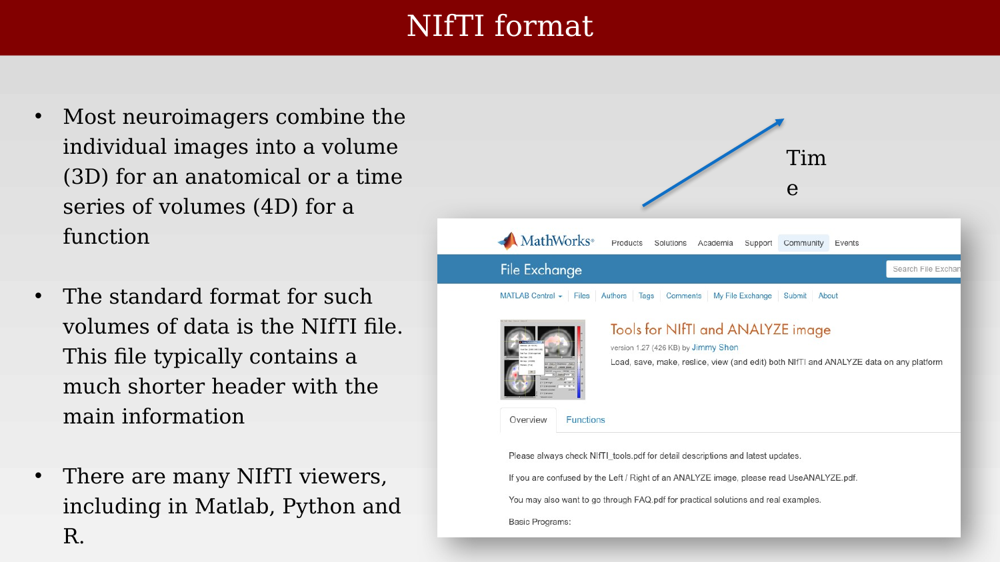
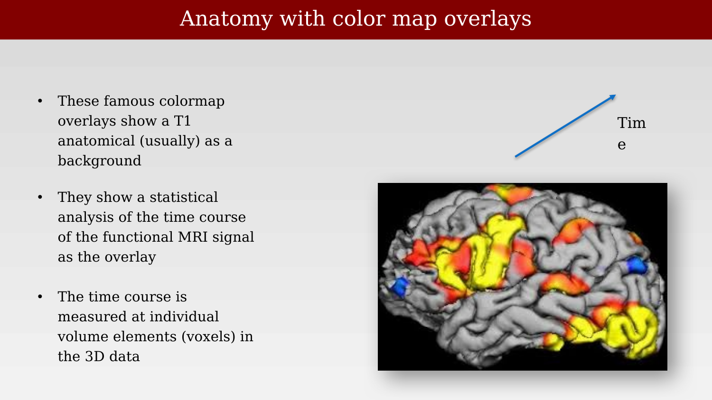

# Practical Software: Image Data Formats



---

## Practical software matters: Image data formats

{#fig-ch21-practical-software-matters-image-data-formats}

## MRI – Raw data

{#fig-ch21-mri-raw-data}

## DICOM

{#fig-ch21-dicom}

## Flywheel stores all the information in the DICOM header

{#fig-ch21-flywheel-stores-all-the-information-in-the-dicom-h}

## NIfTI format

{#fig-ch21-nifti-format}

## Anatomy with color map overlays

{#fig-ch21-anatomy-with-color-map-overlays}
