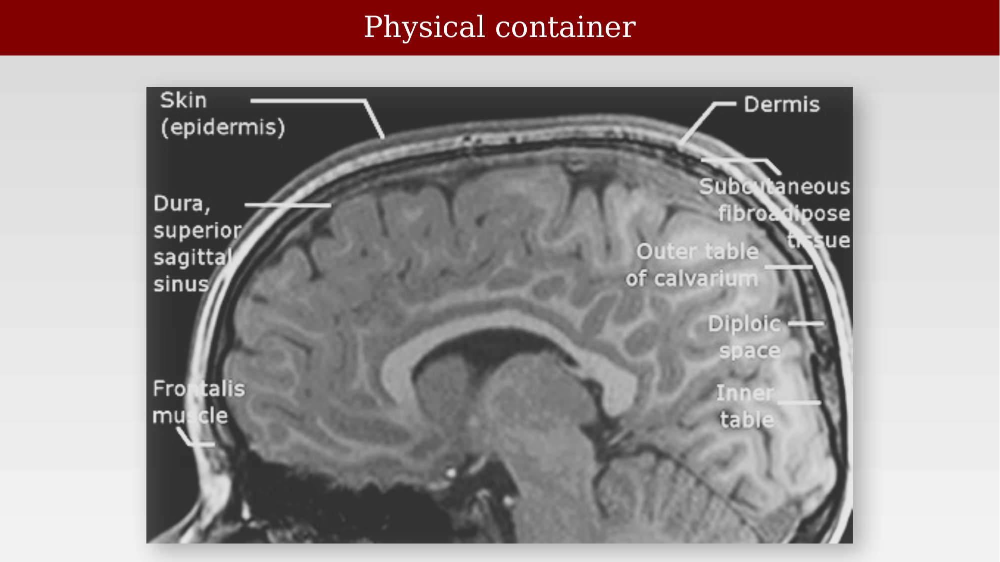
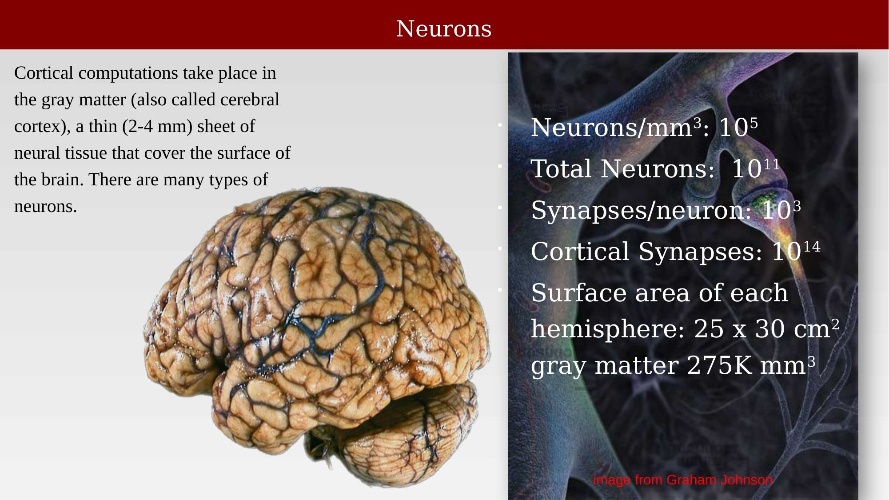
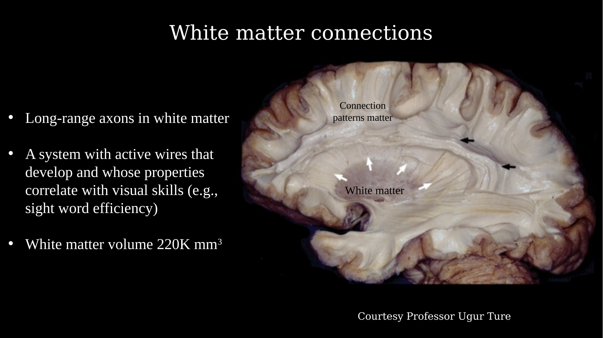
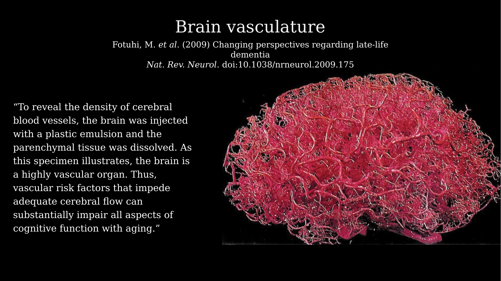
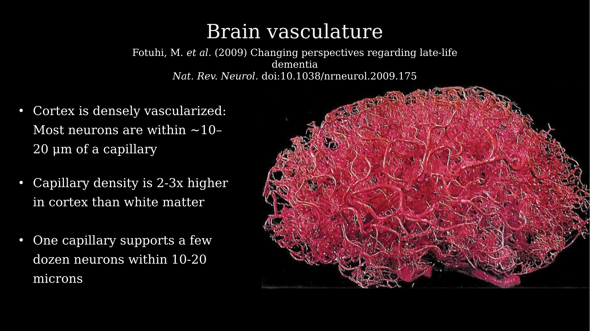
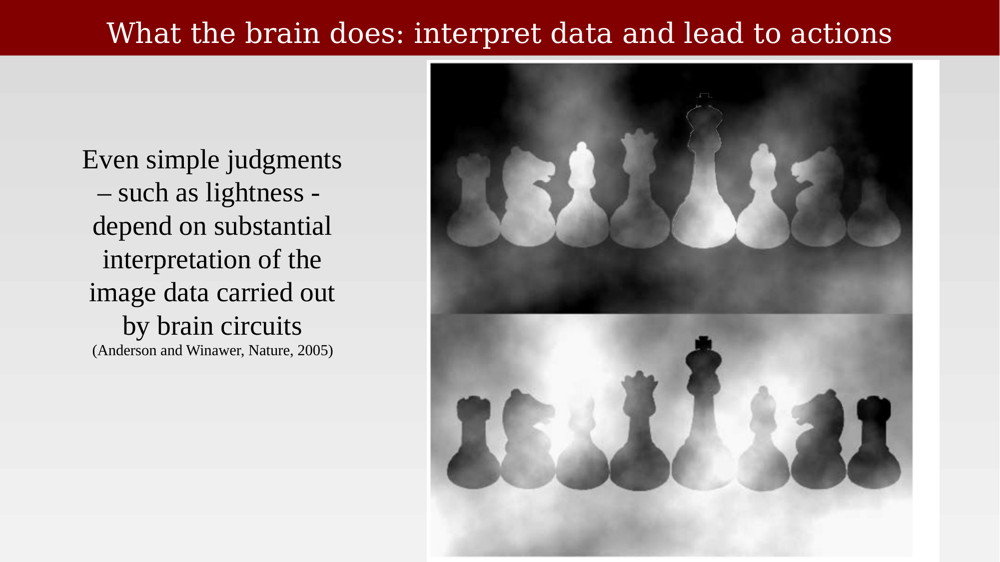
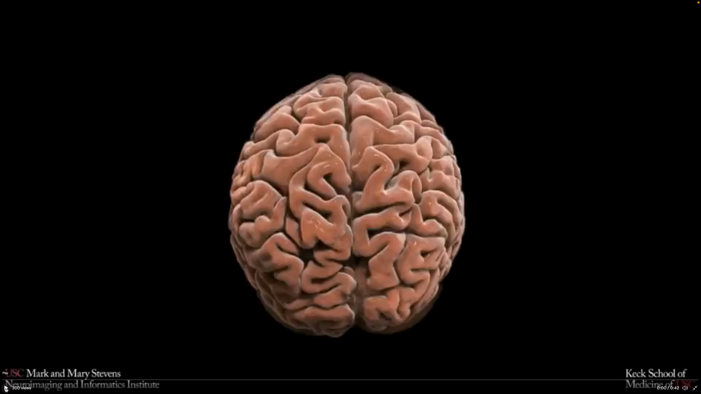

# Brain systems overview



---

The brain is a physical system built from multiple interacting subsystems, operating across a huge range of spatial and temporal scales. This chapter previews four of those subsystems, each covered in more depth in the chapters that follow: 

* the physical container (skull, meninges, geometry), 
* neurons and glia (signaling and computation), 
* white matter (long-range connections), and 
* vasculature (energy delivery and waste removal).

## The physical container

{#fig-ch22-physical-container fig-alt="Labeled sagittal T1-weighted MRI showing skin, skull, and dural layers surrounding the brain."}

## Neurons and glia

Cortical computations take place in the gray matter, a thin (2-4 mm) sheet of neural tissue covering the surface of the brain, containing on the order of $10^5$ neurons/mm$^3$ ($10^{11}$ total) and roughly as many glial cells.

{#fig-ch22-neurons fig-alt="Photo of a human brain alongside statistics on neuron density, synapse counts, and cortical surface area."}

{#fig-ch22-glia fig-alt="Photo of a human brain alongside statistics on glial cell density and the glia-to-neuron ratio."}

## White matter

{#fig-ch22-white-matter-connections fig-alt="Photo of a dissected coronal brain section with white matter and connection pathways labeled."}

## Vasculature

::: {.panel-tabset}
## Overview

{#fig-ch22-vasculature-1 fig-alt="Cast of cerebral blood vessels showing the dense vascular network of the brain."}

## Density

{#fig-ch22-vasculature-2 fig-alt="Same cerebral vasculature cast, with added statistics on capillary density and proximity to neurons."}
:::

## What the brain does

The brain's job is to interpret data and lead to actions. Even simple perceptual judgments, such as the lightness of a surface, depend on substantial interpretation of image data by brain circuits — as illustrated by the classic checkerboard lightness illusion.

{#fig-ch22-checkerboard-illusion fig-alt="Two checkerboard patterns with a shadow illusion demonstrating that identical gray squares appear different depending on context."}

::: {.content-visible when-format="html"}
{#vid-ch22-rotating-brain width="80%" loop="true" autoplay="true" muted="true"}
:::

::: {.content-visible when-format="pdf"}
{#vid-ch22-rotating-brain width="80%"}
:::
