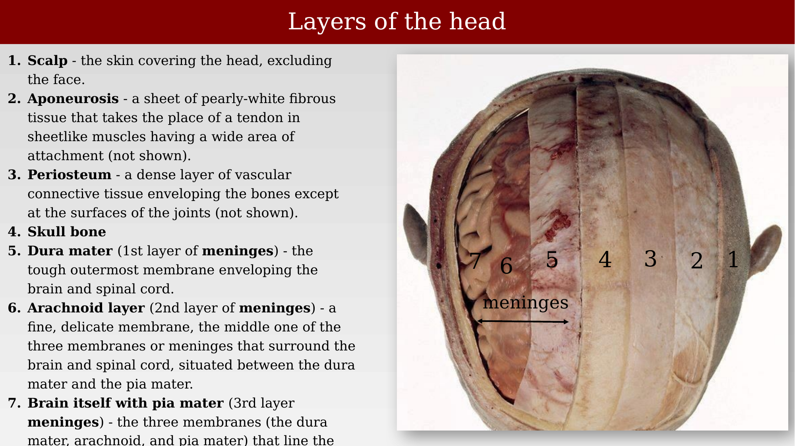
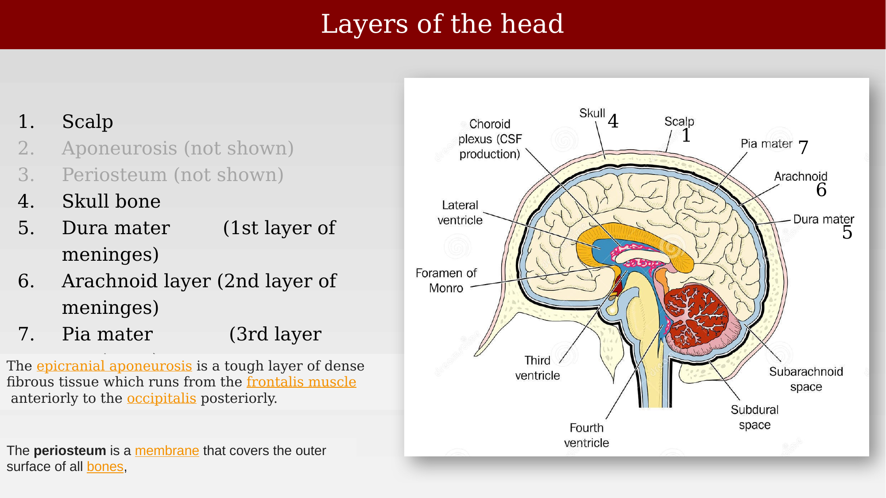
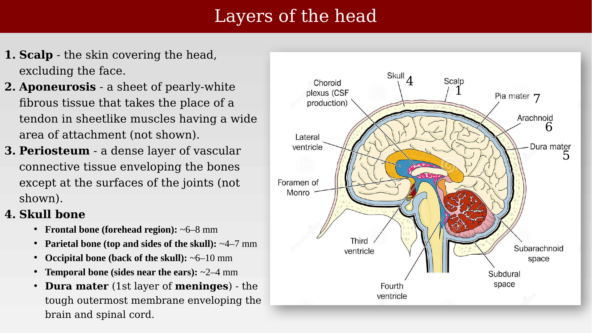
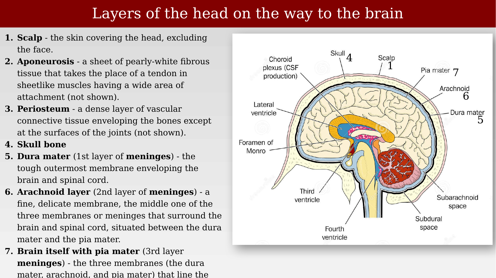
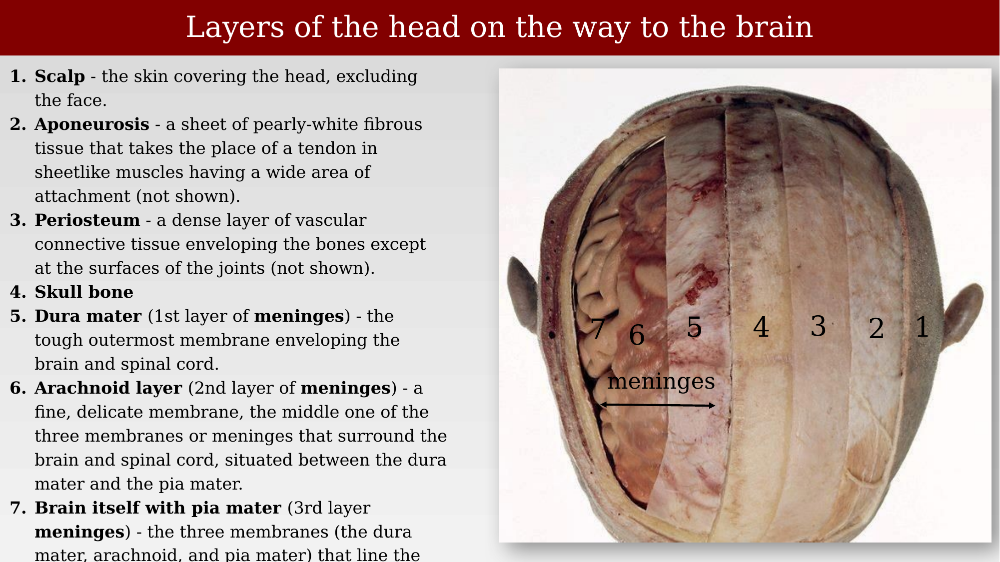
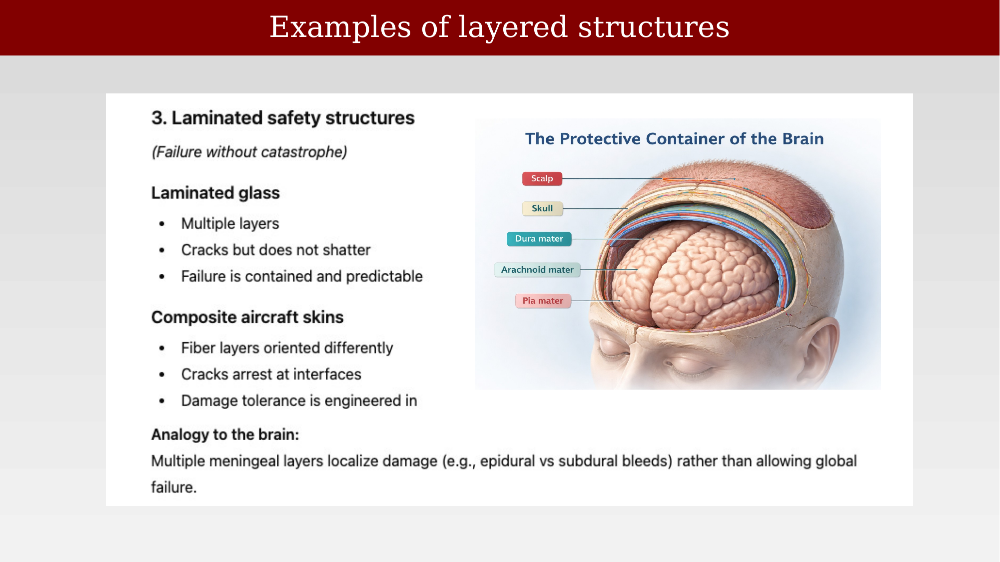
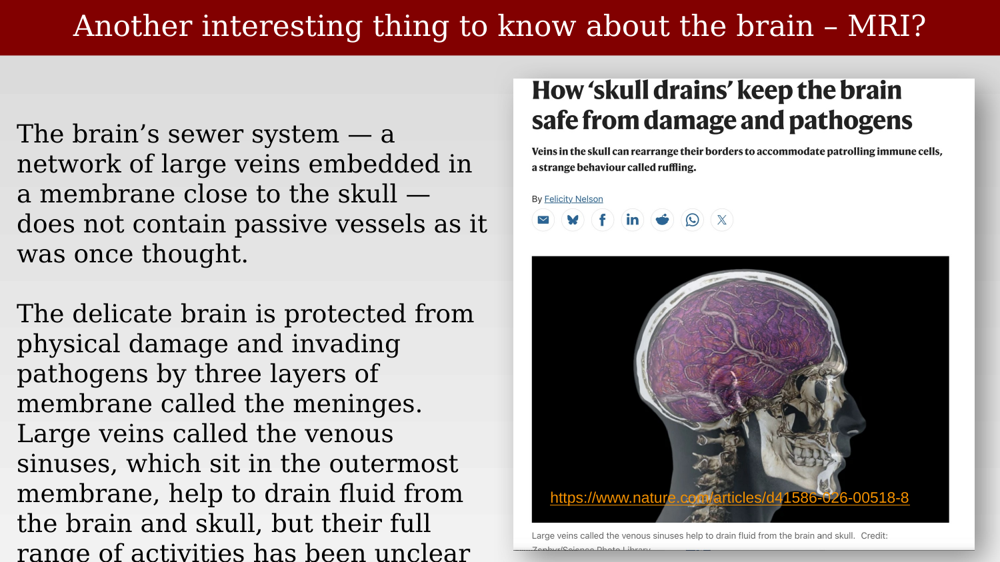
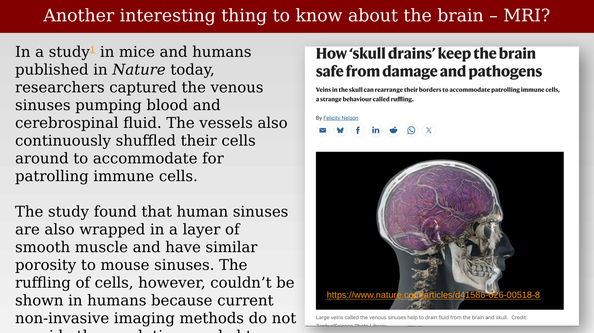

# The packaging



---

The brain is packaged inside several concentric layers: skin, skull, the meninges (dura, arachnoid, and pia mater), and a dense vasculature. Each layer has a distinct mechanical or physiological role, and each is visible in structural MRI.

{#fig-ch23-brain-structures-overview fig-alt="Netter atlas illustration of the scalp, skull, and superficial cerebral vasculature."}

## Layers of the head

From outside in: scalp, aponeurosis, periosteum, skull bone, dura mater (1st meningeal layer), arachnoid layer (2nd meningeal layer), and the brain itself with its pia mater (3rd meningeal layer).

::: {.panel-tabset}
## Step 1

{#fig-ch23-head-layers-1 fig-alt="Numbered dissection photo of the head showing seven layers from scalp to brain."}

## Step 2

{#fig-ch23-head-layers-2 fig-alt="Same layered head diagram with added detail on the aponeurosis and periosteum."}

## Step 3

{#fig-ch23-head-layers-3 fig-alt="Same layered head diagram with added skull-thickness values by region."}
:::

## Layers of the head on the way to the brain

The same seven layers, viewed as a labeled schematic and as a dissection photograph.

::: {.panel-tabset}
## Diagram

{#fig-ch23-head-layers-diagram fig-alt="Labeled schematic sagittal diagram of the head layers and ventricular system."}

## Dissection

{#fig-ch23-head-layers-dissection fig-alt="Numbered dissection photo of the head showing all seven layers."}
:::

## Appearance in a T1-weighted scan

{#fig-ch23-t1-weighted-appearance fig-alt="Labeled sagittal T1-weighted MRI showing skin, skull, and dural layers."}

## Pathology: thickening of the dura

{#fig-ch23-dura-thickening-pathology fig-alt="Four-panel MRI showing dural thickening and enhancement in axial, coronal, sagittal, and FLAIR views."}

## Why so many layers?

The brain is soft, metabolically demanding, and mechanically fragile, while the skull is rigid and subject to motion, impact, and vibration. No single interface can solve all of these constraints at once, so layering separates the functions: the dura provides mechanical support and venous drainage, the arachnoid and CSF provide hydraulic suspension and shock absorption, and the pia forms an intimate interface between vessels and tissue. The brain is not rigidly mounted — it is suspended and supplied.

From an engineering perspective, the different layers of the packaging perform different roles: load-bearing (skull), and bulk fluid transport and pressure management (CSF). Endothelial cells surrounding the vasculature (the blood-brain barrier) control the passage of specific molecules.

## Examples of layered structures

Layering for graceful failure is a general engineering strategy, not unique to the brain. Laminated safety glass has multiple layers, cracks rather than shattering, and fails in a contained, predictable way. Composite aircraft skins orient fiber layers differently so cracks arrest at interfaces, engineering in damage tolerance. The brain's multiple meningeal layers similarly localize damage — for example, distinguishing epidural from subdural bleeds — rather than allowing a global failure.

{#fig-ch23-layered-structures-engineering-analogy fig-alt="Illustration of a head with scalp, skull, dura, arachnoid, and pia mater layers labeled, alongside text about laminated glass and aircraft skin analogies."}

## The venous sinuses are not passive drains {#sec-ch23-skull-drains}

::: {.callout-note}
Placement flagged for review: this section was added from a February 2026 Nature news item, and Brian still needs to decide exactly where it fits best relative to the rest of the chapter — it may belong earlier, alongside the "why so many layers" discussion, rather than as a closing section.
:::

The dural venous sinuses were described above as providing "mechanical support and venous drainage" — but a 2026 study in mice and humans shows that this drainage system is considerably more active than that description suggests. Researchers directly imaged the venous sinuses — the network of large veins embedded in the meningeal membrane closest to the skull — and found that they are not passive vessels, as had long been assumed [@nelson2026-skulldrains].

> In a study in mice and humans published in *Nature* today, researchers captured the venous sinuses pumping blood and cerebrospinal fluid. The vessels also continuously shuffled their cells around to accommodate for patrolling immune cells.
>
> The study found that human sinuses are also wrapped in a layer of smooth muscle and have similar porosity to mouse sinuses. The ruffling of cells, however, couldn't be shown in humans because current non-invasive imaging methods do not [yet provide sufficient resolution].
>
> — @nelson2026-skulldrains

::: {.panel-tabset}
## Overview
{#fig-ch23-skull-drains-venous-sinuses-1 fig-alt="Nature news article headline 'How skull drains keep the brain safe from damage and pathogens,' with a colored sagittal MRI-style image of a skull and brain vasculature."}

## Findings
{#fig-ch23-skull-drains-venous-sinuses-2 fig-alt="Continuation of the Nature news article text describing the study's findings in mice and humans, alongside the same skull-and-vasculature image."}
:::

The immune-surveillance role adds a second function to the venous sinuses' mechanical one: beyond carrying blood and CSF away from the brain, the sinus lining appears to actively reshape itself to let patrolling immune cells through — a behavior the researchers call "ruffling." Human sinuses share the same smooth-muscle wrapping and porosity as the mouse sinuses studied directly, though whether ruffling itself occurs in humans is not yet known, since current non-invasive imaging methods lack the resolution to see it directly.
