# Gross anatomy and model brain systems



---

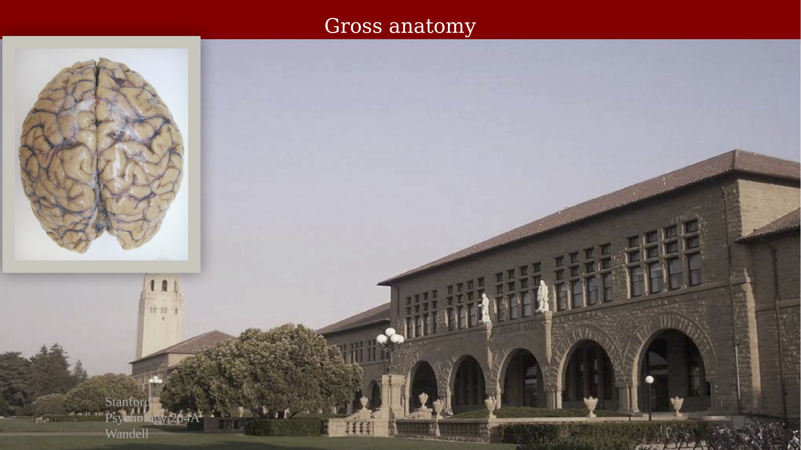{#fig-ch24-gross-anatomy-dorsal-view fig-alt="Photo of a human brain viewed from above, showing the two hemispheres."}

## Cardinal orientations

MRI volumes are described using three standard planes and axes: axial, coronal, and sagittal; anterior-posterior (A/P), left-right (L/R), and superior-inferior (S/I, also dorsal-ventral).

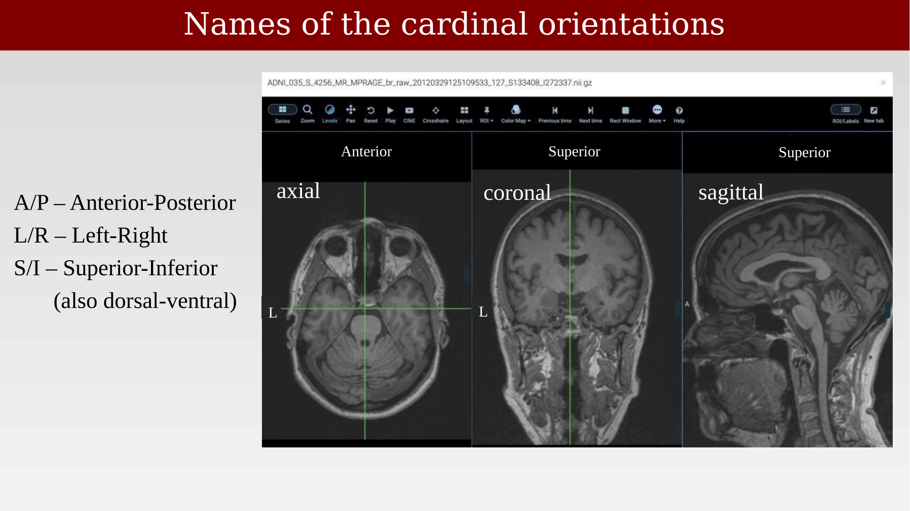{#fig-ch24-cardinal-orientations fig-alt="Three MRI viewer panels showing axial, coronal, and sagittal slices with anterior, superior, and left labeled."}

## Naming conventions for sulci and gyri

It is difficult to remember all the names of the sulci and gyri. If you work in one region of the brain, you need to know its landmarks well; for other regions, some general principles suffice — for example, vision is associated with occipital and temporal cortex, reading with temporal, parietal, and frontal cortex, and hearing with temporal cortex.

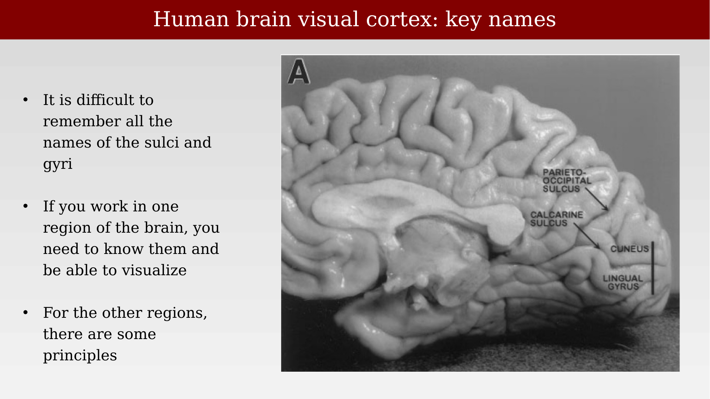{#fig-ch24-visual-cortex-key-names fig-alt="Medial view of a brain specimen with the parieto-occipital sulcus, calcarine sulcus, cuneus, and lingual gyrus labeled."}

Neurologists and psychologists commonly use a structure-function naming scheme — frontal, parietal, temporal, and occipital lobes — which is a loose approximation with imprecise functional associations.

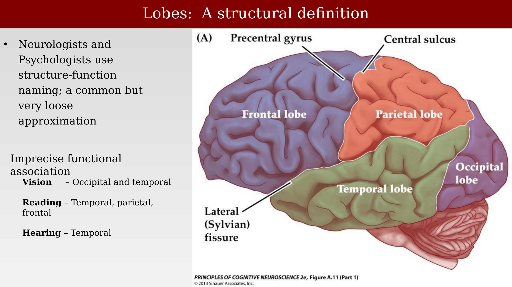{#fig-ch24-lobes-structural-definition fig-alt="Lateral view of a brain with the four lobes colored and labeled."}

### Lateral view

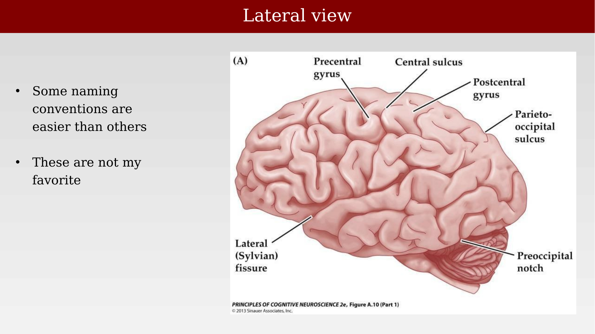{#fig-ch24-lateral-view-labels fig-alt="Lateral view of a brain with major gyri, sulci, and the Sylvian fissure labeled."}

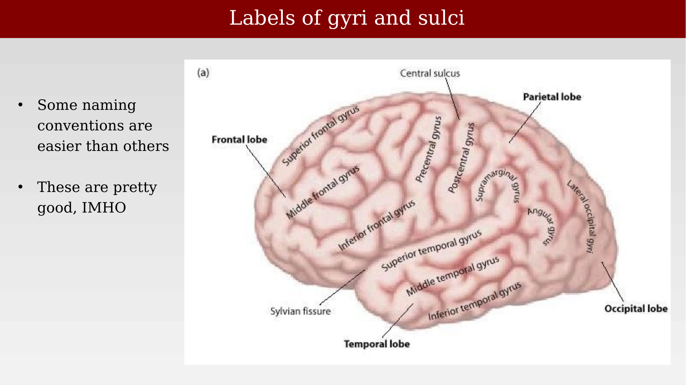{#fig-ch24-gyri-sulci-labels fig-alt="Detailed lateral view of the brain with many gyri and sulci labeled by name."}

### Insula

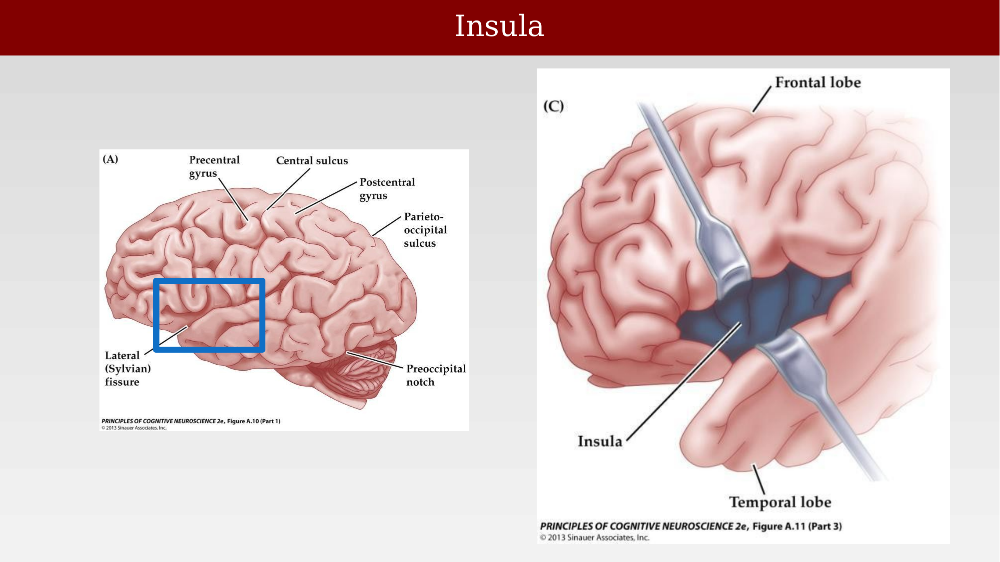{#fig-ch24-insula fig-alt="Lateral brain view with a boxed region over the Sylvian fissure, and a second panel showing the insula exposed by retracting the frontal and temporal opercula."}

### Medial view

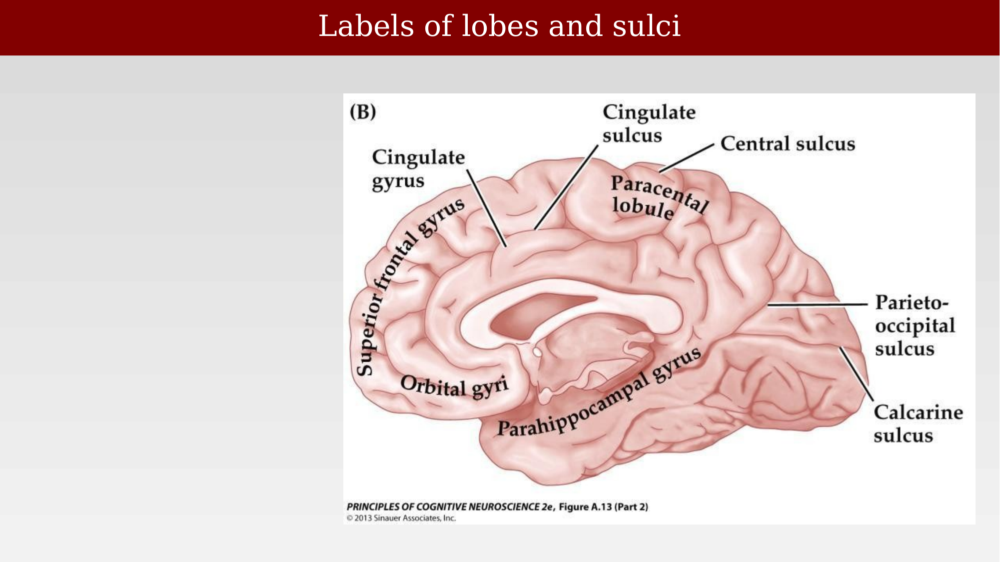{#fig-ch24-medial-view-lobes-sulci fig-alt="Medial view of the brain with lobes, gyri, and sulci labeled."}

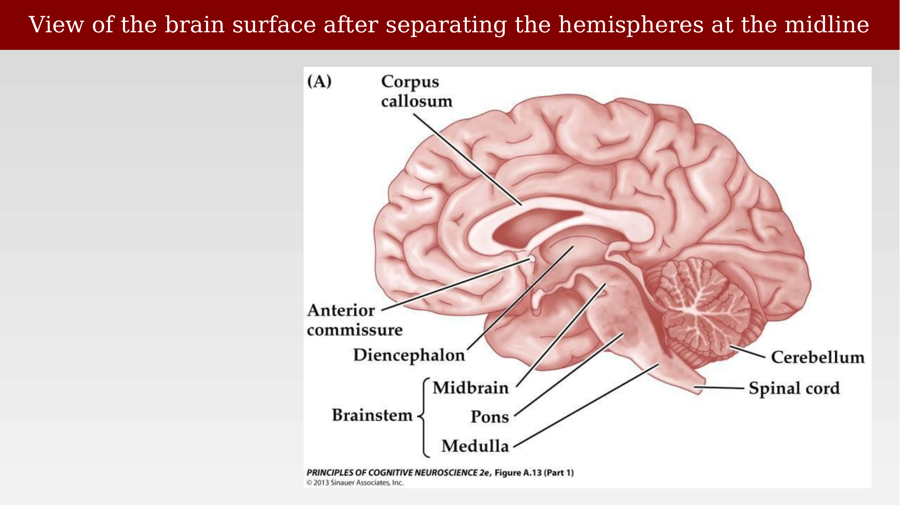{#fig-ch24-medial-view-brainstem-labels fig-alt="Medial view of the brain with the corpus callosum, brainstem subdivisions, cerebellum, and spinal cord labeled."}

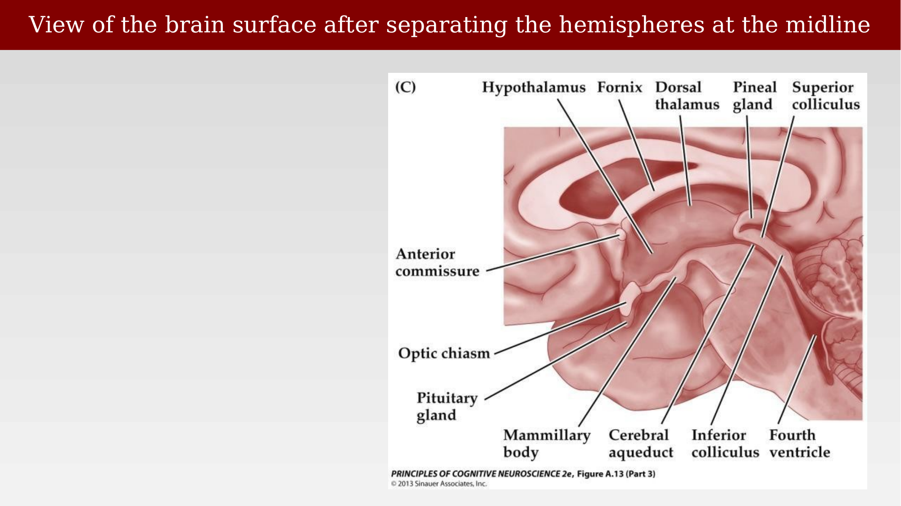{#fig-ch24-diencephalon-midbrain-labels fig-alt="Close-up medial view of the diencephalon and midbrain with many structures labeled."}

### Inferior view

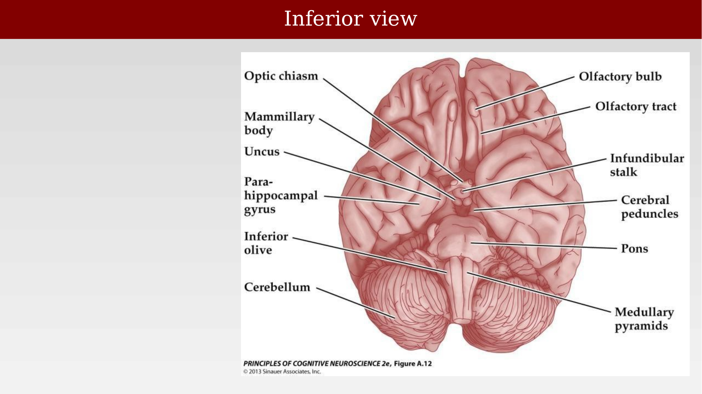{#fig-ch24-inferior-view-labels fig-alt="Inferior view of the brain with many structures labeled, including the optic chiasm, olfactory tract, and brainstem."}

## Model brain systems

There are many aspects of the brain that cannot be easily studied in human. Scientists have learned a great deal by examining the brains of other animals.

Rodents, and to a lesser extent other primates, have served as a primary model system. A great deal has been learned that applies to the human brain.  But it is always important to remember that comparing model systems to the human brain requires understanding both the components they share and where they differ. It is clear that there are significant differences, so that generalization from model systems to humans requires proof.

In this chapter, we make a few observations about different animal brains.  This topic is fascinating in itself, even when the animal brains differ significantly from human.

### The human brain and model brains

Brain volume varies enormously across common model species: mouse, macaque, and human brains have volumes in roughly the ratio 1:15:3000 (0.5 g, 100 g, and 1500 g, respectively).  When two systems differ by a factor of 3000, it is wise to be cautious about extrapolating principles between them.

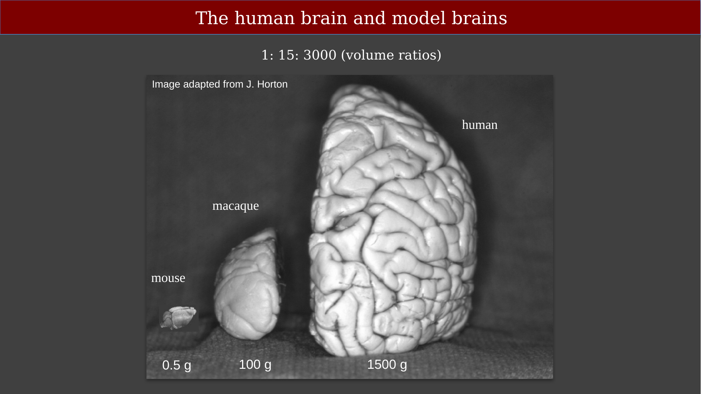{#fig-ch24-human-model-brains-comparison fig-alt="Photo comparing a mouse, macaque, and human brain at the same scale, with approximate weights labeled."}

### Gray and white matter across species

Histological sections show that the relative proportions of gray and white matter differ substantially across species. Thus, it is not just the volumes that differ but the composition of cell types differ as well.

{#fig-ch24-gray-white-matter-species-histology fig-alt="Four coronal histology sections comparing gray and white matter across macaque, human, marmoset, and mouse brains."}

Here is a second way of representing the same images to emphasize the differences.

{#fig-ch24-white-matter-proportion-humans fig-alt="Coronal histology sections of macaque, human, marmoset, and mouse brains scaled to the same physical size."}

### Rodent-primate scaling rules

Cellular scaling rules for rodent brains differ significantly from those for primate brains [@herculano-houzel2007-cellularscalingrules]. In rodents, neuron *size* — but not neuron *number* — grows with brain size. In primates (including humans), neuron *number* scales with brain size while neuron size stays roughly constant, and brain size increases approximately isometrically with cell number: an 11x larger primate brain is built with about 10x more neurons and about 12x more non-neuronal cells of similar average size. This is a large effect — if the human brain had scaled by the rodent rule instead of the primate rule, a 3-lb human brain would weigh roughly 100 lbs.

Neurons are thought to scale with information-processing demands, while glia scale with physical and metabolic support demands; the interesting differences across species are now thought to be morphological, molecular, and circuit-specific rather than purely numerical.

Cortical white and gray matter volumes are tightly related across a wide range of species — spanning shrews to whales — following a power law (exponent 1.23) across nearly six orders of magnitude of brain size [@zhang2000-dz]. The white-to-gray matter ratio is roughly 1:1 in humans but only about 1:10 in mouse.

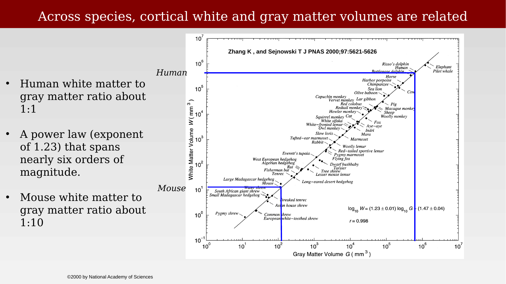{#fig-ch24-cortical-white-gray-matter-scaling fig-alt="Log-log scatter plot of white matter volume versus gray matter volume across many mammalian species, with a fitted power-law line."}
