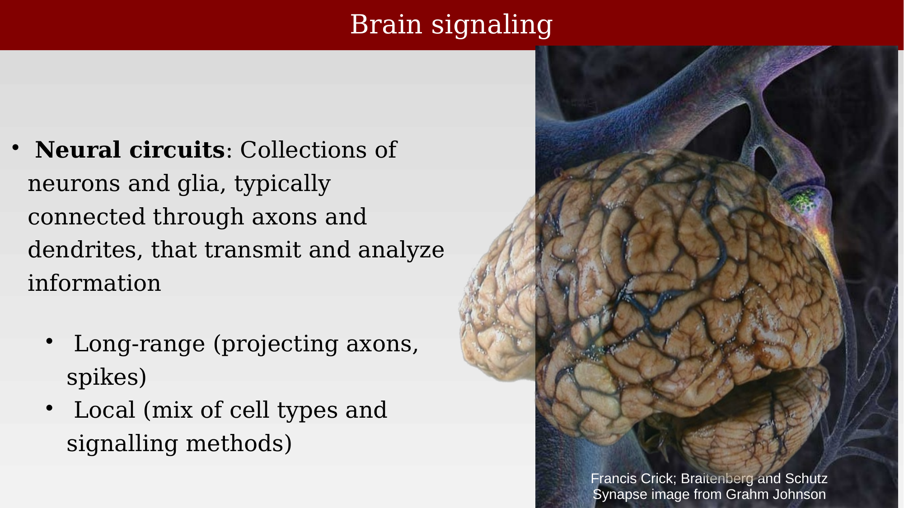
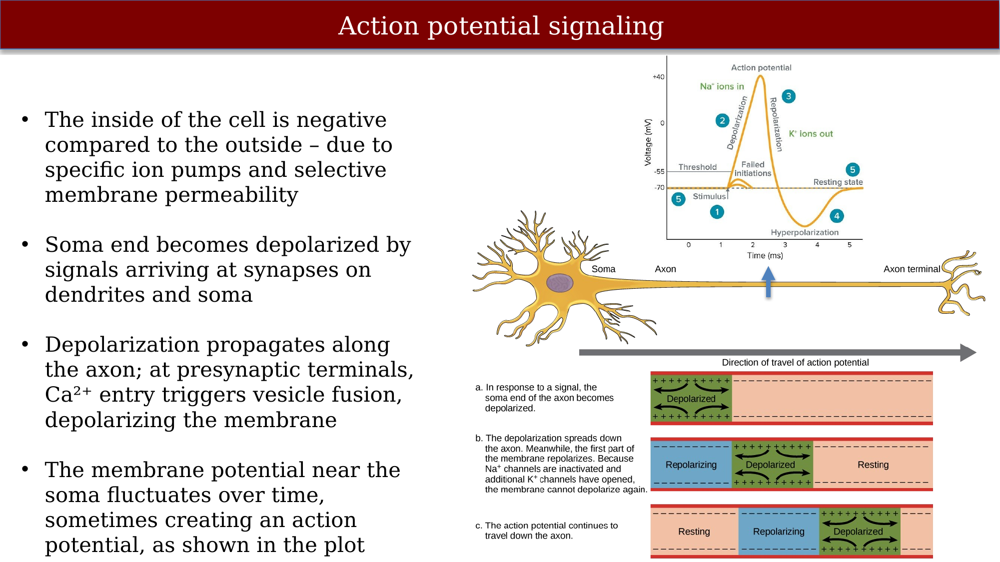
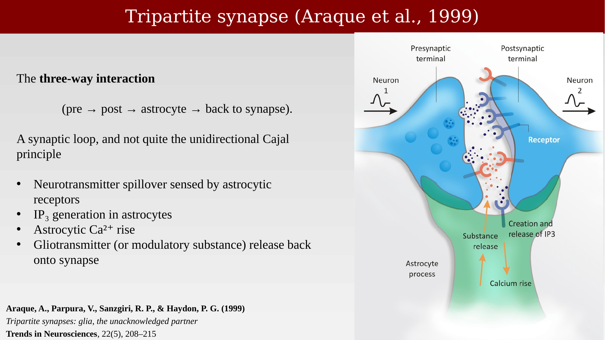

# Cell signaling



---

## Brain signaling

Neural circuits are collections of neurons and glia, typically connected through axons and dendrites, that transmit and analyze information. Signaling within these circuits happens at two scales: long-range signaling, carried by spikes propagating along projecting axons, and local signaling, involving a mix of cell types and signaling methods.

{#fig-ch27-brain-signaling-overview fig-alt="Photo of a human brain specimen alongside an illustration of a synapse, credited to Francis Crick, Braitenberg and Schutz, and Grahm Johnson."}

## Action potential signaling

The inside of a neuron is negative relative to the outside, maintained by ion pumps and selective membrane permeability. Signals arriving at synapses on the dendrites and soma depolarize the soma end of the axon. This depolarization propagates along the axon; at presynaptic terminals, Ca²⁺ entry triggers vesicle fusion, releasing neurotransmitter. The membrane potential near the soma fluctuates continuously, and when it crosses threshold, an action potential is generated.

{#fig-ch27-action-potential-signaling fig-alt="Voltage-versus-time trace of an action potential above a neuron diagram, with three panels showing depolarization propagating along the axon over time."}

## Recording from single neurons

A tungsten microelectrode positioned near a cortical pyramidal neuron can record the spikes produced by that cell, the technique used by Kuffler, Wiesel, and Hubel in their classic studies of visual cortex.

{#fig-ch27-tungsten-microelectrode-setup fig-alt="Golgi-stained pyramidal neurons with a tungsten microelectrode approaching from the upper left, and an inset voltage trace showing a spike train."}

::: {.content-visible when-format="html"}
{#vid-ch27-tungsten-microelectrode-recording width="70%" loop="true" autoplay="true" muted="true"}
:::

::: {.content-visible when-format="pdf"}
{#vid-ch27-tungsten-microelectrode-recording width="70%"}
:::

A related historical recording demonstrates direction selectivity in a complex cell: the cell responds to a bar of light moving in one direction across the receptive field but not the reverse direction.

::: {.content-visible when-format="html"}
{#vid-ch27-direction-selective-complex-cell width="70%" loop="true" autoplay="true" muted="true"}
:::

::: {.content-visible when-format="pdf"}
{#vid-ch27-direction-selective-complex-cell width="70%"}
:::

## Synaptic signaling

Synapses are the junctions between two neurons; there are roughly $10^{13}$–$10^{15}$ synapses in human cortex, or about $10^9$ synapses per cubic millimeter (equivalently, $10^5$ mm³ of cortex holds about $10^{13}$–$10^{15}$ synapses in total). The synaptic cleft between two cells, and the diameter of a synaptic vesicle, are both about 40 nm — roughly 1/2500th the thickness of a sheet of paper (about 100,000 nm).

{#fig-ch27-synaptic-signaling-diagram fig-alt="Labeled diagram of a synapse showing myelin, axon, vesicles, presynaptic and postsynaptic membranes, glutamate release, ion channels, and an electrode recording a local EPSP."}

{#fig-ch27-nerve-terminal-vesicles-sem fig-alt="False-colored scanning electron micrograph of a nerve terminal broken open to show vesicles, with two inset panels showing labeled synapses on a neuron."}

## Neurotransmitters and neuromodulators

Neurotransmitters act directly on receptors at a synapse, producing a fast and localized effect: a rapid change in the postsynaptic neuron's excitation or inhibition. They are released primarily by spikes. Examples include GABA, glutamate, and acetylcholine.

{#fig-ch27-neurotransmitters-book-cover fig-alt="Book cover for Neurotransmitters and Neuromodulators, with a false-colored micrograph of a synapse and a neurotransmitter molecule model."}

Neuromodulators, in contrast, are released from various locations, not just the synapse. Through **volume transmission**, they diffuse into the extracellular space and affect multiple neurons, even those not directly connected by synapses. Through **non-synaptic release**, they can be released from dendrites or the cell body rather than a synaptic terminal.

::: {.panel-tabset}
## Volume and non-synaptic release

{#fig-ch27-neuromodulators-book-1 fig-alt="Book cover for Neurotransmitters and Neuromodulators alongside text describing volume transmission and non-synaptic release."}

## Effects and examples

{#fig-ch27-neuromodulators-book-2 fig-alt="Book cover for Neurotransmitters and Neuromodulators alongside text describing the slower, diffuse effects of neuromodulators and listing examples."}
:::

The two forms of signaling can be summarized by contrasting their targets, effects, and actions.

| Feature | Neurotransmitters | Neuromodulators |
|---|---|---|
| Target | Specific synapse | Multiple neurons |
| Effect | Fast and localized | Slow and diffuse |
| Action | Direct excitation or inhibition | Modulates neuronal activity |

: Summary comparison of neurotransmitters and neuromodulators. {#tbl-ch27-neurotransmitter-neuromodulator-summary}

Noradrenergic, serotonergic, dopaminergic, and cholinergic neuromodulatory systems track environmental signals such as risk, reward, novelty, and effort, and interact extensively with one another and with cortical and subcortical structures such as the amygdala, frontal cortex, hippocampus, and sensory cortices. Malfunction of these systems and their targets has been associated with a wide range of neurological and psychiatric conditions, including ADHD, depression, anxiety, schizophrenia, OCD, addiction, and Parkinson's disease [@avery2017-neuromodulatorysystems].

{#fig-ch27-neuromodulation-behavior-disease fig-alt="Diagram of raphe nucleus, basal forebrain, locus coeruleus, and VTA/SNc projecting to ACC/mPFC, PFC/OFC, striatum, parietal and sensory cortices, hippocampus, and thalamus, with associated psychiatric and neurological conditions labeled above each target."}

## Tripartite synapse: Signaling between neurons and glia

Astrocytes, once considered largely passive support cells, make up about one-quarter of the brain and are now understood to actively shape neuronal signaling, behavior, memory, and health [@abbott2025-silentbraincells]. Neurons and astrocytes communicate bidirectionally: neurotransmitter released at a synapse can spill over and be sensed by astrocytic receptors, and astrocytes in turn release gliotransmitters that feed back onto neurons.

{#fig-ch27-types-of-glia fig-alt="Labeled diagram of CNS glial cell types (astrocytes, oligodendrocytes, microglia, ependymal cells) and PNS glial cell types (Schwann cells, satellite cells)."}

The clearest example of this bidirectional signaling is the **tripartite synapse**: a three-way interaction among the presynaptic terminal, postsynaptic terminal, and an astrocytic process. Neurotransmitter spillover is sensed by astrocytic receptors, triggering IP₃ generation and a rise in astrocytic Ca²⁺, which leads to release of a gliotransmitter or modulatory substance back onto the synapse — a synaptic loop, rather than the purely unidirectional signaling of the classical Cajal picture [@araque1999-gh].

{#fig-ch27-tripartite-synapse fig-alt="Diagram of a tripartite synapse showing a presynaptic terminal, postsynaptic terminal, and astrocyte process, with arrows for substance release, IP3 creation, and calcium rise."}
