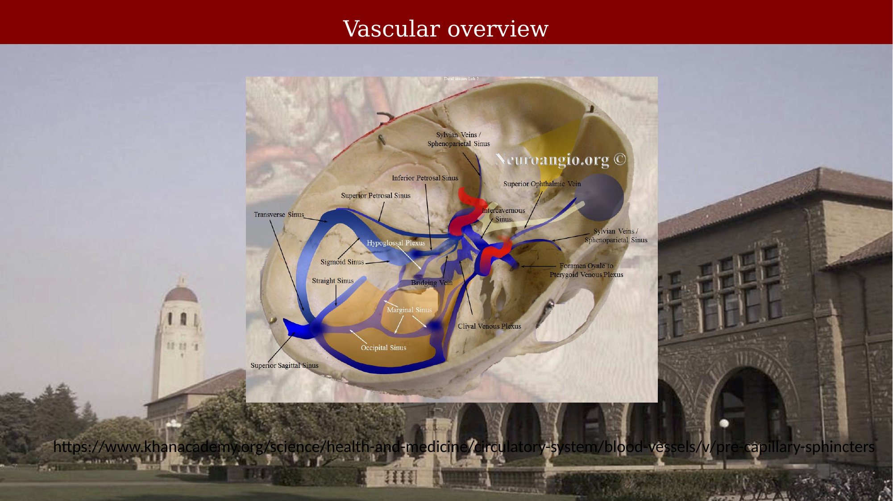
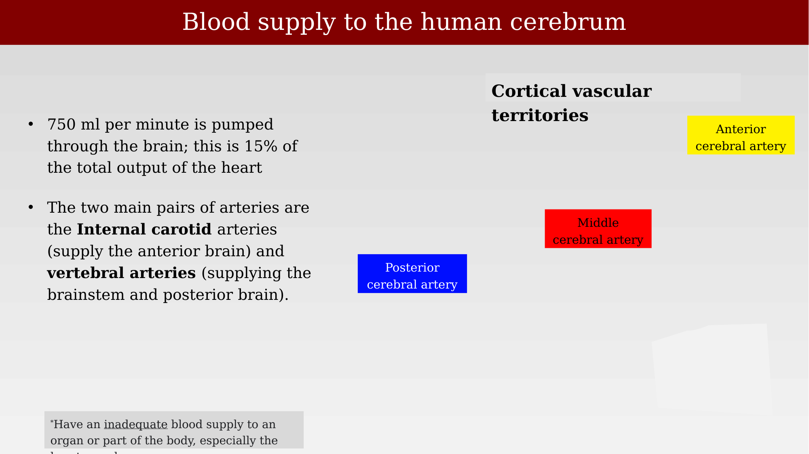
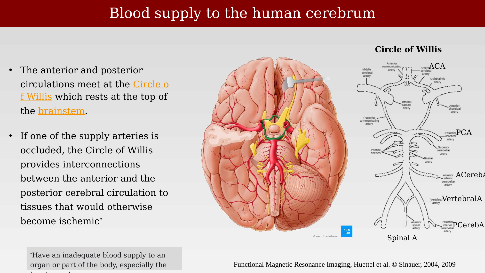
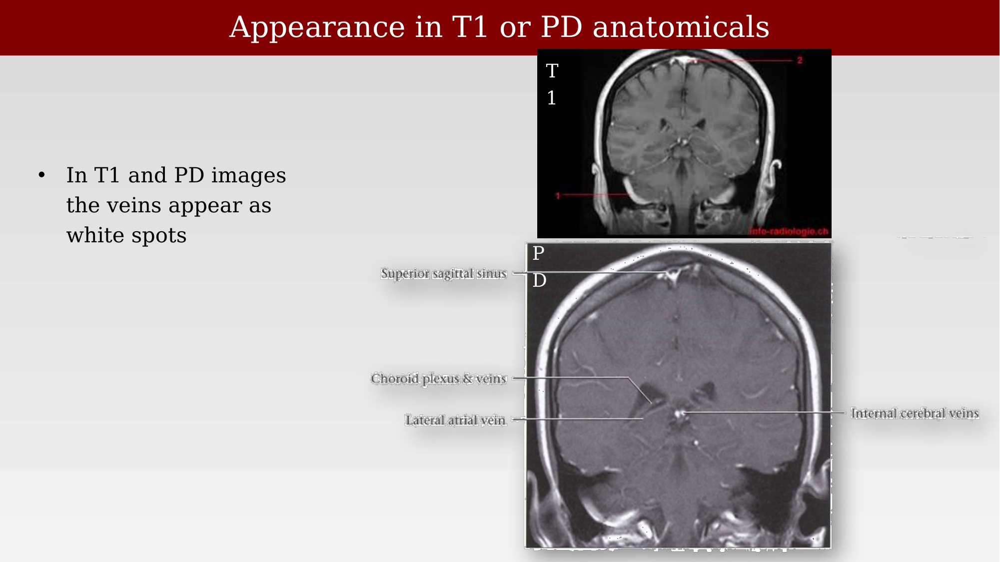
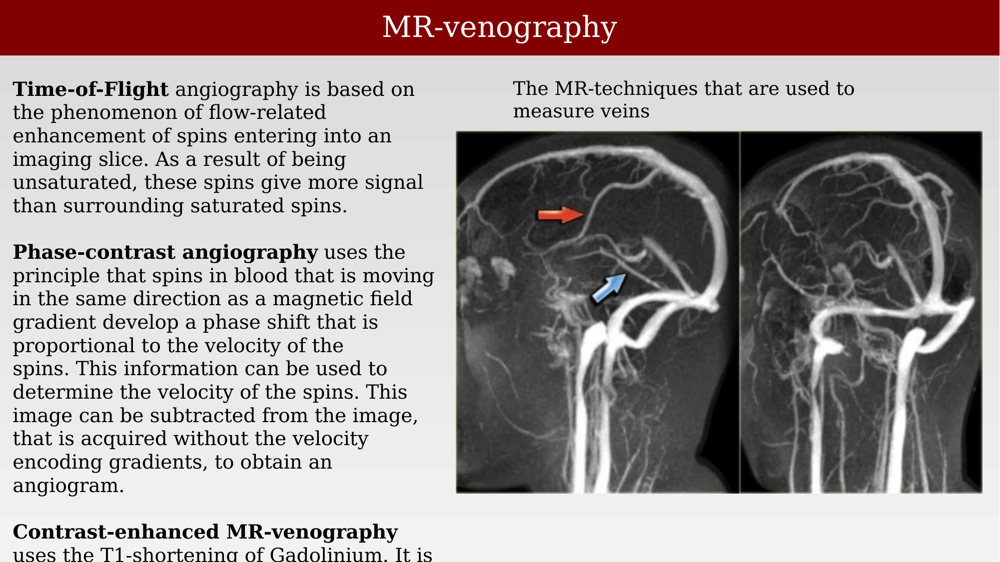
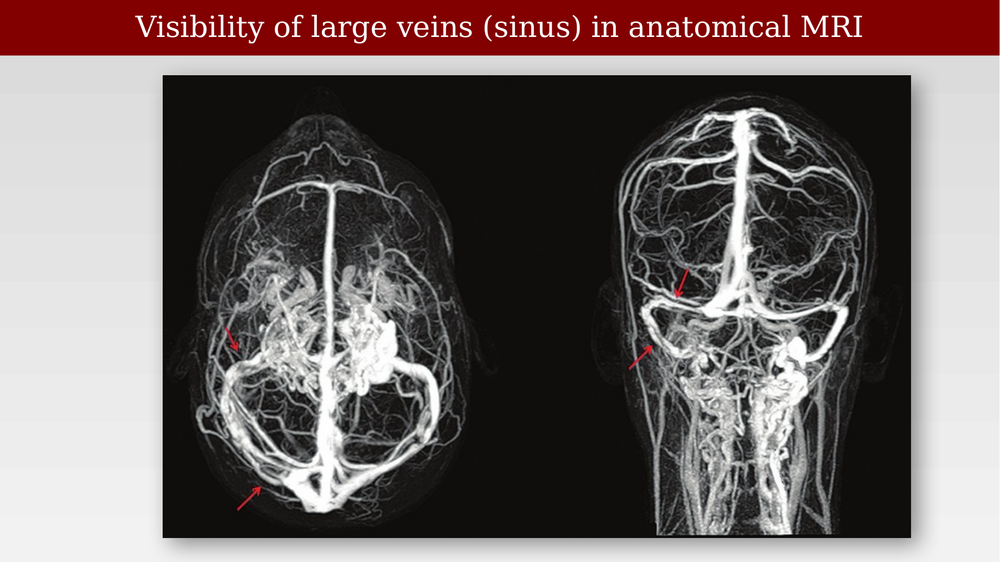

# Gross neurovascular anatomy



---

## Dural venous sinuses

Blood draining from the brain empties into the dural venous sinuses before leaving the skull through the internal jugular veins. The major sinuses — superior sagittal, straight, transverse, sigmoid, and occipital — form an interconnected system at the base and vault of the skull, joined by smaller sinuses and plexuses around the skull base.

{#fig-ch28-vascular-overview-dural-sinuses fig-alt="Skull-base specimen with the dural venous sinuses colored and labeled, including the superior sagittal, straight, transverse, sigmoid, and occipital sinuses."}

## Organization of the cerebral vasculature

The venous and arterial systems of the cerebrum are organized in parallel, medial-view networks. On the venous side, superior cerebral veins and the internal cerebral vein and great cerebral vein of Galen drain into the superior sagittal sinus and straight sinus, which join at the confluence of sinuses before draining through the transverse and sigmoid sinuses. On the arterial side, the internal carotid and basilar arteries supply the anterior, pericallosal, callosomarginal, superior cerebellar, and posterior cerebral arteries.

::: {.panel-tabset}
## Detailed view

{#fig-ch28-cerebral-vasculature-detailed fig-alt="Two medial brain views side by side, one labeled Venous showing sinuses and veins, one labeled Arterial showing named arteries."}

## Simplified view

{#fig-ch28-cerebral-vasculature-simplified fig-alt="Two lateral brain views side by side, one labeled Venous showing the superior sagittal sinus and cerebral veins, one labeled Arterial showing the three named cerebral arteries."}
:::

Cerebral veins pierce the arachnoid and dura to empty into the dural venous sinuses (meningeal layer).

## Blood supply and the Circle of Willis

About 750 mL of blood per minute is pumped through the brain — roughly 15% of total cardiac output. The two main pairs of supply arteries are the internal carotid arteries, which supply the anterior brain, and the vertebral arteries, which supply the brainstem and posterior brain. Cortical vascular territories are organized around the anterior, middle, and posterior cerebral arteries.

::: {.panel-tabset}
## Vascular territories

{#fig-ch28-blood-supply-cerebrum-territories fig-alt="Schematic showing labeled colored regions for the anterior, middle, and posterior cerebral artery territories."}

## Circle of Willis

{#fig-ch28-circle-of-willis fig-alt="Inferior view of the brain with the Circle of Willis highlighted, alongside a labeled schematic of the anterior and posterior cerebral circulation and the Circle of Willis."}
:::

## Veins in structural MRI

In T1- and PD-weighted anatomical images, veins typically appear as bright (white) spots or lines, reflecting flow-related signal enhancement.

{#fig-ch28-veins-t1-pd-appearance fig-alt="Two coronal MRI slices, T1-weighted and PD-weighted, with venous structures labeled and appearing bright."}

## MR venography

Several MR pulse-sequence approaches are used to image veins directly. Time-of-flight angiography relies on flow-related enhancement: unsaturated spins entering an imaging slice give more signal than the surrounding saturated tissue. Phase-contrast angiography exploits the phase shift acquired by spins moving along a magnetic field gradient, which is proportional to their velocity; subtracting a velocity-encoded image from one acquired without velocity encoding yields an angiogram. Contrast-enhanced MR venography uses the T1-shortening effect of gadolinium.

{#fig-ch28-mr-venography-techniques fig-alt="Two sagittal MR venography images of the head, with arrows highlighting venous structures."}

With sufficient resolution and venous-weighted contrast, the large dural sinuses are clearly visible in anatomical MRI, as shown in superior and posterior projections of a venogram.

{#fig-ch28-large-veins-visibility-mri fig-alt="Two MR venography projections, superior and posterior, showing bright venous sinuses with arrows highlighting key structures."}
