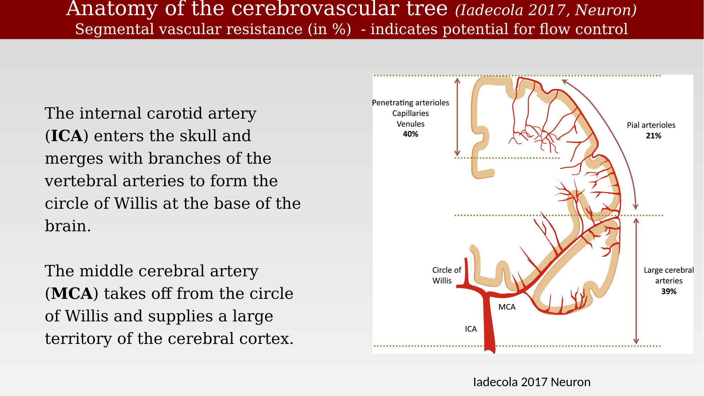
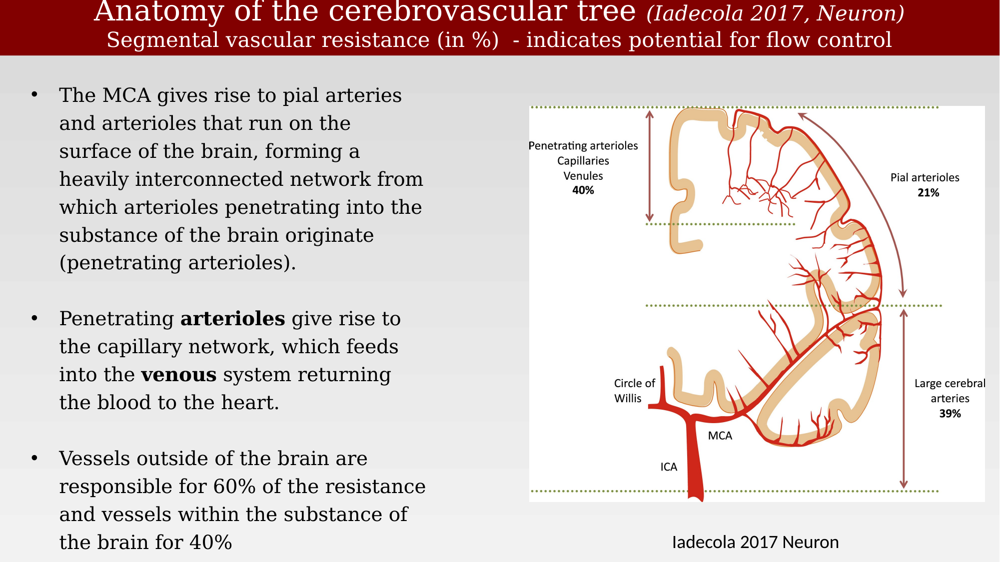
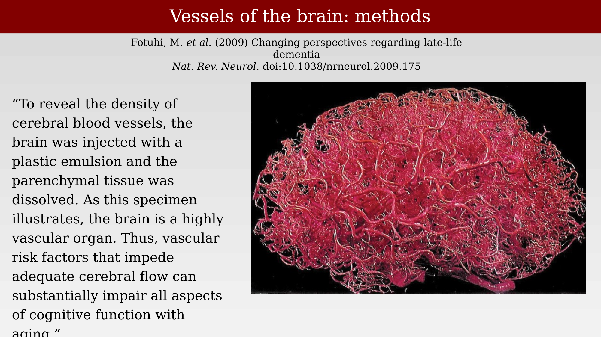
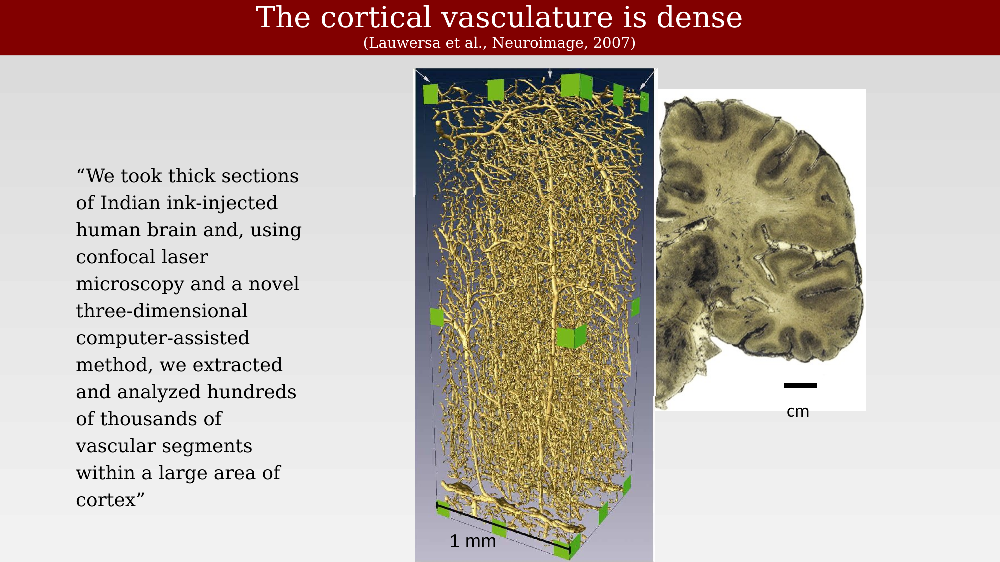
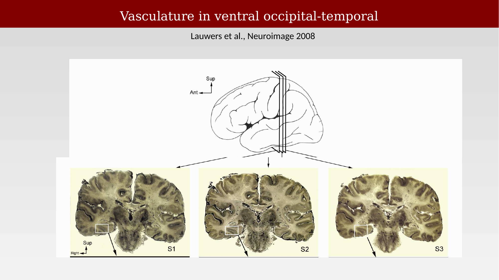
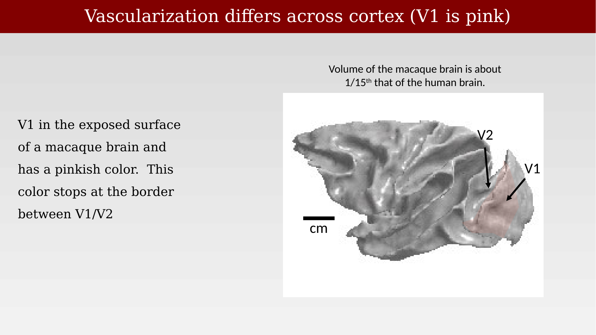
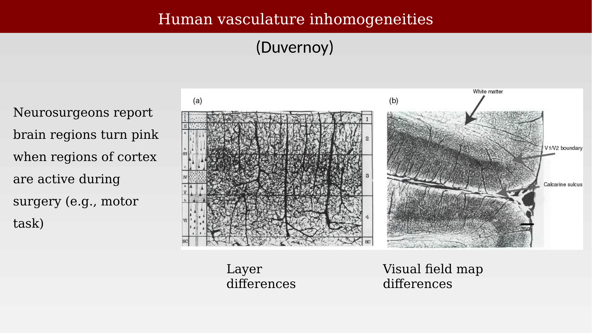

# Fine-scale neurovascular anatomy



---

## Anatomy of the cerebrovascular tree

The internal carotid artery (ICA) enters the skull and merges with branches of the vertebral arteries to form the Circle of Willis at the base of the brain. The middle cerebral artery (MCA) takes off from the Circle of Willis and supplies a large territory of the cerebral cortex, giving rise to pial arteries and arterioles that run along the brain's surface, forming a heavily interconnected network. From this network, penetrating arterioles descend into the substance of the brain, giving rise to the capillary bed, which feeds into the venous system that returns blood to the heart.

Segmental vascular resistance highlights where flow control is concentrated: vessels outside the brain (large cerebral arteries, 39%, and pial arterioles, 21%) account for 60% of total resistance, while vessels within the substance of the brain (penetrating arterioles, capillaries, and venules combined) account for the remaining 40% [@iadecola2017-ho].

::: {.panel-tabset}
## Large vessels to pial arteries

{#fig-ch29-cerebrovascular-tree-anatomy-1 fig-alt="Coronal schematic of the cerebrovascular tree from the ICA and Circle of Willis through the MCA to pial arterioles, with resistance percentages labeled at each segment."}

## Pial network to capillaries

{#fig-ch29-cerebrovascular-tree-anatomy-2 fig-alt="Same cerebrovascular tree schematic, emphasizing the pial network and penetrating arterioles descending into the capillary bed."}
:::

## Vessel density and structure

Cerebral blood vessels can be visualized by injecting the vasculature with a plastic emulsion or ink and dissolving away the surrounding parenchymal tissue, revealing a highly vascular organ. Vascular risk factors that impede adequate cerebral flow can substantially impair cognitive function with aging [@fotuhi2009-gl].

{#fig-ch29-vessels-of-brain-methods fig-alt="Pink-red cast of the dense vascular network of a human cerebral hemisphere against a black background."}

Confocal microscopy of thick sections of ink-injected human cortex, combined with three-dimensional computer-assisted reconstruction, reveals hundreds of thousands of vascular segments within even a small volume of cortex [@lauwers2008-cortexmorphometry].

{#fig-ch29-cortical-vasculature-density fig-alt="Gold three-dimensional rendering of dense cortical microvasculature within a 1 mm cube, next to a coronal brain section stained to show ink-filled vessels."}

Vessel density and organization also vary systematically by region of cortex. In post-mortem tissue, ventral occipital-temporal cortex shows characteristic patterns of vascularization that can be related to the underlying visual field maps and cortical layers.

{#fig-ch29-vasculature-ventral-occipitotemporal fig-alt="Three coronal brain sections labeled S1, S2, and S3 with boxed regions in ventral occipital-temporal cortex and a schematic showing the section levels."}

## Regional differences in vascularization

Neurosurgeons have long reported that regions of cortex visibly turn pink when they become active during surgery, for example during a motor task. This color change reflects local increases in blood flow and oxygenation tied to neural activity.

{#fig-ch29-vascularization-v1-pink fig-alt="Photo of an exposed macaque brain surface with area V1 shaded pink and V2 labeled at the adjacent, unshaded cortex."}

Regional inhomogeneities in vasculature within human cortex have been documented in detail by classical neuroanatomical studies, showing that vessel density and pattern differ both across cortical layers and across visual field maps such as the V1/V2 border [@duvernoy1981-ya].

{#fig-ch29-human-vasculature-inhomogeneities fig-alt="Two historical ink-drawing style figures: one showing vessel density across cortical layers I-VI, the other showing vessel pattern differences across the V1/V2 boundary and calcarine sulcus."}

## Glossary: capillaries, pericytes, and blood flow control

A few terms are useful for describing the fine-scale vasculature. An **arteriole** is a small branch of an artery leading to a capillary. A **capillary** is any of the fine branching blood vessels that form a network between the arterioles and venules. A **venule** is a very small vein, especially one collecting blood from the capillaries. **Pericytes** are contractile cells that wrap around the endothelial cells of capillaries and venules throughout the body; they are a likely modulator of blood flow in response to changes in neural activity, which may contribute to functional imaging signals and to CNS vascular disease, though other theories exist. The **endothelium** — the lining of blood vessels — forms the blood-brain barrier [@peppiatt2006-pericytes].
