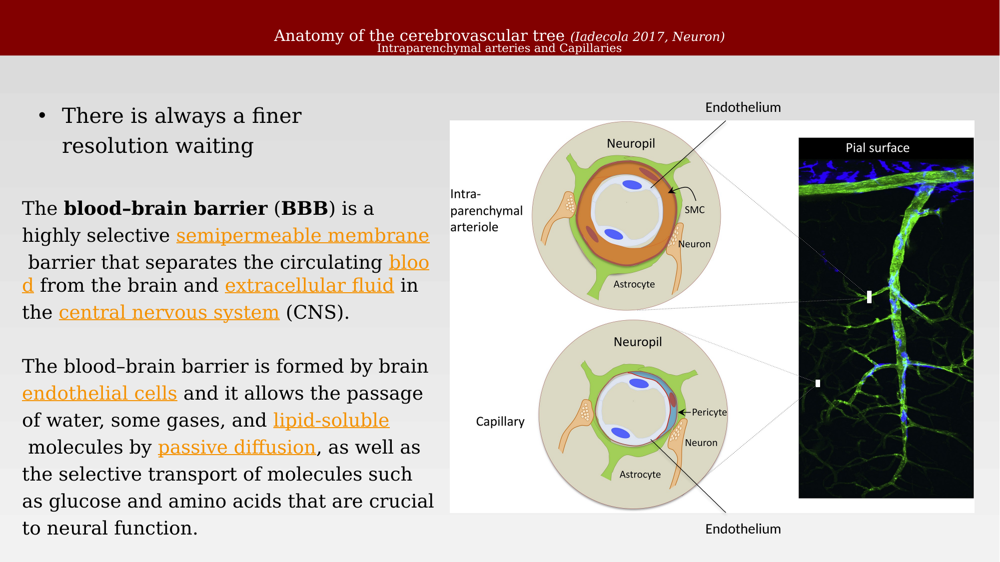
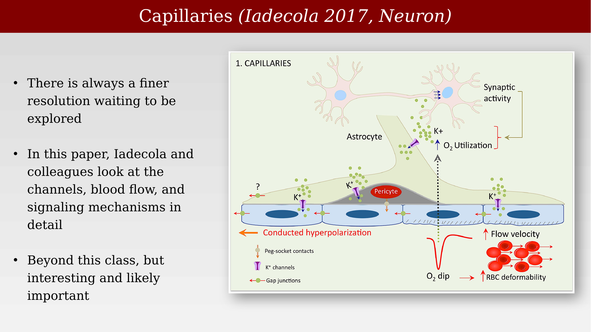
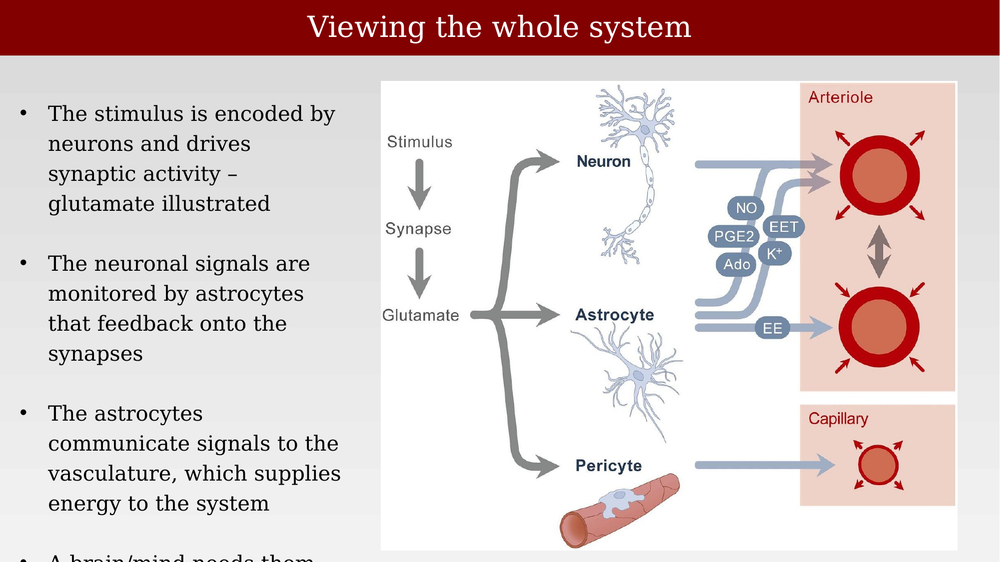

# Fine-scale neurovascular anatomy and the neurovascular unit



---

## Anatomy of the cerebrovascular tree

The internal carotid artery (ICA) enters the skull and merges with branches of the vertebral arteries to form the Circle of Willis at the base of the brain. The middle cerebral artery (MCA) takes off from the Circle of Willis and supplies a large territory of the cerebral cortex, giving rise to pial arteries and arterioles that run along the brain's surface, forming a heavily interconnected network. From this network, penetrating arterioles descend into the substance of the brain, giving rise to the capillary bed, which feeds into the venous system that returns blood to the heart.

Segmental vascular resistance highlights where flow control is concentrated: vessels outside the brain (large cerebral arteries, 39%, and pial arterioles, 21%) account for 60% of total resistance, while vessels within the substance of the brain (penetrating arterioles, capillaries, and venules combined) account for the remaining 40% [@iadecola2017-ho].

::: {.panel-tabset}
## Large vessels to pial arteries

{#fig-ch29-cerebrovascular-tree-anatomy-1 fig-alt="Coronal schematic of the cerebrovascular tree from the ICA and Circle of Willis through the MCA to pial arterioles, with resistance percentages labeled at each segment."}

## Pial network to capillaries

{#fig-ch29-cerebrovascular-tree-anatomy-2 fig-alt="Same cerebrovascular tree schematic, emphasizing the pial network and penetrating arterioles descending into the capillary bed."}
:::

## Vessel density and structure

Cerebral blood vessels can be visualized by injecting the vasculature with a plastic emulsion or ink and dissolving away the surrounding parenchymal tissue, revealing a highly vascular organ. Vascular risk factors that impede adequate cerebral flow can substantially impair cognitive function with aging [@fotuhi2009-gl].

{#fig-ch29-vessels-of-brain-methods fig-alt="Pink-red cast of the dense vascular network of a human cerebral hemisphere against a black background."}

Confocal microscopy of thick sections of ink-injected human cortex, combined with three-dimensional computer-assisted reconstruction, reveals hundreds of thousands of vascular segments within even a small volume of cortex [@lauwers2008-cortexmorphometry].

{#fig-ch29-cortical-vasculature-density fig-alt="Gold three-dimensional rendering of dense cortical microvasculature within a 1 mm cube, next to a coronal brain section stained to show ink-filled vessels."}

Vessel density and organization also vary systematically by region of cortex. In post-mortem tissue, ventral occipital-temporal cortex shows characteristic patterns of vascularization that can be related to the underlying visual field maps and cortical layers.

{#fig-ch29-vasculature-ventral-occipitotemporal fig-alt="Three coronal brain sections labeled S1, S2, and S3 with boxed regions in ventral occipital-temporal cortex and a schematic showing the section levels."}

## Regional differences in vascularization

Neurosurgeons have long reported that regions of cortex visibly turn pink when they become active during surgery, for example during a motor task. This color change reflects local increases in blood flow and oxygenation tied to neural activity.

{#fig-ch29-vascularization-v1-pink fig-alt="Photo of an exposed macaque brain surface with area V1 shaded pink and V2 labeled at the adjacent, unshaded cortex."}

Regional inhomogeneities in vasculature within human cortex have been documented in detail by classical neuroanatomical studies, showing that vessel density and pattern differ both across cortical layers and across visual field maps such as the V1/V2 border [@duvernoy1981-ya].

{#fig-ch29-human-vasculature-inhomogeneities fig-alt="Two historical ink-drawing style figures: one showing vessel density across cortical layers I-VI, the other showing vessel pattern differences across the V1/V2 boundary and calcarine sulcus."}

## Glossary: capillaries, pericytes, and blood flow control

A few terms are useful for describing the fine-scale vasculature. An **arteriole** is a small branch of an artery leading to a capillary. A **capillary** is any of the fine branching blood vessels that form a network between the arterioles and venules. A **venule** is a very small vein, especially one collecting blood from the capillaries. **Pericytes** are contractile cells that wrap around the endothelial cells of capillaries and venules throughout the body; they are a likely modulator of blood flow in response to changes in neural activity, which may contribute to functional imaging signals and to CNS vascular disease, though other theories exist. The **endothelium** — the lining of blood vessels — forms the blood-brain barrier [@peppiatt2006-pericytes].

## The neurovascular unit

In 1890, Roy and Sherrington proposed that local neural activity controls local blood flow, but the idea saw little sustained follow-up [@roy1890-bloodsupply]. This makes a lot of sense because the neurons draw a great deal of the body's energy from the blood supply, and it is likely that there would be a way for neurons to signal their needs.

Through most of 20th-century neuroscience, research focused on neurons and synapses, and the vasculature was largely treated as background. That changed in the late 1990s and early 2000s, when the rise of functional MRI directed attention back to the vascular response and to the cells that produce it: neurons, glia, pericytes, endothelium, and smooth muscle acting together.

The **neurovascular unit (NVU)** names this coupled biological system, linking neural signaling, metabolism, blood flow, and the blood-brain barrier.

### Specialized vascular cell types

Beyond arteries and veins, the vasculature includes specialized cell types — pericytes, smooth muscle, and endothelial cells among them — that control the flow to different parts of the system, including at precapillary sphincters.

{#fig-ch29-nvu-capillary-bed-precapillary-sphincters fig-alt="Diagram of a capillary bed with an arteriole on the left and venule on the right, labeling the precapillary sphincter, metarteriole, capillaries, thoroughfare channel, and arteriovenous anastomosis."}

### Perivascular space and the glymphatic system

The space surrounding brain blood vessels — called the perivascular space or Virchow-Robin space — has a function of its own: clearing waste and distributing solutes through what is now known as the **glymphatic system**. Many different cell types and molecules contribute to this system, including endothelial cells, smooth muscle, pericytes, astrocytes (via aquaporin-4 channels), and the surrounding neuropil, from pial and penetrating arteries down to the capillary bed [@jessen2015-rh].

{#fig-ch29-nvu-glymphatic-drawing fig-alt="Detailed cross-sectional drawing of a pial artery narrowing to a penetrating artery and capillary, with labeled cell types and structures including the perivascular space, pericytes, and astrocyte end-feet."}

### From pial arteries to capillaries

Pial arteries and penetrating arterioles are surrounded by perivascular nerves and contractile perivascular muscle; lymphatic cells are also present around the pial veins and arteries. Glial cells (astrocytes) make contact with these perivascular nerves, coupling neural and vascular signaling from the brain's surface down into the tissue [@iadecola2017-ho].

{#fig-ch29-cerebrovascular-tree-pial-penetrating fig-alt="Two circular cross-section diagrams of a pial arteriole and penetrating arteriole with labeled layers, next to a green-and-blue confocal microscopy image of pial surface and penetrating vasculature."}

At the finest scale, intraparenchymal arterioles and capillaries are wrapped by smooth muscle cells (arterioles) or pericytes (capillaries), astrocyte end-feet, and neurons. The **blood-brain barrier (BBB)** is a highly selective semipermeable barrier formed by these brain endothelial cells that separates circulating blood from the brain's extracellular fluid. It allows the passage of water, some gases, and lipid-soluble molecules by passive diffusion, as well as the selective transport of molecules such as glucose and amino acids that are crucial to neural function.

{#fig-ch29-cerebrovascular-tree-bbb-capillaries fig-alt="Two circular cross-section diagrams of an intraparenchymal arteriole and a capillary with labeled endothelium, smooth muscle cell or pericyte, astrocyte, and neuron, next to a confocal microscopy image of the vasculature."}

### NVU overview

The neurovascular unit is the system that signals between neurons and the vasculature. Its main components are simple — endothelial cells, pericytes, astrocytes, neurons, and microglia — but the details of cell types and signaling continue to be refined, and the concept itself has evolved considerably over the last twenty years [@iadecola2017-ho; @attwell2010-glialneuronalcontrol; @nedergaard2020-glymphaticfailure]. Pericytes, in particular, are capillary-associated mural cells that probably regulate microvascular flow at certain capillary segments, help maintain the blood-brain barrier, and provide the fine spatial control that makes neurovascular coupling — and fMRI — possible.

{#fig-ch29-nvu-overview-diagram fig-alt="Diagram of a capillary cross section with pericyte and endothelial cell, surrounded by an astrocyte, adjacent to a neuron and a microglial cell, labeled with a basement membrane."}

### Capillary-level signaling

There is always a finer resolution waiting to be explored. At the capillary level, synaptic activity increases oxygen utilization and releases K⁺ that is sensed by astrocytic and pericyte K⁺ channels, producing a conducted hyperpolarization that travels along the capillary wall through gap junctions and peg-socket contacts between endothelial cells. This local signal increases flow velocity and red blood cell deformability upstream, coordinated with a dip in local oxygen concentration [@iadecola2017-ho].

{#fig-ch29-capillaries-signaling-iadecola fig-alt="Diagram of two neurons synapsing near an astrocyte process contacting a capillary with a pericyte, showing K+ channels, gap junctions, peg-socket contacts, conducted hyperpolarization, an oxygen dip trace, and increased flow velocity with red blood cells."}

### Viewing the whole system

Putting the pieces together: a stimulus is encoded by neurons and drives synaptic activity, illustrated here by glutamate release. These neuronal signals are monitored by astrocytes, which feed back onto the synapse and also communicate signals to the vasculature — releasing NO, PGE2, EETs, adenosine, and K⁺ — dilating or constricting the arteriole and adjusting flow at the capillary via pericytes. In this way, the vasculature supplies the energy the neural system needs, moment to moment, wherever it is needed.

{#fig-ch29-nvu-whole-system-summary fig-alt="Flow diagram from stimulus to synapse to glutamate, branching to neuron, astrocyte, and pericyte, which signal via NO, PGE2, EET, adenosine, and K+ to an arteriole and capillary shown dilating."}
