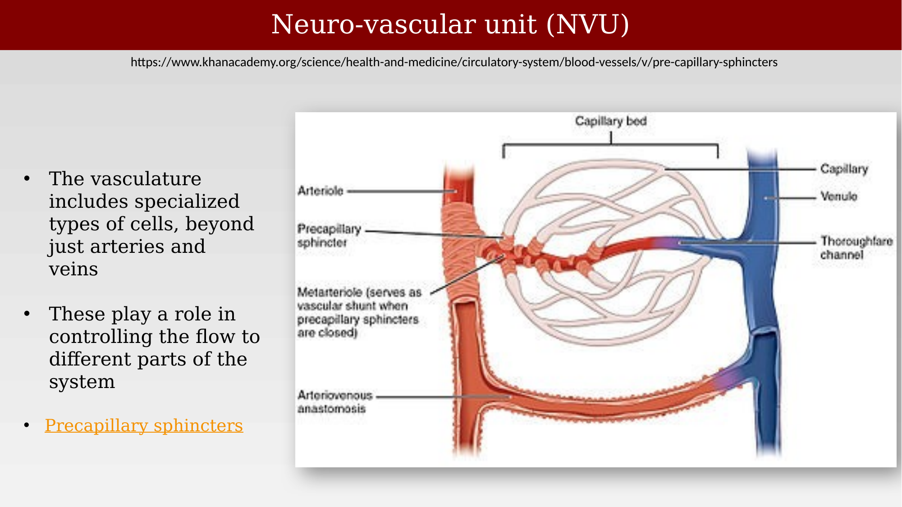
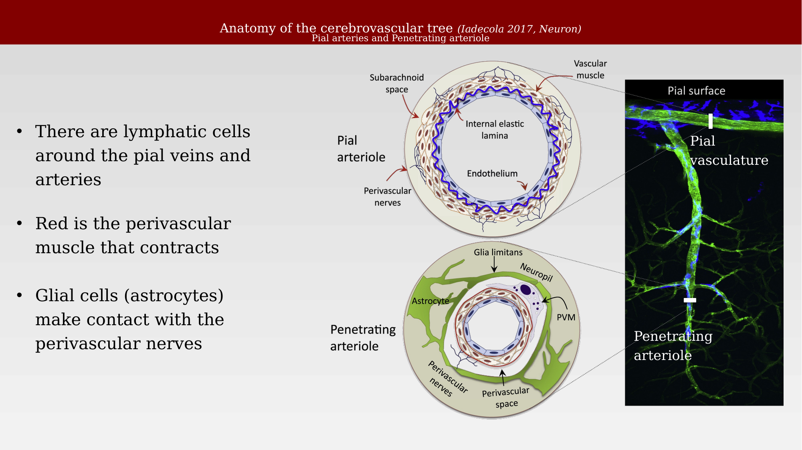
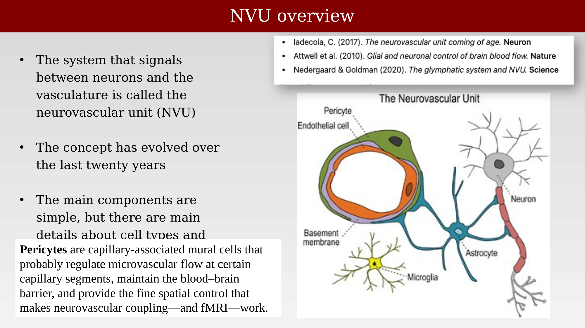

# The neurovascular unit



---

## A relatively new system concept

In 1890, Roy and Sherrington proposed that local neural activity controls local blood flow, but the idea saw little sustained follow-up [@roy1890-bloodsupply]. Through most of 20th-century neuroscience, research focused on neurons and synapses, and the vasculature was largely treated as background. That changed in the late 1990s and early 2000s, when the rise of functional MRI directed attention back to the vascular response and to the cells that produce it: neurons, glia, pericytes, endothelium, and smooth muscle acting together.

The **neurovascular unit (NVU)** names this coupled biological system, linking neural signaling, metabolism, blood flow, and the blood-brain barrier.

## Specialized vascular cell types

Beyond arteries and veins, the vasculature includes specialized cell types — pericytes, smooth muscle, and endothelial cells among them — that control the flow to different parts of the system, including at precapillary sphincters.

{#fig-ch30-nvu-capillary-bed-precapillary-sphincters fig-alt="Diagram of a capillary bed with an arteriole on the left and venule on the right, labeling the precapillary sphincter, metarteriole, capillaries, thoroughfare channel, and arteriovenous anastomosis."}

## Perivascular space and the glymphatic system

The space surrounding brain blood vessels — called the perivascular space or Virchow-Robin space — has a function of its own: clearing waste and distributing solutes through what is now known as the **glymphatic system**. Many different cell types and molecules contribute to this system, including endothelial cells, smooth muscle, pericytes, astrocytes (via aquaporin-4 channels), and the surrounding neuropil, from pial and penetrating arteries down to the capillary bed [@jessen2015-rh].

{#fig-ch30-nvu-glymphatic-drawing fig-alt="Detailed cross-sectional drawing of a pial artery narrowing to a penetrating artery and capillary, with labeled cell types and structures including the perivascular space, pericytes, and astrocyte end-feet."}

## From pial arteries to capillaries

Pial arteries and penetrating arterioles are surrounded by perivascular nerves and contractile perivascular muscle; lymphatic cells are also present around the pial veins and arteries. Glial cells (astrocytes) make contact with these perivascular nerves, coupling neural and vascular signaling from the brain's surface down into the tissue [@iadecola2017-ho].

{#fig-ch30-cerebrovascular-tree-pial-penetrating fig-alt="Two circular cross-section diagrams of a pial arteriole and penetrating arteriole with labeled layers, next to a green-and-blue confocal microscopy image of pial surface and penetrating vasculature."}

At the finest scale, intraparenchymal arterioles and capillaries are wrapped by smooth muscle cells (arterioles) or pericytes (capillaries), astrocyte end-feet, and neurons. The **blood-brain barrier (BBB)** is a highly selective semipermeable barrier formed by these brain endothelial cells that separates circulating blood from the brain's extracellular fluid. It allows the passage of water, some gases, and lipid-soluble molecules by passive diffusion, as well as the selective transport of molecules such as glucose and amino acids that are crucial to neural function.

{#fig-ch30-cerebrovascular-tree-bbb-capillaries fig-alt="Two circular cross-section diagrams of an intraparenchymal arteriole and a capillary with labeled endothelium, smooth muscle cell or pericyte, astrocyte, and neuron, next to a confocal microscopy image of the vasculature."}

## NVU overview
The neurovascular unit is the system that signals between neurons and the vasculature. Its main components are simple — endothelial cells, pericytes, astrocytes, neurons, and microglia — but the details of cell types and signaling continue to be refined, and the concept itself has evolved considerably over the last twenty years [@iadecola2017-ho; @attwell2010-glialneuronalcontrol; @nedergaard2020-glymphaticfailure]. Pericytes, in particular, are capillary-associated mural cells that probably regulate microvascular flow at certain capillary segments, help maintain the blood-brain barrier, and provide the fine spatial control that makes neurovascular coupling — and fMRI — possible.

{#fig-ch30-nvu-overview-diagram fig-alt="Diagram of a capillary cross section with pericyte and endothelial cell, surrounded by an astrocyte, adjacent to a neuron and a microglial cell, labeled with a basement membrane."}

## Capillary-level signaling

There is always a finer resolution waiting to be explored. At the capillary level, synaptic activity increases oxygen utilization and releases K⁺ that is sensed by astrocytic and pericyte K⁺ channels, producing a conducted hyperpolarization that travels along the capillary wall through gap junctions and peg-socket contacts between endothelial cells. This local signal increases flow velocity and red blood cell deformability upstream, coordinated with a dip in local oxygen concentration [@iadecola2017-ho].

{#fig-ch30-capillaries-signaling-iadecola fig-alt="Diagram of two neurons synapsing near an astrocyte process contacting a capillary with a pericyte, showing K+ channels, gap junctions, peg-socket contacts, conducted hyperpolarization, an oxygen dip trace, and increased flow velocity with red blood cells."}

## Viewing the whole system

Putting the pieces together: a stimulus is encoded by neurons and drives synaptic activity, illustrated here by glutamate release. These neuronal signals are monitored by astrocytes, which feed back onto the synapse and also communicate signals to the vasculature — releasing NO, PGE2, EETs, adenosine, and K⁺ — dilating or constricting the arteriole and adjusting flow at the capillary via pericytes. In this way, the vasculature supplies the energy the neural system needs, moment to moment, wherever it is needed.

{#fig-ch30-nvu-whole-system-summary fig-alt="Flow diagram from stimulus to synapse to glutamate, branching to neuron, astrocyte, and pericyte, which signal via NO, PGE2, EET, adenosine, and K+ to an arteriole and capillary shown dilating."}
