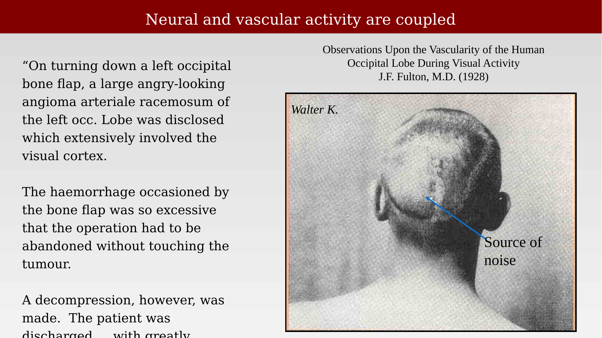
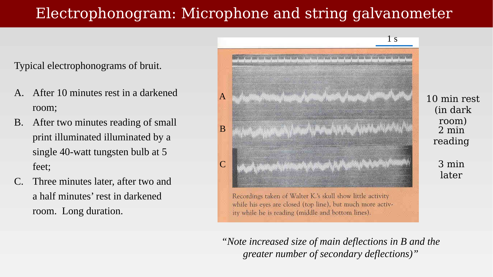

# The story of Walter K



---

## A patient, a bruit, and a hypothesis

Long before neuroimaging existed, clinicians already suspected that brain activity and blood flow were linked. In 1928, J.F. Fulton published a case report proposing that blood flow through the brain increases with sustained mental effort, in harmony with the known increase in metabolic exchange during vigorous intellectual activity [@fulton1928-gq]. At the time, this was suspected but never adequately demonstrated.

Fulton's evidence came from an unusual natural experiment: a patient, referred to as Walter K., who had undergone a left occipital craniotomy for an arteriovenous malformation (an "angioma arteriale racemosum") that extensively involved the visual cortex. The surgery removed a bone flap over the vascular anomaly and left a permanent skull defect. Through this defect, Fulton could place a microphone directly over the exposed vasculature and listen to the blood flow itself.

{#fig-ch31-walter-k-portrait fig-alt="Black and white photograph of the back of a patient's head, labeled Walter K., with an arrow pointing to the source of the noise near the occipital skull defect."}

## Listening to the visual cortex at work

Fulton's microphone picked up a vascular bruit — the sound of blood turbulently rushing through the malformed vessels — and its intensity changed with the patient's behavior. Fulton reported that the noise increased in intensity within twenty to thirty seconds after the patient began to use his eyes, and it was not difficult to convince observers that turning vision on and off reliably changed the sound. When the microphone was moved to other regions of the skull, the bruit was undetectable; it was specific to the site of the malformation.

The effect was also selective for the sense being engaged. Auditory and olfactory stimulation did not increase the bruit's intensity, but the sound increased when the patient tried harder to see, or became tense — on one occasion, Fulton noted a rise of ten points in the patient's systolic blood pressure as he "got worked up" during testing. From these observations, Fulton drew a conclusion that anticipates the logic of modern functional neuroimaging: blood flows to the active parts of the brain when a sense is engaged, and the blood flow itself can serve as an indicator of the underlying neural activity.

## Recording the bruit

Fulton went further than description — he captured the sound quantitatively using a microphone and string galvanometer, producing what he called an **electrophonogram**. The recordings below compare the trace after ten minutes of rest in a darkened room (A), after two minutes of reading small print under a single 40-watt tungsten bulb (B), and again after a further rest period (C). The deflections in trace B are visibly larger and more frequent than in A or C, providing an objective, recorded correlate of the subjective bruit.

{#fig-ch31-electrophonogram-traces fig-alt="Three stacked oscillographic traces labeled A, B, and C, showing small irregular deflections at rest and larger, more frequent deflections during two minutes of reading."}

Fulton's case is a reminder that the core discovery behind functional neuroimaging — that neural activity and local blood flow are coupled — did not begin with MRI, or even with PET. It began with a single patient, a microphone, and a clinician willing to listen closely to a chance opportunity.
