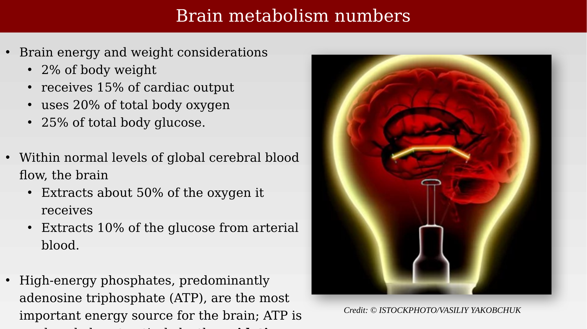
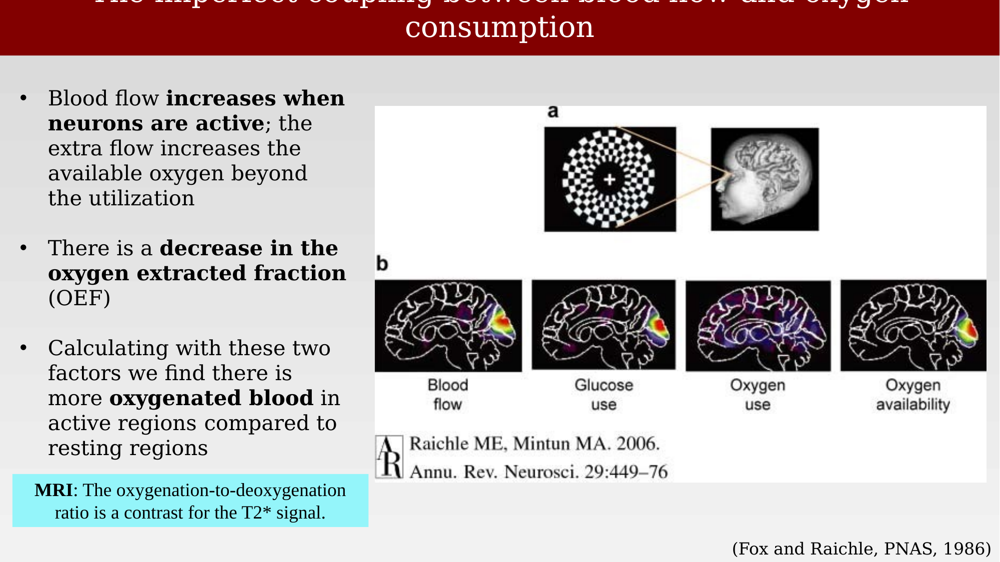
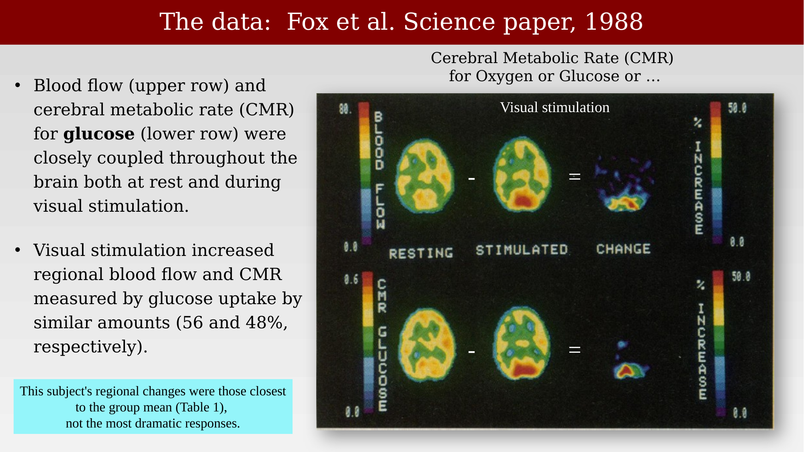
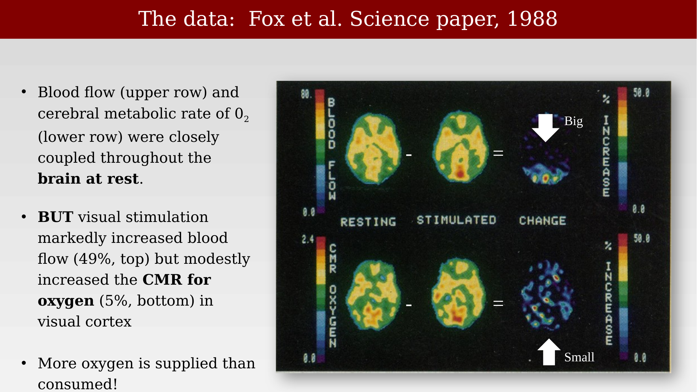
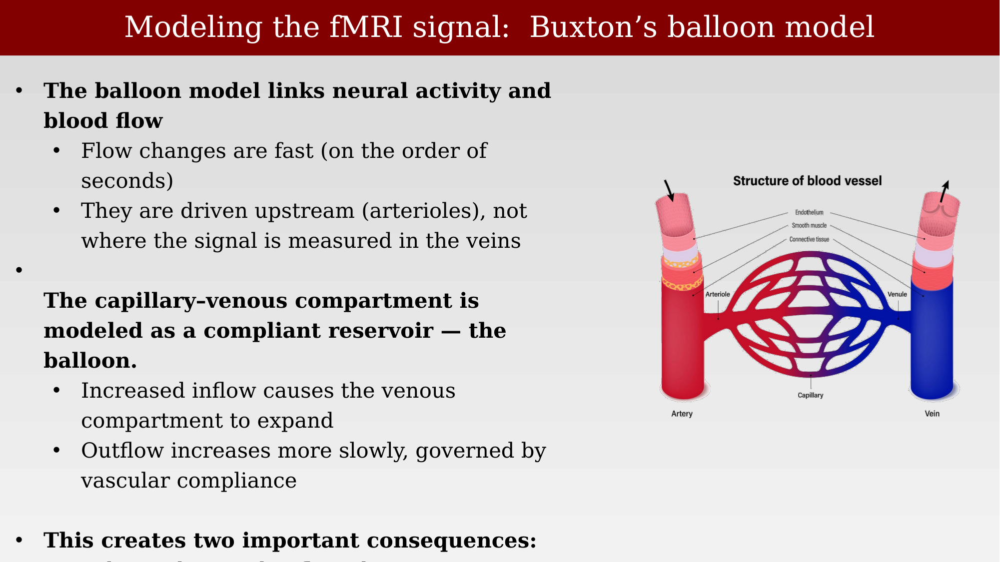
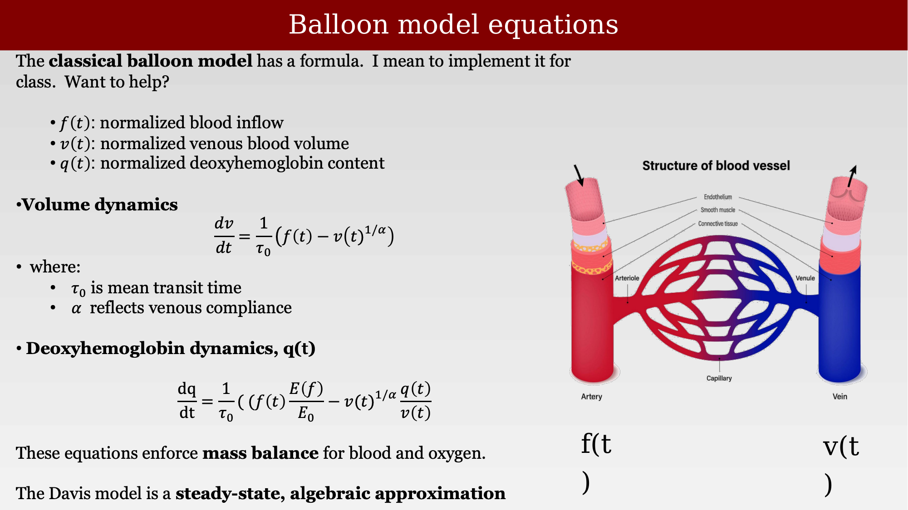

# Blood oxygenation levels and the balloon model



---

When Fulton measured Walter K, it was merely an interesting observation:  activity and blood flow seemed coupled. There was no notion at the time of how we might take advantage of this relationship to make measurements in the living human brain, and certainly not at millimeter resolution! 

There were several additional insights from the biological literature that led to the current methods. One of these was an understanding of how the blood flow and blood oxygen levels related to neural activity.

## Why the brain's energy budget matters for MRI

The brain is metabolically expensive tissue. It makes up only about 2% of body weight, yet it receives roughly 15% of cardiac output and consumes about 20% of the body's total oxygen and 25% of its total glucose. Within the normal range of global cerebral blood flow, the brain extracts about 50% of the oxygen and about 10% of the glucose carried in arterial blood. High-energy phosphates — predominantly ATP — are the brain's principal energy currency, and maintaining their supply is what drives this outsized appetite for oxygen and glucose [@raichle2006-brainwork].

{#fig-ch32-brain-metabolism-numbers fig-alt="Slide listing brain metabolism statistics alongside a glowing red illustration of a brain inside a light bulb, representing brain energy use."}

## Blood flow outpaces oxygen use

If neural activity simply burned oxygen at a locally accelerated rate, one might expect blood flow and oxygen consumption to rise together, in lockstep, wherever neurons became more active. The actual physiology is more surprising: blood flow increases substantially when neurons are active, but the extra flow increases the available oxygen supply by more than local oxygen use goes up. As a result, the fraction of oxygen actually extracted from the blood — the **oxygen extraction fraction (OEF)** — decreases in active regions. Combining these two effects, an active region ends up with relatively more oxygenated blood than a resting region [@foxraichle1986-uncoupling].

This is the physiological fact that makes BOLD contrast possible: because the oxygenation-to-deoxygenation ratio changes with neural activity, and because oxygenated and deoxygenated hemoglobin have different magnetic properties, this ratio becomes a contrast mechanism for the T2*-weighted MRI signal.

{#fig-ch32-imperfect-coupling-flow-oxygen fig-alt="Slide showing a schematic PET stimulus display alongside four brain PET maps labeled blood flow, glucose use, oxygen use, and oxygen availability."}

## The Fox et al. 1988 data

The clearest early demonstration of this uncoupling came from Fox, Raichle, Mintun, and Dence's 1988 PET study comparing blood flow to cerebral metabolic rate (CMR) for glucose and for oxygen, at rest and during visual stimulation [@fox1988-nonoxidative].

For glucose, blood flow (upper row) and the cerebral metabolic rate for glucose (lower row) were closely coupled throughout the brain, both at rest and during visual stimulation: stimulation increased regional blood flow and glucose CMR by similar amounts (49% and 56%, respectively).

{#fig-ch32-fox1988-glucose-cmr fig-alt="PET images comparing resting and stimulated blood flow and glucose metabolic rate, with a difference map and percent increase color scale."}

For oxygen, the story is different. Blood flow and oxygen CMR were closely coupled at rest, but visual stimulation markedly increased blood flow (49%) while only modestly increasing oxygen CMR (5%). More oxygen is delivered to the active tissue than is actually consumed there.

{#fig-ch32-fox1988-oxygen-cmr fig-alt="PET images comparing resting and stimulated blood flow and oxygen metabolic rate, with a difference map and percent increase color scale, with arrows highlighting a large blood-flow increase and a small oxygen increase."}

## Summary: an oversupply of oxygen

Putting the numbers together: the heart and lungs oxygenate the blood delivered to the brain. During rest, about 40% of that oxygen is consumed by brain tissue. In the active state, 30–50% more blood is delivered, but only about 5% more oxygen is consumed — so more oxygen is supplied than is used, and the oversupply shifts the local oxy/deoxy ratio measurably. This shift in the ratio of oxygenated to deoxygenated hemoglobin is precisely what the BOLD signal detects.

{#fig-ch32-oxy-deoxy-ratio-summary fig-alt="Diagram of heart and lungs supplying arterial blood to the brain and receiving venous blood back, comparing oxygen extraction fraction between a resting control state and an active state."}

## The Balloon Model

The observations establish the physiology: neural activity drives a rapid increase in blood flow, and this flow increase outpaces oxygen consumption, so active tissue ends up relatively more oxygenated. To turn this physiology into a quantitative, testable model of the BOLD signal, Buxton, Wong, and Frank proposed the **balloon model** [@buxton1998-balloon].

The model's key move is to focus on the venous side of the vasculature, where the BOLD signal is actually measured, and to treat the capillary-venous compartment as a compliant reservoir — the "balloon." Two facts about the underlying physiology motivate this approach: flow changes are fast, on the order of seconds, and they are driven upstream at the arterioles, not at the site where the signal is measured in the veins.

{#fig-ch32-balloon-model-intro fig-alt="Diagram of a blood vessel showing endothelium, smooth muscle, and connective tissue layers across an artery, capillary, and vein."}

In the balloon model, increased inflow causes the venous compartment to expand, while outflow increases more slowly, governed by the vascular compliance of the vessel wall. This asymmetry — fast inflow, slower, compliance-limited outflow — is what gives the model its name and its characteristic dynamics.

## Quantifying the oxy/deoxy ratio

Continuing the approximate numbers introduced in the previous chapter, consider a simplified balance sheet for oxygen delivery and consumption. At rest, if 100 units of oxygenated blood flow in and 40 units of oxygen are consumed (CMRO₂), the oxygen extraction fraction (OEF) is 40%, leaving 60% oxygen saturation in the venous blood. In the active state, flow increases roughly tenfold (to 1000 units) while oxygen consumption increases only to 200 units — five times, not ten. The OEF therefore drops to 20%, and the venous oxygen saturation rises to 80%. More oxygenated blood in the active state means a higher fMRI signal.

{#fig-ch32-oxy-deoxy-quantification-table fig-alt="Table with columns for flow, oxygen consumed (CMRO2), oxygen extraction fraction, oxygen out (venous), and venous oxygen percentage, comparing rest and active states."}

## The balloon model equations

The balloon model formalizes these ideas with two coupled differential equations tracking normalized blood volume $v(t)$ and normalized deoxyhemoglobin content $q(t)$, driven by the normalized arterial blood inflow $f(t)$.

Volume dynamics — the venous compartment fills faster than it empties, with time constant $\tau_0$ (mean transit time) and a compliance parameter $\alpha$:

$$
\frac{dv}{dt} = \frac{1}{\tau_0}\left(f(t) - v(t)^{1/\alpha}\right)
$$

Deoxyhemoglobin dynamics — deoxyhemoglobin is delivered by flow, extracted at a rate governed by the ratio of extraction fractions $E(t)/E_0$, and washed out with outflow $v(t)^{1/\alpha}$:

$$
\frac{dq}{dt} = \frac{1}{\tau_0}\left(f(t)\,\frac{E(t)}{E_0} - v(t)^{1/\alpha}\,\frac{q(t)}{v(t)}\right)
$$

These equations enforce mass balance for both blood volume and deoxyhemoglobin content. The Davis model, discussed elsewhere in these notes, is a steady-state, algebraic approximation to this more complete dynamic system.

{#fig-ch32-balloon-model-equations fig-alt="Slide showing the balloon model volume dynamics and deoxyhemoglobin dynamics differential equations, alongside the blood vessel structure diagram labeled f(t) and v(t)."}

## Putting the pieces together

Summarizing the balloon model's logic: neural activation causes a rapid increase in arterial inflow, $f(t)$ — this inflow change is taken as an input to the model, not something the model itself explains. Blood enters the venous compartment (the "balloon") faster than it can leave, so the compartment expands; outflow depends on the accumulated volume and the vessel's compliance, producing delayed emptying relative to inflow.

Critically, the oxygen extraction rate does not increase as much as flow does, so the increased flow dilutes deoxyhemoglobin in the venous blood. Since deoxyhemoglobin is the primary source of BOLD contrast, this dilution — not a change in extraction — is why the BOLD signal rises with neural activity. Oxygen delivery, extraction, and washout are all governed by conservation laws, and these constraints are what link flow, volume, and deoxyhemoglobin content over time in the model's equations.

{#fig-ch32-balloon-model-summary fig-alt="Slide summarizing the balloon model in four sections: neural activity to flow increase, venous blood volume as the balloon, deoxyhemoglobin concentration, and mass conservation as the key to the equations."}

::: {.callout-note}
Two of the deck's original diagrams for this section ("Balloon model concept," covering the inflate/deflate schematic) were stored as EMF+ vector graphics that could not be rasterized by the tools available in this extraction pipeline — LibreOffice's EMF import does not support the EMF+ (GDI+) extension these files use, and the files contain no fallback raster data. See `TODO.md` for a note on re-exporting these two slides as PNG directly from PowerPoint.
:::

