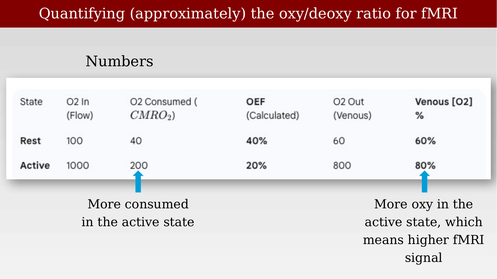
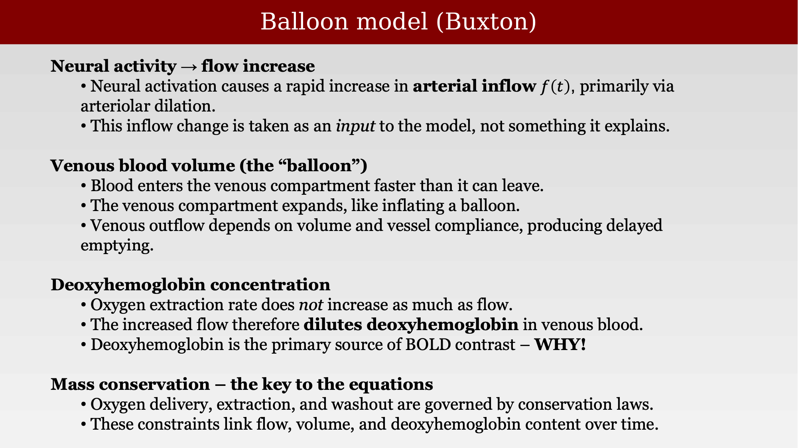

# The Balloon model



---

## Linking neural activity to the measured signal

The observations in the previous chapter establish the physiology: neural activity drives a rapid increase in blood flow, and this flow increase outpaces oxygen consumption, so active tissue ends up relatively more oxygenated. To turn this physiology into a quantitative, testable model of the BOLD signal, Buxton, Wong, and Frank proposed the **balloon model** [@buxton1998-balloon].

The model's key move is to focus on the venous side of the vasculature, where the BOLD signal is actually measured, and to treat the capillary-venous compartment as a compliant reservoir — the "balloon." Two facts about the underlying physiology motivate this approach: flow changes are fast, on the order of seconds, and they are driven upstream at the arterioles, not at the site where the signal is measured in the veins.

{#fig-ch33-balloon-model-intro fig-alt="Diagram of a blood vessel showing endothelium, smooth muscle, and connective tissue layers across an artery, capillary, and vein."}

In the balloon model, increased inflow causes the venous compartment to expand, while outflow increases more slowly, governed by the vascular compliance of the vessel wall. This asymmetry — fast inflow, slower, compliance-limited outflow — is what gives the model its name and its characteristic dynamics.

## Quantifying the oxy/deoxy ratio

Continuing the approximate numbers introduced in the previous chapter, consider a simplified balance sheet for oxygen delivery and consumption. At rest, if 100 units of oxygenated blood flow in and 40 units of oxygen are consumed (CMRO₂), the oxygen extraction fraction (OEF) is 40%, leaving 60% oxygen saturation in the venous blood. In the active state, flow increases roughly tenfold (to 1000 units) while oxygen consumption increases only to 200 units — five times, not ten. The OEF therefore drops to 20%, and the venous oxygen saturation rises to 80%. More oxygenated blood in the active state means a higher fMRI signal.

{#fig-ch33-oxy-deoxy-quantification-table fig-alt="Table with columns for flow, oxygen consumed (CMRO2), oxygen extraction fraction, oxygen out (venous), and venous oxygen percentage, comparing rest and active states."}

## The balloon model equations

The balloon model formalizes these ideas with two coupled differential equations tracking normalized blood volume $v(t)$ and normalized deoxyhemoglobin content $q(t)$, driven by the normalized arterial blood inflow $f(t)$.

Volume dynamics — the venous compartment fills faster than it empties, with time constant $\tau_0$ (mean transit time) and a compliance parameter $\alpha$:

$$
\frac{dv}{dt} = \frac{1}{\tau_0}\left(f(t) - v(t)^{1/\alpha}\right)
$$

Deoxyhemoglobin dynamics — deoxyhemoglobin is delivered by flow, extracted at a rate governed by the ratio of extraction fractions $E(t)/E_0$, and washed out with outflow $v(t)^{1/\alpha}$:

$$
\frac{dq}{dt} = \frac{1}{\tau_0}\left(f(t)\,\frac{E(t)}{E_0} - v(t)^{1/\alpha}\,\frac{q(t)}{v(t)}\right)
$$

These equations enforce mass balance for both blood volume and deoxyhemoglobin content. The Davis model, discussed elsewhere in these notes, is a steady-state, algebraic approximation to this more complete dynamic system.

{#fig-ch33-balloon-model-equations fig-alt="Slide showing the balloon model volume dynamics and deoxyhemoglobin dynamics differential equations, alongside the blood vessel structure diagram labeled f(t) and v(t)."}

## Putting the pieces together

Summarizing the balloon model's logic: neural activation causes a rapid increase in arterial inflow, $f(t)$ — this inflow change is taken as an input to the model, not something the model itself explains. Blood enters the venous compartment (the "balloon") faster than it can leave, so the compartment expands; outflow depends on the accumulated volume and the vessel's compliance, producing delayed emptying relative to inflow.

Critically, the oxygen extraction rate does not increase as much as flow does, so the increased flow dilutes deoxyhemoglobin in the venous blood. Since deoxyhemoglobin is the primary source of BOLD contrast, this dilution — not a change in extraction — is why the BOLD signal rises with neural activity. Oxygen delivery, extraction, and washout are all governed by conservation laws, and these constraints are what link flow, volume, and deoxyhemoglobin content over time in the model's equations.

{#fig-ch33-balloon-model-summary fig-alt="Slide summarizing the balloon model in four sections: neural activity to flow increase, venous blood volume as the balloon, deoxyhemoglobin concentration, and mass conservation as the key to the equations."}

::: {.callout-note}
Two of the deck's original diagrams for this section ("Balloon model concept," covering the inflate/deflate schematic) were stored as EMF+ vector graphics that could not be rasterized by the tools available in this extraction pipeline — LibreOffice's EMF import does not support the EMF+ (GDI+) extension these files use, and the files contain no fallback raster data. See `TODO.md` for a note on re-exporting these two slides as PNG directly from PowerPoint.
:::
