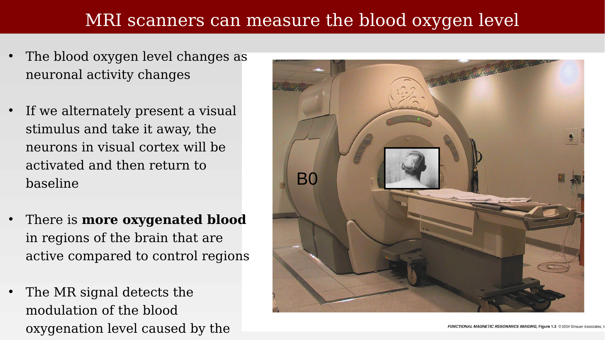
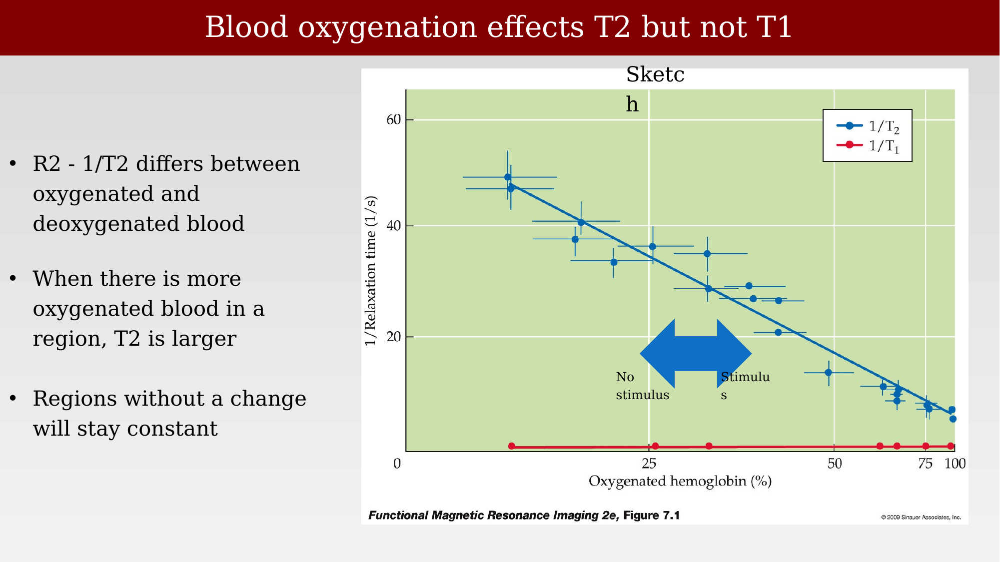
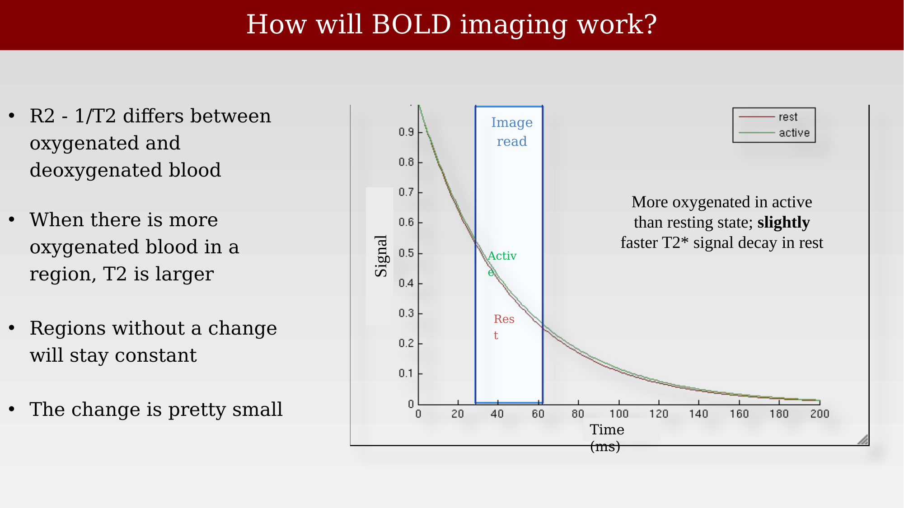

# The functional MRI signal



---

## The discovery of BOLD

Two research groups working independently in the early 1990s were the first to demonstrate that MRI could detect human brain activity through the blood-oxygenation effect: Seiji Ogawa and Ken Kwong. Their route to publication was not smooth. As Ogawa later recounted, the first paper describing these results was submitted to *Nature* and rejected without being sent for scientific review — the editors judged it "not of general interest." After the rejection, the group resubmitted to *Proceedings of the National Academy of Sciences* (PNAS), where the paper was received in March 1992 and appeared in July 1992 [@ogawa1992].

## The early data

Both groups' original figures are worth looking at directly, because they show the entire logic of BOLD imaging condensed into a single result. Ogawa's images (panel A) show a T1-weighted anatomical scan of the calcarine sulcus, a gradient-echo image from the same slice, and the difference between gradient-echo images acquired during visual (photic) stimulation and during darkness — with accompanying time series showing the signal rising and falling as the light was turned on and off. Kwong's images (panel B) used inversion-recovery measurements sensitive to blood flow: the baseline image and a series of difference images show bright functional responses appearing in visual cortex during photic stimulation, and the time series again tracks the response as the stimulus is toggled on and off [@ogawa1992; @kwong1992-mri].

{#fig-ch34-ogawa-kwong-original-data fig-alt="Composite figure showing Ogawa's T1, gradient-echo, and difference images of the calcarine sulcus alongside Kwong's inversion-recovery difference images and both groups' response time series."}

These initial human fMRI experiments were met with some skepticism, in part because the expected signal changes were small and the underlying physiological chain — from neural activity, to blood flow, to oxygenation, to an MRI-detectable signal — was still being worked out at the time.

## How BOLD imaging works, physically

The MRI scanner detects the blood oxygenation level indirectly, through its effect on the local magnetic field and hence on T2/T2* relaxation. The logic runs as follows: the blood oxygen level changes as neuronal activity changes, and if a visual stimulus is alternately presented and withdrawn, neurons in visual cortex are activated and then return to baseline. Because there is more oxygenated blood in active regions than in resting control regions, the MR signal — which detects this modulation of blood oxygenation — can be used to infer where neural activity is occurring [@huettel2009-fmri].

{#fig-ch34-scanner-b0-photo fig-alt="Photograph of a cylindrical MRI scanner bore labeled B0, with a patient positioned on the scanner table."}

The physical basis is a difference between T1 and T2: oxygenated and deoxygenated blood have different magnetic susceptibilities, so R2 (= 1/T2) differs between them. When a region has more oxygenated blood, T2 is larger (slower decay); regions without a change in oxygenation stay constant. Critically, this effect is specific to T2 — it does not appreciably affect T1.

{#fig-ch34-t2-oxygenation-relaxation-plot fig-alt="Scatter plot of relaxation rate versus percent oxygenated hemoglobin, with a steep downward trend for 1/T2 and a flat, near-zero line for 1/T1." fig-cap-location="margin"}

## Translating relaxation-rate changes into a measurable signal

The change in T2/T2* between rest and activity is small, but it is measurable given a well-chosen imaging readout. A simple simulation illustrates the point: given typical measured T2* values at 3T for the rest state (mean of four measurements, about 45.3 ms) and the active state (about 46.7 ms), the expected T2* signal decay curves for rest and active conditions are nearly superimposed, but not identical. Sampling the signal during a fixed image-readout window (starting at the echo time, TE, and lasting for the readout duration) captures a small but consistent difference between the two decay curves — this difference, accumulated over an image acquisition, is the raw material of the BOLD contrast.

{#fig-ch34-bold-signal-decay-model fig-alt="Plot of MR signal (vertical axis) versus time in milliseconds (horizontal axis), showing two nearly overlapping exponential decay curves for rest and active states, with a shaded image-readout window."}

The MATLAB code below reproduces this simulation. It computes exponential decay curves $S(t) = e^{-t/T_2^{*}}$ for the rest and active T2* values, marks the readout window, and then computes both the absolute signal difference and the percent signal change between the two conditions — the quantity that is ultimately mapped onto the brain in a BOLD activation map.

```matlab
% some constants
te = 29;       % te for spiral-out
readout = 33;  % duration of readout

% time in milliseconds
x = 0:200;

% te_rest is the rest-state T2*; te_active is the active-state T2*; (at 3 T)
te_rest = [44.9 46.1 43.9 46.1];
te_active = [46.4 48.7 45.4 46.1+.93];

% let's just take the mean
te_rest = mean(te_rest);
te_active = mean(te_active);

% look at signal decay
figure; hold on;
plot(x,exp(-x./te_rest),'r-');
plot(x,exp(-x./te_active),'g-');
straightline([te te+readout],'v','b-');
xlabel('time (ms)');
ylabel('signal');
legend({'rest' 'active'});
title('signal decay');

% look at difference between active and rest
figure; hold on;
plot(x,exp(-x./te_active)-exp(-x./te_rest),'r-');
straightline([te te+readout],'v','b-');
xlabel('time (ms)');
ylabel('signal difference');
title('difference in signal between active and rest');

% look at the percent change relative to rest
figure; hold on;
plot(x,(exp(-x./te_active)./exp(-x./te_rest) - 1) * 100,'r-');
straightline([te te+readout],'v','b-');
xlabel('time (ms)');
ylabel('percent change');
title('percent change relative to rest');
```

The change is small — typical BOLD percent signal changes are on the order of a few percent — which is why fMRI experiments rely on repeated stimulus presentations and averaging to reliably detect the effect against ongoing physiological and thermal noise.
