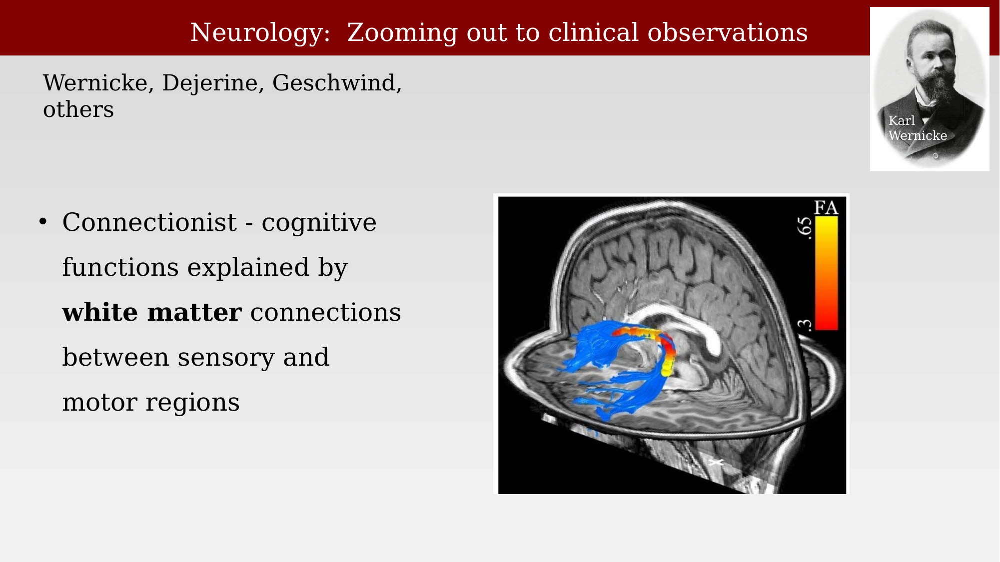
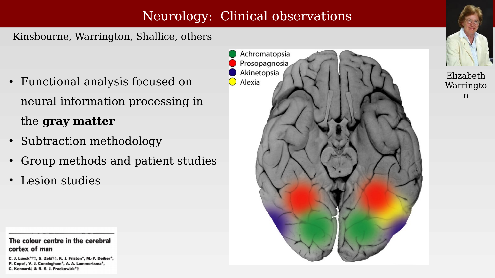
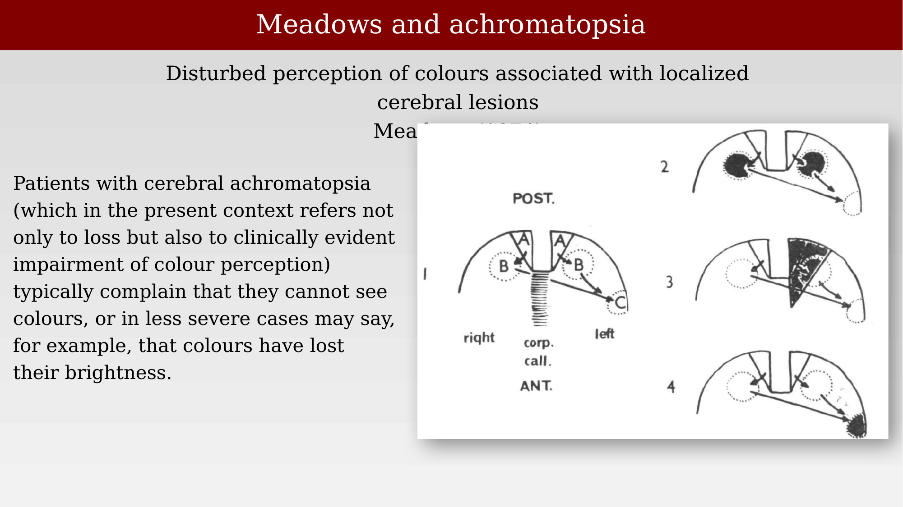
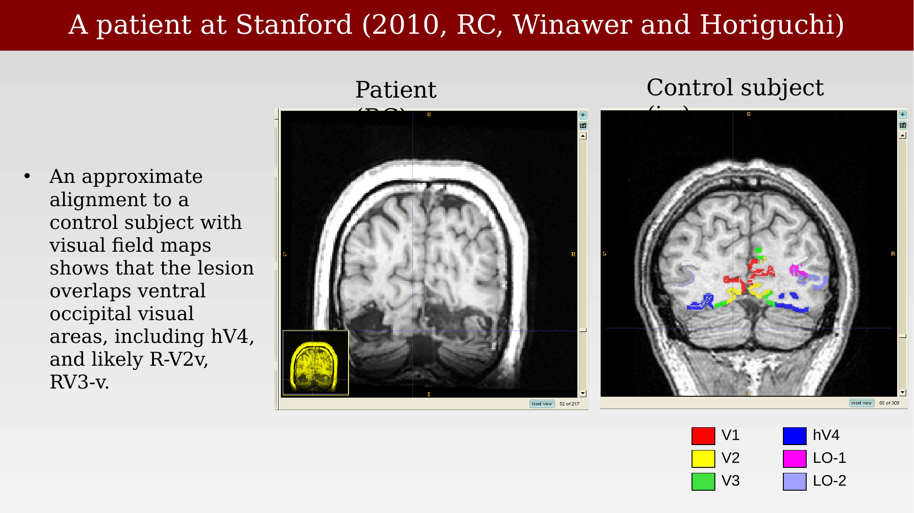
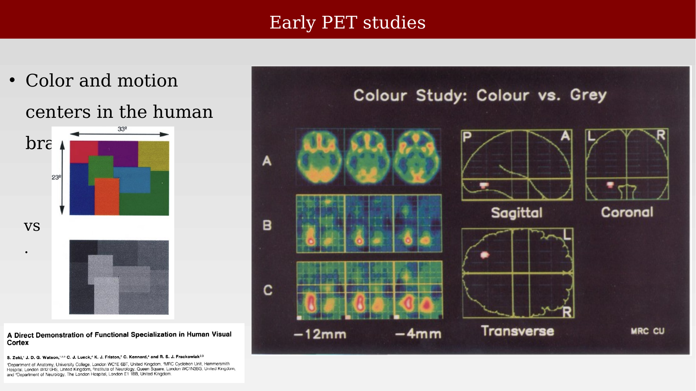
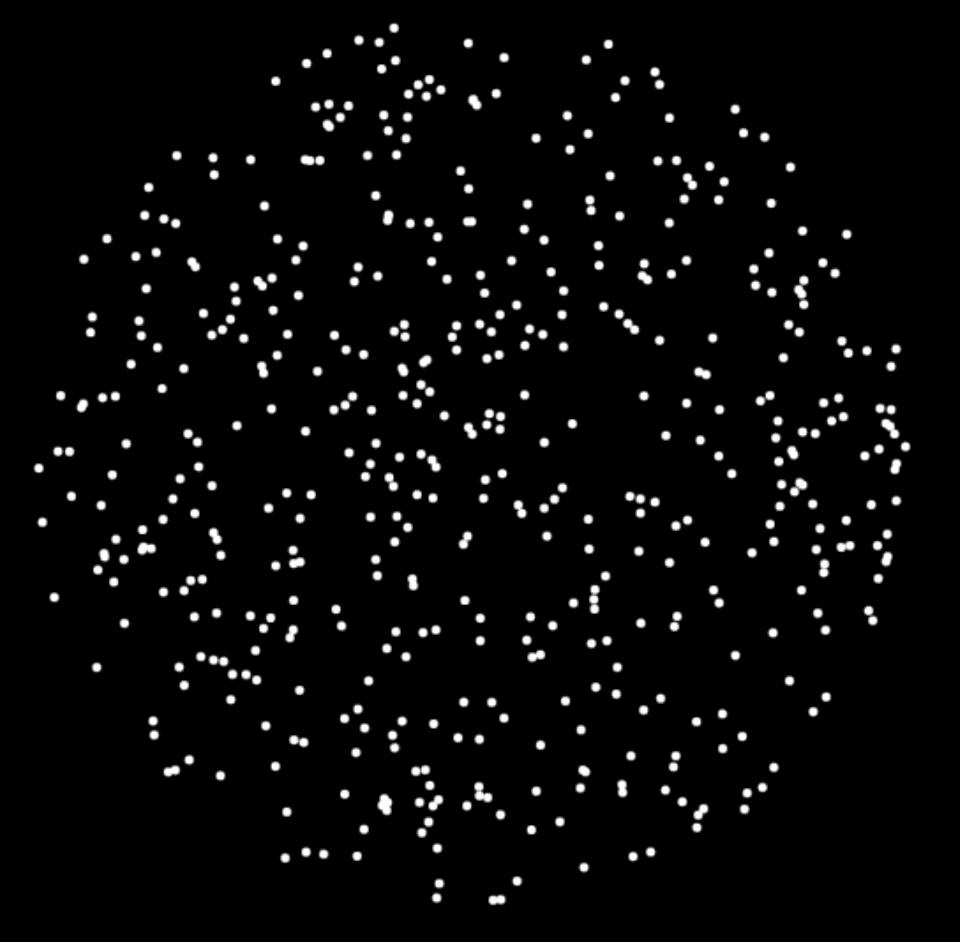
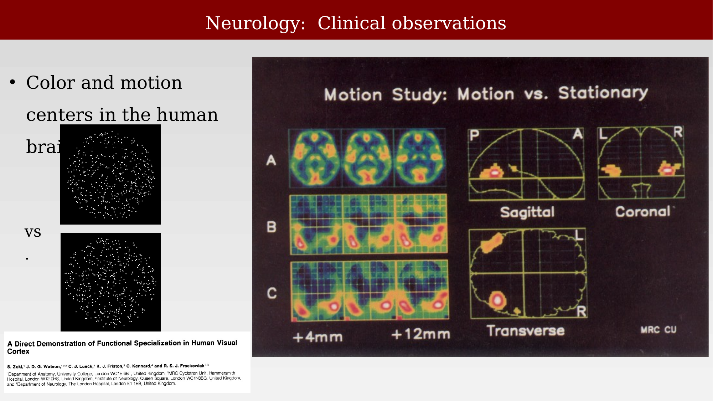

# Early neurological observations



---

## The connectionist perspective

Before functional neuroimaging existed, the study of human brain function relied almost entirely on clinical neurology: relating a patient's behavioral deficits to the location of a lesion, inferred from a stroke, tumor, or surgical resection. Two broad traditions shaped this work. A **connectionist** tradition — associated with Wernicke, Dejerine, Geschwind, and others — explained cognitive functions in terms of white-matter connections linking sensory and motor regions, treating disconnection between intact processing centers as a source of deficits [@dejerine1892-alexia].

{#fig-ch35-connectionist-white-matter fig-alt="Sagittal brain MRI with a colored tractography overlay in blue, red, and yellow, showing a white matter fiber bundle, alongside a portrait labeled Karl Wernicke."}

## The neurologists at work

A second, complementary tradition — associated with Kinsbourne, Warrington, Shallice, and others — focused functional analysis on neural information processing within the **gray matter** itself, rather than on connections between regions. This approach relied on a subtraction methodology, comparing performance across tasks that differ in one component process, together with group studies and single-patient lesion studies. Both traditions converge on a common logic that later became central to functional imaging: localize a deficit (or, later, an activation) by comparing conditions that isolate one cognitive or perceptual component.

{#fig-ch35-clinical-observations-map fig-alt="Inferior view of a brain template with four colored regions labeled achromatopsia (green), prosopagnosia (red), akinetopsia (blue), and alexia (yellow), alongside a portrait of Elizabeth Warrington."}

## Meadows and cortical color blindness

One of the clearest examples of this lesion-based approach is **cerebral achromatopsia**: an acquired loss or impairment of color perception following a localized cerebral lesion, first characterized systematically by Meadows in 1974 [@meadows1974]. Meadows described the disorder using patient reports rather than instrumentation: patients with cerebral achromatopsia typically complain that they cannot see colors at all, or, in less severe cases, that colors have lost their brightness.

A common complaint is that everything looks grey, or in varying shades of black and white — and, as a consequence, everyday objects whose identification depends on their exact hue can become difficult to distinguish. Meadows noted that patients might find it impossible to tell pickle from jam without tasting or smelling them, or confuse "copper" and "silver" coins of similar size by appearance alone.

{#fig-ch35-meadows-achromatopsia-lesion fig-alt="Four schematic brain outline diagrams labeled 1 through 4, each showing a shaded lesion region near the posterior corpus callosum, with anterior and posterior orientation labels."}

## A patient with cerebral achromatopsia

We had the opportunity to work with a volunteer at Stanford in 2010 (referred to as RC).  His lesion and behavior were studied by Winawer and Horiguchi. An approximate alignment of the patient's anatomical scan to a control subject's visual field maps showed that the lesion overlapped ventral occipital visual areas, including the region Meadows identified (now called hV4) and extending into the right hemisphere's visual field maps.  (We will say more about these maps and how they are measured later).

{#fig-ch35-stanford-patient-rc-mri fig-alt="Two coronal brain MRI slices side by side, one from the patient showing a lesion, one from a control subject with colored visual area labels V1 through LO-2 overlaid on ventral occipital cortex."}

The clinical picture behind this anatomical finding was a practical difficulty with color appearance. In the video below, the patient is shown a colored image on a monitor and asked whether they can identify what is depicted — a direct, bedside demonstration of the same functional deficit that Meadows described in prose and that the lesion-overlap and PET studies above localize anatomically.

::: {.content-visible when-format="html"}
{#vid-ch35-patient-color-testing width="70%"}
:::

::: {.content-visible when-format="pdf"}
{#vid-ch35-patient-color-testing width="70%"}
:::

## Lesions and imaging combined
Bouvier and Engel later compared the two lines of evidence directly, overlaying lesion locations from achromatopsia patients with peak activation loci reported across multiple functional-imaging studies of color processing. The overlap is informative but imperfect: lesion overlap clusters broadly around the same fusiform/lingual region implicated by PET and fMRI activation studies, with some spread reflecting differences in patient samples, lesion extent, and imaging methodology across studies [@bouvierBehavioralDeficitsCortical2006].

{#fig-ch35-bouvier-engel-lesion-overlap fig-alt="Inferior view of the brain showing a color-coded percent-overlap map of achromatopsia lesions, with small symbol markers indicating peak activation loci from several published neuroimaging studies."}

## Prior to fMRI:  PET studies of color and motion

The logic of lesion studies — find where damage produces a deficit — has a natural counterpart in functional imaging: find where a stimulus produces activation. Zeki and colleagues used PET to directly demonstrate functional specialization in human visual cortex, comparing brain responses to color versus achromatic (grey) versions of the same abstract display, and to a moving versus a stationary version of a random-dot pattern [@zeki1991-cortex].

In the color study, viewing a colored Mondrian-like display, compared with an isoluminant grey version of the same display, produced a focal increase in a region of the fusiform/lingual gyrus — a human color center, later often referred to as V4 or a V4-complex.

{#fig-ch35-zeki-color-pet-study fig-alt="PET brain activation maps in axial, sagittal, coronal, and transverse views, comparing a colored Mondrian display to a grey control, with small color-versus-grey stimulus thumbnails."}

This approach - of comparing the neuroimaging response to two stimuli to identify a specific functional center - became a widely used approach.  The idea was to find two stimuli that differed only in the labeled dimension, color in the case above. 

Another early study was to compare two stimuli that differed with respect to motion. In the motion study, viewing a display of moving random dots, compared with the same dots held stationary, produced a focal increase in a distinct region near the temporo-parieto-occipital junction — a human motion center, later widely known as V5/MT.

::: {.content-visible when-format="html"}
{#vid-ch35-random-dots-stimulus width="50%" loop="true" autoplay="true" muted="true"}
:::

::: {.content-visible when-format="pdf"}
{#vid-ch35-random-dots-stimulus width="50%"}
:::

{#fig-ch35-zeki-motion-pet-study fig-alt="PET brain activation maps in axial, sagittal, coronal, and transverse views, comparing a moving-dots display to a stationary control, with small motion-versus-stationary stimulus thumbnails."}

We will see the same logic of this **subtraction methodology** applied in many other ways, including specialization for faces, or words, and well into cognition (fear, mood). These can be useful preliminary studies, but in my opinion it is a fairly limited approach to understanding brain signaling.

## Discussion

Taken together, these methods — patient lesion mapping, PET activation studies, and single-patient case comparisons — all rest on a **subtraction** logic: comparing two conditions (lesioned versus intact, stimulated versus baseline, patient versus control) and attributing the difference to the process that differs between them. This raises two questions worth discussing before moving to the data-analysis methods used in modern fMRI: what should we conclude about regions where a subtraction produces zero difference — is that evidence of no involvement, or simply a failure to detect a real effect? And how would the conclusions from any of these studies change if the underlying measurements were noisier, or less noisy, than they were?
