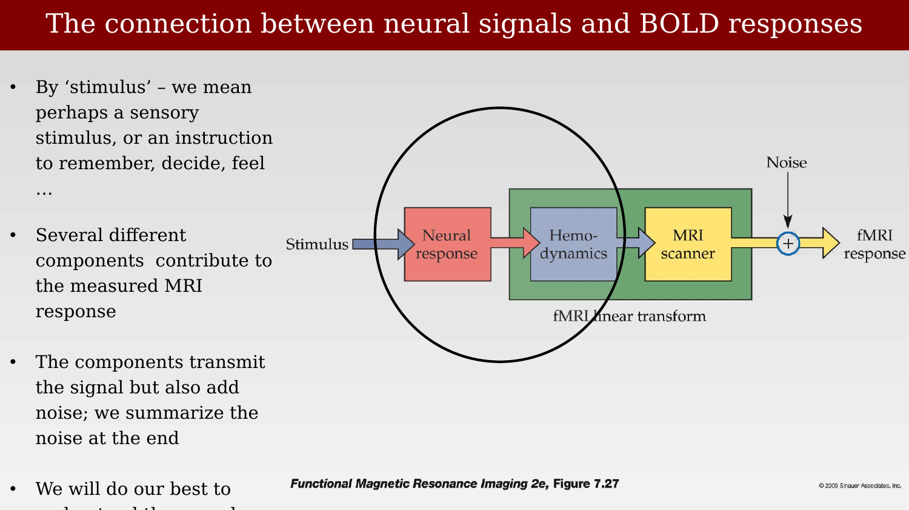

# Electrophysiological and fMRI signals



---

For many years, a central question in neuroimaging was whether the fMRI signal is directly coupled to spikes — the action potentials that carry information along an axon. Framed this way, the question is too narrow, and probably never true in any strict sense. The blood supply does not measure spikes directly; it responds to local metabolic demand, which astrocytes sense at the synapse. A coupling between the BOLD signal and spiking would only be expected if spikes were the principal driver of that metabolic demand.

The broader picture is that many different signals contribute to metabolic demand: ionotropic and metabotropic transmission, volume transmission, neuromodulators, and both spiking and sub-threshold synaptic activity. The chapters that follow examine this hypothesis directly, using experiments that separate electrical signals into their components and ask which components predict the BOLD response. The short answer, developed across several experiments, is that spikes are not always tightly coupled to metabolic demand — sometimes they are, but in other cases, particularly those that depend on the local circuitry, metabolic demand can be dissociated from spiking activity.

## The measurement pipeline

Any comparison between an electrophysiological signal and an fMRI signal passes through several stages, each of which transmits signal but also adds noise:

{#fig-ch36-neural-to-bold-pipeline fig-alt="Block diagram showing a stimulus arrow feeding into a neural response block, then a hemodynamics block, then an MRI scanner block, with a noise term added before the final fMRI response, with a circle around the neural response and hemodynamics stages labeled fMRI linear transform."}

By "stimulus" we mean this broadly — a sensory stimulus, or an instruction to remember, decide, or feel. The next chapters work through this pipeline stage by stage, starting with a set of experiments that isolate the connection between synaptic and spiking activity and local blood flow.
