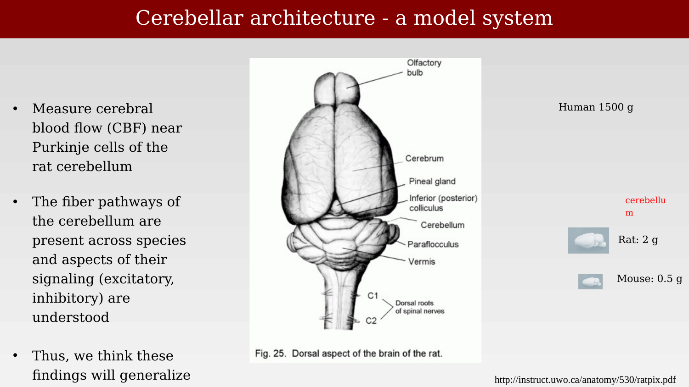
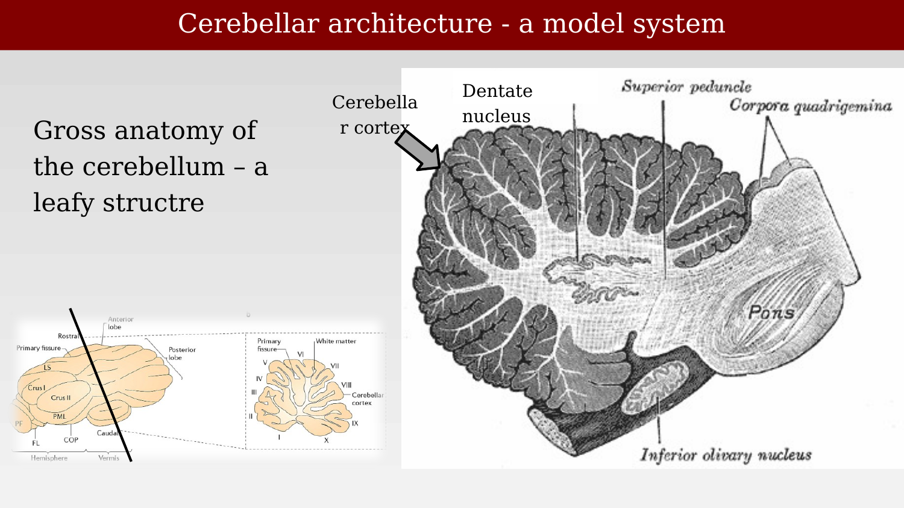
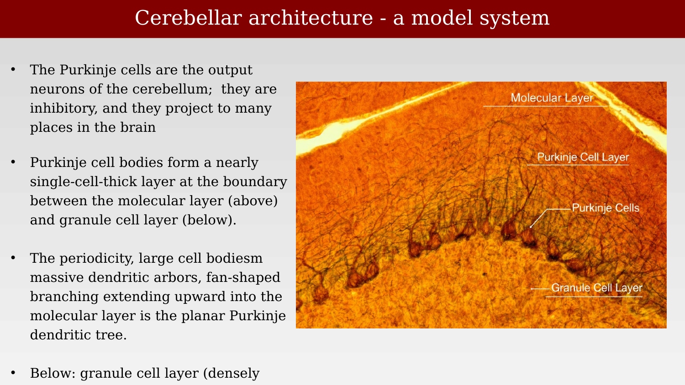
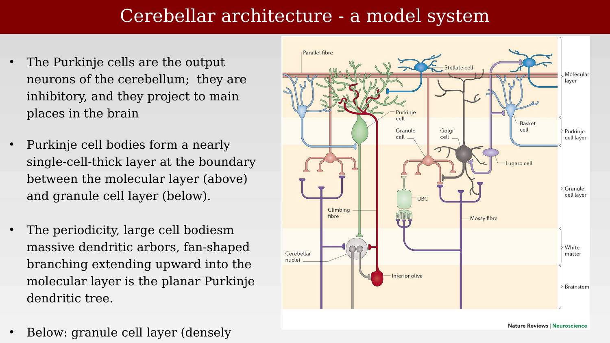
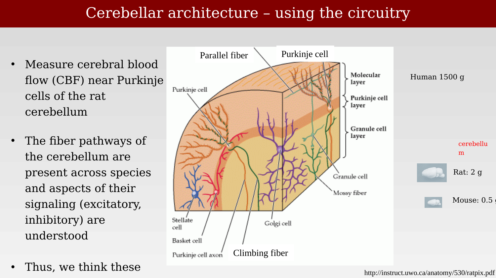
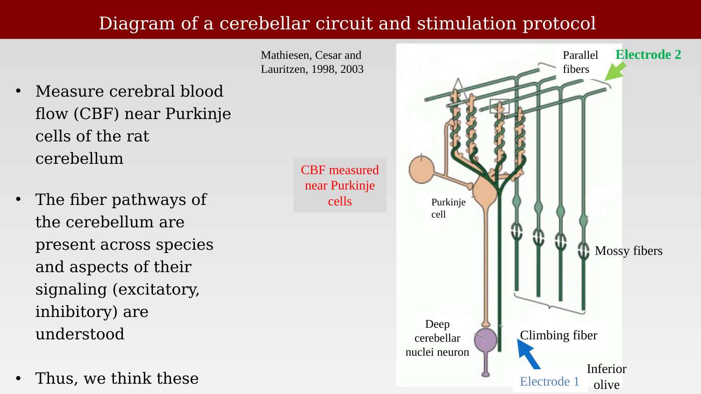
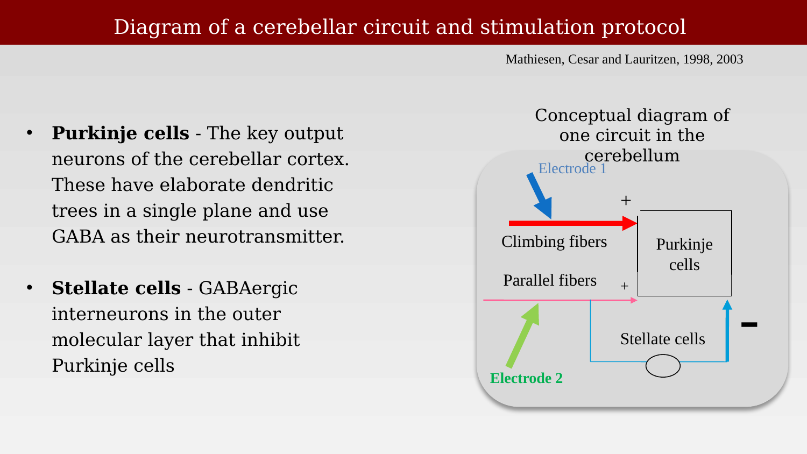
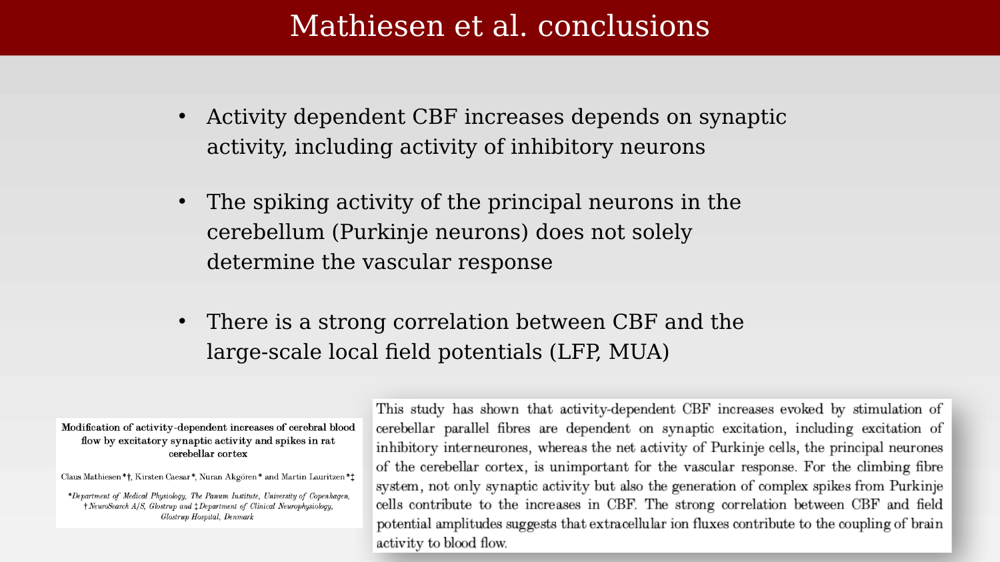

# The Mathiesen-Lauritzen experiments



---

For many years, a central question in neuroimaging was whether the fMRI signal is directly coupled to spikes — the action potentials that carry information along an axon. Framed this way, the question is too narrow, and probably never true in any strict sense. The blood supply does not measure spikes directly; it responds to local metabolic demand, which astrocytes sense at the synapse. A coupling between the BOLD signal and spiking would only be expected if spikes were the principal driver of that metabolic demand.

The broader picture is that many different signals contribute to metabolic demand: ionotropic and metabotropic transmission, volume transmission, neuromodulators, and both spiking and sub-threshold synaptic activity. The chapters that follow examine this hypothesis directly, using experiments that separate electrical signals into their components and ask which components predict the BOLD response. The short answer, developed across several experiments, is that spikes are not always tightly coupled to metabolic demand — sometimes they are, but in other cases, particularly those that depend on the local circuitry, metabolic demand can be dissociated from spiking activity.

## The cerebellum as a model system

The first direct test of the coupling between neural signals and blood flow comes from a series of experiments by Mathiesen, Caesar, and Lauritzen, who measured cerebral blood flow (CBF) near Purkinje cells in the rat cerebellum while electrically stimulating specific fiber pathways [@mathiesen1998-cbf].

The cerebellum is a useful system for this kind of experiment because its circuitry is unusually well characterized, and the same basic wiring diagram is conserved across species even though absolute brain size varies enormously.

{#fig-ch37-cerebellum-model-system-anatomy fig-alt="Dorsal view illustration of a rat brain labeled with olfactory bulb, cerebrum, pineal gland, cerebellum, vermis, and other structures, alongside small silhouette comparisons of human, rat, and mouse cerebellum size."}

The cerebellar cortex has a distinctive laminar, "leafy" structure, visible in cross-section as a folded sheet of gray matter (the folia) wrapped around a core of white matter and deep nuclei.

{#fig-ch37-cerebellum-gross-anatomy fig-alt="Anatomical cross-section illustration of the cerebellum showing its folded leafy structure, with labels for cerebellar cortex, dentate nucleus, superior peduncle, pons, and inferior olivary nucleus, alongside two smaller schematic diagrams of cerebellar lobules."}

At the cellular level, Purkinje cells are the principal output neurons of the cerebellar cortex. They are inhibitory (GABAergic), and their cell bodies form a nearly single-cell-thick layer at the boundary between the molecular layer above and the granule cell layer below. Their elaborate, fan-shaped dendritic trees extend upward into the molecular layer, all confined to a single plane — a distinctive anatomical signature visible in stained tissue.

{#fig-ch37-purkinje-histology fig-alt="Orange-stained micrograph of cerebellar cortex tissue showing a row of Purkinje cell bodies with dendritic trees extending upward into the molecular layer, and the granule cell layer below."}

The cerebellar circuit has a small number of well-defined cell types: Purkinje cells (the output neurons); granule cells, which receive mossy fiber input and send parallel fibers up to contact Purkinje cells; Golgi cells, stellate cells, and basket cells, all inhibitory interneurons that shape the Purkinje response; and the deep cerebellar nuclei neurons, which receive inhibitory input from Purkinje cells and constitute the output of the cerebellum. Two afferent pathways drive this circuit: mossy fibers, which bring input from many brain regions to the granule cells, and climbing fibers, which arise from the inferior olive and form powerful synapses directly onto Purkinje cells.

{#fig-ch37-cerebellar-circuit-diagram fig-alt="Colored schematic diagram of the cerebellar cortex circuit showing parallel fibers, a Purkinje cell, stellate cell, basket cell, Golgi cell, granule cell, climbing fiber, mossy fiber, cerebellar nuclei, and inferior olive, organized by cortical layer."}

A three-dimensional cutaway view makes the geometry of this circuit more concrete: parallel fibers run horizontally through the molecular layer, crossing the planar dendritic trees of many Purkinje cells at once, while climbing fibers wrap around a single Purkinje cell's dendrites.

{#fig-ch37-cerebellar-circuitry-3d fig-alt="Three-dimensional wedge diagram of cerebellar cortex showing parallel fibers running across the top, a Purkinje cell with fan-shaped dendrites, granule cells, mossy fibers, stellate cells, basket cells, and Golgi cells, layered from molecular layer to granule cell layer."}

Because the fiber pathways of the cerebellum — and the excitatory or inhibitory identity of each cell type — are present across species and well understood, Mathiesen and colleagues argued that whatever principles govern the coupling between activity and blood flow here should generalize to other brain circuits.

## Stimulating a single, well-defined circuit

Mathiesen, Caesar, and Lauritzen measured cerebral blood flow near Purkinje cells while electrically stimulating two afferent pathways: the parallel fibers and the climbing fibers, each entering the circuit at a different point.

{#fig-ch37-mathiesen-stimulation-protocol fig-alt="Diagram of the cerebellar circuit with parallel fibers, mossy fibers, a Purkinje cell, and a deep cerebellar nuclei neuron, with Electrode 1 near the inferior olive and Electrode 2 stimulating parallel fibers, and a callout box indicating CBF measured near Purkinje cells."}

A simplified conceptual diagram makes the logic of the experiment explicit: climbing fibers and parallel fibers both excite the Purkinje cell directly, while parallel fibers also excite the inhibitory stellate cells, which in turn inhibit the Purkinje cell. Recording near the Purkinje cell therefore captures the net balance of these excitatory and inhibitory synaptic currents, independent of whatever the Purkinje cell's own output spikes are doing.

{#fig-ch37-mathiesen-circuit-logic fig-alt="Circuit diagram with Electrode 1 driving climbing fibers and Electrode 2 driving parallel fibers, both converging with a plus sign onto a Purkinje cells box, and parallel fibers also driving stellate cells that feed back onto Purkinje cells."}

## Parallel fiber stimulation inhibits spiking, yet blood flow increases

The key result: stimulating the parallel fibers strongly *inhibited* the spontaneous spiking of Purkinje cells — the spike rate dropped essentially to zero during the stimulation period — while cerebral blood flow, measured at the same site, *increased*.

{#fig-ch37-parallel-fiber-inhibits-spiking fig-alt="Two-panel time series plot: top panel shows Purkinje cell spike rate dropping to near zero during a labeled inhibition period, bottom panel shows cerebral blood flow rising and peaking during and after the same period, with parallel fiber stimulation marked in green."}

This is the central, counterintuitive finding: if spikes themselves were the unique or primary driver of local blood flow, blood flow should have decreased along with the spike rate. Instead, blood flow rose while spiking was suppressed, implying that the excitatory synaptic drive onto the circuit — not the Purkinje cell's own spike output — was what determined the local hemodynamic response.

## Conclusions

Mathiesen and colleagues drew three conclusions from this and related experiments in the same preparation [@mathiesen1998-cbf]:

{#fig-ch37-mathiesen-conclusions fig-alt="Slide titled Mathiesen et al conclusions with three bulleted findings, alongside a scanned journal abstract titled Modification of activity-dependent increases of cerebral blood flow by excitatory synaptic activity and spikes in rat cerebellar cortex."}

Activity-dependent increases in CBF depend on synaptic activity, including the activity of inhibitory interneurons — not simply on the net spike output of the principal neurons. The spiking activity of Purkinje cells, the cerebellum's principal output neurons, does not by itself determine the vascular response. And there is a strong correlation between CBF and the amplitude of the large-scale extracellular field potentials — a signal that reflects synaptic current flow rather than individual spikes, and one taken up again in the next chapter.
