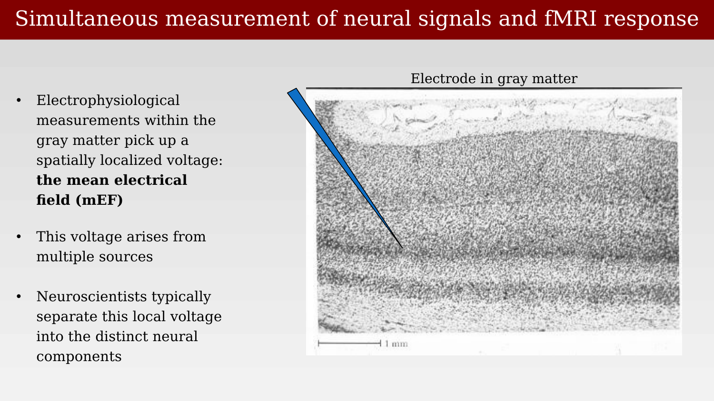
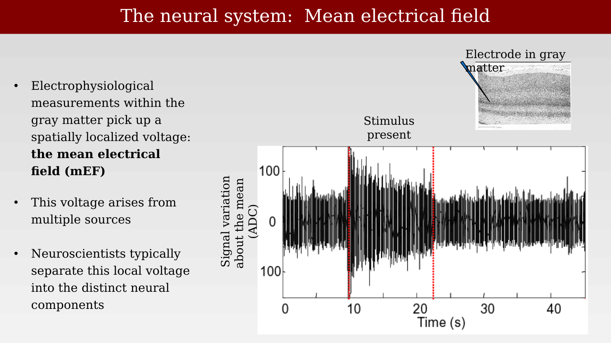
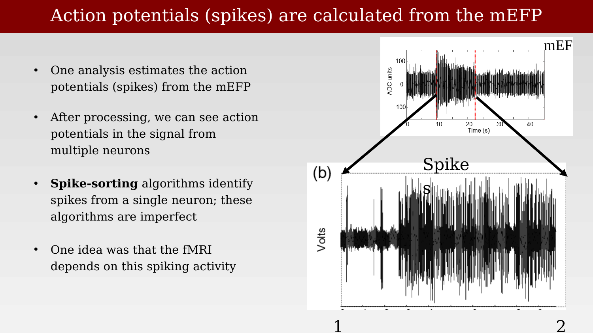
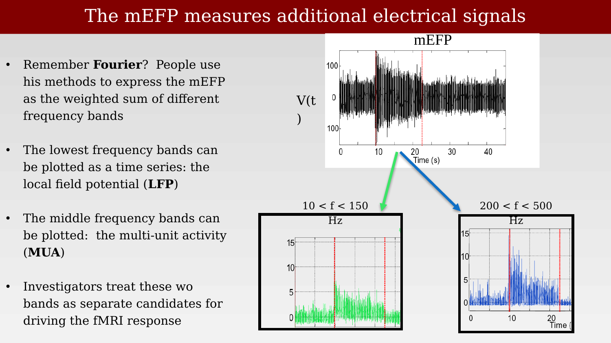

# Electrophysiological signal definitions: mEF, MUA, and LFP



---

The Mathiesen-Lauritzen experiments compared blood flow to spikes and to a field-potential signal, without dwelling on exactly what that field-potential signal is. This chapter defines the electrophysiological measurements more carefully, following the framework used by Logothetis and Wandell in their 2004 review connecting neural signals to the BOLD response [@logothetisInterpretingBOLDSignal2004].

## The mean electrical field

A microelectrode placed in the gray matter, some distance from any single large spiking neuron, does not record the activity of one cell. Instead it picks up a spatially localized voltage summed across many nearby neurons and processes: the **mean electrical field (mEF)**, sometimes called the mean electrical field potential (mEFP).

{#fig-ch38-electrode-in-gray-matter fig-alt="Grayscale micrograph of layered cortical tissue with a blue electrode shaft drawn entering from the upper left and its tip marked partway down."}

This voltage arises from multiple sources — action potentials, synaptic currents, and other membrane currents from many cells near the electrode tip — all superimposed. Neuroscientists typically decompose this raw signal into distinct components rather than treating it as a single undifferentiated measurement.

{#fig-ch38-mean-electrical-field-timeseries fig-alt="Time series plot of signal variation about the mean in ADC units, spanning about 45 seconds, with a stimulus-present period marked by two dashed red vertical lines and a small inset showing the electrode location in gray matter."}

## Spikes extracted from the mEFP

One standard analysis estimates the action potentials (spikes) of one or more nearby neurons directly from the mEFP. After appropriate filtering, individual spikes become visible riding on top of the slower field-potential fluctuations.

{#fig-ch38-spikes-from-mefp fig-alt="Two-panel figure: top panel shows the raw mEF time series with a stimulus period marked; bottom panel zooms into a short segment showing individual voltage spikes."}

**Spike-sorting** algorithms attempt to assign each detected spike to a single neuron, based on its waveform shape. These algorithms are imperfect, particularly when multiple neurons of similar size and orientation are close to the electrode tip. Much of the early literature on the relationship between neural activity and fMRI implicitly assumed that spikes, extracted this way, were the signal that should predict the BOLD response.

## Decomposing the mEFP by frequency: LFP and MUA

The mEFP can also be expressed as a weighted sum of sinusoids at different frequencies — a Fourier decomposition:

$$
\text{mEF}(t) = M + \sum_f a_f \sin(2\pi f t + \phi)
$$

Investigators typically split this sum into two frequency bands and treat each as a distinct candidate signal for driving the fMRI response. The lower frequencies (roughly 10-150 Hz) are called the **local field potential (LFP)**, thought to reflect summed synaptic currents and other slow membrane potentials. The higher frequencies (roughly 200-500 Hz) are called the **multi-unit activity (MUA)**, thought to reflect the spiking of multiple nearby neurons pooled together, without resolving individual cells.

{#fig-ch38-fourier-decomposition-lfp-mua fig-alt="Three-panel figure showing a raw voltage time series at top, and two filtered sub-band time series below labeled 10 to 150 Hz and 200 to 500 Hz, each with amplitude in Hz-scaled units and a stimulus period marked with dashed red lines."}

With these three candidate signals defined — spikes, LFP, and MUA — the next chapter turns directly to the Logothetis experiments, which measured all of them simultaneously with fMRI and ask which one actually predicts the BOLD response.
