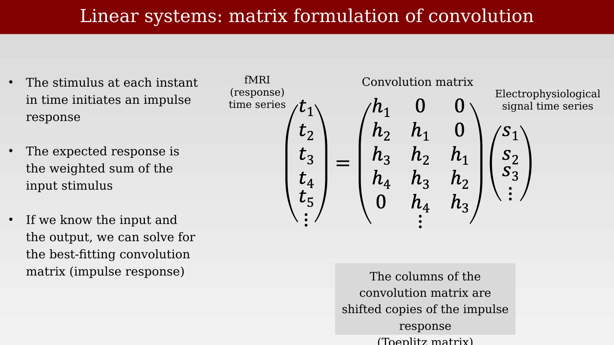

# Electrophysiological signals and the BOLD response



---

The Mathiesen-Lauritzen experiments compared blood flow to spikes and to a field-potential signal, without dwelling on exactly what that field-potential signal is. This chapter defines the electrophysiological measurements more carefully, following the framework used by Logothetis and Wandell in their 2004 review connecting neural signals to the BOLD response [@logothetisInterpretingBOLDSignal2004].

## The mean electrical field

A microelectrode placed in the gray matter, some distance from any single large spiking neuron, does not record the activity of one cell. Instead it picks up a spatially localized voltage summed across many nearby neurons and processes: the **mean electrical field (mEF)**, sometimes called the mean electrical field potential (mEFP).

{#fig-ch38-electrode-in-gray-matter fig-alt="Grayscale micrograph of layered cortical tissue with a blue electrode shaft drawn entering from the upper left and its tip marked partway down."}

This voltage arises from multiple sources — action potentials, synaptic currents, and other membrane currents from many cells near the electrode tip — all superimposed. Neuroscientists typically decompose this raw signal into distinct components rather than treating it as a single undifferentiated measurement.

{#fig-ch38-mean-electrical-field-timeseries fig-alt="Time series plot of signal variation about the mean in ADC units, spanning about 45 seconds, with a stimulus-present period marked by two dashed red vertical lines and a small inset showing the electrode location in gray matter."}

## Spikes extracted from the mEFP

One standard analysis estimates the action potentials (spikes) of one or more nearby neurons directly from the mEFP. After appropriate filtering, individual spikes become visible riding on top of the slower field-potential fluctuations.

{#fig-ch38-spikes-from-mefp fig-alt="Two-panel figure: top panel shows the raw mEF time series with a stimulus period marked; bottom panel zooms into a short segment showing individual voltage spikes."}

**Spike-sorting** algorithms attempt to assign each detected spike to a single neuron, based on its waveform shape. These algorithms are imperfect, particularly when multiple neurons of similar size and orientation are close to the electrode tip. Much of the early literature on the relationship between neural activity and fMRI implicitly assumed that spikes, extracted this way, were the signal that should predict the BOLD response.

## Decomposing the mEFP by frequency: LFP and MUA

The mEFP can also be expressed as a weighted sum of sinusoids at different frequencies — a Fourier decomposition:

$$
\text{mEF}(t) = M + \sum_f a_f \sin(2\pi f t + \phi)
$$

Investigators typically split this sum into two frequency bands and treat each as a distinct candidate signal for driving the fMRI response. The lower frequencies (roughly 10-150 Hz) are called the **local field potential (LFP)**, thought to reflect summed synaptic currents and other slow membrane potentials. The higher frequencies (roughly 200-500 Hz) are called the **multi-unit activity (MUA)**, thought to reflect the spiking of multiple nearby neurons pooled together, without resolving individual cells.

{#fig-ch38-fourier-decomposition-lfp-mua fig-alt="Three-panel figure showing a raw voltage time series at top, and two filtered sub-band time series below labeled 10 to 150 Hz and 200 to 500 Hz, each with amplitude in Hz-scaled units and a stimulus period marked with dashed red lines."}

With these three candidate signals defined — spikes, LFP, and MUA — the rest of this chapter turns directly to the Logothetis experiments, which measured all of them simultaneously with fMRI and ask which one actually predicts the BOLD response.

## BOLD and the LFP: linear systems modeling

How can we relate the two, very different, types of measurements:  BOLD and LFP?  Logothetis approached the problem by using linear systems methods. It is a move that we will see in other fields as well, such as trying to relate the activation in neural networks with the signals from real neurons.

### Predicting the BOLD response with linear systems theory

To make that comparison quantitative, Logothetis and Wandell modeled the relationship between an electrophysiological signal and the BOLD response as a linear, shift-invariant system [@logothetisInterpretingBOLDSignal2004]. Two empirical properties define such a system: scaling (a proportionally stronger input produces a proportionally larger response) and superposition (responses to inputs presented close together in time simply add). Most of the sluggish, delayed shape of the BOLD response relative to its neural driver is attributed to the intervening vasculature, and the transfer function connecting them is called the hemodynamic response function (HRF).

{#fig-ch38-linear-systems-scaling-superposition fig-alt="Six small line plots of BOLD signal intensity versus time in two rows, the top row showing three impulse responses of increasing amplitude, the bottom row showing two separate impulse responses and their sum."}

Because the system is linear and shift-invariant, the predicted fMRI time series can be written as the electrophysiological time series convolved with an impulse response, which is equivalent to a matrix multiplication: the convolution matrix is built from shifted copies of the impulse response (a Toeplitz matrix). Given a measured stimulus/neural time series and a measured fMRI time series, the best-fitting impulse response — the HRF — can be solved for directly.

{#fig-ch38-convolution-matrix-formulation fig-alt="Matrix equation showing a column vector of fMRI response values equal to a lower-triangular Toeplitz matrix of impulse response values h1 through h4 multiplied by a column vector of electrophysiological signal values s1, s2, s3."}

Applying this method, Logothetis solved for the convolution kernel relating the electrophysiological data to the fMRI response and found that the resulting linear prediction matched the measured BOLD response well in several cases, though the prediction was less accurate for the slower, more sustained components of longer responses.

{#fig-ch38-logothetis-convolution-prediction fig-alt="Four line plots, each showing an LFP trace shaded in light blue, a black LTI prediction trace, and a red measured BOLD trace over roughly 45 seconds, with stimulus onset and offset marked by dotted vertical lines."}

### Which signal predicts BOLD: MUA or LFP?

The critical comparison is between the two candidate predictors defined earlier in this chapter. At a few recording sites, the MUA-based prediction failed to match the measured BOLD response, sometimes badly. The LFP, however, served as a good predictor at every site tested. This result is widely cited as evidence that the BOLD signal tracks the LFP more closely than it tracks spiking activity (summarized somewhat bluntly as: "the BOLD signal measures the LFP").

{#fig-ch38-mua-bold-dissociation-summary fig-alt="Left panel shows two stacked time series plots (24 s and 12 s stimuli) with MUA in green, LFP in blue, and BOLD shaded in pink; right panel shows a histogram of LFP r-values in white and red bars for MUA and LFP r-squared distributions respectively."}

Across the full dataset (N = 460 measurements with pulse stimuli of 4-24 s), the LFP consistently gave a higher coefficient of determination (r²) than the MUA, and there were no recording sites where the MUA matched the BOLD response but the LFP did not — only the reverse.

### An experimental test: dissociating MUA from LFP pharmacologically

Correlational evidence of this kind is suggestive but not conclusive, since LFP and MUA are themselves correlated with each other in normal conditions. Rauch, Rainer, and Logothetis addressed this by manipulating the two signals independently: injecting the serotonin agonist BP554 (a 5-HT1A agonist) into primary visual cortex of anesthetized monkeys, which hyperpolarizes efferent neurons and selectively suppresses spiking (MUA) without directly acting on the LFP [@rauch2008-serotonin].

{#fig-ch38-rauch-serotonin-dissociation fig-alt="Two panels: left shows fMRI slices with colored voxels and a multi-unit activity trace dropping after an injection marker; right shows the same fMRI slices alongside a raw data trace that continues oscillating with large amplitude after the injection, annotated spikes are not required for a BOLD signal."}

The result: the serotonin injection reliably reduced MUA without measurably affecting either the LFP or the BOLD response. This is a much stronger claim than the correlational result above — it shows directly that spiking activity is not necessary for a normal BOLD response at this site, at least under this manipulation. The authors interpret this as evidence that the efferent output of a local neuronal population imposes relatively little metabolic burden compared with the combined presynaptic and postsynaptic processing of its incoming afferents.

### The BOLD signal measures circuit properties, not spike counts

Taken together, these results support a more general claim made by Logothetis and Wandell: because synaptic potentials appear to be the strongest driver of the BOLD response, the BOLD signal should be expected to vary with the properties of the local neural circuit, not simply with the number of spikes it produces.

> The data summarized above suggest that synaptic potentials are the strongest cause of the BOLD responses. An important consequence of this hypothesis is that the BOLD response will differ depending on the neural circuit properties within various regions of cortex.
>
> Consider the implications in the case of two hypothetical neural circuits located in different regions of cortex. We suppose that in both regions a specific stimulus causes, on average, 10 action potentials above baseline. The two cortical regions differ, however, in that the first cortical region contains a circuit that measures the size of a purely excitatory input, whereas the circuitry in the second region measures the difference between opposing excitatory and inhibitory inputs. On the hypothesis that the BOLD response depends on synaptic potentials, the purely excitatory circuit usually will generate a smaller BOLD response than the circuit that compares opposing inputs. Hence, other factors being equal, the BOLD signal in the second region should exceed that in the first, despite the equal spiking activity.
>
> — @logothetisInterpretingBOLDSignal2004

This still leaves open why synaptic potentials, rather than spikes, should dominate the metabolic signal in the first place. That question is taken up directly in the next chapter, which works out the energetic cost of the underlying biophysical processes — and, with that cost accounting in hand, returns to the question of circuit properties to show that timing, not just excitation versus inhibition, also determines how the mEF and the BOLD signal relate.
