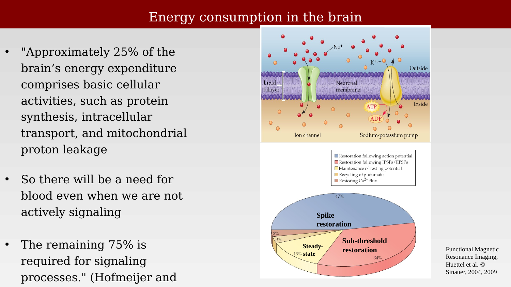
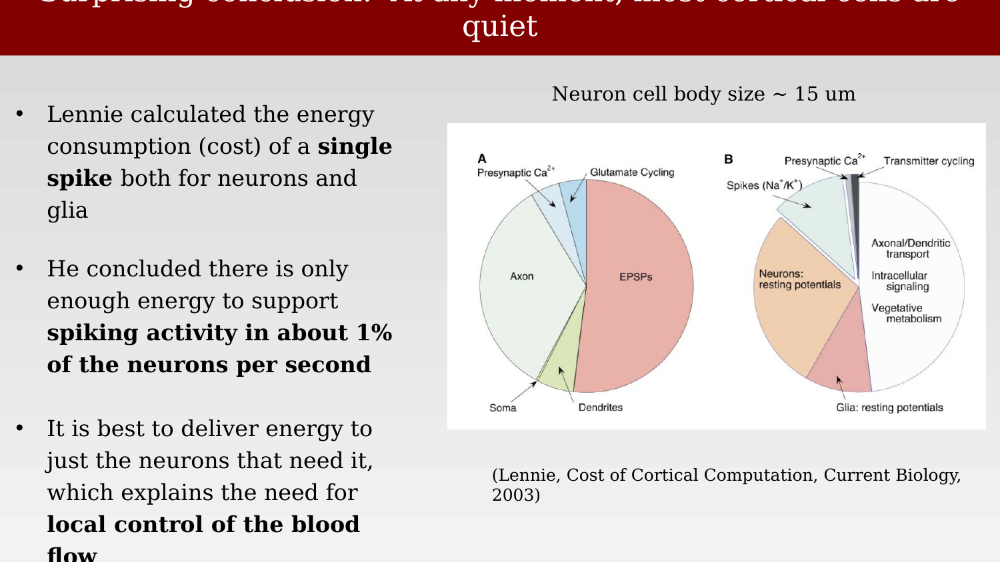

# Energy consumption in the brain



---

The Mathiesen-Lauritzen result raises a natural question: of the several candidate neural signals — spikes, synaptic currents, sub-threshold membrane potentials — which requires the most energy, and therefore the most local blood delivery? Answering this requires a brief look at where the brain's energy budget actually goes.

## The brain's baseline energy budget

In humans, the brain is roughly 2% of body mass but consumes about 20% of the basal metabolic rate [@herculano-houzel2007-cellularscalingrules]. Only part of that is tied to signaling. Hofmeijer and van Putten estimate that approximately 25% of the brain's energy expenditure supports basic cellular housekeeping — protein synthesis, intracellular transport, mitochondrial proton leakage — none of which varies much with moment-to-moment neural activity. The remaining 75% supports signaling processes proper, meaning there is a substantial, relatively fixed energy cost even when a region is not actively engaged by a task, on top of whatever additional cost signaling adds.

## Ion pumps and the cost of signaling

Most of the brain's signaling-related energy cost traces back to a single mechanism: the sodium-potassium pump, which restores ionic gradients across the neuronal membrane after they are disturbed by electrical activity.

{#fig-ch39-energy-consumption-overview fig-alt="Diagram of a neuronal membrane showing an ion channel and a sodium-potassium pump moving Na+ out and K+ in using ATP, alongside a pie chart with slices for spike restoration (47%), sub-threshold restoration (34%), steady-state (13%), and two smaller 3% slices."}

At rest, the pump maintains a membrane potential of about -70 mV by actively exporting 3 Na⁺ ions for every 2 K⁺ ions imported, using ATP. This active transport, not passive diffusion, is what keeps the concentration gradients in place, and it runs continuously, even at rest.

When a stimulus opens voltage-gated Na⁺ channels, Na⁺ rushes into the cell down its concentration gradient, and if the membrane reaches threshold (around -55 mV), a full action potential follows: the membrane depolarizes to about +40 mV, Na⁺ channels then inactivate, delayed voltage-gated K⁺ channels open and repolarize the membrane, and a brief hyperpolarization follows before the resting state is restored. Afterward, the Na⁺/K⁺ pump must work to restore the ionic gradients disturbed by the spike, at metabolic cost. Critically, this restoration cost is not limited to full action potentials: sub-threshold depolarizations that never reach the spiking threshold still displace ions and still require pump-mediated restoration, which is why the pie chart above shows a substantial share of the energy budget going to "sub-threshold restoration" rather than to spikes alone.

## How many neurons can be active at once?

Lennie used this kind of energy accounting to ask a sharper question: given the known energy consumption of cortex and the cost of a single spike (for both neurons and glia), how many neurons can be spiking at any one time [@lennie2003-yn]?

{#fig-ch39-lennie-energy-cost-pie-charts fig-alt="Two pie charts side by side: panel A splits cortical spike energy cost into presynaptic calcium, axon, soma, dendrites, and glutamate cycling components dominated by EPSPs; panel B splits total cost between neurons (resting potentials, spikes, transport, signaling, metabolism) and glia (resting potentials)."}

His answer is surprising: the cost of a single spike is high enough that, given the brain's total energy supply, no more than about 1% of cortical neurons can be substantially active concurrently. At any given moment, the overwhelming majority of cortical cells must be quiet. This has two consequences Lennie draws out explicitly: the brain must rely on sparse representational codes, using very few active neurons at a time to encode information, and it must allocate its limited energy budget flexibly across regions according to task demand rather than supplying all regions equally. That second requirement — local, on-demand control of blood flow rather than uniform perfusion — is exactly what functional MRI exploits, and why mechanisms of selective attention matter for where that limited energy budget gets spent.

With this energy budget in mind, the next chapter returns to the Logothetis experiments and asks directly which of the candidate electrophysiological signals — spikes, MUA, or LFP — actually predicts the measured BOLD response.
