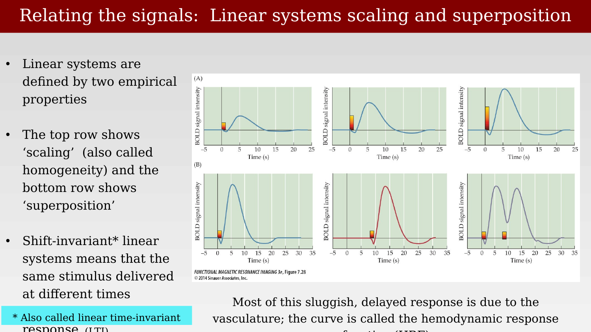
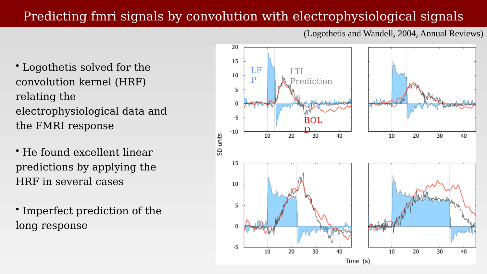
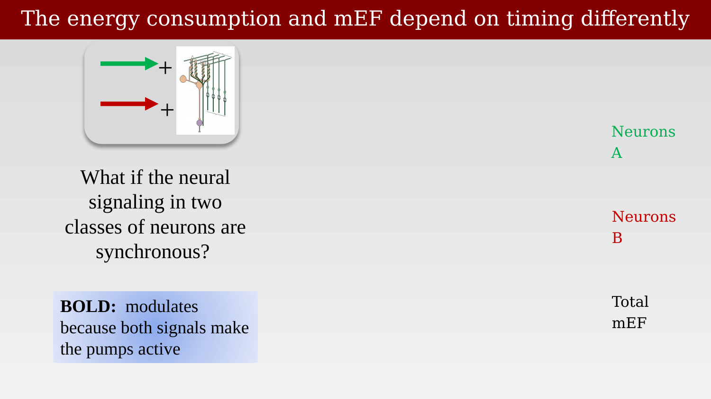
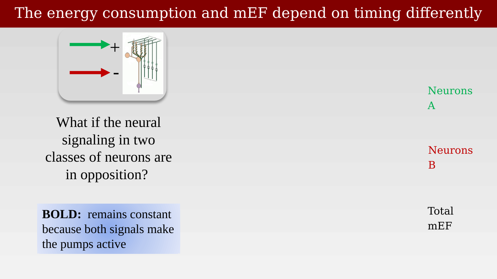

# Logothetis experiments: BOLD and the LFP



---

Logothetis and colleagues addressed the question raised in the last two chapters directly, by recording electrophysiological signals and the BOLD response simultaneously in the same tissue, in primate visual cortex.

## Simultaneous measurement of neural signals and the BOLD response

In their original 2001 study, Logothetis, Pauls, Augath, Trinath, and Oeltermann recorded from primary visual cortex of anesthetized monkeys while presenting a flickering visual stimulus, placing a microelectrode within the region activated by the stimulus in a 4.7T scanner [@logothetis2001-pf]. This single experiment yields, at one site, all of the signals discussed so far: the raw mean electrical field, its spike and MUA components, the LFP, and the BOLD response.

{#fig-ch40-logothetis2001-fig1-neural-bold fig-alt="Multi-panel figure from a Nature paper showing an FLASH MRI scan with electrode location, a time series plot with BOLD signal, signal RMS, and mean EFP overlaid over about 45 seconds, and three-dimensional time-frequency spectrogram plots for 24, 12, and 4 second stimulus durations."}

The electrical signals were separated into frequency bands as described in the previous chapter, and the resulting LFP and MUA time series were compared against the simultaneously measured BOLD response.

## Predicting the BOLD response with linear systems theory

To make that comparison quantitative, Logothetis and Wandell modeled the relationship between an electrophysiological signal and the BOLD response as a linear, shift-invariant system [@logothetisInterpretingBOLDSignal2004]. Two empirical properties define such a system: scaling (a proportionally stronger input produces a proportionally larger response) and superposition (responses to inputs presented close together in time simply add). Most of the sluggish, delayed shape of the BOLD response relative to its neural driver is attributed to the intervening vasculature, and the transfer function connecting them is called the hemodynamic response function (HRF).

{#fig-ch40-linear-systems-scaling-superposition fig-alt="Six small line plots of BOLD signal intensity versus time in two rows, the top row showing three impulse responses of increasing amplitude, the bottom row showing two separate impulse responses and their sum."}

Because the system is linear and shift-invariant, the predicted fMRI time series can be written as the electrophysiological time series convolved with an impulse response, which is equivalent to a matrix multiplication: the convolution matrix is built from shifted copies of the impulse response (a Toeplitz matrix). Given a measured stimulus/neural time series and a measured fMRI time series, the best-fitting impulse response — the HRF — can be solved for directly.

{#fig-ch40-convolution-matrix-formulation fig-alt="Matrix equation showing a column vector of fMRI response values equal to a lower-triangular Toeplitz matrix of impulse response values h1 through h4 multiplied by a column vector of electrophysiological signal values s1, s2, s3."}

Applying this method, Logothetis solved for the convolution kernel relating the electrophysiological data to the fMRI response and found that the resulting linear prediction matched the measured BOLD response well in several cases, though the prediction was less accurate for the slower, more sustained components of longer responses.

{#fig-ch40-logothetis-convolution-prediction fig-alt="Four line plots, each showing an LFP trace shaded in light blue, a black LTI prediction trace, and a red measured BOLD trace over roughly 45 seconds, with stimulus onset and offset marked by dotted vertical lines."}

## Which signal predicts BOLD: MUA or LFP?

The critical comparison is between the two candidate predictors defined in the previous chapter. At a few recording sites, the MUA-based prediction failed to match the measured BOLD response, sometimes badly. The LFP, however, served as a good predictor at every site tested. This result is widely cited as evidence that the BOLD signal tracks the LFP more closely than it tracks spiking activity (summarized somewhat bluntly as: "the BOLD signal measures the LFP").

{#fig-ch40-mua-bold-dissociation-summary fig-alt="Left panel shows two stacked time series plots (24 s and 12 s stimuli) with MUA in green, LFP in blue, and BOLD shaded in pink; right panel shows a histogram of LFP r-values in white and red bars for MUA and LFP r-squared distributions respectively."}

Across the full dataset (N = 460 measurements with pulse stimuli of 4-24 s), the LFP consistently gave a higher coefficient of determination (r²) than the MUA, and there were no recording sites where the MUA matched the BOLD response but the LFP did not — only the reverse.

## An experimental test: dissociating MUA from LFP pharmacologically

Correlational evidence of this kind is suggestive but not conclusive, since LFP and MUA are themselves correlated with each other in normal conditions. Rauch, Rainer, and Logothetis addressed this by manipulating the two signals independently: injecting the serotonin agonist BP554 (a 5-HT1A agonist) into primary visual cortex of anesthetized monkeys, which hyperpolarizes efferent neurons and selectively suppresses spiking (MUA) without directly acting on the LFP [@rauch2008-serotonin].

{#fig-ch40-rauch-serotonin-dissociation fig-alt="Two panels: left shows fMRI slices with colored voxels and a multi-unit activity trace dropping after an injection marker; right shows the same fMRI slices alongside a raw data trace that continues oscillating with large amplitude after the injection, annotated spikes are not required for a BOLD signal."}

The result: the serotonin injection reliably reduced MUA without measurably affecting either the LFP or the BOLD response. This is a much stronger claim than the correlational result above — it shows directly that spiking activity is not necessary for a normal BOLD response at this site, at least under this manipulation. The authors interpret this as evidence that the efferent output of a local neuronal population imposes relatively little metabolic burden compared with the combined presynaptic and postsynaptic processing of its incoming afferents.

## The BOLD signal measures circuit properties, not spike counts

Taken together, these results support a more general claim made by Logothetis and Wandell: because synaptic potentials appear to be the strongest driver of the BOLD response, the BOLD signal should be expected to vary with the properties of the local neural circuit, not simply with the number of spikes it produces.

> The data summarized above suggest that synaptic potentials are the strongest cause of the BOLD responses. An important consequence of this hypothesis is that the BOLD response will differ depending on the neural circuit properties within various regions of cortex.
>
> Consider the implications in the case of two hypothetical neural circuits located in different regions of cortex. We suppose that in both regions a specific stimulus causes, on average, 10 action potentials above baseline. The two cortical regions differ, however, in that the first cortical region contains a circuit that measures the size of a purely excitatory input, whereas the circuitry in the second region measures the difference between opposing excitatory and inhibitory inputs. On the hypothesis that the BOLD response depends on synaptic potentials, the purely excitatory circuit usually will generate a smaller BOLD response than the circuit that compares opposing inputs. Hence, other factors being equal, the BOLD signal in the second region should exceed that in the first, despite the equal spiking activity.
>
> — @logothetisInterpretingBOLDSignal2004

## Timing matters as much as circuit type

The same logic extends to how two populations of neurons are timed relative to each other, not just whether their inputs are excitatory or inhibitory. Because both excitatory and inhibitory synaptic activity require ion pumps to restore the resulting concentration gradients, both kinds of activity contribute to the mEF-based energy cost — but they can have very different effects on the net electrical signal, depending on their relative timing.

::: {.panel-tabset}
## Synchronous populations

{#fig-ch40-timing-synchronous-case fig-alt="Diagram with a green arrow labeled Neurons A and a red arrow labeled Neurons B both pointing into a small cerebellar-circuit icon with a plus sign, and text stating BOLD modulates because both signals make the pumps active."}

## Populations in opposition

{#fig-ch40-timing-opposition-case fig-alt="Diagram identical in layout to the synchronous case but with a minus sign between the two neuron population arrows, and text stating BOLD remains constant because both signals make the pumps active."}
:::

The practical implication is that the mEF (and its LFP/MUA components) and the BOLD signal can, in principle, dissociate depending on the timing relationship between excitatory and inhibitory populations — not only on which signal (spikes versus synaptic potentials) is doing the work. This distinction between what the electrical signal shows and what the BOLD signal shows, driven by the shared metabolic cost of restoring ion gradients regardless of the net electrical outcome, is a recurring theme in interpreting discrepancies between electrophysiology and fMRI.
