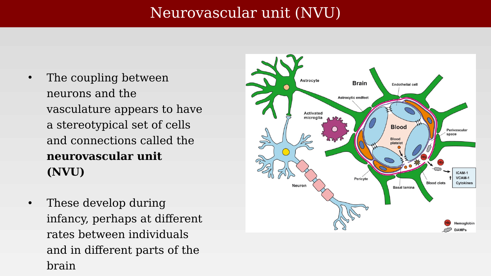
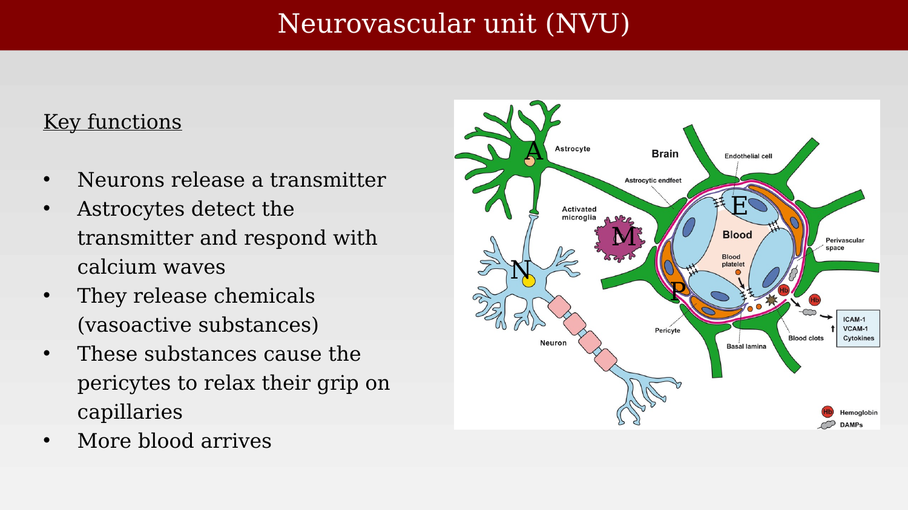
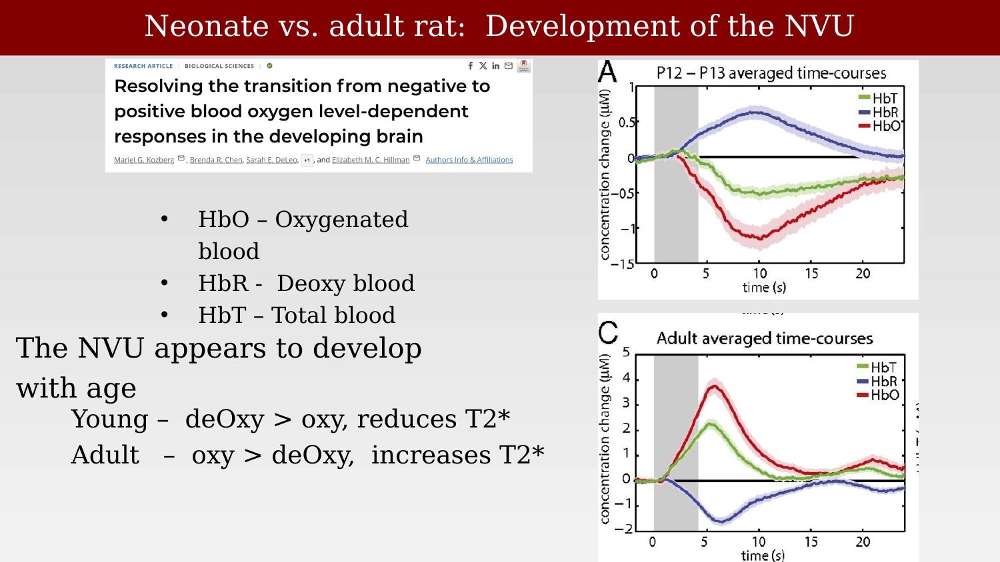
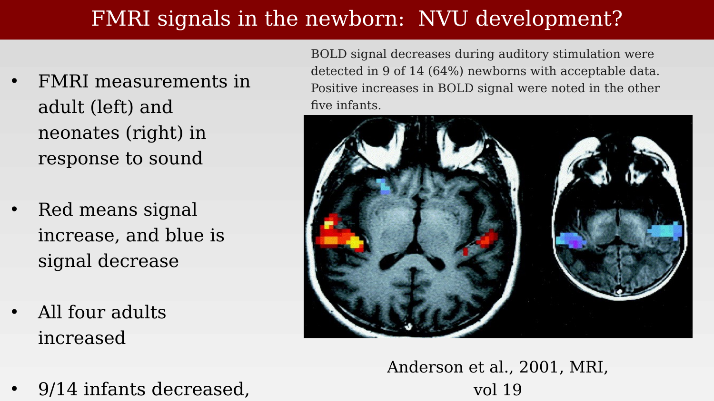

# BOLD and the development of the neurovascular unit



---

The preceding chapters established that local neuronal activity — chiefly synaptic activity, restored by ion pumps — drives the BOLD signal, and that this coupling depends on circuit properties and timing rather than on spike counts alone. This chapter asks a different question: how does neuronal activity actually communicate its need for more blood to the vasculature, and does that communication pathway change over development?

## The neurovascular unit hypothesis

Local neuronal activity must somehow signal for more blood. The current working hypothesis for how this signaling happens is the **neurovascular unit (NVU)**: a stereotyped set of cell types and connections that couples neuronal activity to local vasodilation [@iadecola2017-ho].

{#fig-ch41-nvu-development-intro fig-alt="Block diagram showing a stimulus arrow feeding into a neural response block, then a hemodynamics block, then an MRI scanner block, with a noise term added before the final fMRI response, with a circle around the neural response and hemodynamics stages labeled fMRI linear transform."}

## Components and signaling of the NVU

The NVU comprises several cell types arranged around a capillary: neurons, astrocytes (whose endfeet wrap around blood vessels), pericytes (contractile cells wrapping capillaries), endothelial cells (forming the vessel wall), vascular smooth muscle cells (controlling arteriole diameter), and microglia (which can modulate vascular tone during inflammation).

{#fig-ch41-nvu-diagram-overview fig-alt="Diagram of a neuron and astrocyte in green, a second neuron in light blue with pericytes wrapped around a blood vessel, and a purple microglial cell, all surrounding a central blood vessel cross-section labeled Blood, with hemoglobin and blood clot markers nearby."}

The basic signaling sequence: an active neuron releases glutamate and other neurotransmitters; nearby astrocytes detect this via their own receptors, triggering intracellular calcium waves; astrocytes then release vasoactive substances (prostaglandins, potassium ions, nitric oxide, epoxyeicosatrienoic acids) that cause pericytes to relax their grip on capillaries and smooth muscle cells to relax around arterioles. The net effect is increased local blood flow — functional hyperemia — delivering more oxygen and glucose and clearing metabolic waste. This is the physiological basis for the BOLD signal.

{#fig-ch41-nvu-key-components-labeled fig-alt="Same neurovascular unit diagram as before, now with single-letter labels A, E, M, N, and P marking the astrocyte, endothelial cell, microglia, neuron, and pericyte respectively, next to a bulleted key-components list."}

Disruption of the NVU is implicated in a range of neurological conditions, including stroke, Alzheimer's disease, and vascular dementia — a reminder that this is a physiological system with its own vulnerabilities, not just a convenient signal path for imaging.

## The NVU develops during infancy

Because the NVU is a physiological structure built from several distinct cell types, it does not need to be fully mature at birth, and there is evidence it develops over the course of infancy, at rates that may differ across brain regions and across individuals. Kozberg, Chen, DeLeo, Bouchard, and Hillman studied this directly in neonatal rats, tracking the hemodynamic response to sensory stimulation from early postnatal ages through adulthood [@kozberg2013-negativebold].

{#fig-ch41-neonate-adult-hb-timecourses fig-alt="Two line plots stacked vertically, top labeled P12-P13 averaged time-courses and bottom labeled Adult averaged time-courses, each showing HbT in green, HbR in blue/purple, and HbO in red as a function of time in seconds, with a shaded stimulus period."}

In the adult, the classic pattern holds: oxygenated hemoglobin (HbO) and total hemoglobin (HbT) rise while deoxygenated hemoglobin (HbR) falls, since the blood flow increase outstrips local oxygen consumption — this is what produces a positive BOLD signal (since deoxyhemoglobin is paramagnetic and reduces T2*). In the young rat, this pattern is inverted: deoxygenated hemoglobin rises relative to oxygenated hemoglobin, which would produce a *negative* BOLD signal. Kozberg and colleagues interpret this as evidence that the mature neurovascular coupling mechanism — where blood flow overshoots oxygen demand — has not yet developed in the neonate.

## fMRI signals in the human newborn

The same age-dependent sign reversal shows up in human fMRI. Anderson and colleagues measured the BOLD response to auditory stimulation in newborns and adults, and found that all four adult subjects showed the expected signal increase, while six of eight newborns showed a signal *decrease* to the same stimulus, with only two showing an adult-like increase [@anderson2001-neonatalauditory].

{#fig-ch41-fmri-newborn-auditory-anderson fig-alt="Two axial brain MRI images side by side with colored functional overlays: the left (adult) shows red/yellow clusters near auditory cortex bilaterally, the right (newborn) shows blue clusters in similar regions."}

A similar pattern appears in the visual system. Yamada and colleagues measured visual cortex responses to photic stimulation in infants across a range of ages and found that the sign and consistency of the response changes with age, alongside independent evidence of progressive white-matter myelination in the optic radiation [@yamada2000-milestone]. Not all infants show the same pattern at the same age.

{#fig-ch41-fmri-infant-visual-yamada fig-alt="Grid of eight small brain MRI images in two rows, the top row functional maps with red-yellow or green-blue clusters over occipital cortex, the bottom row corresponding anatomical MRI slices, labeled A through H."}

Taken together, these results are consistent with the NVU maturing over the first weeks to months of life, with individual variability in the exact timeline, and the sign reversal in early BOLD responses is a plausible fingerprint of that immature coupling — though direct causal evidence in humans, of the kind Kozberg obtained in rats, is harder to obtain.

## Other systems may also require energy

It is worth closing this chapter with a note of caution about how settled the "blood flow serves local metabolic demand" story really is. Drew has argued that, while the brain is metabolically demanding overall, it is normally *oversupplied* with oxygen at baseline, and the increases in oxygenation produced by neurovascular coupling do not appear to be strictly required to support local neural activity in many cases.

> In the brain, increases in neural activity drive changes in local blood flow via neurovascular coupling. The common explanation for increased blood flow (known as functional hyperemia) is that it supplies the metabolic needs of active neurons. However, there is a large body of evidence that is inconsistent with this idea. Baseline blood flow is adequate to supply oxygen needs even with elevated neural activity. Neurovascular coupling is irregular, absent, or inverted in many brain regions, behavioral states, and conditions. Increases in respiration can increase brain oxygenation without flow changes. Simulations show that given the architecture of the brain vasculature, areas of low blood flow are inescapable and cannot be removed by functional hyperemia. As discussed in this article, potential alternative functions of neurovascular coupling include supplying oxygen for neuromodulator synthesis, brain temperature regulation, signaling to neurons, stabilizing and optimizing the cerebral vascular structure, accommodating the non-Newtonian nature of blood, and driving the production and circulation of cerebrospinal fluid (CSF).
>
> — @drew2022-motiveunknown

This does not overturn the coupling described in this chapter and the last — the correlation between local activity and blood flow that fMRI exploits is real and well established — but it is a reminder that *why* that coupling exists, mechanistically and evolutionarily, remains an open question, and functional hyperemia may serve several purposes beyond simply feeding hungry neurons.
