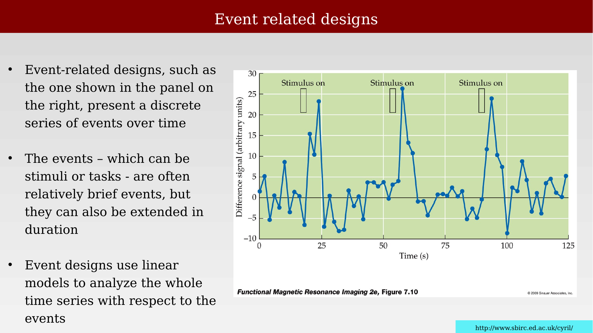
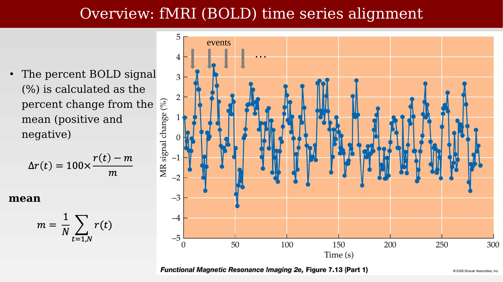
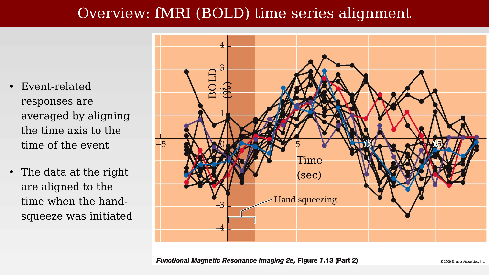
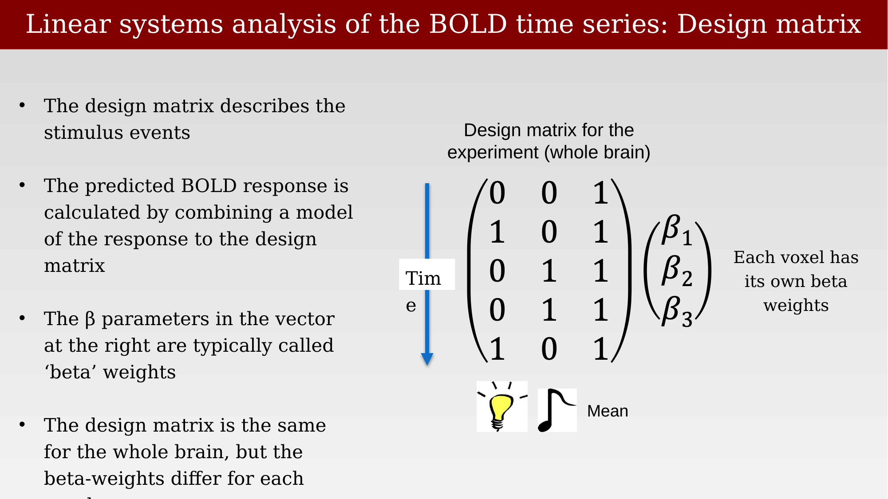
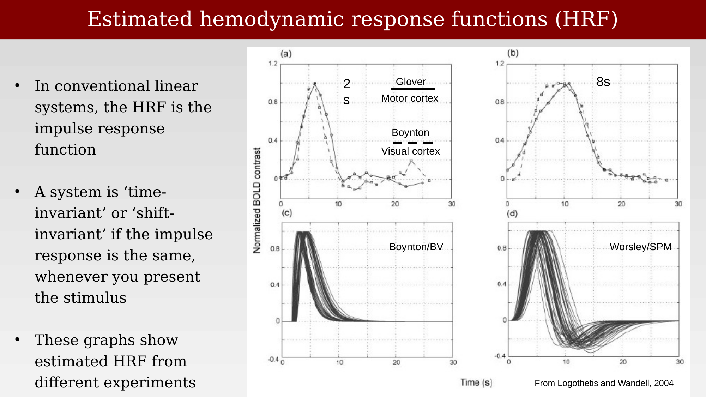
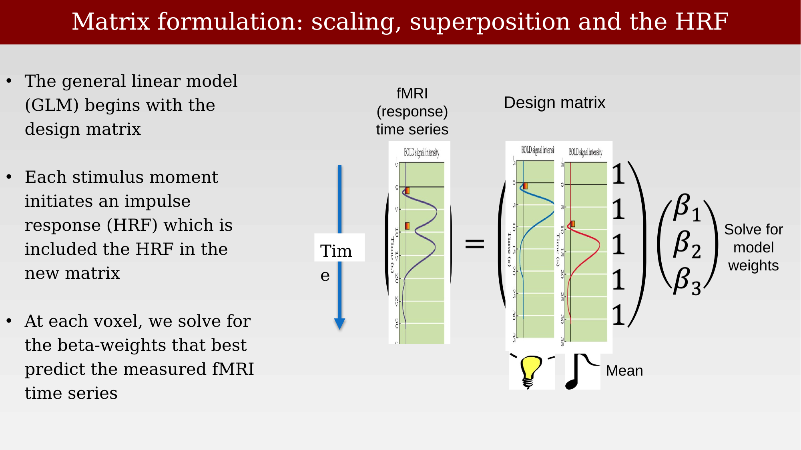
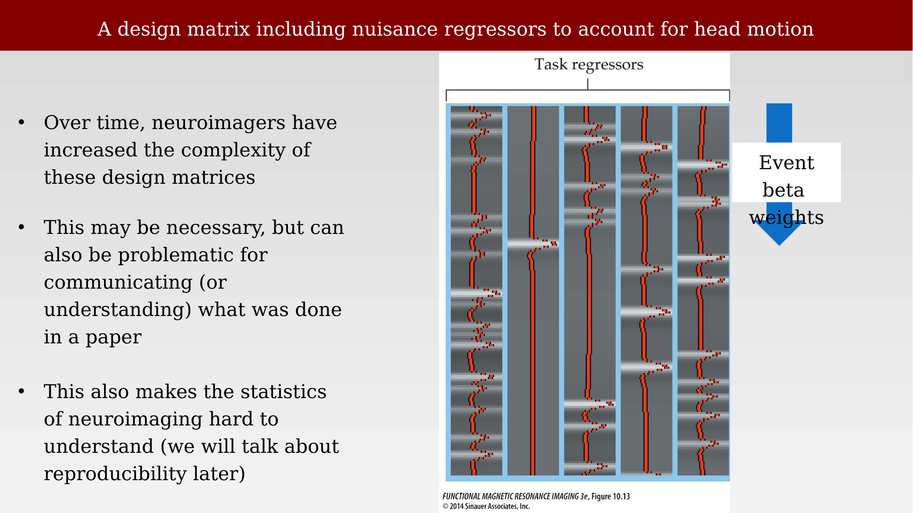
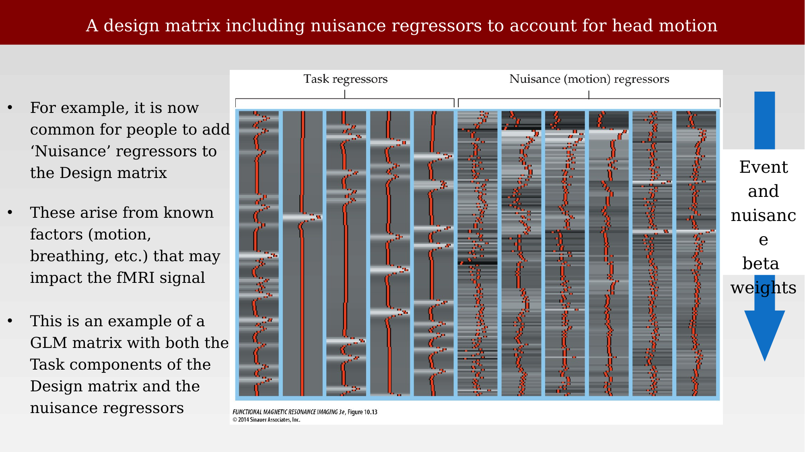

# The general linear model for BOLD time series



---

fMRI produces a noisy time series at every voxel. The measured signal reflects a delayed, indirect vascular response to neural activity, not neural activity itself. The scientific questions we actually want to answer are rarely "what is the signal?" — they are questions like: is there evidence for a response at all? Is response A larger than response B? How big is the difference, relative to the noise? Answering these questions requires a model that connects the timing of an experiment to the shape of the measured time series, and a way to fit that model to noisy data.

Cognitive neuroscience has long been dominated by a few software packages built around this modeling approach — SPM, FSL, FreeSurfer, and more recently Python-based tools such as Nilearn — which combine general-linear-model fitting with tools for visualizing and comparing brain volumes.

{#fig-ch42-analysis-software-landscape fig-alt="Collage of software interface screenshots for SPM, FSL, FreeSurfer, and the Nilearn documentation site."}

## Event-related designs

Event-related designs present a discrete series of events over time — stimuli or tasks that are often brief, though they can also be extended in duration. Event designs use linear models to analyze the whole time series with respect to the timing of these events.

{#fig-ch42-event-related-design fig-alt="Line plot of a noisy difference signal over 125 seconds, with three shaded stimulus-on periods, each followed by a transient rise in signal."}

To compare responses across voxels and subjects, the raw signal is usually converted to percent BOLD signal change — the percent deviation from the voxel's own mean signal, $\Delta r(t) = 100 \times \frac{r(t) - m}{m}$, where $m = \frac{1}{N}\sum_{t=1,N} r(t)$ is the mean of the time series. Event-related responses are then averaged together by aligning the time axis to the time of the event, rather than to the start of the scan.

::: {.panel-tabset}
## Percent signal change
{#fig-ch42-bold-alignment-percent-signal fig-alt="Line plot of MR signal change in percent over 300 seconds with repeated event markers and formulas for percent change and the mean."}

## Averaging aligned to the event
{#fig-ch42-bold-alignment-averaged-events fig-alt="Overlaid line plots of BOLD percent signal change aligned to time zero, with a shaded pre-event region and a label marking hand squeezing."}
:::

## Modeling the measurements: the general linear model

How do we model the measurements? The approach that dominates fMRI analysis makes four assumptions and choices in sequence: assume the BOLD signal is approximately linear and time-invariant; represent the experiment with a **design matrix**; predict the response to each event by convolving it with a **hemodynamic response function (HRF)**; and fit the resulting model to the data using the **general linear model (GLM)**.

Linear, time-invariant (or shift-invariant) systems are defined by two empirical properties: **scaling** (also called homogeneity) and **superposition**. Scaling means that doubling the input doubles the output. Superposition means the response to two events is the sum of the responses to each event individually. Shift-invariance means that the same stimulus, delivered at a different time, produces the identical response, just shifted in time.

{#fig-ch42-scaling-and-superposition fig-alt="Six small line plots of BOLD signal intensity versus time, arranged in two rows, illustrating scaling in the top row and superposition of two closely-timed impulse responses in the bottom row."}

## The design matrix

The design matrix describes the stimulus events over time. Each column of the matrix marks the onset times of one experimental condition; each row is a moment in time. The predicted BOLD response at a voxel is calculated by combining a model of the response — the convolved design matrix — with a set of weights, one per condition, usually called the **beta weights** ($\beta_1, \beta_2, \beta_3, \dots$). The design matrix is the same for the whole brain, but the beta weights differ at every voxel: each voxel has its own beta weights, describing how strongly that voxel's response is driven by each condition.

{#fig-ch42-design-matrix-basic fig-alt="Matrix diagram showing a 5x3 binary design matrix multiplied by a column vector of beta_1, beta_2, beta_3, with a time arrow on the left and icons for a lightbulb and musical note beneath the matrix columns, labeled mean."}

## The hemodynamic response function

We account for the response to an impulse stimulus, as measured by the BOLD signal, using the **hemodynamic response function (HRF)**: the block-diagram picture of the imaging pipeline — stimulus, neural response, hemodynamics, MRI scanner, plus noise — collapses the neural-response-to-hemodynamics stages into a single linear transform whose impulse response is the HRF.

{#fig-ch42-hrf-block-diagram fig-alt="Block diagram with a stimulus arrow feeding a neural response box, then a hemodynamics box, then an MRI scanner box, with a noise term added before the fMRI response output, and a circle around the neural-response and hemodynamics stages labeled fMRI linear transform."}

Estimated HRFs vary across studies, brain regions, and analysis packages — some rise and fall within about 10 seconds, others take closer to 20 — but they share a common overall shape: a rise beginning a couple of seconds after the stimulus, peaking around 5-6 seconds, and returning to baseline (sometimes with an undershoot) after 15-20 seconds.

{#fig-ch42-estimated-hrf-comparison fig-alt="Four panels of normalized BOLD contrast versus time, labeled a through d, comparing HRF shapes across studies and showing families of estimated HRF curves from two analysis packages."}

## Matrix formulation: convolving the design matrix with the HRF

Because each stimulus moment initiates an HRF-shaped response, the design matrix used for model fitting is not simply a column of zeros and ones — each event column is first convolved with the HRF, so the predicted time series already has the characteristic rise-and-fall shape at every event. At each voxel, we solve for the beta weights that best predict the measured fMRI time series from this HRF-convolved design matrix.

::: {.panel-tabset}
## The equation
{#fig-ch42-matrix-formulation-equation fig-alt="Equation diagram: an fMRI response time series column equals an HRF-convolved design matrix (two curved response columns) times a beta-weight vector, with icons for a lightbulb and musical note beneath the matrix, labeled mean."}

## Interpreting the beta weights
{#fig-ch42-matrix-formulation-beta-interpretation fig-alt="Same equation diagram as the previous figure, now with bullet text about comparing beta weight values between conditions."}
:::

## Nuisance regressors

Over time, neuroimagers have increased the complexity of these design matrices. It is now common to add **nuisance regressors** to account for factors — head motion, breathing, and other known confounds — that may affect the fMRI signal but are not of scientific interest. This can be useful, but it can also make published design matrices harder to communicate (or understand) and makes the statistics of neuroimaging harder to follow.

::: {.panel-tabset}
## Task regressors only
{#fig-ch42-design-matrix-task-only fig-alt="Wide design-matrix image with five columns of task regressors, each showing a red trace over a grey time-series background, with a downward arrow labeled Event beta weights."}

## Task and nuisance regressors together
{#fig-ch42-design-matrix-with-nuisance fig-alt="Wide design-matrix image with five task-regressor columns on the left and six nuisance-regressor columns on the right, each showing a red trace over a grey time-series background, with a downward arrow labeled Event and nuisance beta weights."}
:::

## Is the GLM a good idea?

Linearity of the voxel response can, in principle, be tested directly. But it is worth being precise about what the GLM actually assumes: it assumes linearity of the *measurement* process, not linearity of the underlying *neural* processing. And in fact scaling — one of the two defining properties of a linear system — is known to fail in the BOLD response: the "linearity" the GLM relies on turns out to hold with respect to stimulus *duration*, not stimulus *contrast*. The next chapter looks directly at the evidence for and against superposition and additivity, the property the GLM depends on most heavily.
